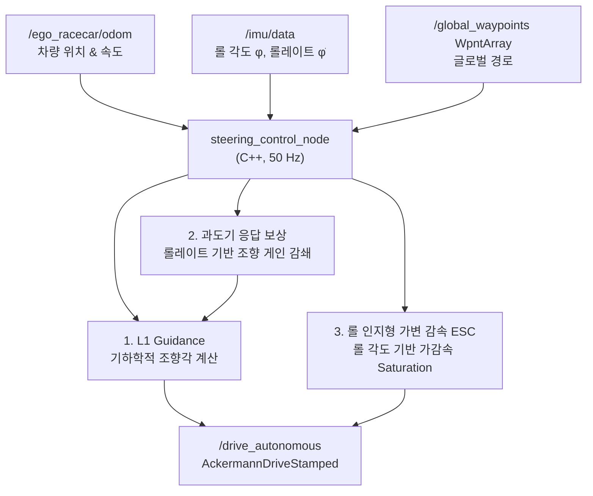

# CLAUDE.md

이 파일은 Claude Code가 이 저장소에서 작업할 때 참고하는 가이드입니다.

## 프로젝트 개요

**2026 IFAC F1TENTH 자율주행 대회**의 **하드웨어 / 제어(Control) 파트** 코드베이스입니다.
ROS 2 패키지 `f1tenth_control` 하나로 구성되며, 플래닝 팀이 발행하는 글로벌 경로를
추종하여 실차(또는 시뮬레이터)를 주행시키는 횡방향(조향)·종방향(가감속) 제어와
안전 시스템(AEB, 수동/자율 Mux)을 담당합니다.

- 언어: C++17 (메인 런타임), Python (참조용 원본 컨트롤러 / LUT 프로토타입)
- 빌드 시스템: `ament_cmake` (ROS 2)
- 코드/주석 언어: **한국어** — 새 코드도 주변 코드의 한국어 주석 밀도·스타일에 맞출 것
- 차량: 휠베이스 0.33 m, 최대 조향각 ±0.41 rad (약 ±23.5°), VESC 모터 컨트롤러

## 워크스페이스 구조 ⚠️ 중요

이 `~/F1tenth_control` 폴더는 **개발/편집용 원본**이며, 루트에 `COLCON_IGNORE`가 있어
**여기서는 colcon 빌드가 되지 않습니다.** 실제 빌드·실행은 상위 ROS 2 워크스페이스
`~/2026_IFAC/`에서 이루어지며, 그 안의 `~/2026_IFAC/f1tenth_control/`로 코드가 동기화됩니다.

```
~/2026_IFAC/                  ← 실제 colcon 워크스페이스
├── src/ , build/ , install/ , log/
├── f1tenth_control/          ← 이 저장소의 동기화 사본 (실제 빌드 대상)
├── planning/                 ← 플래닝 팀 (글로벌 경로 발행)
├── offline_trajectory_generator/ , wpnt_publisher/
├── frenet_conversion/        ← Frenet 좌표 변환 (f110 스택)
└── ...                       ← steering_lookup 패키지(LUT cfg) 포함
```

작업 후에는 변경 사항을 `~/2026_IFAC/f1tenth_control/`로 반영한 뒤 그쪽에서 빌드해야 합니다.

## 빌드 & 실행

```bash
# 빌드 (실제 워크스페이스에서)
cd ~/2026_IFAC
colcon build --packages-select f1tenth_control
source install/setup.bash

# AEB 노드만 단독 실행 (파라미터 포함)
ros2 launch f1tenth_control aeb.launch.py

# 개별 노드 실행
ros2 run f1tenth_control steering_control_node
ros2 run f1tenth_control joy_teleop_monitor
ros2 run f1tenth_control aeb_node
```

- CMake가 `-O3 -march=native -flto`로 최적화 빌드합니다 (임베디드 실시간 제어 성능 목적).
- `compile_commands.json`이 생성되어 VS Code linter와 연동됩니다.

## 노드 구성 (3개 실행 파일)

### 1. `steering_control_node` (control_code/steering_control_node.cpp) — 메인 자율주행 제어
50 Hz 제어 루프. **L1 Guidance + Steering Lookup Table(LUT)** 기반.
- 구독: `<odom_topic>`(기본 `/ego_racecar/odom`), `/imu/data`, `/scan`, `/global_waypoints`(`f110_msgs/WpntArray`, transient_local QoS)
- 발행: `/drive_autonomous` (`ackermann_msgs/AckermannDriveStamped`) — Mux를 거쳐 최종 `/drive`로 전달됨
- 분리된 알고리즘 모듈(별도 .cpp/.hpp):
  - `GapFollower` — 글로벌 경로 미수신 시 순수 LiDAR 갭 추종 폴백
  - `StabilityController` — IMU 기반 롤/롤레이트/요레이트 LPF 및 안정성 보정 (TCS/ESC)
  - `SteeringLookupTable` — Pacejka 타이어 모델 기반 (횡가속도, 속도)→조향각 LUT (CSV)
  - `VelocityProfiler` / `geometry` — 곡률 계산 및 Forward-Backward 속도 프로파일링
  - `MPCController`(`mpc_controller.hpp/cpp`) — `controller_type=mpc` 선택 시 L1을 대체하는 조향전용 LTV-MPC (OSQP). 상세는 아래 "MPC 컨트롤러" 절 참고

### 2. `joy_teleop_monitor` (control_code/joy_teleop_monitor.cpp) — 제어권 Mux & 텔레메트리
Xbox 조이스틱으로 수동/자율 전환하고, 최종 `/drive`를 결정하는 **멀티플렉서**.
- 구독: `/joy`, `/drive_autonomous`, `/aeb_active`
- 발행: `/drive` (최종 구동 명령)
- 버튼 매핑: **LB(4)** AUTO/MANUAL 토글, **B(1)** 비상정지 Latch, **X(2)** 비상정지 해제, **RB(5)** 부스트
- 트리거 스로틀(RT=axes[5], LT=axes[2]), 좌스틱(조향=axes[0])
- 안전 규칙: 실차(`is_simulation=false`)에서는 수동 조작 송출이 막혀 있고, 수동 주행은 `is_simulation=true`일 때만 포워딩됨. `force_autonomous=true`면 조이스틱 없이 자율모드 즉시 기동.
- 비상정지/AEB 활성 시 `/drive`에 brake(speed 0, accel -9.0) 최우선 송출

### 3. `aeb_node` (control_code/aeb_node.cpp) — 자율 비상제동(AEB)
LiDAR TTC(Time-To-Collision) 기반 독립 안전 노드.
- 구독: `/scan`, `/ego_racecar/odom`, `/aeb/reset`(`std_msgs/Empty`)
- 발행: `/drive`(직접 brake 송출), `/aeb_active`(`std_msgs/Bool`)
- 3-point median 필터 → 전방 FOV 내 TTC 계산 → 임계치 미만/초근접 시 제동
- `latch_aeb=true`면 한 번 트리거 후 `/aeb/reset` 전까지 잠금. false면 위험 해제 1초 후 자율 복구.

## 토픽 데이터 흐름

```
플래닝팀 → /global_waypoints (WpntArray)
                    ↓
        steering_control_node ──/drive_autonomous──┐
                                                    ↓
   /joy ──→ joy_teleop_monitor (Mux) ────────────/drive──→ 차량(VESC)
                    ↑                                 ↑
            /aeb_active                        aeb_node가 직접 brake 송출
```



## 핵심 제어 알고리즘 (steering_control_node)

1. **최근접 웨이포인트 탐색** — 지난 인덱스 주변 윈도우 스캔, 2.5m 초과 이탈 시 전역 재탐색(failsafe)
2. **곡률 룩어헤드 사전 감속** — 제동거리 `v²/2a`만큼 전방 곡률을 스캔, `v_max=√(a_lat/κ)`로 속도 제한 (헤어핀 오버스피드 방지)
3. **L1 Guidance** — 속도 비례 L1 거리 → 전방 목표점 → `sin(eta)` 횡오차 → 목표 횡가속도
4. **Steering LUT 조회** — (횡가속도, 속도) → 조향각 (Pacejka 모델 보간)
5. **동적 스케일러** — 가감속/속도/곡률 FF 보정, rate limit(0.4), 물리 한계 ±0.41 클리핑
6. **롤 인지형 가변 가감속(ESC)** — IMU 롤 비율로 가속/감속 한계를 동적 축소, 전복/스핀 방지

### 제어 이론 상세

#### L1 Guidance (Pure Pursuit 계열)

속도 비례 룩어헤드 거리로 전방 목표점을 선정, 횡가속도 명령을 계산한 뒤 LUT로 조향각을 결정합니다.

$$\delta = \arctan\!\left(\frac{2L\sin\alpha}{L_{lt}}\right), \quad L_{lt} = k_{ld} \cdot v + L_{min}$$

- $L$: 휠베이스 (0.33 m), $\alpha$: 차량 헤딩과 목표점 사이 각도
- $k_{ld}$: `l1_gain`, $L_{min}$: `l1_distance`

#### 과도기 응답 보상 (Transient Response Compensation)

코너 진입 시 서스펜션 Settling 전 과도 상태에서 롤레이트($\dot{\phi}$)가 급증할 때 조향 게인을 감쇄하여 타이어 슬립을 방지합니다.

$$K_{p,\text{steer}} = K_{p,\text{base}} \cdot \Bigl(1 - \text{clip}\!\left(k_{\text{roll\_rate}} \cdot |\dot{\phi}|,\ 0,\ \beta_{\max}\right)\Bigr)$$

- $k_{\text{roll\_rate}}$: 감쇄 민감도 게인, $\beta_{\max}$: 최대 감쇄 한계 (예: 0.5 → 최대 50% 감쇄)

#### 롤 인지형 가변 감속 — Roll-Aware ESC

롤 각도($\phi$)가 크면 타이어 하중 이동으로 마찰 한계가 줄어드므로, 가감속 한계를 비례 축소하여 스핀을 방지합니다.

$$a_{\max} = a_{\text{base}} \cdot \Bigl(1 - \text{clip}\!\left(\frac{|\phi|}{\phi_{\text{limit}}},\ 0,\ 1\right) \cdot \gamma_{\text{decel}}\Bigr)$$

- $\phi_{\text{limit}}$: `max_roll_limit` (예: 0.15 rad ≈ 8.6°), $\gamma_{\text{decel}}$: `decel_attenuation`

## MPC 컨트롤러 (선택 경로, `controller_type=mpc`)

`steering_control_node`가 기본은 L1이지만, 파라미터 `controller_type`을 `"mpc"`로 주면
`MPCController`(`control_code/mpc_controller.cpp`, `include/f1tenth_control/mpc_controller.hpp`)가
조향각을 대신 산출합니다. 속도는 여전히 웨이포인트 프로파일을 그대로 따르는 **조향 전용 MPC**입니다.
solve 실패 시 같은 사이클 안에서 즉시 L1로 폴백합니다(`steering_control_node.cpp:541~549`).

### 정식화

전역좌표 kinematic bicycle을 기준궤적($\psi_{ref}, v_{ref}, \delta_{ref}=0$) 주위로 1차 선형화한 LTV 모델을
매 사이클 갱신해 sparse QP(OSQP)로 N스텝을 내다보고 첫 조향각만 사용(receding horizon).

- 상태 $x=[X,Y,\psi]$, 입력 $u=\delta$. $N=12$(`mpc_N`), $T_s=0.05$s(`mpc_Ts`) 기준 예측구간 0.6s
- 결정변수 $z=[x_0..x_N,\ u_0..u_{N-1}]$, 개수 $n_z = 3(N{+}1)+N = 4N+3 = 51$
- 제약행 = 초기조건 3 + 동역학 등식 $3N$ + 입력한계 $N$ + 조향율한계 $N$ = $5N+3 = 63$
- KKT 크기 $n_z+n_c = 114\times114$ (sparse)
- 비용: $\sum_k (x_k-x_{ref,k})^\top Q (x_k-x_{ref,k}) + \sum_k \left[r\,\delta_k^2 + r_\Delta(\delta_k-\delta_{k-1})^2\right]$,
  $Q=\text{diag}(q_x,q_y,q_{yaw})$
- $P$(Hessian)는 상수라 1회만 구성, 매 사이클은 $A/q/l/u$만 갱신 후 `osqp_update_A/lin_cost/bounds` 호출
  (워밀스타트 재사용, `settings.warm_start=1`, `polish=0`)

### ref 샘플링 (steering_control_node.cpp: 482~537)

웨이포인트 인덱스 스냅이 아니라 **폴리라인 위 arc-length 보간**으로 정확히 $v\cdot T_s$ 간격마다 기준점을 샘플링합니다.
모델이 한 스텝에 $v T_s$만큼 전진한다고 예측하므로, ref 간격이 이와 다르면 종방향 오차가 인위적으로 섞여
조향이 불필요하게 흔들리기 때문 — 반드시 보간해야 함(스냅 금지). yaw는 `current_yaw_`를 기준으로 스테이지마다
연속되게 unwrap(2π 경계에서 비용 스파이크 방지).

### 검증된 실시간 성능 (Jetson Orin Nano non-Super)

- 문제 규모가 작아(51 변수/63 제약) warm-start OSQP 예상 solve 0.3~1.5ms vs 50Hz 예산 20ms → 10배 이상 헤드룸
- `[MPC] delta=... solve=...ms` 로그: `steering_control_node.cpp:544` (`RCLCPP_INFO_THROTTLE` 1초 간격 — 최악값 아닌 샘플값이므로 확정 검증엔 별도 max 추적 권장)
- MPPI 등 대체 알고리즘 불필요: 이 MPC는 매 사이클 진짜 볼록 QP라 "더 가벼운 알고리즘" 개념이 성립하지 않음.
  MPPI는 조향 추종 목적엔 과잉이고 CPU-only 50Hz엔 빠듯 — 상대차량 회피 등 **비볼록 목적**이 생길 때만 재검토

### 알려진 한계 / 확인 필요 사항

- **`wheelbase`/`delta_max`가 노드 파라미터(`wheelbase_` 등)와 분리됨** — `MpcParams` 구조체 기본값(0.33/0.41)을 그대로 쓰고,
  파라미터 로딩부(`steering_control_node.cpp:138~155`)에 명시적 연결이 없음. launch/yaml에서 `wheelbase`만 바꾸면
  MPC 내부 모델은 조용히 어긋남 — `mp.wheelbase`/`mp.delta_max`를 노드 파라미터에서 명시적으로 채우는 것을 권장
- **`MpcParams::lr` 필드 미사용** — "슬립각 계산용" 주석이 있으나 현재 순수 kinematic bicycle이라 `buildAqlu`/`buildP`
  어디서도 참조되지 않음 (dynamic bicycle 확장용 자리 또는 정리 대상)
- **타이어 슬립 미반영** — LUT(Pacejka)와 달리 이 MPC는 무슬립 기하모델이라 마찰한계 근접 구간의 정확도는
  LUT 기반 L1/MAP 경로보다 이론상 낮을 수 있음 (50Hz 재계획으로 매 사이클 보정하는 구조)
- 실측 solve time은 추정치 기반 — 확정 검증은 Orin 실측 필요 (§ 위 로그 참고)

## 주요 파라미터

- `config/aeb_params.yaml` — AEB 파라미터 (`ttc_threshold`, `scan_fov_deg`, `min_safe_dist`, `latch_aeb`)
- `steering_control_node`는 파라미터를 코드 내 `declare_parameter` 기본값으로 가짐 (별도 YAML 미연결 상태). 주요값:
  - `odom_topic`(기본 `/ego_racecar/odom` — 실차는 PF/EKF odom으로 변경), `wheelbase=0.33`
  - L1: `l1_gain`, `l1_distance`, `t_clip_min/max`, `lateral_error_coeff`
  - 속도: `max_speed`, `min_speed`, `max_lateral_accel`, `curvature_lookahead_count`
  - 안정성: `use_imu`, `max_roll_limit`, `decel_attenuation`, `base_max_accel/decel`
  - `curvature_ff_blend`(기본 0 — 곡률 FF 비활성, 순수 L1 격리)
  - `wall_safety_margin`(기본 0.6) — **안전라인 시프트**: 플래너 최적라인이 벽에 너무 붙은(클리어런스 부족) 구간에서 메시지의 `d_left/d_right`로 웨이포인트를 트랙 중심 쪽으로 밀어 최소 벽 여유 C 확보. 차체(0.58×0.31m)가 벽을 스치는 충돌 방지. 0이면 원본 라인 그대로. (global_path_callback)
  - `heading_damping_gain`(기본 0 — 비활성) — Stanley형 heading 정렬항. 시뮬에서 효과 미미/역효과로 기본 비활성, 실차 튜닝용으로만 보존
  - `controller_type`(기본 `"l1"`) — `"mpc"`로 설정 시 MPC 조향 경로 활성화. MPC 관련: `mpc_N`(12), `mpc_Ts`(0.05), `mpc_q_x/q_y/q_yaw`(5.0/5.0/0.5), `mpc_r`(0.1), `mpc_r_delta`(5.0), `mpc_ddelta_max`(0.20 rad/step). 상세는 위 "MPC 컨트롤러" 절 참고

## Steering Lookup Table (LUT)

- 파일: `control_code/NUC6_glc_pacejka_lookup_table.csv` (행=조향각축, 열=속도축, 셀=그 조합에서의 실제 횡가속도)
- `steering_control_node`는 여러 경로를 순차 Fallback 하여 LUT 로드 (코드 내 절대경로 하드코딩 포함 — 환경 이전 시 주의: `steering_lookup` share 폴더 → 하드코딩 경로들)
- **교체는 코드 수정 불필요** — `lookup_table_file` 파라미터(기본 빈 문자열)에 새 CSV 경로를 넣으면 그걸 우선 로드함(`steering_control_node.cpp:58,121,171`). `NUC6_glc`는 특정 테스트 차량용이라 다른 차대/타이어면 안 맞을 수 있음 — 불일치 의심 시 정상원 주행 IMU 실측 횡가속도 vs LUT 예측값을 비교해 진단, 실측 데이터로 새 CSV를 만들어 교체
- C++ `SteeringLookupTable`(steering_lookup_table.hpp)는 Python `lookup_steer_angle.py`를 포팅한 것

## 외부 의존성

- `f110_msgs` — 플래닝 팀의 `WpntArray`/`Wpnt` 메시지 (x_m, y_m, vx_mps, kappa_radpm, psi_rad)
- `steering_lookup` — LUT cfg 제공 패키지 (워크스페이스 내)
- 표준: `rclcpp`, `sensor_msgs`, `nav_msgs`, `ackermann_msgs`, `std_msgs`, `ament_index_cpp`

## 참고 / 비활성 자산

- `control_code/MAP_controller_prev.py` — Frenet 기반 원본 Python MAP 컨트롤러 (참조용, 빌드 안 됨)
- `vesc_mcconf.xml` / `vesc_appconf.xml` — VESC 모터/앱 설정 (전류 max 60A, max ERPM 40000 등)
- `docs/` — 하드웨어/IMU 통합 가이드, Technical Description Paper (.gitignore로 git 제외됨)

## 작업 시 주의사항

- **빌드는 항상 `~/2026_IFAC`에서** — 이 폴더 단독 빌드 불가(COLCON_IGNORE)
- 한국어 주석 컨벤션 유지, 실시간 50Hz 루프이므로 콜백/루프 내 무거운 연산 지양
- 안전 노드(AEB, Mux)의 brake 우선순위 로직은 안전 직결 — 변경 시 신중히
- 조향 한계 ±0.41 rad, brake accel -9.0 등 물리/안전 상수는 하드웨어 기준값

## 로드맵 / 다음 단계 (컨트롤 파트, 2026-07-01 기준)

현재 단계: 실차 미주행, 맵 데이터만 받아 시뮬만 구동 중. 아래 순서는 **의존관계가 있어 순서를 지키는 게 중요**함
(LUT 검증 없이 MAP/MPC 비교하면 LUT 오차를 컨트롤러 탓으로 오판할 수 있고, 트래커 미확정 상태로 회피스택을 올리면 이중작업 발생).

1. **LUT 검증/재생성** — 정상원 주행시켜 IMU 실측 횡가속도 vs `NUC6_glc` LUT 예측값 비교. 불일치 크면 실측 데이터로 새 CSV 생성 후
   `lookup_table_file` 파라미터로 교체(코드 수정 불필요). 위 "Steering Lookup Table" 절 참고.
2. **MAP vs MPC A/B 결정** — 같은 맵·속도프로파일로 랩타임/횡오차 RMS·max/조향 jerk/MPC 폴백 빈도/급곡률 구간을 비교.
   MPC가 명확 우세면 `controller_type=mpc`로 승격(L1은 그대로 안전 폴백 유지), 비슷하거나 열세면 MAP(L1) 유지.
   실차 넘어가면(1번 완료 후) 반드시 재검증 — 시뮬 타이어모델이 단순하면 MPC의 무슬립 가정 오차가 시뮬에서 안 드러날 수 있음.
3. **(선택) MPC 유지보수** — 2번에서 MPC 채택 시: `wheelbase`/`delta_max`를 노드 파라미터에서 명시적으로 연결(현재 하드코딩 0.33/0.41),
   `MpcParams::lr` 미사용 필드 정리, Orin 실측으로 `solve=` 로그의 최악값(현재 THROTTLE 샘플이라 누락 가능) 별도 추적.
4. **장애물/H2H 대비 인터페이스 복원** — `MAP_controller_prev.py`엔 있었지만 C++ 포팅판엔 빠진 `/local_waypoints`, `/state`
   구독을 복원. 로컬플래너(장애물 회피/추월 스플라인)가 있으면 그걸 우선 추종, 없으면(타임아웃) `/global_waypoints`로 폴백.
   상태 전환(GB_TRACK/TRAILING/OVERTAKE 등) 순간 참조궤적 점프로 조향이 튀지 않도록 전환 스무딩 처리.
   장애물 회피 스플라인이 원래 라인보다 곡률이 급할 수 있으므로 L1 `t_clip_min/max` 또는 MPC `mpc_ddelta_max`가 충분한지 검증.
   (장애물 검출/로컬 플래너 자체는 별도 모듈 — Planning 팀 영역 가능성 높음, `frenet_conversion` 패키지가 이미 워크스페이스에 있어 활용 가능)
5. **acados+HPIPM / MPPI는 보류** — 지금 볼록 QP는 Orin Nano(non-Super)에서도 헤드룸 충분. 모델을 dynamic bicycle(슬립각)로
   확장하거나 장애물 회피가 실제로 트래킹 컨트롤러 레벨의 비볼록 문제로 번질 때(드묾 — 대부분 로컬 플래너 레벨에서 볼록화되어 해결됨) 재검토.
