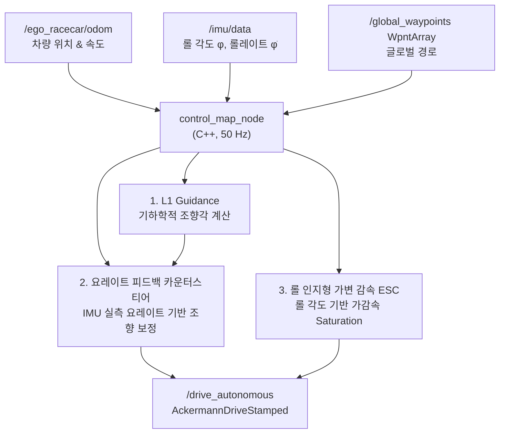

# CLAUDE.md

이 파일은 Claude Code가 이 저장소에서 작업할 때 참고하는 가이드입니다.

## 프로젝트 개요

**2026 IFAC F1TENTH 자율주행 대회**의 **하드웨어 / 제어(Control) 파트** 코드베이스입니다.
ROS 2 패키지 `f1tenth_control` 하나로 구성되며, 플래닝 팀이 발행하는 글로벌 경로를
추종하여 실차(또는 시뮬레이터)를 주행시키는 횡방향(조향)·종방향(가감속) 제어와
안전 시스템(수동/자율 Mux)을 담당합니다. (라이다 기반 자율 비상제동(AEB)은 제어 파트에서
제거됨 — 실제 비상정지는 planning 파트가 판단/발행)

- 언어: C++17 (메인 런타임), Python (참조용 원본 컨트롤러 / LUT 프로토타입)
- 빌드 시스템: `ament_cmake` (ROS 2)
- 코드/주석 언어: **한국어** — 새 코드도 주변 코드의 한국어 주석 밀도·스타일에 맞출 것
- 차량: 휠베이스 0.33 m, 최대 조향각 ±0.41 rad (약 ±23.5°), VESC 모터 컨트롤러

## 워크스페이스 구조 ⚠️ 중요

이 `~/F1tenth_control` 폴더는 **개발/편집용 원본**이며, 루트에 `COLCON_IGNORE`가 있어
**여기서는 colcon 빌드가 되지 않습니다.** 실제 빌드·실행은 상위 ROS 2 워크스페이스
`~/2026_IFAC/`에서 이루어지며, 그 안의 `~/2026_IFAC/f1tenth_control/`로 코드가 동기화됩니다.

```
~/2026_IFAC/                  ← 실제 colcon 워크스페이스
├── src/ , build/ , install/ , log/
├── f1tenth_control/          ← 이 저장소의 동기화 사본 (실제 빌드 대상)
├── planning/                 ← 플래닝 팀 (글로벌 경로 발행)
├── offline_trajectory_generator/ , wpnt_publisher/
├── frenet_conversion/        ← Frenet 좌표 변환 (f110 스택)
└── ...                       ← steering_lookup 패키지(LUT cfg) 포함
```

⚠️ **`~/2026_IFAC` 사본이 이 repo보다 앞서있을 수 있음** — 과거 `steering_control_node.cpp`,
현재 `control_map_node.cpp`/launch 파일들에서 실제로 반복 확인된 패턴(`waypoint_topic`,
`controller_type` 등 2026_IFAC에만 있는 파라미터). **동기화 전 반드시 두 사본을 diff로
비교**하고, 일괄 덮어쓰기(`rsync` 등)로 2026_IFAC의 추가 기능을 지우지 말 것 — 격차를
보존하며 손으로 동일 변경을 양쪽에 적용해야 함.

작업 후에는 변경 사항을 `~/2026_IFAC/f1tenth_control/`로 반영한 뒤 그쪽에서 빌드해야 합니다.

## 빌드 & 실행

```bash
# 빌드 (실제 워크스페이스에서)
cd ~/2026_IFAC
colcon build --packages-select f1tenth_control
source install/setup.bash

# 시뮬레이션 실행 (gym_bridge·global_planner는 별도 기동 필요)
ros2 launch f1tenth_control control_sim.launch.py
ros2 launch f1tenth_control control_sim.launch.py force_autonomous:=true yaw_rate_gain:=0.1

# 실차 실행 (하드웨어 브링업·planning이 먼저 떠 있어야 함)
ros2 launch f1tenth_control control_real.launch.py
ros2 launch f1tenth_control control_real.launch.py max_speed:=8.0 max_lateral_accel:=7.0

# 개별 노드 실행 (디버깅용)
ros2 run f1tenth_control control_map_node
ros2 run f1tenth_control joy_teleop_monitor

# 조이스틱/제어 상태 대시보드 (별도 터미널에서 — 뷰어 노드)
ros2 launch f1tenth_control dashboard.launch.py
```

- 두 launch 파일의 공용 파라미터·노드 정의는 `launch/_control_common.py`에 있음 — 조정 방법은
  아래 "실차 튜닝 파라미터" 참고.
- CMake가 `-O3 -march=native -flto`로 최적화 빌드합니다 (임베디드 실시간 제어 성능 목적).
- `compile_commands.json`이 생성되어 VS Code linter와 연동됩니다.

## 노드 구성 (6개 실행 파일)

### 1. `control_map_node` (control_code/control_map_node.cpp) — 메인 자율주행 제어
50 Hz 제어 루프. **L1 Guidance + Steering Lookup Table(LUT)** 기반.
- 구독: `<odom_topic>`(기본 `/ego_racecar/odom`), `/imu/data`, `/scan`, `/global_waypoints`(`f110_msgs/WpntArray`, transient_local QoS)
- 발행: `/drive_autonomous` (`ackermann_msgs/AckermannDriveStamped`) — Mux를 거쳐 최종 `/drive`로 전달됨
- 분리된 알고리즘 모듈(별도 .cpp/.hpp):
  - `GapFollower` — 글로벌 경로 미수신 시 순수 LiDAR 갭 추종 폴백
  - `StabilityController` — IMU 기반 롤/롤레이트/요레이트 LPF 및 안정성 보정 (TCS/ESC)
  - `SteeringLookupTable` — Pacejka 타이어 모델 기반 (횡가속도, 속도)→조향각 LUT (CSV)
  - `VelocityProfiler` / `geometry` — 곡률 계산 및 Forward-Backward 속도 프로파일링

### 1-B. `control_mppi_node` (control_code/control_mppi_node.cpp) — MPPI 자율주행 제어(MAP 대안)
50 Hz 제어 루프. **샘플링 기반 MPPI**(동역학 자전거+Pacejka, 조향+종가속 동시 최적화)로 글로벌
경로를 추종. `control_map_node`와 **나란히 상시 구동**되며, 평소엔 Mux가 MAP을 라우팅(MPPI 출력
무시)하고 조이스틱 **RB 버튼**을 누르면 즉시 MPPI 출력으로 전환된다.
- 구독: `<odom_topic>`(기본 `/ego_racecar/odom` — pose+twist에서 전체 상태 x,y,yaw,vx,vy,yaw_rate 추출), `/imu/data`(보조, 현재 odom twist 우선), `/global_waypoints`(transient_local)
- 발행: `/drive_mppi` (`ackermann_msgs/AckermannDriveStamped`) — Mux가 RB 상태에 따라 최종 `/drive`로 라우팅
- **솔버 = 컴파일 타임 자동선택**: CUDA 있으면(`USE_MPPI_GPU`) GPU 솔버(`control_mppi_solver_gpu.cu`, float32 병렬 롤아웃), 없으면 CPU 솔버(`control_mppi_solver_cpu.cpp`, double 순차). 노드는 어느 쪽이든 항상 빌드됨(CUDA 없는 팀원 PC에서도 존재 → 런치 안 깨짐). 구조체 필드명이 동일해 `using` 별칭 한 벌로 본문 공유.
- 기준궤적: 최근접 웨이포인트 탐색(control_map_node와 동일 윈도우+wrap) 후 호 길이 `ds=v·dt` 간격으로 N+1개 샘플링(정지 시 수평 붕괴 방지 속도 하한 1.0). 경계비용용 `half_width=min(d_left,d_right)`.
- 출력: MPPI가 (조향, 종가속) 출력 → `speed = vx + accel·dt`(다음스텝 속도 적분)로 변환해 발행.
- **`/scan` 불필요**(갭팔로워 없음, 비상제동은 planning 파트가 판단). LUT 불필요(전방 Pacejka 자체 모델). ⚠️ Pacejka는 gym 기본값 — 실차 보정은 별도 작업.
- **아이들 워밍업 절전** (2026-07-12) — MAP/MPPI 두 노드가 항상 나란히 돌아 Jetson 리소스를
  이중으로 먹는 문제 완화: `joy_teleop_monitor`가 RB 상태를 `/mppi_active`(`std_msgs/Bool`,
  latched/transient_local)로 발행하고, `control_mppi_node`가 이를 구독해 **비활성일 때
  `idle_solve_decimation`(기본 5) 사이클마다 한 번만** 경로탐색+solve를 수행(나머지는 완전
  스킵, warm-start만 유지)해 K=512×N=25 롤아웃 비용을 idle 동안 대폭 절감. RB로 활성화되면
  다음 사이클부터 즉시 매 틱 풀 연산으로 복귀(전환 지연 없음). `/mppi_active` 구독 전(노드
  기동 직후)엔 `mppi_active_=false` 기본값이라 Mux 기본값(MAP)과 자동 일치.

### 2. `joy_teleop_monitor` (control_code/joy_teleop_monitor.cpp) — 제어권 Mux & 텔레메트리
Xbox 조이스틱으로 수동/자율 전환하고, 최종 `/drive`를 결정하는 **멀티플렉서**.
- 구독: `/joy`(원본: 조이스틱 드라이버 `joy_node`, `joy` 패키지 — 2026-07-14부터 이 저장소가 기동하지 않음. 팀 공용 `f1tenth_stack`(f110 단축어)이 라이다/조이스틱/vesc드라이버를 함께 기동하므로 중복 방지 위해 `control_real.launch.py`의 include와 자체 `launch/joy.launch.py` 모두 제거, joy_teleop_monitor는 f1tenth_stack이 띄운 `/joy`를 그대로 구독), `/drive_autonomous`(MAP), `/drive_mppi`(MPPI)
- 발행: `/drive` (최종 구동 명령), `/teleop_dashboard`(`std_msgs/String`, 10Hz — 상태 대시보드 텍스트)
- 대시보드는 화면에 직접 출력하지 않고 텍스트로 발행만 한다(화면 클리어를 Mux 밖으로 분리). 실제 렌더링은 `teleop_dashboard_node`가 별도 터미널에서 담당 → 공용 런치 터미널의 다른 노드 로그를 덮지 않음.
- 버튼 매핑: **LB(4)** AUTO/MANUAL 토글, **B(1)** 비상정지 Latch, **X(2)** 비상정지 해제, **A(0)** 부스트, **RB(5)** MAP/MPPI 알고리즘 전환(**배선 완료** — `current_algorithm_`에 따라 `auto_drive_callback`이 `/drive_autonomous`(MAP)를, `mppi_drive_callback`이 `/drive_mppi`(MPPI)를 각자 자기 차례일 때만 `/drive`로 포워딩. 알고리즘 게이트가 E-stop보다 앞 → 비활성 소스 중복 브레이크 방지, 활성 소스가 E-stop 담당)
- 트리거 스로틀(RT=axes[5], LT=axes[2]), 좌스틱(조향=axes[0])
- 기본 시작 모드: `is_simulation`은 `_control_common.py`에서 **sim/real 런치 양쪽 모두 `True`로
  고정**돼 있음(2026-07-12 확정 — "실차는 안전상 수동 차단"이 아니라 "기본은 항상 조이스틱 수동
  대기"가 의도된 동작). 그 결과 `control_real.launch.py`를 켜도 **MANUAL로 시작**하고 조이스틱
  스틱/트리거 조작이 곧바로 `/drive`에 포워딩됨 — LB로 AUTONOMOUS 전환. 노드 자체 파라미터
  기본값(`false`, 실차 자율 시작+수동 차단)은 더 이상 어느 launch에서도 쓰이지 않음.
  `force_autonomous=true`면 이 기본을 덮어써 조이스틱 없이 AUTONOMOUS로 즉시 기동.
- 수동 비상정지(B버튼 Latch) 활성 시 `/drive`에 brake(speed 0, accel -9.0) 최우선 송출
  (라이다 AEB는 제거됨 — 비상정지는 planning 파트가 판단)
- 대시보드 표시(2026-07-14): "Joystick E-Stop" 상태(`[ACTIVE - BRAKE LATCHED]`/`[NORMAL]`)가
  속도와 무관하게 항상 표시되어 "E-stop으로 정지"와 "그냥 속도 0"을 구분 가능. "Commanded
  RPM(ERPM)"도 추가 — 실제 `/drive`로 나간 마지막 속도(수동/자율/E-stop 어느 경로든)를
  `speed_to_erpm_gain`(위 참고)으로 환산해 표시(표시 전용 계산, 실제 VESC 변환은
  `ackermann_to_vesc_node`가 별도 수행). VESC 실측 피드백 RPM(`sensors/core`,
  `vesc_msgs/msg/VescStateStamped.state.speed`)은 `vesc_msgs`가 main에 없어(팀 재편 때 누락,
  `backup/main-2026-07-13` 브랜치엔 있음) 보류 — 복구되면 이어서 추가 예정.

### 3. `teleop_dashboard_node` (control_code/teleop_dashboard_node.cpp) — 대시보드 뷰어
`joy_teleop_monitor`가 발행하는 `/teleop_dashboard`(`std_msgs/String`)를 구독해, **자기 터미널에서** 화면을 지우고(`\033[2J\033[H`) 상태 대시보드를 렌더링하는 표시 전용 노드.
- 구독: `/teleop_dashboard` / 발행: 없음
- **별도 터미널**에서 실행: `ros2 launch f1tenth_control dashboard.launch.py` (또는 `ros2 run f1tenth_control teleop_dashboard_node`). control_real 런치에는 넣지 말 것(화면 클리어가 공용 터미널을 덮음).
- 안전/제어 경로와 무관한 표시 전용 → 안 띄워도 주행에는 영향 없음.

### 4. `lut_calibrator_node` (control_code/lut_calibrator_node.cpp) — LUT 실측 보정 (관찰 전용)
실차 주행 데이터로 Steering LUT를 실측 보정하는 오프라인 캘리브레이션 노드. **`/drive`를 발행하지 않는 순수 관찰자**라 control_real과 같이 켜둬도 제어에 영향 없음.
- 구독: `/imu/data`(요레이트), `<odom_topic>`(속도), `/drive`(실제 송출된 조향각 — 서보 피드백 대용), `/lut_calibration/save`(`std_msgs/Empty`, 강제 저장 트리거)
- 발행: `/lut_calibration/status`(`std_msgs/String`, 1Hz — 샘플 수·커버리지 등 진행상황)
- 실제 횡가속도 = `v × yaw_rate`로 산출해 LUT와 동일 그리드(조향축×속도축)에 비닝, 원본값 대비 베이지안 블렌딩(`prior_weight`, 샘플 적은 셀은 원본에 가깝게)으로 `~/f1tenth_lut_calibration/NUC6_glc_pacejka_lookup_table_calibrated.csv`에 주기 저장(`save_interval_sec`).
- 누적치는 `~/f1tenth_lut_calibration/calibration_state.csv`에 저장되어, 여러 번 재실행(여러 번 주행)해도 자동으로 이어서 평균이 쌓임.
- **별도 터미널**에서 실행: `ros2 launch f1tenth_control lut_calibration.launch.py`. 결과를 실제로 적용하려면 다음 실행 때 `control_real.launch.py`에 `lookup_table_file:=<출력경로>` 인자로 지정(원본 LUT는 건드리지 않음, 지정 안 하면 원본 그대로).

### 5. `sim_imu_bridge_node` (control_code/sim_imu_bridge_node.cpp) — 시뮬 전용 odom→IMU 중계
f1tenth_gym(gym_bridge)은 `/imu/data`를 발행하지 않으므로, `control_map_node`의 `use_imu` 경로
(요레이트 카운터스티어 등)를 시뮬에서도 실제 데이터로 검증하기 위한 유틸리티 노드.
- 구독: `<odom_topic>`(기본 `/ego_racecar/odom`) / 발행: `<imu_topic>`(기본 `/imu/data`)
- odom의 `twist.twist.angular.z`(요레이트)만 실측 중계, orientation은 identity 고정(롤=0 —
  2D 물리 시뮬 한계라 롤 인지 ESC는 시뮬에서 항상 비활성, 실차 전용 검증 항목).
- `control_sim.launch.py`에 기본 포함되어 `use_imu:=true`를 안전하게 만들어줌. 실차
  런치(`control_real.launch.py`)에는 넣지 말 것(실제 VESC IMU와 토픽이 충돌).

## 토픽 데이터 흐름

```
플래닝팀 → /global_waypoints (WpntArray)
                    ↓
        control_map_node  ──/drive_autonomous──┐ (MAP)
        control_mppi_node ──/drive_mppi────────┤ (MPPI)
                                                    ↓  RB 버튼으로 소스 선택
   /joy ──→ joy_teleop_monitor (Mux) ────────────/drive──→ 차량(VESC)

(비상제동은 제어 파트에서 제거됨 — planning 파트가 판단/발행)
```
(두 컨트롤러 노드는 항상 나란히 구동 — 기본은 MAP, RB로 MPPI 즉시 전환)



## 핵심 제어 알고리즘 (control_map_node)

1. **최근접 웨이포인트 탐색** — 지난 인덱스 주변 윈도우 스캔, 2.5m 초과 이탈 시 전역 재탐색(failsafe)
2. **곡률 룩어헤드 사전 감속 (프로파일 신뢰형 backward-pass, 2026-07-13 재설계)** — 제동거리
   `v²/2a`만큼 전방을 스캔해, 각 전방 지점의 그립제한 목표속도 `v_cap=min(프로파일 vx, √(a_lat/κ))`
   까지 `base_max_decel`로 감속 가능한 현재 최대속도 `√(v_cap²+2·a·d)`의 최소값을 캡으로 사용.
   (구 방식 `v_max=√(a_lat/κ_max)` 블랭킷 재캡은 오프라인 프로파일보다 낮은 a_lat·창내 최대 κ로
   전 구간을 과잉감속시켜 폐기 — 아래 L1 Guidance 노트 참고)
3. **L1 Guidance** — 속도 비례 L1 거리 → 전방 목표점 → `sin(eta)` 횡오차 → 목표 횡가속도
4. **Steering LUT 조회** — (횡가속도, 속도) → 조향각 (Pacejka 모델 보간)
5. **동적 스케일러** — 가감속/속도/곡률 FF 보정
6. **요레이트 피드백 카운터스티어** (2026-07-11 배선) — IMU 실측 요레이트와 기하학적 기대
   요레이트(`v·tanδ/L`) 오차만큼 조향 보정, `use_imu` 게이트. rate limit·클리핑 이전에 적용
7. **rate limit(0.4) + 물리 한계 ±0.41 클리핑**
8. **롤 인지형 가변 가감속(ESC)** — IMU 롤 비율로 가속/감속 한계를 동적 축소, 전복/스핀 방지

### 제어 이론 상세

#### L1 Guidance (Pure Pursuit 계열)

속도 비례 룩어헤드 거리로 전방 목표점을 선정, 횡가속도 명령을 계산한 뒤 LUT로 조향각을 결정합니다.

$$\delta = \arctan\!\left(\frac{2L\sin\alpha}{L_{lt}}\right), \quad L_{lt} = k_{ld} \cdot v + L_{min}$$

- $L$: 휠베이스 (0.33 m), $\alpha$: 차량 헤딩과 목표점 사이 각도
- $k_{ld}$: `l1_gain`, $L_{min}$: `l1_distance`

✅ **해결됨 — 촘촘/시케인형 웨이포인트에서 스타트/피니시 부근 스핀** (2026-07-12 발견, 2026-07-13
해결): 작년 완성형 `new_map_con` 컨트롤러와 폐루프 랩타임을 비교하기 위해 그쪽이 쓰던 0.18m 간격
웨이포인트 CSV(`fuck_f1.csv`, 우리 `global_planner` 표준 출력은 ~0.36m)를 현재 `control_map_node`에
그대로 먹였더니, 스타트/피니시 직전 급코너 연속 구간(idx 약 153~197, ~8m, 인접점 헤딩차분 기반
`kappa_radpm`이 0.18m 간격 때문에 점마다 0.05~1.05 rad/m로 크게 튀는 구간 — 시각적으로는 "곡률 부호
반전 시케인"처럼 보였으나 실제로는 노이즈 심한 단일 방향 급커브였음, closest_idx 탐색 자체는
정상)에서 매 랩 반복적으로 조향이 ±0.41 rad에 포화되고 속도가 0 근처로 붕괴하는 스핀이 발생(작년
컨트롤러 7.1s/랩 vs 우리 16.6~16.8s/랩, 동일 웨이포인트). closest_idx 탐색 관련 2가지 수정
([[map-node-index-fixes]] 참고)과 `t_clip_min` 단독 조정(0.8→1.5)은 모두 근본 원인이 아니었음
(후자는 오히려 출발선을 못 벗어남).

**근본 원인 2가지, 둘 다 LUT/곡률 파이프라인의 구조적 문제였고 파라미터가 아니라 코드 수정으로
해결**(`include/f1tenth_control/steering_lookup_table.hpp`, `control_code/control_map_node.cpp`,
`include/f1tenth_control/types.hpp`):

1. **LUT 역조회의 봉우리 접힘(fold-back) 모호성** — Pacejka LUT의 각 속도열은 조향각이 커질수록
   횡가속도가 단조 증가하다 타이어 슬립각 한계(그립 피크, 실측 최대 ~6.8 m/s²)를 넘으면 다시
   감소하는 봉우리형 곡선이다(전 속도축 실측 확인, 단일 피크). 시케인처럼 `lat_acc = 2v²sinη/L1`가
   순간적으로 이 피크를 넘는 요청을 하면, 기존 `find_closest_neighbors`는 배열 전체에서 목표값에
   최근접한 두 이웃을 찾는데 피크 양쪽(저조향/고조향)의 서로 다른 두 조향각이 "비슷하게 가까운
   값"이 되어 사이클마다 어느 쪽이 선택되는지 흔들리며 조향이 요동쳤음. **수정**: `lookup_steer_angle()`에서
   각 속도열의 피크 인덱스를 찾아 그 이후 구간을 NaN 처리, 검색을 "피크 이전(그립 내) 단조 구간"으로
   제한 — 피크를 넘는 요청은 자연히 그 속도의 최대 그립 조향각으로 saturate되어 항상 하나의 안정적인
   해로 수렴한다.
2. **단일점 곡률 노이즈로 인한 과잉 사전감속** — `kappa_radpm`은 인접점 헤딩차분으로 산출되어
   웨이포인트가 촘촘할수록(0.18m) 짧은 구간의 헤딩 노이즈가 증폭돼 개별 포인트 kappa가 실제
   지속 곡률보다 훨씬 크게 튄다(예: idx175 kappa=1.05, 그러나 주변 포인트는 0.05~0.4). 곡률
   사전감속(1.5절)이 "윈도우 내 최대 단일점 kappa"를 그대로 써서 `v_max=sqrt(a_lat/kappa)`를
   계산하면, 이 노이즈 스파이크 하나가 이미 오프라인 최적화된 플래너 자체 속도(`vx_mps`, 이 구간
   ~5 m/s)보다 훨씬 낮은 속도로 과잉 감속시켜 코너를 불필요하게 느리고 덜걱거리게 통과했음.
   **수정**: `global_path_callback`에서 물리거리 ±0.3m(총 0.6m) 창으로 `|kappa|` 평균을 내
   `Waypoint::smoothed_curvature`에 저장, 사전감속 스캔은 이 평활값을 사용(원본 `curvature` 필드는
   FF 조향 등 다른 용도를 위해 그대로 둠).

**결과 (시뮬 실측, 두 수정 함께 적용, 런치 파라미터는 전부 기본값 그대로)**: `fuck_f1.csv`(198점,
0.18m) 위에서 9랩 연속 스핀/이탈/장시간 포화 없이 완주, 랩타임 8.4~10.0s(첫 랩 7.4~8.5s, 이후
9.9~10s에 수렴 — `new_map_con`의 7.1s에는 못 미치지만 스핀 없이 안정적, 성공 기준 "7~9초대면 충분"에
근접). `t_clip_min`/`l1_gain`/`max_lateral_accel`/가감속 스케일러 등 여러 파라미터 조합을 추가로
스윕했으나 이 코드 수정 대비 유의미한 추가 개선은 없었음(아래 "시도했다 버린 것" 참고) — 즉 이
두 코드 수정이 사실상 유일한 레버였음.

**회귀 확인**: 우리 실제 `global_planner` 산출 프로덕션 트랙(같은 `fuck_f1` 맵, 자체 mincurv
최적화 99점 웨이포인트, ~0.36m 간격, 오프라인 추정 랩타임 8.27s)에서 6랩 연속 **8.54s로 완전히
일관되게** 완주 — 회귀 없음, 오히려 개선(과거엔 이 안전장치가 프로덕션 트랙에서도 다소 과잉
보수적이었을 가능성).

**시도했다 버린 것** (다음에 같은 삽질 방지):
- `t_clip_min` 0.8→1.0/1.5 단독 조정: 개선 없음(1.5는 오히려 출발선 이탈 실패).
- 곡률 평활 창 0.3m→0.6m: 랩타임 소폭 악화(9.9s→10.2s) — 창이 넓을수록 진짜 급코너에서도
  과도하게 눌려 더 보수적으로 감속됨. 0.3m가 최적.
- 헤딩오차 기반 감속 스케일러(7. 종방향 제어, `heading_error>=20°`일 때 `target_speed`를 최대
  50%까지 깎는 로직, `new_map_con`엔 없는 우리만의 로직) 임시 비활성화: 랩타임 악화 및 변동성
  증가(9.9s→9.8~11.3s) — 이 로직은 새 코너 진입 시 실제로 안정성에 기여하고 있었음, 제거하면 안 됨.
- `acceleration_scaler_for_steering`/`deceleration_scaler_for_steering`을 `new_map_con` 값(1.2/0.9)에
  맞춤 + `max_lateral_accel` 6.0→6.7: 위 두 코드 수정이 이미 적용된 상태에서는 눈에 띄는 차이 없음
  (9.9s대에서 거의 동일) — 남겨두지 않고 기존 기본값(1.0/0.95, 6.0) 유지.

**남은 불확실성**: 시뮬 Pacejka 타이어 모델(f1tenth_gym 기본값)이 실차와 다르므로 위 LUT
피크saturate 동작이 실차 LUT(`NUC6_glc_pacejka_lookup_table.csv`, 실측 데이터)에서도 동일하게
유효한지는 실차 검증 필요 — 다만 이 CSV도 동일한 봉우리형 구조(그립 피크 후 감소)를 갖고 있음을
확인했으므로 로직 자체는 데이터 형태에 안전하게 적용됨. `new_map_con`의 7.1s와 우리의 9.9s 사이
남은 ~2.8초 격차의 정확한 원인(속도 프로파일을 그대로 신뢰하는 `new_map_con`과 달리 우리는 곡률
사전감속·헤딩오차 감속 등 다중 안전장치가 누적 보수적으로 작동하기 때문으로 추정)은 더 파고들지
않았음 — 촘촘한 시케인 트랙은 실제 대회에서 거의 안 나오는 엣지케이스이고, 스핀 없는 안정 완주라는
최우선 목표는 달성했다고 판단.

✅ **곡률 사전감속을 프로파일 신뢰형 backward-pass로 재설계** (2026-07-13, 작년 실대회맵 oct_28
벤치에서 도출 — [[oct28-benchmark-backward-pass]], WORKLOG 2026-07-13 (2) 참고): 작년 실제 대회맵
`oct_28`+작년 웨이포인트(`oct28.csv`)로 우리 컨트롤러를 처음 폐루프 측정했더니 기본 **13.62s**로,
친구 실차(~7.5s)의 1.8배·평균속도가 프로파일의 **41%**밖에 안 됐다. 원인은 곡률 사전감속의 구
방식 `√(max_lateral_accel/κ_max)`: ① 고정 a_lat(6.0)이 이 프로파일의 암묵 가정 a_lat(vx²·κ 최대
~10)보다 낮고, ② 창내 '최대 κ'를 써서 다가오는 코너 하나가 그 앞 직선(프로파일 8 m/s)까지
3.5로 과잉감속. **해결**: 각 전방 지점의 그립제한 목표 `min(프로파일 vx, √(a_lat/κ))`까지
`base_max_decel`로 감속 가능한 현재속도의 최소값을 캡으로 쓰는 backward-pass로 교체(위 핵심
알고리즘 2번). 결과 oct_28 기본 13.62→**12.07s**, MLA 8/10에서 11.1/10.98s, 그리고 구 방식이
이탈하던 **고 MLA(20~50)에서도 안정 완주**(선제동을 항상 보장 → 크래시 실패모드 제거). fuck_f1
프로덕션 트랙은 8.54→8.64s로 **+0.1s 미세 회귀**했으나 실대회맵 이득이 명백해 유지 결정. 남은
11s→7.5s 갭은 사전감속이 아니라 헤딩오차 감속·횡추종 능력 등 다른 층의 문제(다음 과제, MPPI는
별건).

✅ **fuck_f1 프로덕션 8.54→6.97s(7초 돌파)** (2026-07-14, [[fuck-f1-7s-profile-regen]], WORKLOG
2026-07-14): 컨트롤러는 이미 프로파일 추정(8.27s)을 거의 따라잡고 있어 **7초 레버는 컨트롤러가
아니라 속도 프로파일**이었음(우리 프로파일 min 3.5/mean 4.43 vs new_map_con 5.0/5.38). 트래젝토리
생성기 속도 파라미터 상향(재생성) + 컨트롤러 그립클램프 `max_lateral_accel` 동반 상향(backward-pass가
프로파일을 누르지 않게)으로 폐루프 6.97s 달성. sim 기본값 반영(위 파라미터 표). ⚠️ 공격적 프로파일은
실그립 초과라 실차 검증 별도, 생성기 수치는 글로벌 파트가 재생성.

#### 요레이트 피드백 카운터스티어 (Yaw Rate Feedback)

L1로 확정한 명령 조향각이 기하학적으로 의도하는 기대 요레이트 대비, IMU 실측 요레이트의 오차에
비례해 조향을 보정합니다. 언더스티어(실측 < 기대) 시 더 꺾어 슬립을 상쇄합니다.

$$\delta \mathrel{+}= k_{\dot\psi} \cdot \left(\frac{v \tan\delta}{L} - \dot\psi_{\text{measured}}\right)$$

- $k_{\dot\psi}$: `yaw_rate_gain`(기본 0.08), $\dot\psi_{\text{measured}}$: IMU `angular_velocity.z` LPF
- `use_imu=false`면 비활성, 저속(<0.5m/s)은 특이점 방지로 0 처리
- ⚠️ VESC 자이로가 deg/s를 rad/s로 변환 안 하고 그대로 발행할 가능성이 있음(미확정, 실측
  필요 — WORKLOG 2026-07-11 VESC IMU 조사 참고). 확정 전 실차에서 게인을 과도하게 올리지 말 것

#### 과도기 응답 보상 (Transient Response Compensation) — ⚠️ 현재 미배선(dead code)

`imu_stability_controller.cpp`에 함수(`calculate_steering_attenuation`)는 정의돼 있으나
**control_loop에서 호출되지 않음** — 코너 진입 시 서스펜션 Settling 전 과도 상태에서
롤레이트($\dot{\phi}$)가 급증할 때 조향 게인을 감쇄해 타이어 슬립을 방지하려는 의도였으나
아직 실제 조향 계산에 반영되지 않고 있음(설계 참고용으로만 보존).

$$K_{p,\text{steer}} = K_{p,\text{base}} \cdot \Bigl(1 - \text{clip}\!\left(k_{\text{roll\_rate}} \cdot |\dot{\phi}|,\ 0,\ \beta_{\max}\right)\Bigr)$$

- $k_{\text{roll\_rate}}$: 감쇄 민감도 게인, $\beta_{\max}$: 최대 감쇄 한계 (예: 0.5 → 최대 50% 감쇄)

#### 롤 인지형 가변 감속 — Roll-Aware ESC

롤 각도($\phi$)가 크면 타이어 하중 이동으로 마찰 한계가 줄어드므로, 가감속 한계를 비례 축소하여 스핀을 방지합니다.

$$a_{\max} = a_{\text{base}} \cdot \Bigl(1 - \text{clip}\!\left(\frac{|\phi|}{\phi_{\text{limit}}},\ 0,\ 1\right) \cdot \gamma_{\text{decel}}\Bigr)$$

- $\phi_{\text{limit}}$: `max_roll_limit` (예: 0.15 rad ≈ 8.6°), $\gamma_{\text{decel}}$: `decel_attenuation`

## 실차 튜닝 파라미터 (control_map_node)

- `control_map_node`의 나머지 파라미터는 전부 코드 내 `declare_parameter` 기본값(별도 YAML
  미연결). **전부 생성자에서 1회만 읽음**(파라미터 콜백 없음) — 값을 바꾸려면 노드 재시작 필요,
  런타임 `ros2 param set`은 무효. 조정 경로에 따라 3그룹으로 나뉨:

### ① 터미널 인자로 즉시 조정 (파일 수정·재빌드 불필요)
`control_real.launch.py`/`control_sim.launch.py` 실행 시 `param:=value`로 바로 오버라이드.
전체 목록은 `ros2 launch f1tenth_control control_real.launch.py --show-args`로 확인:

| 파라미터 | 기본값 | 설명 |
|---|---|---|
| `max_speed` | 6.0(real)/12.0(sim) | 직선 최고속도 캡 [m/s] |
| `max_lateral_accel` | **10.0(real·sim)** | **코너 그립 한계 a_lat [m/s²]** — 2026-07-13 backward-pass 재설계 후 의미가 "블랭킷 속도캡"에서 "실차 타이어 그립"으로 바뀜. 각 전방 지점 목표속도 `min(프로파일 vx, √(a_lat/κ))`의 그립항. **2026-07-14 sim·real 모두 6.0/6.5→10.0**(사용자 요청, 폐루프 6.97s 달성값). ⚠️⚠️ **10.0은 LUT 실그립 마찰피크(~6.7) 크게 초과 = 시뮬 낙관치**. backward-pass가 min(프로파일,√(10/κ))라 **보수적 프로파일에선 사실상 무효**(프로파일이 이김) — 실차가 이 값만으로 빨라지지 않음. 공격적 프로파일이 √(6.7/κ) 넘으면 **실차 코너 슬라이드/이탈** → 실그립 매칭 프로파일+저속 셰이크다운 검증 필수, 슬라이드 시 6.7로 복귀 |
| `yaw_rate_gain` | 0.08 | 요레이트 카운터스티어 게인 (낮게 시작해 채터링 보며 상향) |
| `odom_topic` | `/pf/pose/odom` | 위치추정 odom 소스 (real만 인자, sim은 `/ego_racecar/odom` 고정) |
| `lookup_table_file` | `''` | 보정 LUT CSV 경로 (`lut_calibrator_node` 결과 적용 시, real만) |
| `acceleration_scaler_for_steering` | 1.0 | 가속 중(acc_mean≥1.0) 조향각 스케일러 |
| `deceleration_scaler_for_steering` | 0.95 | 감속 중(acc_mean≤-1.0) 조향각 스케일러 |
| `start_scale_speed` / `end_scale_speed` | 7.0 / 8.0 | 속도 비례 조향 다운스케일 구간 [m/s] |
| `downscale_factor` | 0.10 | 고속 구간 조향각 다운스케일 최대 비율 |
| `speed_lookahead` / `speed_lookahead_for_steering` | 0.15 / 0.0 | 종방향/조향용 속도 예측 룩어헤드 시간 [s] |
| `max_roll_limit` | 0.15 | 롤 전복 위험 임계치 [rad] |
| `decel_attenuation` | 0.6 | 롤 비율에 따른 가감속 한계 축소 비율 |
| `local_fresh_timeout` | 0.3 | `/local_waypoints` 신선도 타임아웃 [s] |
| `obstacle_avoid_enable` | false | GapFollower 장애물 회피 폴백 활성화 (기본 false — 앞차를 장애물로 오인해 회피 전환하는 overtake 방해 방지, `:=true`로 복구) |
| `obstacle_cone_halfangle` / `obstacle_trigger_dist` / `obstacle_margin` | 0.14 / 1.5 / 0.3 | 장애물 차단 판정 콘 각도[rad]/거리[m]/여유[m] |
| `obstacle_avoid_hold_cycles` | 15 | 회피 폴백 유지 사이클(50Hz, int) |
| `base_max_decel` | 8.0 | 종방향 최대 감속도 한계 [m/s²] — 곡률 사전감속 제동거리(`v²/2a`) 계산에 직접 쓰임. **실측 검증 전 추정값**, `max_lateral_accel` 마찰피크(~6.7)보다 높아 낙관적일 수 있음 — 실차 급제동 IMU 실측(`acc_mean`) 후 재조정 권장 |
| `base_max_accel` | **9.0(real·sim)** | 종방향 최대 가속도 한계 [m/s²] — **각 진입점 launch 파일**에 각각 `DeclareLaunchArgument`로 선언. **2026-07-14 sim·real 모두 4.0/6.5→9.0**(사용자 요청, 공격적 프로파일 직선속도 추종용, 폐루프 6.97s 달성값). 속도는 프로파일이 캡하므로 최고속 불변, 램프만 급해짐. ⚠️ 실차는 급가속 휠스핀/앞들림 실측 검증 후 유지 |
| `l1_gain` / `l1_distance` | 0.5 / 0.3 | L1 룩어헤드 거리 공식 `l1_gain + v*l1_distance`의 오프셋[m]/속도게인[s] |
| `t_clip_min` / `t_clip_max` | 0.8 / 5.0 | L1 룩어헤드 거리 하한/상한 [m] (`t_clip_min`은 촘촘/시케인 웨이포인트에서 낮을수록 국소 지그재그 추종해 조향 진동 유발 가능 — new_map_con 대응값은 1.5. 단독 조정으론 스핀 미해결로 확인됨, 아래 L1 Guidance 해결 노트 참고) |

(2026-07-11: 과거 "③ 어디에도 노출 안 됨" 그룹이었던 15개 전부 `_control_common.py`의
`declare_common_args()`에 추가해 여기로 이동 — 이제 `control_map_node.cpp`를 안 건드리고도 전부
터미널에서 튜닝 가능. 2026-07-12: `base_max_decel`/`base_max_accel`도 동일하게 터미널 인자로 승격.
2026-07-13: `l1_gain`/`l1_distance`/`t_clip_min`/`t_clip_max`도 시케인 스핀 조사 중 터미널 인자로
승격 — 이전엔 그룹②였음)

### ② `launch/_control_common.py` 수정 필요 (sim/real 둘 다 반영, 재빌드는 파일 복사라 가벼움)
`build_control_map_node()` 안에 고정 정의된 공통 파라미터 — 여기 고치면 시뮬·실차 둘 다 바뀜:

`wheelbase`(0.33), `lateral_error_coeff`(1.0), `min_speed`(2.0), `curvature_lookahead_count`(20),
`wall_safety_margin`(0.6), `use_imu`(true), `curvature_ff_blend`(0.0),
`heading_damping_gain`(0.0)
(주: `l1_gain`/`l1_distance`/`t_clip_min`/`t_clip_max`는 2026-07-13 그룹①(터미널 인자)로 승격됨)

- `wall_safety_margin` — **안전라인 시프트**: 플래너 최적라인이 벽에 너무 붙은(클리어런스 부족)
  구간에서 메시지의 `d_left/d_right`로 웨이포인트를 트랙 중심 쪽으로 밀어 최소 벽 여유 확보.
  차체(0.58×0.31m)가 벽을 스치는 충돌 방지. 0이면 원본 라인 그대로(`global_path_callback`)
- `heading_damping_gain` — Stanley형 heading 정렬항. 시뮬에서 효과 미미/역효과로 기본 비활성,
  실차 튜닝용으로만 보존
- `curvature_ff_blend` — 곡률 피드포워드 비중. 0이면 순수 L1 격리(검증된 상태 유지)

### MPPI 노드 파라미터 (control_mppi_node)
`build_control_mppi_node()`가 `_control_common.py`에 있으며, MPPI 튜너블
`mppi_lambda`(1.0)/`mppi_sigma_steer`(0.15)/`mppi_sigma_accel`(1.5)이 `declare_common_args()`에
런치 인자로 노출됨(control_map_node와 동일 패턴 — 코드는 안 건드리고 튜닝). `odom_topic`,
`max_speed`(→노드 `v_max`)는 진입점 런치에서 전달. 나머지 MPPI 파라미터(N/K/차량/타이어/비용
가중)는 노드 코드 `declare_parameter` 기본값이라 `ros2 run ... --ros-args -p` 또는 런치 확장으로
오버라이드 가능(전부 생성자 1회 읽음, 콜백 없음 — control_map_node와 동일).

### VESC 게인 파라미터 (joy_teleop_monitor ↔ ackermann_to_vesc_node 공용)
`speed_to_erpm_gain`(기본 4614.0) — 속도[m/s]→VESC ERPM 변환 게인. `_control_common.py`의
`declare_common_args()`에 런치 인자로 선언돼 있고, `build_joy_teleop_monitor()`(대시보드 "Commanded
RPM(ERPM)" 표시용, 2026-07-14 추가)와 `control_real.launch.py`의 `ackermann_to_vesc_node`(실제
VESC 변환)가 동일한 값을 공유한다. 두 곳이 어긋나면 대시보드 RPM 표시가 실제 VESC 동작과 안 맞게
되므로, 값을 바꿀 때는 반드시 이 인자 하나만 조정할 것(개별 노드 파라미터를 따로 덮어쓰지 말 것).

## Steering Lookup Table (LUT)

- 파일: `control_code/NUC6_glc_pacejka_lookup_table.csv` (행=조향각축, 열=속도축). CMake `install(FILES ...)`로 `share/f1tenth_control/cfg/`에도 설치됨.
- `control_map_node`의 LUT 로드 Fallback 순서(**모두 이식성 있는 ament 경로 — 하드코딩 홈 경로 제거됨**):
  1. `lookup_table_file` 파라미터(기본 빈값→스킵) 2. `steering_lookup` 패키지 share/cfg 3. `f1tenth_control` 패키지 자체 share/cfg. 전부 실패 시 조향 0 고정+에러 로그.
- C++ `SteeringLookupTable`(steering_lookup_table.hpp)는 Python `lookup_steer_angle.py`(현재
  `docs/`, 아래 "참고/비활성 자산" 참고)를 포팅한 것

## 외부 의존성

- `f110_msgs` — 플래닝 팀의 `WpntArray`/`Wpnt` 메시지 (x_m, y_m, vx_mps, kappa_radpm, psi_rad)
- `steering_lookup` — LUT cfg 제공 패키지 (워크스페이스 내)
- 표준: `rclcpp`, `sensor_msgs`, `nav_msgs`, `ackermann_msgs`, `std_msgs`, `ament_index_cpp`

## 참고 / 비활성 자산

## MPPI 컨트롤러 솔버 (control_mppi_node의 백엔드 — 위 노드 1-B 참조)

MPPI 알고리즘은 **CPU/GPU 두 솔버**로 구현돼 있고, `control_mppi_node`가 빌드타임에 하나를
선택해 링크한다(위 노드 1-B). 아래 두 파일은 그 솔버 본체.

- `control_code/control_mppi_solver_cpu.cpp` (구 `mpc_controller.cpp`) — **CPU 솔버**(`MPPIController`, double). 정보이론 MPPI(Williams 2018): K개 잡음 롤아웃을 **동역학 자전거+Pacejka** 타이어 모델로 전진시켜 비용 가중평균으로 **조향+종가속 동시** 최적화. 저속(vx→0) 슬립각 발산은 기구학 자전거로 블렌드. 별도 헤더 없이 **단일 파일에 인라인 정의**(control_map_node.cpp 패턴)이며 외부 솔버 의존 없음(OSQP 제거). CUDA 없는 빌드에서 `control_mppi_node`가 `#include "control_mppi_solver_cpu.cpp"`로 직접 링크(가드된 main은 미포함). 파일 하단 `#ifdef MPPI_SMOKE_TEST` 블록으로 ROS 없이 폐루프 검증 가능(`g++ -DMPPI_SMOKE_TEST`). ⚠️ 기존 NUC6 Pacejka LUT는 (횡가속도,속도)→조향각의 *역방향* 맵이라 MPPI 전방 롤아웃엔 못 씀 → 전방 Pacejka 파라미터는 자체 기본값(f1tenth_gym), 추후 실차 보정.
- **MPPI GPU 솔버** (2026-07-11 추가) — **GPU 솔버**: `control_mppi_solver_cpu.cpp`의 롤아웃 코어를 CUDA로 포팅. CUDA 있는 빌드에서 `control_mppi_node`가 `USE_MPPI_GPU`로 이걸 링크(위 노드 1-B). 수학/구조(동역학 자전거+Pacejka, 저속 기구학 블렌드, 정보이론 가중 갱신, warm-start)는 CPU와 동일하되 K개 롤아웃을 GPU 병렬 실행하고 float32로 계산(소비자/임베디드 GPU FP64 처리량 열세 회피). CPU 레퍼런스(double)는 그대로 두고 독립 유지.
  - `control_code/control_mppi_solver_gpu.cu` — 커널 3종(rollout=롤아웃당 스레드1개+스레드별 영속 curand Philox / weighted_update=타임스텝당 블록+공유메모리 트리 리덕션 / init_rng) + `solve()`. 파일 하단 `#ifdef MPPI_GPU_SMOKE_TEST` 폐루프 검증(`nvcc -arch=sm_89 -DMPPI_GPU_SMOKE_TEST`).
  - `include/f1tenth_control/mppi_types_gpu.hpp` — float32 POD(`MppiStateF`/`MppiRefF`/`MppiControlF`/`MppiParamsF`, CPU와 동일 기본값) + `__host__ __device__` 공용 유틸(NVCC 아닐 땐 매크로 소거).
  - `include/f1tenth_control/mppi_gpu.hpp` — PImpl로 thrust/CUDA를 은닉한 `MPPIControllerGPU` 순수 C++ 인터페이스(CPU `MPPIController`와 동일 형태 reset/propagate/solve). 향후 노드가 두 컨트롤러를 상호 교체하는 데 씀.
  - **빌드**: `CMakeLists.txt`의 `check_language(CUDA)` 게이트로 **CUDA 있을 때만** `control_mppi_gpu_solver` 정적라이브러리 빌드 + `control_mppi_node`에 `USE_MPPI_GPU` 정의·링크(plain-signature `target_link_libraries` — ament이 이미 plain을 써서 keyword 혼용 시 CMake 에러). CUDA 없는 팀원 PC/CI에선 GPU 타겟만 스킵되고 `control_mppi_node`는 CPU 솔버로, 나머지 6개 노드는 그대로 빌드됨(양쪽 경로 colcon 빌드 검증 완료). `CMAKE_CUDA_ARCHITECTURES "75;80;86;87;89"`(Jetson Orin Nano=87, 개발PC RTX4060=89). ⚠️ 기존 `add_compile_options(-O3 -march=native -flto)`는 `$<$<COMPILE_LANGUAGE:CXX>:...>`로 CXX 전용 스코프 제한됨 — nvcc가 `-march=native`를 못 알아들어서(제거 시 `.cu` 컴파일 실패).
  - ⚠️ 개발PC에 CUDA 13.0 설치돼 있으나 **PATH가 zshrc에 없음** — 빌드 전 `export PATH=/usr/local/cuda/bin:$PATH; export LD_LIBRARY_PATH=/usr/local/cuda/lib64:$LD_LIBRARY_PATH` 필요. 성능수치(solve ms)는 RTX 4060 기준이라 Jetson 실시간 예산(20ms@50Hz) 예측 아님 — 실차 Jetson 재검증 항목.
- `vesc_mcconf.xml` / `vesc_appconf.xml` — VESC 모터/앱 설정 (전류 max 60A, max ERPM 40000 등)
- `docs/` — 하드웨어/IMU 통합 가이드, Technical Description Paper, `lookup_steer_angle.py`(C++
  `SteeringLookupTable`의 포팅 원본, 실행 안 됨 — 2026-07-14 `control_code/`에서 이동) (.gitignore로
  git 제외됨)

## 작업 시 주의사항

- **빌드는 항상 `~/2026_IFAC`에서** — 이 폴더 단독 빌드 불가(COLCON_IGNORE)
- 한국어 주석 컨벤션 유지, 실시간 50Hz 루프이므로 콜백/루프 내 무거운 연산 지양
- 안전 노드(Mux)의 brake 우선순위 로직은 안전 직결 — 변경 시 신중히
- 조향 한계 ±0.41 rad, brake accel -9.0 등 물리/안전 상수는 하드웨어 기준값
- 시뮬/실차 런치파일 공통 로직은 `launch/_control_common.py`에 있음 — 공통 파라미터 추가/변경
  시 여기 한 곳만 고치면 됨. 단 조이스틱 드라이버·`sim_imu_bridge_node` 포함 여부 같은
  안전 관련 구조 차이는 일부러 공용화하지 않고 각 진입점 파일(`control_sim/real.launch.py`)에
  그대로 둠(환경을 잘못 골라 안전기능이 빠진 채 기동되는 실수를 구조적으로 차단하기 위함)
- `~/2026_IFAC` 사본이 repo보다 앞서있을 수 있음(`waypoint_topic`/`controller_type` 등) —
  동기화 전 반드시 diff 확인, 일괄 덮어쓰기로 격차를 지우지 말 것(위 워크스페이스 구조 참고)
