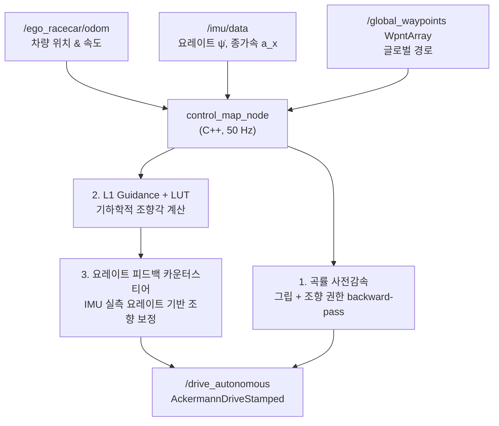

# CLAUDE.md

이 파일은 Claude Code가 이 저장소에서 작업할 때 참고하는 가이드입니다.

## 프로젝트 개요

**2026 IFAC F1TENTH 자율주행 대회**의 **하드웨어 / 제어(Control) 파트** 코드베이스입니다.
ROS 2 패키지 `f1tenth_control` 하나로 구성되며, 플래닝 팀이 발행하는 글로벌 경로를
추종하여 실차(또는 시뮬레이터)를 주행시키는 횡방향(조향)·종방향(가감속) 제어와
안전 시스템(수동/자율 Mux)을 담당합니다. (라이다 기반 자율 비상제동(AEB)은 제어 파트에서
제거됨 — 실제 비상정지는 planning 파트가 판단/발행)

- 언어: C++17 (메인 런타임), Python (참조용 원본 컨트롤러 / LUT 프로토타입)
- 빌드 시스템: `ament_cmake` (ROS 2)
- 코드/주석 언어: **한국어** — 새 코드도 주변 코드의 한국어 주석 밀도·스타일에 맞출 것
- 차량: 휠베이스 0.33 m, 최대 조향각 **좌 0.41 / 우 0.379 rad(비대칭)** — servo_min/max가 옛 중심
  기준이라 우측이 잘린다. 2026-07-28에 ±0.42 대칭화를 시도했다가 **odom이 깨져 롤백**
  (아래 ⚠️ 참고). 시뮬은 대칭 ±0.41. VESC 모터 컨트롤러
  - 🔴 **그런데 실측 도달각은 명령의 74%뿐이다**(2026-07-28 저녁, 3회 재현). 0.41 rad을
    명령해도 실제로는 **~0.30 rad**밖에 안 꺾인다(횡가속 1.09 m/s²라 슬립으론 설명 불가 =
    기계적). 즉 위 0.41/0.379는 **둘 다 낙관치**일 수 있고, 조향 권한 속도 캡(②-b)이
    그만큼 코너 진입 속도를 과대 허용 중이다. 슬립분이 섞여 있어 순수 기계 한계는
    0.30~0.41 사이 — **바퀴 들고 각도기로 풀락 각을 재야** 분리된다. 재검증 전까지
    컨트롤러 값은 건드리지 않았다.

## 워크스페이스 구조 ⚠️ 중요

이 `~/F1tenth_control` 폴더는 **개발/편집용 원본**이며, 루트에 `COLCON_IGNORE`가 있어
**여기서는 colcon 빌드가 되지 않습니다.** 실제 빌드·실행은 상위 ROS 2 워크스페이스
`~/2026_IFAC/`에서 이루어지며, 그 안의 `~/2026_IFAC/src/f1tenth_control/`로 코드가 동기화됩니다.

```
~/2026_IFAC/                  ← 실제 colcon 워크스페이스
├── build/ , install/ , log/
├── src/
│   ├── f1tenth_control/      ← 이 저장소의 동기화 사본 (실제 빌드 대상)
│   ├── local_planning/ , global_planning/ , state_machine/   ← 플래닝 팀
│   ├── opponent_detector/ , wpnt_publisher/ , monte_carlo_localization/
├── offline_trajectory_generator/ , wpnt_publisher/
├── frenet_conversion/        ← Frenet 좌표 변환 (f110 스택)
└── ...                       ← steering_lookup 패키지(LUT cfg) 포함
```

⚠️ **`~/2026_IFAC` 사본이 이 repo보다 앞서있을 수 있음** — `f1up`으로 커밋 전, 두 사본을
diff로 비교해 어느 쪽이 최신인지 확인할 것. 특히 팀 공용 저장소(`2026_IFAC`)의 `main` 브랜치가
다른 팀원의 push로 갱신됐다면, 이쪽(dev repo)의 미커밋 변경을 그대로 덮어쓰지 않도록 주의.

작업 후에는 변경 사항을 `~/2026_IFAC/src/f1tenth_control/`로 반영한 뒤 그쪽에서 빌드해야 합니다.

⚠️ **빌드는 `--symlink-install`로 할 것**(`build` alias가 이미 그렇게 함). 그러면 `install/`의
런치·YAML이 `src/`를 가리키는 심볼릭 링크가 되어 **런치 파일 수정은 재빌드 없이 즉시 반영**된다
(`.cpp`는 당연히 재빌드 필요). 옵션 없이 빌드하면 실제 복사본으로 바뀌어 "src를 고쳤는데
반영이 안 되는" 상태가 된다.

## 빌드 & 실행

```bash
# 빌드 (실제 워크스페이스에서)
cd ~/2026_IFAC
colcon build --symlink-install --packages-select f1tenth_control
source install/setup.bash

# 시뮬레이션 실행 (gym_bridge·global_planner는 별도 기동 필요)
ros2 launch f1tenth_control control_sim.launch.py
ros2 launch f1tenth_control control_sim.launch.py force_autonomous:=true yaw_rate_gain:=0.1

# 실차 실행 (하드웨어 브링업·planning이 먼저 떠 있어야 함)
# ⚠️ 실차는 f1tenth_stack(별도 워크스페이스 ~/f1tenth_ws)이 라이다·조이스틱·VESC 드라이버와
#    수동/자율/E-stop Mux를 담당하므로 두 워크스페이스를 다 소싱할 것(순서 무관):
source ~/f1tenth_ws/install/setup.zsh
source ~/2026_IFAC/install/setup.zsh
ros2 launch f1tenth_control control_real.launch.py
ros2 launch f1tenth_control control_real.launch.py max_speed:=4.0 max_lateral_accel:=5.1

# 개별 노드 실행 (디버깅용)
ros2 run f1tenth_control control_map_node
ros2 run f1tenth_control joy_teleop_monitor

# 조이스틱/제어 상태 대시보드 (별도 터미널에서 — 뷰어 노드)
ros2 launch f1tenth_control dashboard.launch.py            # 시뮬(mode:=sim 기본)
ros2 launch f1tenth_control dashboard.launch.py mode:=real  # 실차 원격(우리 컴, ROS_DISCOVERY_SERVER 필요)
```

- 두 launch 파일의 공용 파라미터·노드 정의는 `launch/_control_common.py`에 있음 — 조정 방법은
  아래 "실차 튜닝 파라미터" 참고.
- CMake가 `-O3 -march=native -flto`로 최적화 빌드합니다 (임베디드 실시간 제어 성능 목적).
- `compile_commands.json`이 생성되어 VS Code linter와 연동됩니다.

## 노드 구성 (9개 실행 파일)

### 1. `control_map_node` (control_code/control_map_node.cpp) — 메인 자율주행 제어
50 Hz 제어 루프. **L1 Guidance + Steering Lookup Table(LUT)** 기반.
- 구독: `<odom_topic>`(기본 `/ego_racecar/odom`), `/imu/data`, `/scan`, `/global_waypoints`(`f110_msgs/WpntArray`, transient_local QoS), `/drive_mode`(`std_msgs/String` — 2026-07-28 신설, 자율 미체결 중 속도 램프 와인드업 차단. 발행자 없으면 자동 비활성이라 시뮬 무영향)
- 발행: `/drive_autonomous` (`ackermann_msgs/AckermannDriveStamped`) — Mux를 거쳐 최종 `/drive`로 전달됨
- 분리된 알고리즘 모듈(별도 .cpp/.hpp):
  - `GapFollower` — 글로벌 경로 미수신 시 순수 LiDAR 갭 추종 폴백
  - `StabilityController` — IMU 요레이트 LPF + 카운터스티어 보정. **헤더 전용**(`.hpp`)이라
    별도 `.cpp`가 없다. ⚠️ 2026-07-29에 **롤 인지 ESC를 제거**했다(1/10 차량은 임계각까지
    기울지 않아 상시 비활성이었고, 레이싱에선 코너 속도만 깎는다) — 롤각·롤레이트 둘 다 없음
  - `SteeringLookupTable` — Pacejka 타이어 모델 기반 (횡가속도, 속도)→조향각 LUT (CSV)
  - `VelocityProfiler` / `geometry` — 곡률 계산 및 Forward-Backward 속도 프로파일링

### 1-B. `control_mppi_node` (control_code/control_mppi_node.cpp) — MPPI 자율주행 제어(MAP 대안)
50 Hz 제어 루프. **샘플링 기반 MPPI**(동역학 자전거+Pacejka, 조향+종가속 동시 최적화)로 글로벌
경로를 추종. `control_map_node`와 **나란히 상시 구동**되며, 평소엔 Mux가 MAP을 라우팅(MPPI 출력
무시)하고 조이스틱 **RB 버튼**을 누르면 즉시 MPPI 출력으로 전환된다.
- 구독: `<odom_topic>`(기본 `/ego_racecar/odom` — pose+twist에서 전체 상태 x,y,yaw,vx,vy,yaw_rate 추출), `/imu/data`(보조, 현재 odom twist 우선), `/global_waypoints`(transient_local)
- 발행: `/drive_mppi` (`ackermann_msgs/AckermannDriveStamped`) — Mux가 RB 상태에 따라 최종 `/drive`로 라우팅
- **솔버 = 컴파일 타임 자동선택**: CUDA 있으면(`USE_MPPI_GPU`) GPU 솔버(`control_mppi_solver_gpu.cu`, float32 병렬 롤아웃), 없으면 CPU 솔버(`control_mppi_solver_cpu.cpp`, double 순차). 노드는 어느 쪽이든 항상 빌드됨(CUDA 없는 팀원 PC에서도 존재 → 런치 안 깨짐). 구조체 필드명이 동일해 `using` 별칭 한 벌로 본문 공유.
- 기준궤적: 최근접 웨이포인트 탐색(control_map_node와 동일 윈도우+wrap) 후 호 길이 `ds=v·dt` 간격으로 N+1개 샘플링(정지 시 수평 붕괴 방지 속도 하한 1.0). 경계비용용 `half_width=min(d_left,d_right)`.
- 출력: MPPI가 (조향, 종가속) 출력 → `speed = vx + accel·dt`(다음스텝 속도 적분)로 변환해 발행.
- **`/scan` 불필요**(갭팔로워 없음, 비상제동은 planning 파트가 판단). LUT 불필요(전방 Pacejka 자체 모델). ⚠️ Pacejka는 gym 기본값 — 실차 보정은 별도 작업.

### 2. `joy_teleop_monitor` (control_code/joy_teleop_monitor.cpp) — 제어권 Mux & 텔레메트리 (⚠️ 2026-07-17부터 시뮬 전용)
Xbox 조이스틱으로 수동/자율 전환하고, 최종 `/drive`를 결정하는 **멀티플렉서**.
⚠️ **실차 런치에서는 제외됨**(2026-07-17) — 실차는 팀 공용 `f1tenth_stack`의 `drive_mode_manager`
+ `ackermann_mux`가 수동/자율/E-stop Mux를 담당하므로 이 노드를 띄우면 `/drive` 이중 발행 충돌.
시뮬(`control_sim.launch.py`)엔 f1tenth_stack이 없어 이 노드가 여전히 전체 Mux 역할. 실차의
MAP/MPPI 선택은 대신 `drive_source_selector`(아래 노드 2-B)가 담당.
- 구독: `/joy`(원본: 조이스틱 드라이버 `joy_node`, `joy` 패키지 — 실차는 2026-07-14부터 이 저장소가 기동하지 않음. 팀 공용 `f1tenth_stack`(f110 단축어)이 라이다/조이스틱/vesc드라이버를 함께 기동하므로 중복 방지 위해 `control_real.launch.py`의 include와 자체 `launch/joy.launch.py` 모두 제거, joy_teleop_monitor는 f1tenth_stack이 띄운 `/joy`를 그대로 구독. 시뮬은 2026-07-17부터 `control_sim.launch.py`가 `joy_node`를 직접 번들, 아래 참고), `/drive_autonomous`(MAP), `/drive_mppi`(MPPI)
- 발행: `/drive` (최종 구동 명령), `/teleop_dashboard`(`std_msgs/String`, 10Hz — 상태 대시보드 텍스트)
- 대시보드는 화면에 직접 출력하지 않고 텍스트로 발행만 한다(화면 클리어를 Mux 밖으로 분리). 실제 렌더링은 `teleop_dashboard_node`가 별도 터미널에서 담당 → 공용 런치 터미널의 다른 노드 로그를 덮지 않음.
- 버튼/축 매핑(2026-07-17 실차 `drive_mode_manager`와 정렬 — 시뮬↔실차 조작감 통일): **A(0)**
  AUTONOMOUS(+E-stop 해제), **B(1)** 비상정지 Latch, **X(2)** MANUAL(+E-stop 해제), **RB(5)**
  MAP/MPPI 알고리즘 전환. 축: **좌스틱 세로(axis1)** 속도(scale 5.0), **우스틱 가로(axis3)**
  조향(scale 0.34). A/B/X는 drive_mode_manager와 동일한 래칭 시맨틱(구 LB 토글/X-해제/A-부스트
  방식 폐지, 부스트 제거). RB 전환은 `current_algorithm_`에 따라 `auto_drive_callback`(MAP)/
  `mppi_drive_callback`(MPPI)이 자기 차례일 때만 `/drive`로 포워딩(알고리즘 게이트가 E-stop보다
  앞 → 비활성 소스 중복 브레이크 방지)
- 기본 시작 모드(시뮬): `is_simulation`은 `_control_common.py`에서 **`True`로 고정**돼 있음
  (2026-07-12 확정 — "기본은 항상 조이스틱 수동 대기"가 의도된 동작). 시뮬은 **MANUAL로 시작**하고
  조이스틱 좌스틱 조작이 곧바로 `/drive`에 포워딩됨 — A로 AUTONOMOUS 전환. `force_autonomous=true`면
  조이스틱 없이 AUTONOMOUS로 즉시 기동. (실차는 이 노드가 없고 drive_mode_manager가 ESTOP으로
  시작 → 운전자가 A를 눌러 자율 진입.)
- 수동 비상정지(B버튼 Latch) 활성 시 `/drive`에 brake(speed 0, accel -9.0) 최우선 송출
  (라이다 AEB는 제거됨 — 비상정지는 planning 파트가 판단)
- 대시보드 표시(2026-07-14): "Joystick E-Stop" 상태(`[ACTIVE - BRAKE LATCHED]`/`[NORMAL]`)가
  속도와 무관하게 항상 표시되어 "E-stop으로 정지"와 "그냥 속도 0"을 구분 가능. "Commanded
  RPM(ERPM)"도 추가 — 실제 `/drive`로 나간 마지막 속도(수동/자율/E-stop 어느 경로든)를
  `speed_to_erpm_gain`(아래 참고)으로 환산해 표시(표시 전용 계산, 실제 VESC 변환은
  `ackermann_to_vesc_node`가 별도 수행). VESC 실측 피드백 RPM(`sensors/core`,
  `vesc_msgs/msg/VescStateStamped.state.speed`)은 `vesc_msgs`가 워크스페이스에 없을 수 있어
  보류 — 확보되면 이어서 추가 가능.

### 2-B. `drive_source_selector` (control_code/drive_source_selector.cpp) — 실차 전용 MAP/MPPI 슬림 셀렉터
실차는 수동/자율/E-stop Mux를 팀 공용 `f1tenth_stack`(`drive_mode_manager` + `ackermann_mux`)이
맡고 `joy_teleop_monitor`는 실차 런치에서 제외되므로(2026-07-17), MAP/MPPI 알고리즘 선택만
담당하는 슬림 노드. `joy_teleop_monitor`에서 RB 선택 부분만 떼어낸 것(수동/E-stop/대시보드 없음).
- 구독: `/joy`(RB 토글), `/drive_autonomous`(MAP), `/drive_mppi`(MPPI)
- 발행: `/drive`(= `ackermann_mux`의 navigation 채널 `drive`, 우선순위10 — 자율모드에서 teleop
  침묵 시 통과), `/mppi_active`(latched — `control_mppi_node` 활성/워밍업 게이트)
- RB(5)로 MAP↔MPPI 토글 → 활성 소스를 `/drive`로 재스탬프 포워딩. **E-stop을 몰라도 됨** —
  `drive_mode_manager`가 `estop_lock`으로 mux 입력 전체를 마스킹하므로 제동 중엔 이 노드의 `/drive`도
  자동 차단됨. `control_real.launch.py`에만 포함(시뮬은 joy_teleop_monitor가 이 역할까지 겸함).

### 3. `teleop_dashboard_node` (control_code/teleop_dashboard_node.cpp) — 시뮬 대시보드 뷰어
`joy_teleop_monitor`가 발행하는 `/teleop_dashboard`(`std_msgs/String`)를 구독해, **자기 터미널에서** 화면을 지우고(`\033[2J\033[H`) 상태 대시보드를 렌더링하는 표시 전용 노드. (완성된 문자열을 그대로 그리는 뷰어라 시뮬 전용 — 실차엔 joy_teleop_monitor가 없어 이 토픽이 없음)
- 구독: `/teleop_dashboard` / 발행: 없음
- **별도 터미널**에서 실행: `ros2 launch f1tenth_control dashboard.launch.py` (기본 `mode:=sim`). control_real 런치에는 넣지 말 것(화면 클리어가 공용 터미널을 덮음).
- 안전/제어 경로와 무관한 표시 전용 → 안 띄워도 주행에는 영향 없음.

### 3-B. `realcar_dashboard_node` (control_code/realcar_dashboard_node.cpp) — 실차 원격 대시보드 (우리 컴에서 실행)
실차(젯슨)엔 `joy_teleop_monitor`가 없어 `/teleop_dashboard`가 없으므로, 젯슨의 **원시 토픽을
직접 구독**해 **우리 컴 터미널에서** 조립·렌더링하는 노드 → 젯슨 렌더 연산 0. 원격 wifi 뷰라
각 토픽의 마지막 수신 경과(age)도 색으로 표시(끊김 감지).
- 구독: `/drive_mode`(estop/manual/autonomous), `/mppi_active`(MAP/MPPI, transient_local),
  `<odom_topic>`(기본 `/pf/pose/odom`), `/joy` / 발행: 없음
- 표시: E-Stop on/off + 주행모드, 알고리즘, 스로틀·조향 %(조이스틱 입력), 현재 속도,
  ERPM(=속도×`speed_to_erpm_gain` 환산 — 실 VESC 피드백은 vesc_msgs 부재로 미사용),
  종가속도(odom `d(vx)/dt` EMA), 횡가속도(`vx×yaw_rate`). odom 파생이라 SI 단위 안전
  (IMU 축/단위 미확정 회피). E-stop은 자율 중 눌러도 drive_mode_manager가 최우선 처리
- 실행: `ros2 launch f1tenth_control dashboard.launch.py mode:=real` (또는 `.zshrc`의 `realdash` alias)
- ⚠️ **무선 연결 전제 = Fast DDS Discovery Server**: wifi가 DDS 멀티캐스트를 막고 우리 컴·젯슨
  둘 다 멀티홈이라 유니캐스트 피어만으론 디스커버리가 안 붙는다. 팀원이 젯슨을 Discovery
  Server(`10.1.1.3:11811`)로 세팅함 → 우리 컴에서 `export ROS_DISCOVERY_SERVER="10.1.1.3:11811"`
  후 실행하면 붙는다(런치는 DDS를 따로 설정 안 함, env에 위임). `ros2 topic list`로 열거하려면
  `ROS_SUPER_CLIENT=true`도 필요할 수 있으나, 이 노드는 특정 토픽 구독이라 일반 client로도 뜬다.
  유선(피트)에선 멀티캐스트가 되므로 env 없이도 붙음. (2026-07-17 코드 완료, 실차 라이브 검증 대기)

### 4. `lut_calibrator_node` (control_code/lut_calibrator_node.cpp) — LUT 실측 보정 (관찰 전용)
실차 주행 데이터로 Steering LUT를 실측 보정하는 오프라인 캘리브레이션 노드. **`/drive`를 발행하지 않는 순수 관찰자**라 control_real과 같이 켜둬도 제어에 영향 없음.
- 구독: `/imu/data`(요레이트), `<odom_topic>`(속도), `/drive`(실제 송출된 조향각 — 서보 피드백 대용), `/lut_calibration/save`(`std_msgs/Empty`, 강제 저장 트리거)
- 발행: `/lut_calibration/status`(`std_msgs/String`, 1Hz — 샘플 수·커버리지 등 진행상황)
- 실제 횡가속도 = `v × yaw_rate`로 산출해 LUT와 동일 그리드(조향축×속도축)에 비닝, 원본값 대비 베이지안 블렌딩(`prior_weight`, 샘플 적은 셀은 원본에 가깝게)으로 `~/f1tenth_lut_calibration/NUC6_glc_pacejka_lookup_table_calibrated.csv`에 주기 저장(`save_interval_sec`).
- 누적치는 `~/f1tenth_lut_calibration/calibration_state.csv`에 저장되어, 여러 번 재실행(여러 번 주행)해도 자동으로 이어서 평균이 쌓임.
- **별도 터미널**에서 실행: `ros2 launch f1tenth_control lut_calibration.launch.py`. 결과를 실제로 적용하려면 다음 실행 때 `control_real.launch.py`에 `lookup_table_file:=<출력경로>` 인자로 지정(원본 LUT는 건드리지 않음, 지정 안 하면 원본 그대로).

### 5. `sim_imu_bridge_node` (control_code/sim_imu_bridge_node.cpp) — 시뮬 전용 odom→IMU 중계
f1tenth_gym(gym_bridge)은 `/imu/data`를 발행하지 않으므로, `control_map_node`의 `use_imu` 경로
(요레이트 카운터스티어 등)를 시뮬에서도 실제 데이터로 검증하기 위한 유틸리티 노드.
- 구독: `<odom_topic>`(기본 `/ego_racecar/odom`) / 발행: `<imu_topic>`(기본 `/imu/data`)
- odom의 `twist.twist.angular.z`(요레이트)만 실측 중계, orientation은 identity 고정
  (2D 물리 시뮬이라 롤이 없다 — 컨트롤러도 2026-07-29부터 롤을 안 쓴다).
- `control_sim.launch.py`에 기본 포함되어 `use_imu:=true`를 안전하게 만들어줌. 실차
  런치(`control_real.launch.py`)에는 넣지 말 것(실제 VESC IMU와 토픽이 충돌).

### 6. `odom_calib_node` (control_code/odom_calib_node.cpp) — odom 거리 스케일 실측 보정 (우리 컴에서 실행)
"명령 주고 자로 재기" 테스트를 자동화한 관찰 전용 노드. `realcar_dashboard_node`와 같은 원격 구조
(젯슨은 원시 토픽만, 렌더링은 우리 컴). **`/drive` 미발행**이라 주행 중 켜둬도 제어에 영향 없음.
- 구독: `<odom_topic>`(기본 `/pf/pose/odom`), `/drive`, `/odom_calib/reset`(`std_msgs/Empty`) / 발행: 없음
- 한 번의 직선 주행에서 **독립적인 거리 3개를 동시 적분**해 어느 게인이 틀렸는지 분리한다:
  ① 명령 `∫/drive.speed dt` ② 휠 `∫odom vx dt`(VESC `erpm_to_speed` 경로)
  ③ 맵 `|끝−시작|`(MCL 스캔매칭 — 휠과 독립). `/pf/pose/odom` 한 토픽에 twist(VESC 패스스루)와
  pose(MCL 추정)라는 다른 출처가 섞여 있다는 점을 이용 → **자를 대기 전에도** 스케일 오차가 드러난다.
- 판정: 휠≠맵 → 젯슨 `vesc_to_odom`의 `erpm_to_speed` / 맵≠자 → 맵 스케일·MCL / 명령≠휠 → 속도 추종
- 보정: `G_새 = G_기존 × (휠/맵)`. ⚠️ 게인을 고치면 같은 명령에 차가 실제로 빨라지므로 `max_speed`를
  낮춰 재셰이크다운할 것.
- 출발/정지 자동 감지로 구간을 끊고 최근 10건 이력·평균 비율 표시. 경로길이가 아니라 **직선변위**를
  쓴다(MCL 보정 점프가 `Σ|Δpos|`를 부풀림 — 지터 ±5cm에서 경로길이 +14%, 직선변위 +0.45%).
- 실행: `ros2 launch f1tenth_control dashboard.launch.py mode:=calib`
- ⚠️ 측정 시: 직선만 / 5~10m(1m는 자 오차가 2%) / **1.0~2.0 m/s**(FOC 센서리스 데드존
  800~2250 ERPM ≈ 0.17~0.49 m/s 회피) / 양방향(오프셋 검출) / 여러 속도(슬립 검출)

### joy_node 시뮬 번들 (control_sim.launch.py 전용)
실차와 달리 `control_sim.launch.py`는 `joy` 패키지의 `joy_node`를 `device_id` 인자와 함께
직접 포함한다(2026-07-17) — `ifac_sim` 같은 터미널 1~7 일괄 실행 스크립트에서 별도 8번째
터미널 없이 조이스틱 수동 개입/오버라이드를 바로 쓸 수 있게 하기 위함. 실차는 f1tenth_stack이
`joy_node`를 별도로 띄우므로 `control_real.launch.py`엔 포함하지 않는다(중복 방지, 위 참고).

## 토픽 데이터 흐름

```
플래닝팀 → /global_waypoints (WpntArray)
                    ↓
        control_map_node  ──/drive_autonomous──┐ (MAP)
        control_mppi_node ──/drive_mppi────────┤ (MPPI)
                                                    ↓  RB 버튼으로 소스 선택
  [시뮬] /joy ──→ joy_teleop_monitor (수동/자율/MAP·MPPI/E-stop Mux) ──/drive──→ gym_bridge
  [실차] /joy ──→ drive_source_selector (MAP/MPPI만) ──/drive(navigation,pri10)─┐
         /joy ──→ f1tenth_stack drive_mode_manager ──teleop(pri100)+estop_lock─┤
                                          f1tenth_stack ackermann_mux ──────────┴─→ VESC
```
(두 컨트롤러 노드는 항상 나란히 구동 — 기본은 MAP, RB로 MPPI 즉시 전환.
 실차 수동/자율/E-stop은 f1tenth_stack 담당, 우리 셀렉터는 MAP/MPPI 선택만)


```mermaid
graph TD
    SubOdom["/ego_racecar/odom<br>차량 위치 & 속도"]
    SubIMU["/imu/data<br>요레이트 ψ̇, 종가속 a_x"]
    Waypoints["/global_waypoints WpntArray<br>글로벌 경로"]

    Controller["control_map_node<br>(C++, 50 Hz)"]

    SubPrebrake["1. 곡률 사전감속<br>그립 + 조향 권한 backward-pass"]
    SubL1["2. L1 Guidance + LUT<br>기하학적 조향각 계산"]
    SubYawRate["3. 요레이트 피드백 카운터스티어<br>IMU 실측 요레이트 기반 조향 보정"]

    PubDrive["/drive_autonomous<br>AckermannDriveStamped"]

    SubOdom --> Controller
    SubIMU --> Controller
    Waypoints --> Controller

    Controller --> SubPrebrake
    Controller --> SubL1

    SubL1 --> SubYawRate
    SubYawRate --> PubDrive
    SubPrebrake --> PubDrive
```

## 핵심 제어 알고리즘 (control_map_node)

1. **최근접 웨이포인트 탐색** — 지난 인덱스 주변 윈도우 스캔, 2.5m 초과 이탈 시 전역 재탐색(failsafe)
2. **곡률 룩어헤드 사전 감속** — 제동거리 `v²/2·prebrake_decel`만큼 전방 곡률을 스캔해
   지점별 상한(그립 `√(a_lat/κ)` + 조향 권한, ②-b)까지 감속 가능한 속도의 최소값을 캡으로 씀
3. **L1 Guidance** — 속도 비례 L1 거리 → 전방 목표점 → `sin(eta)` 횡오차 → 목표 횡가속도
4. **Steering LUT 조회** — (횡가속도, 속도) → 조향각 (Pacejka 모델 보간)
5. **동적 스케일러** — 가감속/속도/곡률 FF 보정
6. **요레이트 피드백 카운터스티어** (2026-07-11 배선) — IMU 실측 요레이트와 기하학적 기대
   요레이트(`v·tanδ/L`) 오차만큼 조향 보정, `use_imu` 게이트. rate limit·클리핑 이전에 적용
7. **rate limit(0.4) + 좌우 물리 한계 클리핑**(real 좌 0.41 / 우 0.379, sim ±0.41)
8. **기동 실패(탈조) 안티와인드업 가드** (2026-07-22 실차 증상 대응, 기본 꺼짐) — 속도 램프의 증분은
   실측과 무관하게 매 사이클 쌓이므로, VESC 센서리스 탈조로 차가 안 움직이는 동안 명령만
   프로파일 속도까지 감겨 올라가 모터가 물리는 순간 급발진한다. 실측 < `stall_speed_threshold`
   상태가 `stall_hold_delay` 이상 지속되면 명령을 `stall_hold_speed`로 묶고 램프를 되감는다.
   ⚠️ **"명령이 실측보다 앞서지 못하게" 일반 clamp를 거는 방식은 쓰면 안 된다** — VESC 속도
   PID가 ERPM 오차에 비례해 전류를 만들어(`s_pid_kp`=0.003) 60A를 뽑으려면 20000 ERPM
   ≈ 4.7 m/s의 명령 선행이 물리적으로 필요하다. 선행을 좁히면 가속이 그대로 죽는다.
   근본 원인은 VESC mcconf(오픈루프 800 vs 옵저버 인수 2500 ERPM 갭)이며 이 가드는 급발진만
   막는 안전망. 시뮬 검증: ifac_track 9랩 × 2회(on/off) 플라잉랩 10.78~10.83s 동일, 발동 0회
9. **engage 게이트 (bumpless transfer)** — `/drive_mode`가 `autonomous`가 아니면 속도 램프를
   실측에 고정. 자율 진입 순간 계단 명령이 VESC에 꽂히는 것(급발진)을 막는다. `/drive_mode`
   미수신 시 자동 비활성이라 시뮬은 무영향
10. **런치 킥** — 자율 정지출발 시 짧게 높은 속도를 명령해 VESC 센서리스 데드존을 관통.
    램프 상태(`final_speed`)는 안 건드리고 **발행값만** 덮으므로 킥 종료 후 램프가 이어진다
11. **최근접 인덱스 견고화** — 전역 재탐색 헤딩 게이트 + 인덱스 점프 확인 대기. 보류 중에는
    조향을 직전값으로 홀드하고 감속한다 (MCL pose 붕괴 대응)

### 제어 이론 상세

#### L1 Guidance (Pure Pursuit 계열)

속도 비례 룩어헤드 거리로 전방 목표점을 선정, 횡가속도 명령을 계산한 뒤 LUT로 조향각을 결정합니다.

$$L_1 = \mathrm{clip}\Big(\big(q + m\,v\big)\cdot s_\kappa,\ \ \max(t_{min},\ \sqrt{2}\,e_{lat}),\ \ t_{max}\Big)
\qquad
a_{lat} = \frac{2\,v_{lu}^2}{\lVert \mathbf{p}_t - \mathbf{p}\rVert}\sin\eta
\qquad
\delta = \mathrm{LUT}(a_{lat},\ v_{lu})$$

- $q$ = `l1_gain`(0.5) = **상수항**, $m$ = `l1_distance`(0.3) = **속도 계수** → $L_1 = 0.5 + 0.3v$
  > ⚠️ **이름이 역할과 반대다.** `l1_gain`이 기울기가 아니라 절편이고 `l1_distance`가 기울기다
  > (원본 Python MAP의 `q_l1`/`m_l1` 대응). 2026-07-28 이전 문서는 이걸 거꾸로 적어놨었다.
- $s_\kappa$: $|\kappa_{closest}|>0.3$이면 최대 25% 축소(코너 반응성), $t_{min}$=`t_clip_min`(0.6), $t_{max}$=`t_clip_max`(5.0)
- $\sin\eta$: 차량 좌표계에서 목표점 방향의 횡성분 / 실제 거리 (+면 목표가 왼쪽)
- **목표점 $\mathbf{p}_t$는 `closest_idx`로부터 경로 호 길이 $L_1$만큼 전진한 점**(`walk_forward`).
  차량 기준 직선거리가 아니다.
- ⚠️ **분모는 명목 $L_1$이 아니라 목표점까지의 실제 거리 $\lVert\mathbf{p}_t-\mathbf{p}\rVert$다**
  (2026-07-28 수정, `l1_use_actual_distance`=false면 구 거동). 호 길이로 고른 목표점의 실제
  거리는 웨이포인트 이산화(1점 간격까지 초과) + 차량 오프셋 때문에 $L_1$보다 길다 —
  07-27 실차 bag 실측 비율 중앙 1.06~1.31·p95 최대 1.72. 명목값을 쓰면 횡가속 명령이 그만큼
  과대해지고 **경로에서 벗어날수록 = 복귀가 필요한 순간에 더 심해진다.**

#### 요레이트 피드백 카운터스티어 (Yaw Rate Feedback)

L1로 확정한 명령 조향각이 기하학적으로 의도하는 기대 요레이트 대비, IMU 실측 요레이트의 오차에
비례해 조향을 보정합니다. 언더스티어(실측 < 기대) 시 더 꺾어 슬립을 상쇄합니다.

$$\delta \mathrel{+}= k_{\dot\psi} \cdot \left(\frac{v \tan\delta}{L} - \dot\psi_{\text{measured}}\right)$$

- $k_{\dot\psi}$: `yaw_rate_gain`(**런치 기본 0.00 = 비활성**), $\dot\psi_{\text{measured}}$: IMU `angular_velocity.z` LPF
- `use_imu=false`면 비활성, 저속(<0.5m/s)은 특이점 방지로 0 처리
- ⚠️ 기본이 0인 이유: 이 항은 오버스티어 보정인데 우리 크래시는 전부 언더스티어였고, 저마찰
  드리프트 bag이 없어 게인을 검증할 데이터 자체가 없다(07-29). 켜기 전 실차 채터링 확인 필수
- ⚠️ **VESC 자이로는 deg/s로 발행한다**(2026-07-19 실차 확인). `sensor_msgs/Imu`의 rad/s 규약
  위반이라 `imu_angular_scale`(= π/180)로 우리 쪽에서 환산 중 — 정의는 `_control_common.py`의
  `IMU_ANGULAR_SCALE` 한 곳. **젯슨 vesc_driver가 고쳐지면 반드시 1.0으로 되돌릴 것**(이중 보정
  시 요레이트가 1/57로 죽음). 부호는 정상(반시계 양수, REP-103 일치)

#### ❌ 제거된 감속 로직 (2026-07-29) — 다시 넣기 전에 읽을 것

레이싱에 불필요하다고 판단해 **코드에서 삭제**했다. 되살릴 근거가 생기면 git 이력에서 꺼낼 것.

| 제거한 것 | 무엇이었나 | 왜 뺐나 |
|---|---|---|
| **롤 인지 ESC** (`max_roll_limit` 0.15 / `decel_attenuation` 0.6) | 롤각 비율로 가속·감속 한계를 축소하고 롤 비율 0.8 초과 시 목표속도까지 깎던 전복 방지 | 1/10 차량은 서스펜션이 단단해 임계각(8.6°)까지 안 기운다 → **사실상 상시 비활성**. 시뮬은 2D라 롤이 아예 0. 얻는 것 없이 코너 속도만 깎을 위험 |
| **언더스티어 가드** (`understeer_guard_enable` 외 8개) | 요레이트 결손(`\|ψ̇_ref\|−\|ψ̇_meas\|`)을 EMA로 잡아 최대 25% 감속(+선택적 조향 완화) | bag 재생만 했고 **시뮬 폐루프·실차 둘 다 미검증**(발동률 24~42%, 발동 시 평균 −19%). 기본값도 `false`였다. 조향 완화는 `yaw_rate_gain`과 같은 신호에 반대로 반응해 서로 싸움 |

⚠️ 언더스티어 자체는 실재하는 문제다(07-25 시케인·07-26 헤어핀 크래시). 다만 **반응형 감속이
아니라 사전 대응**으로 푼다 — 곡률 사전감속의 조향 권한 캡(②-b)이 코너 **진입 전에** 속도를
낮추므로 원인 쪽에서 막는다. 요레이트 결손 신호의 실측 근거는 WORKLOG 2026-07-29 항목 참고.

## 실차 튜닝 파라미터 (control_map_node)

- `control_map_node`의 나머지 파라미터는 전부 코드 내 `declare_parameter` 기본값(별도 YAML
  미연결). **전부 생성자에서 1회만 읽음**(파라미터 콜백 없음) — 값을 바꾸려면 노드 재시작 필요,
  런타임 `ros2 param set`은 무효. 조정 경로에 따라 3그룹으로 나뉨:

### ① 터미널 인자로 즉시 조정 (파일 수정·재빌드 불필요)
`control_real.launch.py`/`control_sim.launch.py` 실행 시 `param:=value`로 바로 오버라이드.
전체 목록은 `ros2 launch f1tenth_control control_real.launch.py --show-args`로 확인:

⚠️ 아래 기본값은 **런치 인자 기본값**(= 실제로 적용되는 값)이다. `control_map_node.cpp`의
`declare_parameter` 기본값과 다를 수 있는데, 런치가 항상 덮어쓰므로 **이 표가 정답**이다.
직접 확인: `ros2 launch f1tenth_control control_real.launch.py --show-args`

| 파라미터 | 기본값 | 설명 |
|---|---|---|
| `max_speed` | **5.0**(real) / 12.0(sim) | 직선 최고속도 캡 [m/s]. 곡률 제한은 코너에서만 걸리므로 직선 상한은 이 값이 유일하다. control_mppi_node의 `v_max`로도 전달됨. real 5.0은 셰이크다운 캡 |
| `min_speed` | **1.0** (real·sim 공통) | 최저 순항 속도 [m/s] (곡률 감속 하한). ⚠️ 장애물 정지 경로는 이 하한을 무시하고 0까지 내려감(안전 우선). ⚠️ 이 값이 조향 권한 캡보다 높으면 캡이 무력화된다(②-b) |
| `max_lateral_accel` | **5.1**(real) / 10.0(sim) | 코너 그립 클램프 a_lat [m/s²]. real 5.1은 실측 마찰한계(~3.1) 반영해 보수화. sim은 랩타임 튜닝 기준 유지차 10.0 낙관치 그대로 |
| `base_max_accel` | **2.5**(real) / 9.0(sim) | 종방향 가속 rate limit [m/s²]. ⚠️ `_control_common.py`가 아니라 **각 진입점 런치**의 인자 |
| `yaw_rate_gain` | **0.00** | 요레이트 카운터스티어 게인. 0 = 비활성 — 검증 데이터 부재(위 "요레이트 피드백" 참고) |
| `use_imu` | true | IMU 보정 on/off (요레이트 카운터스티어 + 조향 스케일러용 종가속). 조향 채터링 시 false로 순수 L1+LUT 회귀 |
| `odom_topic` | `/pf/pose/odom` | 위치추정 odom 소스 (real만 인자, sim은 `/ego_racecar/odom` 고정) |
| `lookup_table_file` | `''` | 보정 LUT CSV 경로 (`lut_calibrator_node` 결과 적용 시, real만) |
| `acceleration_scaler_for_steering` | 1.0 | 가속 중(acc_mean≥1.0) 조향각 스케일러 |
| `deceleration_scaler_for_steering` | 0.95 | 감속 중(acc_mean≤-1.0) 조향각 스케일러 |
| `start_scale_speed` / `end_scale_speed` | 7.0 / 8.0 | 속도 비례 조향 다운스케일 구간 [m/s] |
| `downscale_factor` | 0.10 | 고속 구간 조향각 다운스케일 최대 비율 |
| `speed_lookahead` / `speed_lookahead_for_steering` | 0.15 / 0.0 | 종방향/조향용 속도 예측 룩어헤드 시간 [s] |
| `l1_gain` / `l1_distance` | 0.5 / 0.3 | L1 = `l1_gain` + v·`l1_distance`. ⚠️ 이름이 역할과 반대(위 L1 절 참고) |
| `t_clip_min` / `t_clip_max` | **0.6** / 5.0 | L1 룩어헤드 거리 하한/상한 [m] |
| `local_fresh_timeout` | 0.3 | `/local_waypoints` 신선도 타임아웃 [s] |
| `recovery_lat_error` / `recovery_speed` | **0.0** / 2.0 | 경로 이탈 복구 가드 발동 횡오차 [m] / 복구 중 속도 상한. **0 = 비활성**. 트랙 반폭보다 크게 잡을 것 |
| `gap_follower_failsafe` | false | 경로가 아예 없을 때 GapFollower 자율주행 허용. 🔴 실차에서는 켜지 말 것(플래닝 없이 차가 스스로 출발) |
| `obstacle_avoid_enable` | **false** | GapFollower 장애물 회피 폴백. 기본 꺼짐 — 앞차를 장애물로 오인해 추월을 방해하는 것 차단 |
| `obstacle_cone_halfangle` / `obstacle_trigger_dist` / `obstacle_margin` | 0.14 / 1.5 / 0.3 | 장애물 차단 판정 콘 각도[rad]/거리[m]/여유[m] |
| `obstacle_avoid_hold_cycles` | 15 | 회피 폴백 유지 사이클(50Hz, int) |
| `obstacle_brake_enable` | true | 통로 전방 장애물에 대한 종방향 soft 감속(조향 미개입). 최종 e-stop은 planning 소관 |
| `obstacle_brake_decel` / `obstacle_stop_gap` | 6.0 / 1.0 | 감속 캡 `v=√(2ad)` 산출용 감속도 [m/s²] / 장애물 앞 정지 여유 [m]. ⚠️ 6.0은 실측(~0.4)보다 낙관 — 별도 검증 필요 |
| `obstacle_corridor_halfwidth` / `obstacle_max_range` | 0.35 / 9.0 | 통로 반폭 [m] / 이 전방거리 밖 장애물 무시 [m] |
| `obstacle_brake_hold_cycles` / `obstacle_brake_timeout` / `obstacle_avoid_min_speed` | 10 / 0.3 / 1.5 | 소실 후 캡 유지 사이클 / raw 토픽 신선도 [s] / 로컬 회피경로 추종 중 캡 하한 [m/s] |
| `stall_guard_enable` | **false** | 기동 실패(VESC 센서리스 탈조) 시 속도 명령 와인드업 차단. 07-27부터 기본 꺼짐(명령이 1.50에 묶이는 증상). 출발이 더듬거리면 즉시 true로 |
| `stall_speed_threshold` / `stall_hold_speed` / `stall_hold_delay` | 0.7 / 1.5 / 1.0 | "안 움직인다" 판정 속도[m/s] / 묶어둘 값[m/s] / 발동 지연[s] |
| `launch_boost_enable` | true | 런치 킥 — 자율 정지출발 시 VESC 센서리스 데드존 관통 펀치 |
| `launch_boost_speed` / `launch_boost_time` | 2.2 / 0.6 | 펀치 속도 명령 [m/s] / 포기까지 최대 시간 [s] (`stall_hold_delay`보다 작아야 함) |
| `launch_exit_speed` / `launch_standstill_speed` | 0.8 / 0.3 | 관통 성공 판정 속도 / 정지 판정 속도 [m/s] (히스테리시스) |
| `base_max_decel` | 8.0 | **명령 속도 하강 rate limit** [m/s²]. 낮추면 감속 명령이 늦게 도달 → 높게 유지 (②-a) |
| `prebrake_decel` | **1.0** | **곡률 사전감속 제동거리 산출용 실측 감속 권한** [m/s²]. 낮을수록 코너를 일찍 봄. 실측 ~0.4라 1.0도 아직 낙관 (②-a) |
| `curvature_lookahead_count` | **80** | 곡률 룩어헤드 스캔 거리 하한 (×0.1m → **8m**) |
| `understeer_gradient` | **0.0** | **조향 권한 속도 캡**의 K_us [rad/(m/s²)]. **0 = 캡 비활성**(현재 기본). bag 회귀 실측치는 0.019 — 켤 때 쓸 값. ②-b 참고 |
| `steer_authority_ratio` | 0.85 | δ_max 중 곡률 추종에 배정할 비율. 나머지는 횡오차·요레이트 보정 여유 |
| `l1_use_actual_distance` | true | L1 횡가속 분모로 목표점까지의 **실제 직선거리** 사용. false면 구 거동(명목 L1 거리) |
| `closest_idx_max_heading_err` | 1.75 | 최근접 전역 재탐색 시 경로접선-차량헤딩 허용오차 [rad]. 0이면 비활성 |
| `idx_jump_confirm_dist` / `idx_jump_confirm_cycles` | 2.0 / 5 | 이 거리[m] 초과 인덱스 점프는 연속 N사이클 유지될 때만 채택. cycles=0이면 비활성 |
| `pose_suspect_speed` | **5.0** | 인덱스 점프 보류 중(조향 홀드) 속도 상한 [m/s] |
| `engage_gate_enable` | true | 자율 미체결(`/drive_mode` != autonomous) 중 속도 램프를 실측에 고정(bumpless transfer) |
| `drive_mode_topic` / `engaged_mode_value` / `drive_mode_timeout` | `/drive_mode` / `autonomous` / 1.0 | engage 게이트 입력. timeout 넘게 미수신이면 게이트 자동 비활성(시뮬 호환) |
| `max_steering_left` / `max_steering_right` | 0.41 / 0.379 (real), 0.41 / 0.41 (sim) | 좌/우 조향 물리 한계 [rad]. **젯슨 `vesc.yaml`의 `servo_min`(0.2703)/`servo_max`(0.6363)과 반드시 한 쌍** (한쪽만 넓히면 vesc_driver가 조용히 자르고 컨트롤러는 꺾었다고 착각). 곡률 조향 권한 캡·갭팔로워는 둘 중 **작은 쪽**을 씀. 🔴 **실측 도달각은 명령의 74%(~0.30 rad)라 이 두 값은 낙관치일 수 있다** — 위 "프로젝트 개요" 참고, 각도기 실측 전까지 보류 |

### ② `launch/_control_common.py` 수정 필요 (sim/real 둘 다 반영, 재빌드는 파일 복사라 가벼움)
`build_control_map_node()` 안에 고정 정의된 공통 파라미터 — 여기 고치면 시뮬·실차 둘 다 바뀜:

`wheelbase`(0.33), `lateral_error_coeff`(1.0), `wall_safety_margin`(0.6), `curvature_ff_blend`(0.0),
`heading_damping_gain`(0.0)

### ②-a 감속도 파라미터가 두 개인 이유 (2026-07-25 분리)
전엔 `base_max_decel` 하나가 두 역할을 겸했는데, **튜닝 방향이 정반대**라 반드시 한쪽이 손해를 봤다.

| 파라미터 | 의미 | 쓰이는 곳 | 방향 |
|---|---|---|---|
| `base_max_decel`(8.0) | 명령 속도를 초당 얼마나 빨리 떨어뜨릴 수 있나 (램프 rate limit) | control_loop 8 | **높게** 유지 — 낮추면 감속 명령이 늦게 도달 |
| `prebrake_decel`(1.0) | 차가 **실제로 낼 수 있는** 감속도 (제동거리 `v²/2a`) | control_loop 1.5 (룩어헤드 거리 + backward-pass `v_reach`) | **실측값**에 맞춤 — 낮을수록 코너를 멀리서 보고 일찍 감속 |

⚠️ `prebrake_decel`에 8.0(구 동작)을 쓰면 4 m/s에서 제동거리를 1.0m로 착각한다. 07-25 실차 bag
실측 감속은 **-0.4 m/s²**(명령 4.00→3.11로 내렸는데 실속 4.03→3.80, 주행 중
`/commands/motor/brake`는 0건 — VESC 속도모드는 회생제동이 거의 없어 사실상 coast)이라 실제로는
~8m가 필요하다. 사전감속이 0.5초 앞만 보고 시작 → 시케인 언더스티어 크래시의 직접 원인.
`curvature_lookahead_count`(현재 80 = 8m)는 그 스캔 거리의 하한(×0.1m)이라 같이 올렸다.
⚠️ 미해결: `obstacle_brake_decel`(6.0)도 같은 성격인데 아직 낙관치다 — 장애물/추월 거동에 직접
영향이 있어 별도 실차 검증 후 조정할 것.

### ②-b 곡률 속도 캡이 두 개인 이유 — 그립 ≠ 조향 (2026-07-26 신설)
곡률 사전감속의 지점별 상한 `v_cap[i]`가 그동안 **그립 한 축만** 봤다: `√(a_lat_max/κ)`.
그런데 코너에서 걸리는 물리 제약은 둘이고, 서로 다르다.

| 축 | 질문 | 상한 |
|---|---|---|
| 그립 | 타이어가 그 횡가속을 **낼 수 있나** | $v \le \sqrt{a_{lat,max}/\kappa}$ |
| **조향** | 바퀴가 그만큼 **꺾일 수 있나** | $v \le \sqrt{\dfrac{r\,\delta_{max} - L\kappa}{K_{us}\,\kappa}}$ |

정상상태 자전거 모델 $\delta = L\kappa + K_{us}\,a_{lat} = L\kappa + K_{us}\kappa v^2$ 를
$\delta \le r\cdot\delta_{max}$ 로 푼 것 (`r` = `steer_authority_ratio`).

⚠️ **조향이 먼저 걸리는 구간이 실제로 있다.** 2026-07-26 실차 bag(`run_0726_181747`)의
κ=1.190(R=0.84m) 헤어핀: 그립 한계 2.11 m/s인데 **조향 한계 0.87 m/s**. 그립만 보고 2배
빠르게 진입한 결과 조향이 풀락(0.410)에 붙고도 안 돌아가 크로스트랙이 0.11 → 2.07m로
발산했다(실제 이탈·정지). 그 트랙 127점 중 **9점(7%)에서 조향이 구속**한다.

- `understeer_gradient`(K_us) — **현재 런치 기본은 0.0 = 이 항 전체 비활성**이다(07-28에
  `steer_budget` 속도 붕괴가 나와 껐다). 켤 때 쓸 값은 **0.019** — 07-25 bag의 자전거모델
  회귀 실측치(`tools/bag_analyzer`가 뽑아준다).
- `steer_authority_ratio` — 1.0으로 두면 곡률 추종에 δ_max를 다 써서 횡오차 보정·요레이트
  피드백 여력이 0이 된다. 0.85면 δ_max의 15%가 보정 예산으로 남는다.
- ⚠️ **`min_speed`가 조향 한계보다 높으면 캡이 무력화된다** — 최종적으로
  `max(min_speed, cap)`을 하기 때문. 위 헤어핀(0.87)은 현재 `min_speed=1.0`으로도 못 돈다.
  이 상황이면 노드가 2초 throttle로 `조향 권한 한계 ... < min_speed — 하한이 캡을 무력화 중`
  경고를 띄운다. 고곡률 트랙에선 `min_speed`를 함께 낮출 것.
- ⚠️ `r·δ_max/L`보다 큰 κ는 **기구학적으로 불가능**(r=0.85면 κ>1.06, R<0.94m)하다.
  이때 `v_cap=0`이 되고 backward-pass가 최대한 감속시킨 뒤 `min_speed`가 정지를 막는다.
  근본 해결은 플래너 쪽에서 그 코너의 반경을 키우는 것.

### ②-c 언더스티어는 왜 β가 아니라 요레이트 결손으로 봐야 하나 (2026-07-29, 가드는 제거됨)

가드 코드 자체는 뺐지만(위 "제거된 감속 로직" 참고) **왜 β로는 안 되는지**는 다시 같은 길을
가지 않도록 남겨 둔다. 07-29에 횡슬립각 β 추정기(`v̇_y = a_y − v·ψ̇` 누설적분)를 만들어 bag
20여 개에 돌리고 MCL 궤적으로 독립 검증했으나 **게이트 불통과**(상관 r=0.13~0.43, 기울기 음수).
이유가 구조적이다:

| | β 신호 | 요레이트 결손 |
|---|---|---|
| 오버스티어(드리프트) | 큼 (10~30°) ✅ | 작음 |
| **언더스티어(밀림)** | **작게 유지** ❌ | 큼 ✅ |

언더스티어는 차가 **향한 곳으로 가되 덜 도는** 것이라 정의상 β가 안 커진다. β는 오버스티어의
신호지 언더스티어의 신호가 아니다.

반면 요레이트 결손은 **자이로만으로** 깨끗하게 나온다(가속도계 불필요 → 축·배율·바이어스
불확실성을 전부 우회. 자이로는 07-28 닫힌루프로 +0.06%까지 검증됨).
**bag 4개 독립 재현** (완만 δ<0.15 vs 한계 δ>0.30): 결손 +0.03~+0.07(≈0) vs **+0.29~+0.32 rad/s**,
ψ̇/ψ̇_ref ~1.0 vs **0.82~0.87**.

다시 구현하게 되면 반드시 지킬 것 (전부 07-29에 실제로 밟은 지뢰):
- 기준은 **직전 사이클의 조향**. 조향→요레이트 지연이 ~100 ms라 방금 만든 값과 비교하면
  지연을 통째로 "결손"으로 오판한다.
- **도달각 74%를 곱한다.** 명령각 그대로 쓰면 코너마다 상시 언더스티어로 오판한다
  (07-28에 고친 odom 헤딩 버그 = 명령을 측정으로 착각과 같은 병).
- **최소 요구 요레이트 게이트(1.0 rad/s)가 필수다.** 없으면 완만한 조향에서 **오발동 38.5%**,
  넣으면 2.4%로 떨어지면서 한계 검출은 71.8% 유지된다.
- 대응은 **감속만**. 조향 완화는 피크 슬립각 전/후를 데이터로 못 갈랐고, `yaw_rate_gain`과
  같은 신호에 반대로 반응해 서로 싸운다.

- `wall_safety_margin` — **안전라인 시프트**: 플래너 최적라인이 벽에 너무 붙은(클리어런스 부족)
  구간에서 메시지의 `d_left/d_right`로 웨이포인트를 트랙 중심 쪽으로 밀어 최소 벽 여유 확보.
  차체(0.58×0.31m)가 벽을 스치는 충돌 방지. 0이면 원본 라인 그대로(`global_path_callback`)
- `heading_damping_gain` — Stanley형 heading 정렬항. 시뮬에서 효과 미미/역효과로 기본 비활성,
  실차 튜닝용으로만 보존
- `curvature_ff_blend` — 곡률 피드포워드 비중. 0이면 순수 L1 격리(검증된 상태 유지)

⚠️ **`base_max_accel`·`max_lateral_accel`·`max_speed`는 예외** — `_control_common.py`가 아니라
**각 진입점 launch 파일**(`control_sim/real.launch.py`)이 환경별로 다르게 선언한다.
현재 `base_max_accel`은 **sim 9.0 / real 2.5**(실차는 07-27에 와인드업 급발진 대응으로 낮춤).
바꾸려면 해당 launch 파일을 직접 수정할 것.

### ⚠️ 젯슨 odom은 2026-07-28부터 자이로 기반이다 (제어 전제 조건)

`<odom_topic>`(`/pf/pose/odom`, `/odom`)의 **헤딩이 무엇으로 만들어지는지**는 이 저장소의
모든 제어·분석의 전제라서 여기 적어둔다. 코드는 젯슨 `~/f1tenth_ws`(팀 공용 f1tenth_system)에 있다.

- **구 거동(~07-28 낮)**: `vesc_to_odom`이 헤딩을 조향 **명령**에서 기구학으로 합성했다
  (`yaw += v·tan((servo_cmd−offset)/gain)/L·dt`). 측정이 하나도 안 들어가서 조향 트림 오차·
  조향 이득 손실·타이어 슬립이 통째로 헤딩 오차가 됐고, **선회 중 +36~39% 과대 적분**했다.
- **현 거동**: `vesc.yaml`의 `use_imu_for_angular_velocity: true`로 **실측 자이로**(`/sensors/imu`,
  50 Hz, 정지 노이즈 σ=0.058 deg/s)를 쓴다. `imu_angular_scale: π/180`(VESC는 deg/s 발행),
  IMU가 `imu_timeout`(0.2 s) 넘게 끊기면 기존 조향명령 방식으로 **자동 폴백**.
  기본값은 `false`(구 거동)이라 팀원이 pull 해도 거동이 안 바뀐다.
- **검증치(닫힌 루프 = 정확히 360°를 절대 기준자로)**: 요레이트 배율 1.36→**0.998**,
  랩당 헤딩 오차 **0.21°**, 자이로 스케일 오차 **+0.06%**, 34 m 경로 위치 폐합 **15.6 cm**.
- ⚠️ **헤딩이 순수 적분이라 바이어스 드리프트가 유일한 장기 위협이다.** 정지 중에만
  학습하므로(τ=10 s) **경기처럼 안 서는 주행에서는 갱신이 안 된다**. 실측 바이어스는
  0.049~0.080 deg/s(기록 간 변동 0.031) → 보정 없으면 10분에 48°, 보정해도 잔차가
  10분에 ~19°. **랩(15초)에는 0.5°라 충분하지만 긴 매핑은 중간에 한 번 세울 것.**
- 진단·재보정 도구는 `tools/odom_diag/` (아래 참고).

### VESC 게인 파라미터 (표시 전용)
`speed_to_erpm_gain`(기본 4232.0 — 2026-07-20 줄자 실측 보정, 이전 이론값 4614.0) —
속도[m/s]→VESC ERPM 변환 게인. **2026-07-28 라이다 대조로 재검증: 오차 ±0.3%(잔차 11·28 mm)
— 4232가 정확하다.** ⚠️ 줄자 방식으로는 재지 말 것(같은 차에서 −5.6%/−19.0%로 갈렸다,
출발 임계 이전 누락·정지 판정·저속 ERPM이 섞임). `tools/odom_diag/lidar_odom_calib.py` 사용.
⚠️ **이 저장소는 더 이상 `ackermann_to_vesc_node`를 띄우지 않는다**(2026-07-17부터 f1tenth_stack이
담당). 따라서 이 인자는 **시뮬 대시보드의 "Commanded RPM" 표시에만** 쓰이고, 실제 VESC 변환
게인은 젯슨 `f1tenth_stack`의 `vesc.yaml`에 있다. 표시가 실제와 맞으려면 그쪽 값과 같아야 한다.

### IMU 각속도 단위 보정 (`IMU_ANGULAR_SCALE`)
`_control_common.py` 상단의 **하드웨어 상수**(런치 인자가 아니라 상수 — 주행마다 바꿀 값이 아님).
VESC가 deg/s로 발행하므로 `π/180 = 0.0174533`. `control_map_node`(카운터스티어)와
`lut_calibrator_node`(a_lat = v×yaw_rate)가 공유하며, `lut_calibration.launch.py`가 이 상수를
import 해서 쓰므로 두 곳이 어긋날 수 없다.
⚠️ `lut_calibrator_node`는 `/drive`를 발행하지 않아 **단위가 틀려도 주행 중 증상이 전혀 없고**
보정 LUT만 조용히 오염된다. 값 변경은 반드시 이 상수 한 곳에서 할 것.

### IMU 선형가속도 단위 보정 (`IMU_LINEAR_SCALE`) — 2026-07-19 추가
같은 자리의 하드웨어 상수. **VESC 가속도계는 m/s²가 아니라 g로 발행한다**(자이로의 deg/s와
같은 계열의 비-SI 발행). 팀 저장소 커밋 `148e9ea`의 `vesc_packet.cpp`에서 확정 —
`acc_x()` getter에 `// g/s` 주석(물리적으로 성립하지 않는 오타, 단위는 g)이 있고
`vesc_driver.cpp`가 `linear_acceleration`에 변환 없이 그대로 대입한다. 따라서 실차는
`9.80665`, 시뮬은 `1.0`(`sim_imu_bridge_node`가 linear_acceleration을 안 채워 0 고정).
- 소비처는 `control_map_node`의 `acc_now_`(→`acc_mean`) 하나 — 가감속 조향 스케일러 판정용.
- 🔴 **2026-07-29 축 수정**: 예전엔 "장착 90° 회전"으로 보고 `-linear_acceleration.y`를 썼는데
  **y는 종방향이 아니라 횡방향**이다. 실제 회전은 **180°**(x·y 둘 다 부호 반전) →
  **전방 = `-a_x`, 좌측 = `-a_y`, 위 = `+z`**. 독립적인 두 방법이 부호까지 일치:
  ① bag 회귀(0726~0728) `-a_x`↔`dv/dt` R²=0.787, `-a_y`↔`v·ψ̇` R²=0.958
  ② VESC Tool 정지 자세 — 수평 z=+1.04 / 앞코위 x=−1.00 / 좌측눕힘 y=+0.95
  (정지 가속도계는 **위를 향하는 축**에 +1g를 읽는다)
  - **수정 전 증상**: `acc_mean`이 횡가속과 상관 **+0.99**(종가속과는 −0.09)여서 스케일러가
    **우선회에서만** 걸렸다(우 56~95% vs 좌 0%) → 우조향만 5% 깎임. 이미 있는 우조향
    결손(vesc_driver가 0.379로 클립)과 **같은 방향으로 겹치던** 버그다.
  - ⚠️ 이 매핑은 젯슨 VESC 설정 **`Imu Rotation Yaw`(현재 −90°)와 한 쌍**이다. 그 값이
    바뀌면 코드 부호도 같이 바뀌어야 한다 — `servo_min/max` ↔ `max_steering_left/right`와
    같은 종류의 조용히 깨지는 결합. 도구: `tools/odom_diag/accel_axis_check.py`
  - ⚠️ **07-24 IMU 필터 수정 이전 bag은 가속도계 분석에 못 쓴다** — `a_y`↔`v·ψ̇` 스케일이
    0.05~0.55(이후 1.00~1.09). 위 도구가 자동으로 거른다.
- ⚠️ **보정 전에는 이 스케일러가 실차에서 사실상 꺼져 있었다.** `acc_mean`이 실제의 1/9.8이라
  `acc_mean >= 1.0` / `<= -1.0` 임계값에 도달할 수 없었다(최대 가속 9.0 m/s² ≈ 0.92g < 1.0g).
  보정을 넣으면 비로소 동작하므로, 실차에서 감속 시 조향이 `deceleration_scaler_for_steering`
  (0.95)만큼 줄어드는 **거동 변화가 실제로 생긴다** — "고쳤더니 차가 달라졌다"의 정체.
- 각속도와 마찬가지로 sim/real 상수를 나눠 둔다(공용 상수 하나로 뒀다가 시뮬이 깨졌던 전례).

### MPPI 노드 파라미터 (control_mppi_node)
`build_control_mppi_node()`가 `_control_common.py`에 있으며, MPPI 튜너블
`mppi_lambda`(1.0)/`mppi_sigma_steer`(0.15)/`mppi_sigma_accel`(1.5)이 `declare_common_args()`에
런치 인자로 노출됨(control_map_node와 동일 패턴 — 코드는 안 건드리고 튜닝). `odom_topic`,
`max_speed`(→노드 `v_max`)는 진입점 런치에서 전달. 나머지 MPPI 파라미터(N/K/차량/타이어/비용
가중)는 노드 코드 `declare_parameter` 기본값이라 `ros2 run ... --ros-args -p` 또는 런치 확장으로
오버라이드 가능(전부 생성자 1회 읽음, 콜백 없음 — control_map_node와 동일).

## Steering Lookup Table (LUT)

- 파일: `control_code/NUC6_glc_pacejka_lookup_table.csv` (행=조향각축, 열=속도축). CMake `install(FILES ...)`로 `share/f1tenth_control/cfg/`에도 설치됨.
- `control_map_node`의 LUT 로드 Fallback 순서(**모두 이식성 있는 ament 경로 — 하드코딩 홈 경로 제거됨**):
  1. `lookup_table_file` 파라미터(기본 빈값→스킵) 2. `steering_lookup` 패키지 share/cfg 3. `f1tenth_control` 패키지 자체 share/cfg. 전부 실패 시 조향 0 고정+에러 로그.
- C++ `SteeringLookupTable`(steering_lookup_table.hpp)는 Python `lookup_steer_angle.py`(현재
  `docs/`, 아래 "참고/비활성 자산" 참고)를 포팅한 것

## 외부 의존성

- `f110_msgs` — 플래닝 팀의 `WpntArray`/`Wpnt` 메시지 (x_m, y_m, vx_mps, kappa_radpm, psi_rad)
- `steering_lookup` — LUT cfg 제공 패키지 (워크스페이스 내)
- 표준: `rclcpp`, `sensor_msgs`, `nav_msgs`, `ackermann_msgs`, `std_msgs`, `ament_index_cpp`

## 참고 / 비활성 자산

## MPPI 컨트롤러 솔버 (control_mppi_node의 백엔드 — 위 노드 1-B 참조)

MPPI 알고리즘은 **CPU/GPU 두 솔버**로 구현돼 있고, `control_mppi_node`가 빌드타임에 하나를
선택해 링크한다(위 노드 1-B). 아래 두 파일은 그 솔버 본체.

- `control_code/control_mppi_solver_cpu.cpp` (구 `mpc_controller.cpp`) — **CPU 솔버**(`MPPIController`, double). 정보이론 MPPI(Williams 2018): K개 잡음 롤아웃을 **동역학 자전거+Pacejka** 타이어 모델로 전진시켜 비용 가중평균으로 **조향+종가속 동시** 최적화. 저속(vx→0) 슬립각 발산은 기구학 자전거로 블렌드. 별도 헤더 없이 **단일 파일에 인라인 정의**(control_map_node.cpp 패턴)이며 외부 솔버 의존 없음(OSQP 제거). CUDA 없는 빌드에서 `control_mppi_node`가 `#include "control_mppi_solver_cpu.cpp"`로 직접 링크(가드된 main은 미포함). 파일 하단 `#ifdef MPPI_SMOKE_TEST` 블록으로 ROS 없이 폐루프 검증 가능(`g++ -DMPPI_SMOKE_TEST`). ⚠️ 기존 NUC6 Pacejka LUT는 (횡가속도,속도)→조향각의 *역방향* 맵이라 MPPI 전방 롤아웃엔 못 씀 → 전방 Pacejka 파라미터는 자체 기본값(f1tenth_gym), 추후 실차 보정.
- **MPPI GPU 솔버** (2026-07-11 추가) — **GPU 솔버**: `control_mppi_solver_cpu.cpp`의 롤아웃 코어를 CUDA로 포팅. CUDA 있는 빌드에서 `control_mppi_node`가 `USE_MPPI_GPU`로 이걸 링크(위 노드 1-B). 수학/구조(동역학 자전거+Pacejka, 저속 기구학 블렌드, 정보이론 가중 갱신, warm-start)는 CPU와 동일하되 K개 롤아웃을 GPU 병렬 실행하고 float32로 계산(소비자/임베디드 GPU FP64 처리량 열세 회피). CPU 레퍼런스(double)는 그대로 두고 독립 유지.
  - `control_code/control_mppi_solver_gpu.cu` — 커널 3종(rollout=롤아웃당 스레드1개+스레드별 영속 curand Philox / weighted_update=타임스텝당 블록+공유메모리 트리 리덕션 / init_rng) + `solve()`. 파일 하단 `#ifdef MPPI_GPU_SMOKE_TEST` 폐루프 검증(`nvcc -arch=sm_89 -DMPPI_GPU_SMOKE_TEST`).
  - `include/f1tenth_control/mppi_types_gpu.hpp` — float32 POD(`MppiStateF`/`MppiRefF`/`MppiControlF`/`MppiParamsF`, CPU와 동일 기본값) + `__host__ __device__` 공용 유틸(NVCC 아닐 땐 매크로 소거).
  - `include/f1tenth_control/mppi_gpu.hpp` — PImpl로 thrust/CUDA를 은닉한 `MPPIControllerGPU` 순수 C++ 인터페이스(CPU `MPPIController`와 동일 형태 reset/propagate/solve). control_mppi_node가 CPU/GPU 어느 쪽이든 동일 코드로 다룰 수 있게 함.
  - **빌드**: `CMakeLists.txt`의 `check_language(CUDA)` 게이트로 **CUDA 있을 때만** `control_mppi_gpu_solver` 정적라이브러리 빌드 + `control_mppi_node`에 `USE_MPPI_GPU` 정의·링크(plain-signature `target_link_libraries` — ament이 이미 plain을 써서 keyword 혼용 시 CMake 에러). CUDA 없는 팀원 PC/CI에선 GPU 타겟만 스킵되고 `control_mppi_node`는 CPU 솔버로, 나머지 6개 노드는 그대로 빌드됨(양쪽 경로 colcon 빌드 검증 완료). `CMAKE_CUDA_ARCHITECTURES "75;80;86;87;89"`(Jetson Orin Nano=87, 개발PC RTX4060=89). ⚠️ 기존 `add_compile_options(-O3 -march=native -flto)`는 `$<$<COMPILE_LANGUAGE:CXX>:...>`로 CXX 전용 스코프 제한됨 — nvcc가 `-march=native`를 못 알아들어서(제거 시 `.cu` 컴파일 실패).
  - ⚠️ 개발PC에 CUDA 13.0 설치돼 있으나 **PATH가 zshrc에 없음** — 빌드 전 `export PATH=/usr/local/cuda/bin:$PATH; export LD_LIBRARY_PATH=/usr/local/cuda/lib64:$LD_LIBRARY_PATH` 필요. 성능수치(solve ms)는 RTX 4060 기준이라 Jetson 실시간 예산(20ms@50Hz) 예측 아님 — 실차 Jetson 재검증 항목.
## 진단 도구 — `tools/odom_diag/` (2026-07-28 신설)

odom·SLAM·MCL 문제를 **추측 없이 숫자로** 가르는 관찰 전용 도구 모음(`/drive` 미발행).
설계 핵심은 **외부 기준자를 공짜로 얻는 것** — 닫힌 루프의 360°와 라이다의 mm 거리는
캘리브레이션 대상과 완전히 독립이라 줄자가 필요 없다.

- **계층 1 (odom 자체 검증)**: `gyro_scale_loop.py`(닫힌 루프로 자이로 스케일),
  `lidar_odom_calib.py`+`lidar_fit.py`(라이다로 거리 스케일), `tilt_check.py`(라이다 하향 기울기)
- **계층 2 (SLAM 오프라인 재현 — 차 불필요)**: `filter_bag.py` → `replay_slam.sh` →
  `metric.py`+`map_quality.py`. bag 하나로 파라미터를 몇 번이든 스윕한다.
- **계층 3 (MCL 포즈 붕괴)**: `pose_break.py`, `jump_where.py`(지점 반복 vs 속도 의존),
  `timeerr.py`(시간 지연 vs 거리 오차)

⚠️ `README.md`에 **측정 자체가 조용히 거짓말한 사례 8건**을 정리해 뒀다 — 최대치 함정,
충돌 구간 혼입, 스캔 단위 임계가 소수 빔을 놓침, 끝점 계산의 취약성, 프로세스 잔재 오염,
zsh 단어 분할로 인한 파라미터 무시, A/B 전 산포 측정 누락 등. **새 분석을 짜기 전에 읽을 것.**

## 참고 / 비활성 자산 (계속)

- `vesc_mcconf.xml` / `vesc_appconf.xml` — VESC 모터/앱 설정 (전류 max 60A, max ERPM 40000 등)
- `docs/` — 하드웨어/IMU 통합 가이드, Technical Description Paper, `lookup_steer_angle.py`(C++
  `SteeringLookupTable`의 포팅 원본, 실행 안 됨 — 2026-07-14 `control_code/`에서 이동) (.gitignore로
  git 제외됨)

## 작업 시 주의사항

- **빌드는 항상 `~/2026_IFAC`에서** — 이 폴더 단독 빌드 불가(COLCON_IGNORE)
- 한국어 주석 컨벤션 유지, 실시간 50Hz 루프이므로 콜백/루프 내 무거운 연산 지양
- 안전 노드(Mux)의 brake 우선순위 로직은 안전 직결 — 변경 시 신중히
- 조향 한계(실차 좌 0.41 / 우 0.379, 시뮬 ±0.41), brake accel -9.0 등 물리/안전 상수는
  하드웨어 기준값. ⚠️ 조향 한계는 **젯슨 `vesc.yaml`의 `servo_min`/`servo_max`와 한 쌍**으로만
  바꿀 것 — 한쪽만 바꾸면 vesc_driver가 조용히 자르고 컨트롤러는 꺾었다고 착각한다
  - ℹ️ 07-28 ±0.42 대칭화가 **odom을 깨뜨렸던 이유는 없어졌다** — 그땐 odom 요레이트가
    클립된 조향 **명령**에서 합성돼서 클립이 풀리면 odom이 링키지가 못 가는 각도를 믿었다.
    이제 odom은 자이로 실측을 쓰므로(위 "젯슨 odom" 참고) 그 결합이 끊겼다.
    다만 **링키지가 실제로 그 각까지 가는지**는 여전히 미검증이라 재시도 전 각도기 실측 필요.
- 시뮬/실차 런치파일 공통 로직은 `launch/_control_common.py`에 있음 — 공통 파라미터 추가/변경
  시 여기 한 곳만 고치면 됨. 단 조이스틱 드라이버·`sim_imu_bridge_node` 포함 여부 같은
  안전 관련 구조 차이는 일부러 공용화하지 않고 각 진입점 파일(`control_sim/real.launch.py`)에
  그대로 둠(환경을 잘못 골라 안전기능이 빠진 채 기동되는 실수를 구조적으로 차단하기 위함)
- `~/2026_IFAC` 사본이 repo보다 앞서있을 수 있음 — `f1up` 전 반드시 diff 확인, 일괄
  덮어쓰기로 팀원 최신 변경을 지우지 말 것(위 워크스페이스 구조 참고)
