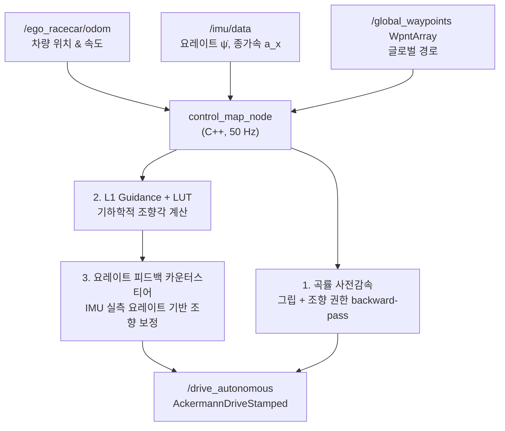

# CLAUDE.md

이 파일은 Claude Code가 이 저장소에서 작업할 때 참고하는 가이드입니다.

## 프로젝트 개요

**2026 IFAC F1TENTH 자율주행 대회**의 **하드웨어 / 제어(Control) 파트** 코드베이스입니다.
ROS 2 패키지 `f1tenth_control` 하나로 구성되며, 플래닝 팀이 발행하는 글로벌 경로를
추종하여 실차(또는 시뮬레이터)를 주행시키는 횡방향(조향)·종방향(가감속) 제어를 담당합니다.
(수동/자율/E-stop Mux(teleop)는 이 저장소 담당이 아님 — 실차는 팀 공용 f1tenth_stack의
drive_mode_manager + ackermann_mux가 수행하며, 2026-07-29에 시뮬용 joy_teleop_monitor도
저장소에서 제거됨. 라이다 기반 자율 비상제동(AEB)도 제어 파트에서 제거됨 — 실제 비상정지는
planning 파트가 판단/발행)

- 언어: C++17 (메인 런타임), Python (참조용 원본 컨트롤러 / LUT 프로토타입)
- 빌드 시스템: `ament_cmake` (ROS 2)
- 코드/주석 언어: **한국어** — 새 코드도 주변 코드의 한국어 주석 밀도·스타일에 맞출 것
- 차량: 휠베이스 0.33 m. **실제 최대 조향각 = 좌우 모두 약 23.5°(0.410 rad)** — 2026-07-31
  각도기 전 구간 실측으로 확정. 시뮬은 대칭 ±0.41. VESC 모터 컨트롤러
  - **명령 한계는 비대칭이 맞다**: `max_steering_left` 0.5315 / `max_steering_right` 0.4320
    (젯슨 `vesc.yaml` `servo_min` 0.23 / `servo_max` 0.66과 한 쌍). 좌측 링키지가 우측보다
    servo를 21.9% 더 써야 같은 각이 나와서(도달비 좌 0.756 / 우 0.922), 명령을 비대칭으로
    줘야 **실제 바퀴 각이 좌우 대칭**이 된다.
  - ✅ **"도달각 74%" 문제는 해결됐다** (2026-07-31). 원인은 타이어 슬립도 링키지 설계도
    아니고 **서보 암이 스플라인에서 풀린 것**이었다(07-30 팀원 주행 중 이탈 → 재장착).
    재장착 후 중간각 실측 11.46° 명령 → 좌 11° / 우 12°, **게인 1.003 = 명령대로 도달**.
    → `steering_reach_ratio`를 0.74 → **1.0**으로 되돌렸다(0.74로 두면 1.35배 과조향).
  - 🔴 **기계 한계는 24°(간섭)이고 라인은 25.1°를 요구한다** — 아래 ②-d 참고. 차량 쪽에서
    더 짜낼 수 없으므로 **플래너에서 최소 반경 제약(≥0.85 m)**으로 풀어야 한다.

## 워크스페이스 구조 ⚠️ 중요

이 `~/F1tenth_control` 폴더는 **개발/편집용 원본**이며, 루트에 `COLCON_IGNORE`가 있어
**여기서는 colcon 빌드가 되지 않습니다.** 실제 빌드·실행은 상위 ROS 2 워크스페이스
`~/2026_IFAC/`에서 이루어지며, 그 안의 `~/2026_IFAC/src/f1tenth_control/`로 코드가 동기화됩니다.

```
~/2026_IFAC/                  ← 실제 colcon 워크스페이스
├── build/ , install/ , log/
├── src/
│   ├── f1tenth_control/      ← 이 저장소의 동기화 사본 (실제 빌드 대상)
│   ├── local_planning/ , global_planning/ , state_machine/   ← 플래닝 팀
│   ├── opponent_detector/ , wpnt_publisher/ , monte_carlo_localization/
├── offline_trajectory_generator/ , wpnt_publisher/
├── frenet_conversion/        ← Frenet 좌표 변환 (f110 스택)
└── ...                       ← steering_lookup 패키지(LUT cfg) 포함
```

⚠️ **`~/2026_IFAC` 사본이 이 repo보다 앞서있을 수 있음** — `f1up`으로 커밋 전, 두 사본을
diff로 비교해 어느 쪽이 최신인지 확인할 것. 특히 팀 공용 저장소(`2026_IFAC`)의 `main` 브랜치가
다른 팀원의 push로 갱신됐다면, 이쪽(dev repo)의 미커밋 변경을 그대로 덮어쓰지 않도록 주의.

작업 후에는 변경 사항을 `~/2026_IFAC/src/f1tenth_control/`로 반영한 뒤 그쪽에서 빌드해야 합니다.

⚠️ **빌드는 `--symlink-install`로 할 것**(`build` alias가 이미 그렇게 함). 그러면 `install/`의
런치·YAML이 `src/`를 가리키는 심볼릭 링크가 되어 **런치 파일 수정은 재빌드 없이 즉시 반영**된다
(`.cpp`는 당연히 재빌드 필요). 옵션 없이 빌드하면 실제 복사본으로 바뀌어 "src를 고쳤는데
반영이 안 되는" 상태가 된다.

## 빌드 & 실행

```bash
# 빌드 (실제 워크스페이스에서)
cd ~/2026_IFAC
colcon build --symlink-install --packages-select f1tenth_control
source install/setup.bash

# 시뮬레이션 실행 (gym_bridge·global_planner는 별도 기동 필요) — 기동 즉시 자율주행
ros2 launch f1tenth_control control_sim.launch.py
ros2 launch f1tenth_control control_sim.launch.py yaw_rate_gain:=0.1

# 실차 실행 (하드웨어 브링업·planning이 먼저 떠 있어야 함)
# ⚠️ 실차는 f1tenth_stack(별도 워크스페이스 ~/f1tenth_ws)이 라이다·조이스틱·VESC 드라이버와
#    수동/자율/E-stop Mux를 담당하므로 두 워크스페이스를 다 소싱할 것(순서 무관):
source ~/f1tenth_ws/install/setup.zsh
source ~/2026_IFAC/install/setup.zsh
ros2 launch f1tenth_control control_real.launch.py
ros2 launch f1tenth_control control_real.launch.py max_speed:=4.0 max_lateral_accel:=5.1

# 개별 노드 실행 (디버깅용)
ros2 run f1tenth_control control_map_node

# odom 거리 스케일 실측 보정 (별도 터미널에서 — 관찰 전용 노드, 우리 컴에서 실행)
ros2 launch f1tenth_control odom_calib.launch.py
```

- 두 launch 파일의 공용 파라미터·노드 정의는 `launch/_control_common.py`에 있음 — 조정 방법은
  아래 "실차 튜닝 파라미터" 참고.
- CMake가 `-O3 -march=native -flto`로 최적화 빌드합니다 (임베디드 실시간 제어 성능 목적).
- `compile_commands.json`이 생성되어 VS Code linter와 연동됩니다.

⚠️ **2026-08-01: MPPI 컨트롤러, 실차 원격 대시보드, LUT 실측 보정 노드를 저장소에서 전부
제거했다** — 대회가 한 달 앞으로 다가와 MAP(control_map_node) 하나에만 집중하기로 했고, 실시간
모니터링/LUT 보정은 이미 자체 웹앱(`tools/bag_analyzer/`, `tools/lut_calibrator/`)으로 rosbag을
분석하는 방식으로 대체돼 있어 라이브 ROS 노드가 중복이었다. 자세한 배경은 "❌ 제거된 노드/로직"
항목 참고. 되살릴 근거가 생기면 git 이력에서 꺼낼 것.

## 노드 구성 (4개 실행 파일)

### 1. `control_map_node` (control_code/control_map_node.cpp) — 메인 자율주행 제어
50 Hz 제어 루프. **L1 Guidance + Steering Lookup Table(LUT)** 기반.
- 구독: `<odom_topic>`(기본 `/ego_racecar/odom`), `/imu/data`, `/scan`, `/global_waypoints`(`f110_msgs/WpntArray`, transient_local QoS), `/drive_mode`(`std_msgs/String` — 2026-07-28 신설, 자율 미체결 중 속도 램프 와인드업 차단. 발행자 없으면 자동 비활성이라 시뮬 무영향)
- 발행: `/drive_autonomous` (`ackermann_msgs/AckermannDriveStamped`) — `drive_source_selector`를 거쳐 최종 `/drive`로 전달됨
  - ⚠️ `drive.acceleration`은 **명령 속도의 시간미분**이다(2026-07-30 수정). 예전엔
    `(명령 − 실측)/dt`, 즉 추종오차를 dt로 나눈 값을 가속도라고 발행했다 — VESC 속도 PID는
    명령이 실측보다 앞서야 전류가 나오는 구조라 정상 가속 중에도 200 m/s²급이 나오고 odom
    노이즈가 ×50 증폭됐다. 젯슨 `ackermann_to_vesc` 서비스 브레이크 패치가 이 필드로 제동을
    중재하면 그대로 오작동한다(그 패치는 현재 기본 꺼짐)
- 분리된 알고리즘 모듈(별도 .cpp/.hpp):
  - `GapFollower` — 글로벌 경로 미수신 시 순수 LiDAR 갭 추종 폴백(기본 비활성, 아래 참고)
  - `StabilityController` — IMU 요레이트 LPF + 카운터스티어 보정. **헤더 전용**(`.hpp`)이라
    별도 `.cpp`가 없다. ⚠️ 2026-07-29에 **롤 인지 ESC를 제거**했다(1/10 차량은 임계각까지
    기울지 않아 상시 비활성이었고, 레이싱에선 코너 속도만 깎는다) — 롤각·롤레이트 둘 다 없음
  - `SteeringLookupTable` — Pacejka 타이어 모델 기반 (횡가속도, 속도)→조향각 LUT (CSV)
  - `VelocityProfiler` / `geometry` — 곡률 계산 및 Forward-Backward 속도 프로파일링
- ⚠️ **장애물 종방향 soft brake(`obstacle_brake_enable_`)는 2026-08-01 제거됨** — `local_planning`이
  이미 완성된 회피+비상정지 스택(`safe_stop_latch` 등)을 갖췄고 필요시 `vx_mps=0` 웨이포인트를
  직접 발행하므로, control 쪽 자체 장애물 감속은 planning과 겹치는 중복 안전망이었다. 자세한
  배경은 "❌ 제거된 노드/로직" 참고.
  GapFollower 기반 콘 감지 회피 폴백(`obstacle_avoid_enable_`)은 둘 다 기본 비활성 상태로 코드는
  남겨뒀다(마지막 안전망 후보).

### 2. `drive_source_selector` (control_code/drive_source_selector.cpp) — 자율 명령 포워더 (sim/real 공용)
`control_map_node`의 `/drive_autonomous`를 재스탬프해 `/drive`로 그대로 흘려보내는 슬림 노드 —
수동 조종/E-stop/대시보드 기능이 없다(teleop 아님). 실차는 수동/자율/E-stop Mux를 팀 공용
`f1tenth_stack`(`drive_mode_manager` + `ackermann_mux`)이 맡고, 시뮬은 Mux 없이 이 노드가 자율
명령을 `/drive`로 직결한다.
- 구독: `/drive_autonomous`
- 발행: `/drive`(실차 = `ackermann_mux`의 navigation 채널, 우선순위10 / 시뮬 = gym_bridge가 직접 구독)
- **E-stop을 몰라도 됨** — 실차는 `drive_mode_manager`가 `estop_lock`으로 mux 입력 전체를
  마스킹하므로 제동 중엔 이 노드의 `/drive`도 자동 차단됨.
- ⚠️ 2026-08-01 이전엔 MAP/MPPI 알고리즘을 조이스틱 RB로 고르는 셀렉터였다. MPPI 노드 전체
  제거와 함께 순수 포워더로 단순화됨 — `/joy` 구독, `/mppi_active` 발행, RB 토글 로직은 더 이상
  없다.

### 3. `sim_imu_bridge_node` (control_code/sim_imu_bridge_node.cpp) — 시뮬 전용 odom→IMU 중계
f1tenth_gym(gym_bridge)은 `/imu/data`를 발행하지 않으므로, `control_map_node`의 `use_imu` 경로
(요레이트 카운터스티어 등)를 시뮬에서도 실제 데이터로 검증하기 위한 유틸리티 노드.
- 구독: `<odom_topic>`(기본 `/ego_racecar/odom`) / 발행: `<imu_topic>`(기본 `/imu/data`)
- odom의 `twist.twist.angular.z`(요레이트)만 실측 중계, orientation은 identity 고정
  (2D 물리 시뮬이라 롤이 없다 — 컨트롤러도 2026-07-29부터 롤을 안 쓴다).
- `control_sim.launch.py`에 기본 포함되어 `use_imu:=true`를 안전하게 만들어줌. 실차
  런치(`control_real.launch.py`)에는 넣지 말 것(실제 VESC IMU와 토픽이 충돌).

### 4. `odom_calib_node` (control_code/odom_calib_node.cpp) — odom 거리 스케일 실측 보정 (우리 컴에서 실행)
"명령 주고 자로 재기" 테스트를 자동화한 관찰 전용 노드. 젯슨의 원시 토픽을 직접 구독해
우리 컴에서 조립·계산한다(젯슨 렌더 연산 0). **`/drive` 미발행**이라 주행 중 켜둬도 제어에 영향 없음.
- 구독: `<odom_topic>`(기본 `/pf/pose/odom`), `/drive`, `/odom_calib/reset`(`std_msgs/Empty`) / 발행: 없음
- 한 번의 직선 주행에서 **독립적인 거리 3개를 동시 적분**해 어느 게인이 틀렸는지 분리한다:
  ① 명령 `∫/drive.speed dt` ② 휠 `∫odom vx dt`(VESC `erpm_to_speed` 경로)
  ③ 맵 `|끝−시작|`(MCL 스캔매칭 — 휠과 독립). `/pf/pose/odom` 한 토픽에 twist(VESC 패스스루)와
  pose(MCL 추정)라는 다른 출처가 섞여 있다는 점을 이용 → **자를 대기 전에도** 스케일 오차가 드러난다.
- 판정: 휠≠맵 → 젯슨 `vesc_to_odom`의 `erpm_to_speed` / 맵≠자 → 맵 스케일·MCL / 명령≠휠 → 속도 추종
- 보정: `G_새 = G_기존 × (휠/맵)`. ⚠️ 게인을 고치면 같은 명령에 차가 실제로 빨라지므로 `max_speed`를
  낮춰 재셰이크다운할 것.
- 출발/정지 자동 감지로 구간을 끊고 최근 10건 이력·평균 비율 표시. 경로길이가 아니라 **직선변위**를
  쓴다(MCL 보정 점프가 `Σ|Δpos|`를 부풀림 — 지터 ±5cm에서 경로길이 +14%, 직선변위 +0.45%).
- 실행: `ros2 launch f1tenth_control odom_calib.launch.py` (구 파일명 `dashboard.launch.py mode:=calib`)
- ⚠️ 측정 시: 직선만 / 5~10m(1m는 자 오차가 2%) / **1.0~2.0 m/s**(FOC 센서리스 데드존
  800~2250 ERPM ≈ 0.17~0.49 m/s 회피) / 양방향(오프셋 검출) / 여러 속도(슬립 검출)

## 토픽 데이터 흐름

```
플래닝팀 → /global_waypoints (WpntArray)
                    ↓
        control_map_node ──/drive_autonomous──┐
                                                ↓
  [시뮬] drive_source_selector (순수 포워더) ──/drive──→ gym_bridge
  [실차] drive_source_selector (순수 포워더) ──/drive(navigation,pri10)─┐
         /joy ──→ f1tenth_stack drive_mode_manager ──teleop(pri100)+estop_lock─┤
                                          f1tenth_stack ackermann_mux ──────────┴─→ VESC
```
(2026-08-01 MPPI 제거로 컨트롤러 노드는 control_map_node 하나뿐. drive_source_selector는
 이제 MAP/MPPI 선택 없이 /drive_autonomous를 그대로 /drive로 흘려보낸다.
 수동/자율/E-stop Mux(teleop)는 이 저장소에 없음 — 실차 f1tenth_stack 담당)


```mermaid
graph TD
    SubOdom["/ego_racecar/odom<br>차량 위치 & 속도"]
    SubIMU["/imu/data<br>요레이트 ψ̇, 종가속 a_x"]
    Waypoints["/global_waypoints WpntArray<br>글로벌 경로"]

    Controller["control_map_node<br>(C++, 50 Hz)"]

    SubPrebrake["1. 곡률 사전감속<br>그립 + 조향 권한 backward-pass"]
    SubL1["2. L1 Guidance + LUT<br>기하학적 조향각 계산"]
    SubYawRate["3. 요레이트 피드백 카운터스티어<br>IMU 실측 요레이트 기반 조향 보정"]

    PubDrive["/drive_autonomous<br>AckermannDriveStamped"]

    SubOdom --> Controller
    SubIMU --> Controller
    Waypoints --> Controller

    Controller --> SubPrebrake
    Controller --> SubL1

    SubL1 --> SubYawRate
    SubYawRate --> PubDrive
    SubPrebrake --> PubDrive
```

## 핵심 제어 알고리즘 (control_map_node)

1. **최근접 웨이포인트 탐색** — 지난 인덱스 주변 윈도우 스캔, 2.5m 초과 이탈 시 전역 재탐색(failsafe)
2. **곡률 룩어헤드 사전 감속** — 제동거리 `v²/2·prebrake_decel`만큼 전방 곡률을 스캔해
   지점별 상한(그립 `√(a_lat/κ)` + 조향 권한, ②-b)까지 감속 가능한 속도의 최소값을 캡으로 씀
3. **L1 Guidance** — 속도 비례 L1 거리 → 전방 목표점 → `sin(eta)` 횡오차 → 목표 횡가속도
4. **Steering LUT 조회** — (횡가속도, 속도) → 조향각 (Pacejka 모델 보간)
5. **동적 스케일러** — 가감속/속도/곡률 FF 보정
6. **요레이트 피드백 카운터스티어** (2026-07-11 배선) — IMU 실측 요레이트와 기하학적 기대
   요레이트(`v·tanδ/L`) 오차만큼 조향 보정, `use_imu` 게이트. rate limit·클리핑 이전에 적용
7. **도달각 보상**(`steering_reach_ratio`, ②-e) → **rate limit**(`max_steering_rate`, dt 비례)
   → 좌우 물리 한계 클리핑(real 좌 0.41 / 우 0.379, sim ±0.41)
8. **기동 실패(탈조) 안티와인드업 가드** (2026-07-22 실차 증상 대응, 기본 꺼짐) — 속도 램프의 증분은
   실측과 무관하게 매 사이클 쌓이므로, VESC 센서리스 탈조로 차가 안 움직이는 동안 명령만
   프로파일 속도까지 감겨 올라가 모터가 물리는 순간 급발진한다. 실측 < `stall_speed_threshold`
   상태가 `stall_hold_delay` 이상 지속되면 명령을 `stall_hold_speed`로 묶고 램프를 되감는다.
   ⚠️ **"명령이 실측보다 앞서지 못하게" 일반 clamp를 거는 방식은 쓰면 안 된다** — VESC 속도
   PID가 ERPM 오차에 비례해 전류를 만들어(`s_pid_kp`=0.003) 60A를 뽑으려면 20000 ERPM
   ≈ 4.7 m/s의 명령 선행이 물리적으로 필요하다. 선행을 좁히면 가속이 그대로 죽는다.
   근본 원인은 VESC mcconf(오픈루프 800 vs 옵저버 인수 2500 ERPM 갭)이며 이 가드는 급발진만
   막는 안전망. 시뮬 검증: ifac_track 9랩 × 2회(on/off) 플라잉랩 10.78~10.83s 동일, 발동 0회
9. **engage 게이트 (bumpless transfer)** — `/drive_mode`가 `autonomous`가 아니면 속도 램프를
   실측에 고정. 자율 진입 순간 계단 명령이 VESC에 꽂히는 것(급발진)을 막는다. `/drive_mode`
   미수신 시 자동 비활성이라 시뮬은 무영향
10. **런치 킥** — 자율 정지출발 시 짧게 높은 속도를 명령해 VESC 센서리스 데드존을 관통.
    램프 상태(`final_speed`)는 안 건드리고 **발행값만** 덮으므로 킥 종료 후 램프가 이어진다
11. **최근접 인덱스 견고화** — 전역 재탐색 헤딩 게이트 + 인덱스 점프 확인 대기. 보류 중에는
    조향을 직전값으로 홀드하고 감속한다 (MCL pose 붕괴 대응)
12. **odom 워치독**(2026-07-30, `odom_timeout` 0.5s) — 위치추정이 없거나 끊기면 안전 정지.
    NaN/Inf pose는 콜백에서 버려 파이프라인 오염을 막는다. **미수신 상태에서는 출발도 안 한다**
13. **dt 클램프**(2026-07-30, [0.001, 0.1]) — `wall_timer`는 실시간 보장이 없다. dt는 램프
    증분·런치 킥 타이머·발행 가속도에 전부 곱해지므로, 젯슨에서 한 사이클 0.2s 밀리면 램프가
    한 스텝에 1.6 m/s 튄다(= 계단 명령 = 07-27 급발진과 같은 형태)

### 제어 이론 상세

#### L1 Guidance (Pure Pursuit 계열)

속도 비례 룩어헤드 거리로 전방 목표점을 선정, 횡가속도 명령을 계산한 뒤 LUT로 조향각을 결정합니다.

$$L_1 = \mathrm{clip}\Big(\big(q + m\,v\big)\cdot s_\kappa,\ \ \max(t_{min},\ \sqrt{2}\,e_{lat}),\ \ t_{max}\Big)
\qquad
a_{lat} = \frac{2\,v_{lu}^2}{\lVert \mathbf{p}_t - \mathbf{p}\rVert}\sin\eta
\qquad
\delta = \mathrm{LUT}(a_{lat},\ v_{lu})$$

- $q$ = `l1_offset`(0.5) = **절편 [m]**, $m$ = `l1_speed_gain`(0.3) = **속도 계수 [s]**
  → $L_1 = 0.5 + 0.3v$ (원본 Python MAP의 `q_l1`/`m_l1` 대응)
  > ℹ️ **2026-07-30 개명**: 구 이름 `l1_gain`/`l1_distance`는 역할과 정반대였다(gain이 절편,
  > distance가 기울기). 노드에 호환 shim이 있어 구 이름을 넘기면 **경고와 함께** 여전히
  > 먹지만, 새 이름을 쓸 것.
- $s_\kappa$: $|\kappa_{closest}|>0.3$이면 최대 25% 축소(코너 반응성), $t_{min}$=`t_clip_min`(0.6), $t_{max}$=`t_clip_max`(5.0)
- $\sin\eta$: 차량 좌표계에서 목표점 방향의 횡성분 / 실제 거리 (+면 목표가 왼쪽)
- **목표점 $\mathbf{p}_t$는 `closest_idx`로부터 경로 호 길이 $L_1$만큼 전진한 점**(`walk_forward`).
  차량 기준 직선거리가 아니다.
- ⚠️ **분모는 명목 $L_1$이 아니라 목표점까지의 실제 거리 $\lVert\mathbf{p}_t-\mathbf{p}\rVert$다**
  (2026-07-28 수정, `l1_use_actual_distance`=false면 구 거동). 호 길이로 고른 목표점의 실제
  거리는 웨이포인트 이산화(1점 간격까지 초과) + 차량 오프셋 때문에 $L_1$보다 길다 —
  07-27 실차 bag 실측 비율 중앙 1.06~1.31·p95 최대 1.72. 명목값을 쓰면 횡가속 명령이 그만큼
  과대해지고 **경로에서 벗어날수록 = 복귀가 필요한 순간에 더 심해진다.**

#### 요레이트 피드백 카운터스티어 (Yaw Rate Feedback)

L1로 확정한 명령 조향각이 기하학적으로 의도하는 기대 요레이트 대비, IMU 실측 요레이트의 오차에
비례해 조향을 보정합니다. 언더스티어(실측 < 기대) 시 더 꺾어 슬립을 상쇄합니다.

$$\delta \mathrel{+}= k_{\dot\psi} \cdot \left(\frac{v \tan\delta}{L} - \dot\psi_{\text{measured}}\right)$$

- $k_{\dot\psi}$: `yaw_rate_gain`(**런치 기본 0.00 = 비활성**), $\dot\psi_{\text{measured}}$: IMU `angular_velocity.z` LPF
- `use_imu=false`면 비활성, 저속(<0.5m/s)은 특이점 방지로 0 처리
- ⚠️ 기본이 0인 이유: 이 항은 오버스티어 보정인데 우리 크래시는 전부 언더스티어였고, 저마찰
  드리프트 bag이 없어 게인을 검증할 데이터 자체가 없다(07-29). 켜기 전 실차 채터링 확인 필수
- ⚠️ **VESC 자이로는 deg/s로 발행한다**(2026-07-19 실차 확인). `sensor_msgs/Imu`의 rad/s 규약
  위반이라 `imu_angular_scale`(= π/180)로 우리 쪽에서 환산 중 — 정의는 `_control_common.py`의
  `IMU_ANGULAR_SCALE` 한 곳. **젯슨 vesc_driver가 고쳐지면 반드시 1.0으로 되돌릴 것**(이중 보정
  시 요레이트가 1/57로 죽음). 부호는 정상(반시계 양수, REP-103 일치)

#### ❌ 제거된 감속 로직 (2026-07-29) — 다시 넣기 전에 읽을 것

레이싱에 불필요하다고 판단해 **코드에서 삭제**했다. 되살릴 근거가 생기면 git 이력에서 꺼낼 것.

| 제거한 것 | 무엇이었나 | 왜 뺐나 |
|---|---|---|
| **롤 인지 ESC** (`max_roll_limit` 0.15 / `decel_attenuation` 0.6) | 롤각 비율로 가속·감속 한계를 축소하고 롤 비율 0.8 초과 시 목표속도까지 깎던 전복 방지 | 1/10 차량은 서스펜션이 단단해 임계각(8.6°)까지 안 기운다 → **사실상 상시 비활성**. 시뮬은 2D라 롤이 아예 0. 얻는 것 없이 코너 속도만 깎을 위험 |
| **언더스티어 가드** (`understeer_guard_enable` 외 8개) | 요레이트 결손(`\|ψ̇_ref\|−\|ψ̇_meas\|`)을 EMA로 잡아 최대 25% 감속(+선택적 조향 완화) | bag 재생만 했고 **시뮬 폐루프·실차 둘 다 미검증**(발동률 24~42%, 발동 시 평균 −19%). 기본값도 `false`였다. 조향 완화는 `yaw_rate_gain`과 같은 신호에 반대로 반응해 서로 싸움 |

⚠️ 언더스티어 자체는 실재하는 문제다(07-25 시케인·07-26 헤어핀 크래시). 다만 **반응형 감속이
아니라 사전 대응**으로 푼다 — 곡률 사전감속의 조향 권한 캡(②-b)이 코너 **진입 전에** 속도를
낮추므로 원인 쪽에서 막는다. 요레이트 결손 신호의 실측 근거는 WORKLOG 2026-07-29 항목 참고.

## 실차 튜닝 파라미터 (control_map_node)

- `control_map_node`의 나머지 파라미터는 전부 코드 내 `declare_parameter` 기본값(별도 YAML
  미연결). **전부 생성자에서 1회만 읽음**(파라미터 콜백 없음) — 값을 바꾸려면 노드 재시작 필요,
  런타임 `ros2 param set`은 무효. 조정 경로에 따라 3그룹으로 나뉨:

### ① 터미널 인자로 즉시 조정 (파일 수정·재빌드 불필요)
`control_real.launch.py`/`control_sim.launch.py` 실행 시 `param:=value`로 바로 오버라이드.
전체 목록은 `ros2 launch f1tenth_control control_real.launch.py --show-args`로 확인:

⚠️ 아래 기본값은 **런치 인자 기본값**(= 실제로 적용되는 값)이다. `control_map_node.cpp`의
`declare_parameter` 기본값과 다를 수 있는데, 런치가 항상 덮어쓰므로 **이 표가 정답**이다.
직접 확인: `ros2 launch f1tenth_control control_real.launch.py --show-args`

| 파라미터 | 기본값 | 설명 |
|---|---|---|
| `max_speed` | **8.0**(real) / 12.0(sim) | 직선 최고속도 캡 [m/s]. 곡률 제한은 코너에서만 걸리므로 직선 상한은 이 값이 유일하다. real 8.0 = ERPM 상한(바퀴 ~9 m/s)의 89% (2026-07-30 5.0→8.0 상향) |
| `min_speed` | **1.0** (real·sim 공통) | 최저 순항 속도 [m/s] (곡률 감속 하한). ⚠️ 장애물 정지 경로는 이 하한을 무시하고 0까지 내려감(안전 우선). ⚠️ 이 값이 조향 권한 캡보다 높으면 캡이 무력화된다(②-b) |
| `max_lateral_accel` | **6.0**(real) / 10.0(sim) | 코너 그립 클램프 a_lat [m/s²]. (2026-07-30 5.1→6.0 상향). sim은 랩타임 튜닝 기준 유지차 10.0 낙관치 그대로. ✅ **2026-08-01 실차 bag(172.8s, 34코너)으로 재검증**: `bag_analyzer` IMU 실측 피크 a_lat **6.8 m/s²**, 대부분 코너의 피크는 **5.7~6.3 m/s²** 대역 — real 6.0은 이제 이 실측 범위 **안쪽**이라 보수적인 쪽에 가깝다. 6.8은 두 코너(요레이트 추종률 100%인데도 "그립 초과 1.0×" 판정)에서만 나온 순간 피크라 지속 가능한 여유치로 보긴 어렵다. ⚠️ **구 문서치 "~3.1"은 이 bag으로 stale 확정** — 07-25 이전, 이후 가속 램프·사전감속 튜닝 전 데이터였다 |
| `base_max_accel` | **3.5**(real) / 9.0(sim) | 종방향 가속 rate limit [m/s²]. 🔑 **천장은 VESC의 `s_pid_ramp_erpms_s`(15600 ÷ 4232 = 3.69 m/s²)** — 넘겨 줘도 VESC가 깎고 와인드업 위험만 커진다. 2026-07-31 2.5→3.5(천장의 95%). ⚠️ `_control_common.py`가 아니라 **각 진입점 런치**의 인자 |
| `yaw_rate_gain` | **0.00** | 요레이트 카운터스티어 게인. 0 = 비활성 — 검증 데이터 부재(위 "요레이트 피드백" 참고) |
| `use_imu` | true | IMU 보정 on/off (요레이트 카운터스티어 + 조향 스케일러용 종가속). 조향 채터링 시 false로 순수 L1+LUT 회귀 |
| `odom_topic` | `/pf/pose/odom` | 위치추정 odom 소스 (real만 인자, sim은 `/ego_racecar/odom` 고정) |
| `lookup_table_file` | `''` | 보정 LUT CSV 경로 (`tools/lut_calibrator/`의 오프라인 웹앱 결과 적용 시, real만) |
| `acceleration_scaler_for_steering` | 1.0 | 가속 중 조향각 스케일러 (acc_mean 0→`steering_scaler_accel_ref` 구간 선형 블렌딩) |
| `steering_scaler_accel_ref` | 1.0 | 위 두 스케일러가 완전 적용되는 기준 \|a_x\| [m/s²]. 2026-07-30 신설 — 예전엔 ±1.0 하드 임계라 넘는 순간 조향이 5% 계단 점프했다 |
| `steering_reach_ratio` | **0.74** | 명령 조향각 중 **바퀴가 실제 도달하는 비율**. 2026-07-30 신설. 조향 명령 보상(×1/ratio)과 조향 권한 캡의 δ_avail(×ratio)을 **한 상수로 지배**. 1.0 = 보상 없음(구 낙관 거동). ⚠️ 아래 "하드코딩 게인 제거" 참고 |
| `max_steering_rate` | 20.0 | 조향 rate limit [rad/s], dt 비례. 2026-07-30 신설 — 예전엔 "사이클당 0.4 rad" 하드코딩(50Hz에서 20 rad/s = 사실상 무제한, dt 무관). 기본값은 구 거동과 동일 |
| `odom_timeout` | **0.5** | odom 신선도 타임아웃 [s]. 초과 시 안전 정지, 미수신 상태에서는 출발 자체를 안 함(0=비활성). 2026-07-30 신설 — 다른 입력엔 다 있던 검사가 odom만 없었다 |
| `deceleration_scaler_for_steering` | 0.95 | 감속 중(acc_mean≤-1.0) 조향각 스케일러 |
| `start_scale_speed` / `end_scale_speed` | 7.0 / 8.0 | 속도 비례 조향 다운스케일 구간 [m/s] |
| `downscale_factor` | 0.10 | 고속 구간 조향각 다운스케일 최대 비율 |
| `speed_lookahead` / `speed_lookahead_for_steering` | 0.15 / 0.0 | 종방향/조향용 속도 예측 룩어헤드 시간 [s] |
| `l1_offset` / `l1_speed_gain` | 0.5 / 0.3 | L1 = `l1_offset`[m] + v·`l1_speed_gain`[s]. 2026-07-30 `l1_gain`/`l1_distance`에서 개명(구 이름은 경고 후 호환 동작) |
| `t_clip_min` / `t_clip_max` | **0.6** / 5.0 | L1 룩어헤드 거리 하한/상한 [m] |
| `l1_min_denom` | 0.6 | L1 횡가속 분모 하한 [m]. 2026-07-30 신설 — 예전엔 `t_clip_min`을 재사용해서, **룩어헤드 노브**를 낮추면 횡가속 명령 상한이 조용히 올라갔다(0.6이면 6 m/s에서 최대 lat_acc 120 m/s²) |
| `local_fresh_timeout` | 0.3 | `/local_waypoints` 신선도 타임아웃 [s] |
| `recovery_lat_error` / `recovery_speed` | **1.2** / 2.0 | 경로 이탈 복구 가드 발동 횡오차 [m] / 복구 중 속도 상한. 0 = 비활성. 2026-07-30에 0.0→1.2로 **켰다**(트랙 반폭 0.6의 2배 = 트랙을 실제로 벗어났을 때만 발동). 이 가드가 막는 limit cycle이 그동안 무방비였다 |
| `gap_follower_failsafe` | false | 경로가 아예 없을 때 GapFollower 자율주행 허용. 🔴 실차에서는 켜지 말 것(플래닝 없이 차가 스스로 출발) |
| `obstacle_avoid_enable` | **false** | GapFollower 장애물 회피 폴백. 기본 꺼짐 — 앞차를 장애물로 오인해 추월을 방해하는 것 차단 |
| `obstacle_cone_halfangle` / `obstacle_trigger_dist` / `obstacle_margin` | 0.14 / 1.5 / 0.3 | 장애물 차단 판정 콘 각도[rad]/거리[m]/여유[m] |
| `obstacle_avoid_hold_cycles` | 15 | 회피 폴백 유지 사이클(50Hz, int) |
| `stall_guard_enable` | **false** | 기동 실패(VESC 센서리스 탈조) 시 속도 명령 와인드업 차단. 07-27부터 기본 꺼짐(명령이 1.50에 묶이는 증상). 출발이 더듬거리면 즉시 true로 |
| `stall_speed_threshold` / `stall_hold_speed` / `stall_hold_delay` | 0.7 / 1.5 / 1.0 | "안 움직인다" 판정 속도[m/s] / 묶어둘 값[m/s] / 발동 지연[s] |
| `launch_boost_enable` | true | 런치 킥 — 자율 정지출발 시 VESC 센서리스 데드존 관통 펀치 |
| `launch_boost_speed` / `launch_boost_time` | 2.2 / 0.6 | 펀치 속도 명령 [m/s] / 포기까지 최대 시간 [s] (`stall_hold_delay`보다 작아야 함) |
| `launch_exit_speed` / `launch_standstill_speed` | 0.8 / 0.3 | 관통 성공 판정 속도 / 정지 판정 속도 [m/s] (히스테리시스) |
| `base_max_decel` | 8.0 | **명령 속도 하강 rate limit** [m/s²]. 낮추면 감속 명령이 늦게 도달 → 높게 유지 (②-a) |
| `prebrake_decel` | **2.6** | **곡률 사전감속 제동거리 산출용 감속 권한** [m/s²]. 낮을수록 코너를 일찍 봄. 2026-07-30 1.0→2.5 상향 → 08-01 1.0으로 잠깐 되돌림 → 08-02 **2.6**(젯슨 `brake_gain` 페어링, ②-a 하단 표 참고). 실측 coast ~0.4 대비 여전히 낙관치라, 코너 진입 언더스티어 시 **가장 먼저 되돌릴 값** (②-a) |
| `curvature_lookahead_count` | **80** | 곡률 룩어헤드 스캔 거리 하한 (×0.1m → **8m**) |
| `understeer_gradient` | **0.028** | **조향 권한 속도 캡**의 K_us [rad/(m/s²)]. ✅ **2026-08-01부터 활성**(07-31 `steering_reach_ratio` 0.74→1.0 복구로 δ_avail이 커져 재활성 가능해짐). 07-26 bag 회귀치는 0.019였으나 이후 재추정 0.029→0.028로 조정. 자세한 경위는 ②-b 참고 |
| `steer_authority_ratio` | 0.85 | δ 중 곡률 추종에 배정할 비율. 나머지는 횡오차·요레이트 보정 여유. ⚠️ 2026-07-30부터 δ_avail = `steer_authority_ratio` × min(좌,우) × **`steering_reach_ratio`** (명령각이 아니라 도달각 기준) |
| `l1_use_actual_distance` | true | L1 횡가속 분모로 목표점까지의 **실제 직선거리** 사용. false면 구 거동(명목 L1 거리) |
| `closest_idx_max_heading_err` | 1.75 | 최근접 전역 재탐색 시 경로접선-차량헤딩 허용오차 [rad]. 0이면 비활성 |
| `idx_jump_confirm_dist` / `idx_jump_confirm_cycles` | 2.0 / 5 | 이 거리[m] 초과 인덱스 점프는 연속 N사이클 유지될 때만 채택. cycles=0이면 비활성 |
| `pose_suspect_speed` | **5.0** | 인덱스 점프 보류 중(조향 홀드) 속도 상한 [m/s] |
| `engage_gate_enable` | true | 자율 미체결(`/drive_mode` != autonomous) 중 속도 램프를 실측에 고정(bumpless transfer) |
| `drive_mode_topic` / `engaged_mode_value` / `drive_mode_timeout` | `/drive_mode` / `autonomous` / 1.0 | engage 게이트 입력. timeout 넘게 미수신이면 게이트 자동 비활성(시뮬 호환) |
| `max_steering_left` / `max_steering_right` | **0.5315 / 0.4320** (real), 0.41 / 0.41 (sim) | 좌/우 조향 **명령** 한계 [rad]. 2026-07-31 실측 재설정 — 실제 바퀴 각은 좌우 모두 약 23.5°다(좌측 링키지 비선형이라 명령각만 크다). **젯슨 `vesc.yaml`의 `servo_min`(0.23)/`servo_max`(0.66)과 반드시 한 쌍.** 곡률 조향 권한 캡·갭팔로워는 둘 중 **작은 쪽**(0.4320, 더 선형인 우측)을 씀 |

### ② `launch/_control_common.py` 수정 필요 (sim/real 둘 다 반영, 재빌드는 파일 복사라 가벼움)
`build_control_map_node()` 안에 고정 정의된 공통 파라미터 — 여기 고치면 시뮬·실차 둘 다 바뀜:

`wheelbase`(0.33), `wall_safety_margin`(0.6), `curvature_ff_blend`(0.0), `heading_damping_gain`(0.0)
(⚠️ `lateral_error_coeff`는 2026-07-30 폐지 — 아래 "제거한 조향 로직" 참고)

### ②-a 감속도 파라미터가 두 개인 이유 (2026-07-25 분리)
전엔 `base_max_decel` 하나가 두 역할을 겸했는데, **튜닝 방향이 정반대**라 반드시 한쪽이 손해를 봤다.

| 파라미터 | 의미 | 쓰이는 곳 | 방향 |
|---|---|---|---|
| `base_max_decel`(8.0) | 명령 속도를 초당 얼마나 빨리 떨어뜨릴 수 있나 (램프 rate limit) | control_loop 8 | **높게** 유지 — 낮추면 감속 명령이 늦게 도달 |
| `prebrake_decel`(2.6) | 차가 **실제로 낼 수 있는** 감속도 (제동거리 `v²/2a`) | control_loop 1.5 (룩어헤드 거리 + backward-pass `v_reach`) | **실측값**에 맞춤 — 낮을수록 코너를 멀리서 보고 일찍 감속 |

⚠️ `prebrake_decel`에 8.0(구 동작)을 쓰면 4 m/s에서 제동거리를 1.0m로 착각한다. 07-25 실차 bag
실측 감속은 **-0.4 m/s²**(명령 4.00→3.11로 내렸는데 실속 4.03→3.80, 주행 중
`/commands/motor/brake`는 0건 — VESC 속도모드는 회생제동이 거의 없어 사실상 coast)이라 실제로는
~8m가 필요하다. 사전감속이 0.5초 앞만 보고 시작 → 시케인 언더스티어 크래시의 직접 원인.
`curvature_lookahead_count`(현재 80 = 8m)는 그 스캔 거리의 하한(×0.1m)이라 같이 올렸다.
(장애물 감속용 `obstacle_brake_decel`은 2026-08-01 obstacle_brake_enable_ 경로 전체 제거와
함께 없어졌다 — local_planning의 safe_stop 스택이 이 역할을 대신 맡는다.)

### ②-b 곡률 속도 캡이 두 개인 이유 — 그립 ≠ 조향 (2026-07-26 신설)
곡률 사전감속의 지점별 상한 `v_cap[i]`가 그동안 **그립 한 축만** 봤다: `√(a_lat_max/κ)`.
그런데 코너에서 걸리는 물리 제약은 둘이고, 서로 다르다.

| 축 | 질문 | 상한 |
|---|---|---|
| 그립 | 타이어가 그 횡가속을 **낼 수 있나** | $v \le \sqrt{a_{lat,max}/\kappa}$ |
| **조향** | 바퀴가 그만큼 **꺾일 수 있나** | $v \le \sqrt{\dfrac{r\,\delta_{max} - L\kappa}{K_{us}\,\kappa}}$ |

정상상태 자전거 모델 $\delta = L\kappa + K_{us}\,a_{lat} = L\kappa + K_{us}\kappa v^2$ 를
$\delta \le r\cdot\delta_{max}$ 로 푼 것 (`r` = `steer_authority_ratio`).

⚠️ **조향이 먼저 걸리는 구간이 실제로 있다.** 2026-07-26 실차 bag(`run_0726_181747`)의
κ=1.190(R=0.84m) 헤어핀: 그립 한계 2.11 m/s인데 **조향 한계 0.87 m/s**. 그립만 보고 2배
빠르게 진입한 결과 조향이 풀락(0.410)에 붙고도 안 돌아가 크로스트랙이 0.11 → 2.07m로
발산했다(실제 이탈·정지). 그 트랙 127점 중 **9점(7%)에서 조향이 구속**한다.

- `understeer_gradient`(K_us) — ✅ **2026-08-01부터 런치 기본 0.028로 활성**(현재 상태).
  07-28에 `steer_budget` 속도 붕괴로 한 번 0.0으로 껐었지만, 그 붕괴의 진짜 원인이었던
  `steering_reach_ratio`(서보암 이탈로 0.74까지 떨어졌던 것)가 07-31에 1.0으로 복구되면서
  δ_avail이 다시 커져 08-01에 재활성했다. 값 자체는 07-26 bag 회귀치 0.019에서 이후
  재추정 0.029 → 미세조정 0.028로 이어짐(`tools/bag_analyzer`가 뽑아준다). 아래
  "지금 켜면 안 되는 이유" 표는 **재활성 전(δ_avail=0.238) 기준 기록**이니 현재 상태와
  헷갈리지 말 것.
- `steer_authority_ratio` — 1.0으로 두면 곡률 추종에 δ_max를 다 써서 횡오차 보정·요레이트
  피드백 여력이 0이 된다. 0.85면 δ_max의 15%가 보정 예산으로 남는다.
- ⚠️ **`min_speed`가 조향 한계보다 높으면 캡이 무력화된다** — 최종적으로
  `max(min_speed, cap)`을 하기 때문. 위 헤어핀(0.87)은 현재 `min_speed=1.0`으로도 못 돈다.
  이 상황이면 노드가 2초 throttle로 `조향 권한 한계 ... < min_speed — 하한이 캡을 무력화 중`
  경고를 띄운다. 고곡률 트랙에선 `min_speed`를 함께 낮출 것.
- ⚠️ `δ_avail/L`보다 큰 κ는 **기구학적으로 불가능**하다. 이때 `v_cap=0`이 되고 backward-pass가
  최대한 감속시킨 뒤 `min_speed`가 정지를 막는다. 근본 해결은 플래너 쪽에서 반경을 키우는 것.
  - 🔴 **2026-07-30 수정**: 예전 코드는 이 경우(`steer_budget <= 0`) 캡을 **통째로 건너뛰어서**,
    가장 급한 코너만 조향 캡을 못 받고 그립 캡만 받았다(문서는 위처럼 "v_cap=0"이라 적어놨는데
    코드가 반대였다). `v_steer = 0`으로 이어 붙여 연속화했다 — budget→0에서 √항도 0이므로
    수학적으로도 이게 맞는 접합이다.
- ⚠️ **δ_avail은 명령각이 아니라 도달각이다**(2026-07-30):
  δ_avail = `steer_authority_ratio` × min(좌,우) × `steering_reach_ratio` = 0.85 × 0.379 × 0.74
  = **0.238 rad**. 예전엔 0.322(도달각 무시)로 잡아 코너 진입 속도를 그만큼 과대 허용했다.

#### ✅ (해결됨, 2026-08-01) `understeer_gradient`를 껐던 이유 — 재활성 전 기록

당시(2026-07-30) `ifac_track_v2`(187점)에 아래 두 구성으로 캡을 계산해 봤었다:

| 구성 | 최소 캡 | 2.0 m/s 미만 점수 | 0 m/s 점수 |
|---|---|---|---|
| 구(δ_avail 0.322, budget≤0 스킵) | 0.43 m/s | 8 | 0 |
| 신(δ_avail 0.238, budget≤0 → 0) | 0.00 m/s | **34** | **20** |

당시 δ_avail=0.238이었던 건 `steering_reach_ratio`가 (서보암 이탈로) 0.74까지 떨어져 있어서였다.
K_us=0.019를 그 상태로 켜면 187점 중 34점이 2 m/s 미만으로 눌려 **캡이 옳아진 결과지 캡이 잘못된
게 아니다** — 진짜 원인은 도달각 손실이었다(아래 ②-d). **07-31 서보암 재장착으로 도달각이 1.0으로
복구되면서 δ_avail이 다시 0.322대로 돌아왔고, 08-01에 K_us를 재활성했다**(현재 기본 0.028).
②-d의 "물리적으로 불가능한 극소수 지점"(187점 중 2~9점)은 여전히 남아있지만, 서보암 문제 때문에
**멀쩡한 지점까지 34점으로 부풀려졌던 문제는 해소**됐다.

### ②-d 🔴 이 레이싱 라인은 차의 최소 선회반경보다 급하다 (2026-07-30 확인)

컨트롤러 튜닝으로 못 고치는 문제라 여기 적어 둔다. 기구학 $R_{min} = L/\tan\delta$:

| 조향각 | R_min | 그 이상 κ |
|---|---|---|
| 0.30 rad (**실측 도달각**) | **1.067 m** | κ > 0.937 |
| 0.379 rad (우 명령 한계) | 0.829 m | κ > 1.207 |
| 0.41 rad (좌 명령 한계) | 0.759 m | κ > 1.317 |

그런데 `ifac_track_v2`가 요구하는 곡률은 **최대 κ=1.485(R=0.673 m)**, 평활 후에도
**κ=1.419(R=0.705 m)**다. 즉:

- 실측 도달각 0.30에서는 **187점 중 9점이 물리적으로 불가능**
- **풀 명령 0.41을 다 낸다 해도 2점은 여전히 불가능** (0.759 > 0.705)
- 그 지점의 프로파일 속도는 `vx = 8.0 m/s`다(프로파일이 그 코너를 곡률 제한하지 않았다)

07-25 시케인·07-26 헤어핀 언더스티어 크래시(크로스트랙 0.11 → 2.07 m 발산)와 정합한다.
**어떤 조향 게인·감속 튜닝으로도 이 점들은 돌 수 없다.** 해결 순서:
1. **플래너/트랙 라인 쪽에서 최소 반경을 1.1 m 이상으로 제한** (가장 근본적. 오프라인
   trajectory generator의 곡률 제약) — 미착수
2. ✅ (2026-07-31 완료) 각도기로 풀락 도달각 실측 → 원인은 도달각 손실이 아니라 서보암
   스플라인 이탈이었다(문서 최상단 참고). 재장착으로 도달각 100% 회복(`steering_reach_ratio`
   0.74→1.0) — 이 표의 "실측 도달각 0.30" 행은 이제 해당 없음, 유효한 건 0.41(좌)/0.379(우) 행뿐
3. ✅ (2026-08-01 완료) `understeer_gradient` 재활성 — 현재 기본 0.028(②-b 참고)

### ②-e ❌ 제거한 조향 로직 (2026-07-30) — 다시 넣기 전에 읽을 것

| 제거한 것 | 무엇이었나 | 왜 뺐나 |
|---|---|---|
| **하드코딩 속도 조향 게인** `*= clamp(1 + v/10, 1.0, 1.4)` | LUT 출력에 곱하던 이름 없는 게인 | 값 자체(1.4)는 **1/0.74 = 1.35 ≈ 도달각 보상**이라 의미가 있었지만, 기계적 손실인데 **속도 램프 모양**이라 4 m/s에서 천장에 붙었고(= 사실상 상시 +40% 상수), 바로 윗줄 `downscale_factor`(−10%)와 정면으로 싸웠고, 파라미터·문서가 없었고, 조향 권한 캡의 δ_avail과 어긋나 있었다 → `steering_reach_ratio` 상수 하나로 통합 |
| **`lat_err_scale`** (`lateral_error_coeff` 외 곡률 게이트) | 횡오차·평균곡률로 조향용 속도와 target_speed를 감쇠 | ① **죽은 코드**였다 — 발동 조건이 랩 평균 \|κ\| ≥ 0.8 rad/m인데 `ifac_track_v2` 실측 평균은 **0.273**(2.9배 더 꼬여야 켜짐) → 항상 정확히 1.0. ② 모양이 레이싱에 부적합(완전 발동 시 횡오차 0.5m에서 속도 −63%, MCL 지터로도 랩타임 붕괴). ③ 라인 복귀 감속이 이미 둘 있다(heading 오차 감속 + 이탈 복구 가드) — 같은 신호에 셋을 걸면 서로 싸운다 |

⚠️ 도달각 보상 위치는 **모든 보정항 뒤, pose 홀드/클리핑 앞**이 유일하게 맞는 자리다.
pose 홀드 뒤에 두면 `last_steering_angle_`(이미 보상된 값)에 매 사이클 1/0.74가 다시 곱해져
**100 사이클에 풀락(0.41)까지 발산한다** — 등가 모델로 실제 확인했다.

### ②-c 언더스티어는 왜 β가 아니라 요레이트 결손으로 봐야 하나 (2026-07-29, 가드는 제거됨)

가드 코드 자체는 뺐지만(위 "제거된 감속 로직" 참고) **왜 β로는 안 되는지**는 다시 같은 길을
가지 않도록 남겨 둔다. 07-29에 횡슬립각 β 추정기(`v̇_y = a_y − v·ψ̇` 누설적분)를 만들어 bag
20여 개에 돌리고 MCL 궤적으로 독립 검증했으나 **게이트 불통과**(상관 r=0.13~0.43, 기울기 음수).
이유가 구조적이다:

| | β 신호 | 요레이트 결손 |
|---|---|---|
| 오버스티어(드리프트) | 큼 (10~30°) ✅ | 작음 |
| **언더스티어(밀림)** | **작게 유지** ❌ | 큼 ✅ |

언더스티어는 차가 **향한 곳으로 가되 덜 도는** 것이라 정의상 β가 안 커진다. β는 오버스티어의
신호지 언더스티어의 신호가 아니다.

반면 요레이트 결손은 **자이로만으로** 깨끗하게 나온다(가속도계 불필요 → 축·배율·바이어스
불확실성을 전부 우회. 자이로는 07-28 닫힌루프로 +0.06%까지 검증됨).
**bag 4개 독립 재현** (완만 δ<0.15 vs 한계 δ>0.30): 결손 +0.03~+0.07(≈0) vs **+0.29~+0.32 rad/s**,
ψ̇/ψ̇_ref ~1.0 vs **0.82~0.87**.

다시 구현하게 되면 반드시 지킬 것 (전부 07-29에 실제로 밟은 지뢰):
- 기준은 **직전 사이클의 조향**. 조향→요레이트 지연이 ~100 ms라 방금 만든 값과 비교하면
  지연을 통째로 "결손"으로 오판한다.
- **도달각 74%를 곱한다.** 명령각 그대로 쓰면 코너마다 상시 언더스티어로 오판한다
  (07-28에 고친 odom 헤딩 버그 = 명령을 측정으로 착각과 같은 병).
- **최소 요구 요레이트 게이트(1.0 rad/s)가 필수다.** 없으면 완만한 조향에서 **오발동 38.5%**,
  넣으면 2.4%로 떨어지면서 한계 검출은 71.8% 유지된다.
- 대응은 **감속만**. 조향 완화는 피크 슬립각 전/후를 데이터로 못 갈랐고, `yaw_rate_gain`과
  같은 신호에 반대로 반응해 서로 싸운다.

- `wall_safety_margin` — **안전라인 시프트**: 플래너 최적라인이 벽에 너무 붙은(클리어런스 부족)
  구간에서 메시지의 `d_left/d_right`로 웨이포인트를 트랙 중심 쪽으로 밀어 최소 벽 여유 확보.
  차체(0.58×0.31m)가 벽을 스치는 충돌 방지. 0이면 원본 라인 그대로(`global_path_callback`)
- `heading_damping_gain` — Stanley형 heading 정렬항. 시뮬에서 효과 미미/역효과로 기본 비활성,
  실차 튜닝용으로만 보존
- `curvature_ff_blend` — 곡률 피드포워드 비중. 0이면 순수 L1 격리(검증된 상태 유지)

⚠️ **`base_max_accel`·`max_lateral_accel`·`max_speed`는 예외** — `_control_common.py`가 아니라
**각 진입점 launch 파일**(`control_sim/real.launch.py`)이 환경별로 다르게 선언한다.
현재 `base_max_accel`은 **sim 9.0 / real 3.5**. 바꾸려면 해당 launch 파일을 직접 수정할 것.

#### 🔑 실차 종방향 성능의 진짜 한계는 VESC에 있다 (2026-07-31 정리)

컨트롤러 값을 올려도 아래 하드웨어 한계를 못 넘는다. 튜닝 전 반드시 확인할 것:

| 한계 | 값 | 환산 | 어디 |
|---|---|---|---|
| 가속 램프 | `s_pid_ramp_erpms_s` 15600 | **3.69 m/s²** | VESC mcconf |
| 제동 전류 | `brake_max_current` 8.0 A | **~4.8 m/s²** | 젯슨 `vesc.yaml` |
| ERPM 상한 | `l_max_erpm` 40000 | **9.45 m/s** | VESC mcconf |

- `base_max_accel`은 가속 램프의 95%(3.5)로 둔다 — **컨트롤러가 제한을 쥐고 있어야**
  곡률 사전감속의 전방-후방 패스 예측이 실제와 맞는다.
- **`max_speed`(8.0)는 이 트랙에서 무의미하다.** 총 46.9 m·최장 직선 13.3 m라 실제 도달
  최고속이 7.4 m/s다 — 8.0에 닿기 전에 다음 코너 제동이 시작된다. 최고속 레버는 가속도다.
- **제동에 여유가 더 많다.** 하드웨어는 4.8까지 되는데 `brake_gain`(0.0024)은 −2.5 목표로만
  튜닝돼 있다. 전방-후방 패스 시뮬(ifac_track_v2) 기준 랩타임:

  | | 랩타임 | 이득 |
  |---|---|---|
  | 가속 2.5 / 제동 2.5 (07-31 이전) | 11.97 s | — |
  | 가속 3.5 / 제동 2.5 (07-31~08-01) | 11.63 s | −0.34 s |
  | **가속 3.5 / 제동 2.6 (08-02, 현재)** | — | 젯슨 `brake_gain` 페어링해서 한 단계 상향. 4.8까진 아직 |
  | 가속 3.5 / 제동 4.8 | 10.93 s | −1.04 s |
  | 가속 3.69 / 제동 4.8 (하드웨어 한계) | ~10.8 s | −1.2 s |

  ⚠️ 제동을 올리려면 젯슨 `brake_gain`과 컨트롤러 `prebrake_decel`을 **한 쌍으로** 올려야
  한다. `brake_max_current`는 락업 방지 하드캡이므로 8.0을 넘기지 말 것. 2.6으로 올릴 때
  젯슨 `brake_gain`을 같이 올렸는지는 젯슨 `vesc.yaml`에서 직접 확인할 것(이 dev repo에는
  없는 값).

### ⚠️ 젯슨 odom은 2026-07-28부터 자이로 기반이다 (제어 전제 조건)

`<odom_topic>`(`/pf/pose/odom`, `/odom`)의 **헤딩이 무엇으로 만들어지는지**는 이 저장소의
모든 제어·분석의 전제라서 여기 적어둔다. 코드는 젯슨 `~/f1tenth_ws`(팀 공용 f1tenth_system)에 있다.

- **구 거동(~07-28 낮)**: `vesc_to_odom`이 헤딩을 조향 **명령**에서 기구학으로 합성했다
  (`yaw += v·tan((servo_cmd−offset)/gain)/L·dt`). 측정이 하나도 안 들어가서 조향 트림 오차·
  조향 이득 손실·타이어 슬립이 통째로 헤딩 오차가 됐고, **선회 중 +36~39% 과대 적분**했다.
- **현 거동**: `vesc.yaml`의 `use_imu_for_angular_velocity: true`로 **실측 자이로**(`/sensors/imu`,
  50 Hz, 정지 노이즈 σ=0.058 deg/s)를 쓴다. `imu_angular_scale: π/180`(VESC는 deg/s 발행),
  IMU가 `imu_timeout`(0.2 s) 넘게 끊기면 기존 조향명령 방식으로 **자동 폴백**.
  기본값은 `false`(구 거동)이라 팀원이 pull 해도 거동이 안 바뀐다.
- **검증치(닫힌 루프 = 정확히 360°를 절대 기준자로)**: 요레이트 배율 1.36→**0.998**,
  랩당 헤딩 오차 **0.21°**, 자이로 스케일 오차 **+0.06%**, 34 m 경로 위치 폐합 **15.6 cm**.
- ⚠️ **헤딩이 순수 적분이라 바이어스 드리프트가 유일한 장기 위협이다.** 정지 중에만
  학습하므로(τ=10 s) **경기처럼 안 서는 주행에서는 갱신이 안 된다**. 실측 바이어스는
  0.049~0.080 deg/s(기록 간 변동 0.031) → 보정 없으면 10분에 48°, 보정해도 잔차가
  10분에 ~19°. **랩(15초)에는 0.5°라 충분하지만 긴 매핑은 중간에 한 번 세울 것.**
- 진단·재보정 도구는 `tools/odom_diag/` (아래 참고).

### VESC 게인 파라미터 (표시 전용)
`speed_to_erpm_gain`(기본 4232.0 — 2026-07-20 줄자 실측 보정, 이전 이론값 4614.0) —
속도[m/s]→VESC ERPM 변환 게인. **2026-07-28 라이다 대조로 재검증: 오차 ±0.3%(잔차 11·28 mm)
— 4232가 정확하다.** ⚠️ 줄자 방식으로는 재지 말 것(같은 차에서 −5.6%/−19.0%로 갈렸다,
출발 임계 이전 누락·정지 판정·저속 ERPM이 섞임). `tools/odom_diag/lidar_odom_calib.py` 사용.
⚠️ **이 저장소는 더 이상 `ackermann_to_vesc_node`를 띄우지 않는다**(2026-07-17부터 f1tenth_stack이
담당). 따라서 이 인자는 **시뮬 대시보드의 "Commanded RPM" 표시에만** 쓰이고, 실제 VESC 변환
게인은 젯슨 `f1tenth_stack`의 `vesc.yaml`에 있다. 표시가 실제와 맞으려면 그쪽 값과 같아야 한다.

### IMU 각속도 단위 보정 (`IMU_ANGULAR_SCALE`)
`_control_common.py` 상단의 **하드웨어 상수**(런치 인자가 아니라 상수 — 주행마다 바꿀 값이 아님).
VESC가 deg/s로 발행하므로 `π/180 = 0.0174533`. `control_map_node`(카운터스티어)가 소비하는
유일한 곳이다(2026-08-01: 실시간 LUT 보정 노드 `lut_calibrator_node` 제거로 공유처가 하나로
줄었음 — LUT 보정은 이제 `tools/lut_calibrator/`의 rosbag 오프라인 웹앱이 담당). 값 변경은
반드시 이 상수 한 곳에서 할 것.

### IMU 선형가속도 단위 보정 (`IMU_LINEAR_SCALE`) — 2026-07-19 추가
같은 자리의 하드웨어 상수. **VESC 가속도계는 m/s²가 아니라 g로 발행한다**(자이로의 deg/s와
같은 계열의 비-SI 발행). 팀 저장소 커밋 `148e9ea`의 `vesc_packet.cpp`에서 확정 —
`acc_x()` getter에 `// g/s` 주석(물리적으로 성립하지 않는 오타, 단위는 g)이 있고
`vesc_driver.cpp`가 `linear_acceleration`에 변환 없이 그대로 대입한다. 따라서 실차는
`9.80665`, 시뮬은 `1.0`(`sim_imu_bridge_node`가 linear_acceleration을 안 채워 0 고정).
- 소비처는 `control_map_node`의 `acc_now_`(→`acc_mean`) 하나 — 가감속 조향 스케일러 판정용.
- 🔴 **2026-07-29 축 수정**: 예전엔 "장착 90° 회전"으로 보고 `-linear_acceleration.y`를 썼는데
  **y는 종방향이 아니라 횡방향**이다. 실제 회전은 **180°**(x·y 둘 다 부호 반전) →
  **전방 = `-a_x`, 좌측 = `-a_y`, 위 = `+z`**. 독립적인 두 방법이 부호까지 일치:
  ① bag 회귀(0726~0728) `-a_x`↔`dv/dt` R²=0.787, `-a_y`↔`v·ψ̇` R²=0.958
  ② VESC Tool 정지 자세 — 수평 z=+1.04 / 앞코위 x=−1.00 / 좌측눕힘 y=+0.95
  (정지 가속도계는 **위를 향하는 축**에 +1g를 읽는다)
  - **수정 전 증상**: `acc_mean`이 횡가속과 상관 **+0.99**(종가속과는 −0.09)여서 스케일러가
    **우선회에서만** 걸렸다(우 56~95% vs 좌 0%) → 우조향만 5% 깎임. 이미 있는 우조향
    결손(vesc_driver가 0.379로 클립)과 **같은 방향으로 겹치던** 버그다.
  - ⚠️ 이 매핑은 젯슨 VESC 설정 **`Imu Rotation Yaw`(현재 −90°)와 한 쌍**이다. 그 값이
    바뀌면 코드 부호도 같이 바뀌어야 한다 — `servo_min/max` ↔ `max_steering_left/right`와
    같은 종류의 조용히 깨지는 결합. 도구: `tools/odom_diag/accel_axis_check.py`
  - ⚠️ **07-24 IMU 필터 수정 이전 bag은 가속도계 분석에 못 쓴다** — `a_y`↔`v·ψ̇` 스케일이
    0.05~0.55(이후 1.00~1.09). 위 도구가 자동으로 거른다.
- ⚠️ **보정 전에는 이 스케일러가 실차에서 사실상 꺼져 있었다.** `acc_mean`이 실제의 1/9.8이라
  `acc_mean >= 1.0` / `<= -1.0` 임계값에 도달할 수 없었다(최대 가속 9.0 m/s² ≈ 0.92g < 1.0g).
  보정을 넣으면 비로소 동작하므로, 실차에서 감속 시 조향이 `deceleration_scaler_for_steering`
  (0.95)만큼 줄어드는 **거동 변화가 실제로 생긴다** — "고쳤더니 차가 달라졌다"의 정체.
- 각속도와 마찬가지로 sim/real 상수를 나눠 둔다(공용 상수 하나로 뒀다가 시뮬이 깨졌던 전례).

## Steering Lookup Table (LUT)

- 파일: `control_code/LUT_calibrated.csv` (행=조향각축, 열=속도축). CMake `install(FILES ...)`로 `share/f1tenth_control/cfg/`에도 설치됨.
  이 파일이 **디폴트로 로드되는 실제 LUT**다 — 실측 보정 결과를 그대로 여기 덮어쓰면 된다
  (`lookup_table_file:=` 없이 그냥 실행해도 이게 뜬다).
- `control_map_node`의 LUT 로드 Fallback 순서(**모두 이식성 있는 ament 경로 — 하드코딩 홈 경로 제거됨**):
  1. `lookup_table_file` 파라미터(기본 빈값→스킵) 2. `f1tenth_control` 패키지 자체 share/cfg
  3. `steering_lookup` 패키지 share/cfg. 전부 실패 시 조향 0 고정+에러 로그.
  ⚠️ **2026-08-02 순서를 뒤집고 파일명을 개명했다**: 옛 이름 `NUC6_glc_pacejka_lookup_table.csv`가
  서드파티 `steering_lookup` 패키지에도 **우연히 같은 이름**으로 있어서, `steering_lookup`이 먼저
  걸리는 옛 순서에서는 `f1tenth_control`쪽에 보정 LUT를 넣어도 조용히 안 먹혔다(그쪽의 미보정
  원본이 대신 로드됨). 이름을 `LUT_calibrated.csv`로 바꿔 그 충돌 자체를 없앴다.
- **타이어 교체 등으로 재보정할 때** (`tools/lut_calibrator/`, 아래 "진단 도구" 전 항목):
  1. 웹앱/CLI로 새로 보정 → 산출물 파일명이 이미 `LUT_calibrated.csv`(CLI 기본 출력, 웹앱
     다운로드 파일명 둘 다 이 이름으로 통일돼 있음 — 리네임 불필요)
  2. 이 dev repo의 `control_code/LUT_calibrated.csv`를 그 파일로 **그대로 교체**
  3. `~/2026_IFAC/src/f1tenth_control/`로 동기화 → `colcon build --symlink-install --packages-select f1tenth_control`
  4. `lookup_table_file:=` 없이 평소대로 실행하면 새 LUT가 디폴트로 뜸(로그에
     `🟢 룩업 테이블(LUT) 로드 성공: .../cfg/LUT_calibrated.csv` 확인)
- C++ `SteeringLookupTable`(steering_lookup_table.hpp)는 Python `lookup_steer_angle.py`(현재
  `docs/`, 아래 "참고/비활성 자산" 참고)를 포팅한 것

## 외부 의존성

- `f110_msgs` — 플래닝 팀의 `WpntArray`/`Wpnt` 메시지 (x_m, y_m, vx_mps, kappa_radpm, psi_rad)
- `steering_lookup` — LUT cfg 제공 패키지 (워크스페이스 내)
- 표준: `rclcpp`, `sensor_msgs`, `nav_msgs`, `ackermann_msgs`, `std_msgs`, `ament_index_cpp`

## ❌ 제거된 노드/로직 (2026-08-01) — 대회 준비 기간 MAP 집중, 다시 넣기 전에 읽을 것

대회가 한 달 앞으로 다가와 컨트롤 파트를 MAP(`control_map_node`) 하나로 좁히고, 이미 플래닝
파트나 오프라인 웹앱이 담당하게 된 중복 기능을 코드베이스에서 걷어냈다. 전부 git 이력에서
꺼낼 수 있다.

| 제거한 것 | 무엇이었나 | 왜 뺐나 |
|---|---|---|
| **MPPI 컨트롤러 전체** — `control_mppi_node.cpp`, `control_mppi_solver_{cpu.cpp,gpu.cu}`, `include/f1tenth_control/mppi_{gpu,types_gpu}.hpp`, `_control_common.py`의 `build_control_mppi_node()`+튜너블 20여 개 | 샘플링 기반 MPPI(동역학 자전거+Pacejka)로 MAP과 나란히 상시 구동되던 대안 컨트롤러. `drive_source_selector`가 조이스틱 RB로 MAP↔MPPI를 골랐다 | 실차 bag 3건 모두 `/drive_mppi`가 50Hz 목표 대비 10Hz(solve ~100ms, 실시간 예산 20ms의 5배)라 07-27부터 이미 실차 런치 배선에서 빠져있었다(젯슨 CPU만 먹는 낭비, 출력은 셀렉터가 버림). 대회 임박으로 MAP 튜닝에만 집중하기로 함 |
| **`realcar_dashboard_node.cpp`** + 구 `dashboard.launch.py`(mode:=real) | 젯슨 원시 토픽을 우리 컴에서 조립해 보여주는 실시간 원격 대시보드 | `tools/bag_analyzer/webapp/`로 rosbag 오프라인 분석을 이미 쓰고 있어 라이브 모니터링이 중복이었다. 같은 런치에 있던 `odom_calib_node`(odom 거리 스케일 보정)는 목적이 달라 남기고, 런치 파일은 `odom_calib.launch.py`로 개명 |
| **`lut_calibrator_node.cpp`** + `lut_calibration.launch.py` | 실차 주행 중 실시간으로 IMU 요레이트·odom 속도를 비닝해 Steering LUT를 보정하는 관찰 전용 노드 | `tools/lut_calibrator/webapp/`(rosbag 기반 오프라인 LUT 보정 웹앱)로 이미 대체돼 있었다 — 라이브 노드는 중복 |
| **`obstacle_brake_enable_`**(`control_map_node.cpp`의 장애물 종방향 soft brake) — `obstacle_callback`, `compute_obstacle_speed_limit()`, `project_ego_to_global()`, `f110_msgs/ObstacleArray` 구독 전체 | opponent_detector의 raw 장애물 클러스터를 직접 보고 통로 전방 물체 앞에서 멈출 속도로 target_speed를 캡하던 종방향 안전망(07-23 도입, "첫 바퀴 늦은 인지" 대응용 땜빵) | `local_planning`(`local_planner_node.cpp`)이 이미 `safe_stop_deceleration_mps2`/`safe_stop_buffer_m`, 클러스터 안정화, side-switch, sequential handoff까지 갖춘 완성된 회피+비상정지 스택이고, 정지가 필요하면 `vx_mps=0` 웨이포인트를 직접 발행한다(`control_map_node`는 원래 프로파일 속도를 따라가므로 그것만으로 이미 멈춘다) — control 쪽 자체 안전망은 검증도 안 된 채(폐루프 미완) planning과 겹치는 중복이었다 |

⚠️ GapFollower 콘 감지 회피 폴백(`obstacle_avoid_enable_`)과 경로 부재 시 자율주행
폴백(`gap_follower_failsafe_`)은 **코드는 그대로 남겨뒀다** — 둘 다 이미 기본 비활성이라
평소엔 죽은 코드지만, 플래닝 스택이 예기치 않게 죽었을 때의 마지막 안전망 후보로 보존.

## 진단 도구 — `tools/odom_diag/` (2026-07-28 신설)

odom·SLAM·MCL 문제를 **추측 없이 숫자로** 가르는 관찰 전용 도구 모음(`/drive` 미발행).
설계 핵심은 **외부 기준자를 공짜로 얻는 것** — 닫힌 루프의 360°와 라이다의 mm 거리는
캘리브레이션 대상과 완전히 독립이라 줄자가 필요 없다.

- **계층 1 (odom 자체 검증)**: `gyro_scale_loop.py`(닫힌 루프로 자이로 스케일),
  `lidar_odom_calib.py`+`lidar_fit.py`(라이다로 거리 스케일), `tilt_check.py`(라이다 하향 기울기)
- **계층 2 (SLAM 오프라인 재현 — 차 불필요)**: `filter_bag.py` → `replay_slam.sh` →
  `metric.py`+`map_quality.py`. bag 하나로 파라미터를 몇 번이든 스윕한다.
- **계층 3 (MCL 포즈 붕괴)**: `pose_break.py`, `jump_where.py`(지점 반복 vs 속도 의존),
  `timeerr.py`(시간 지연 vs 거리 오차)

⚠️ `README.md`에 **측정 자체가 조용히 거짓말한 사례 8건**을 정리해 뒀다 — 최대치 함정,
충돌 구간 혼입, 스캔 단위 임계가 소수 빔을 놓침, 끝점 계산의 취약성, 프로세스 잔재 오염,
zsh 단어 분할로 인한 파라미터 무시, A/B 전 산포 측정 누락 등. **새 분석을 짜기 전에 읽을 것.**

## 참고 / 비활성 자산 (계속)

- `vesc_mcconf.xml` / `vesc_appconf.xml` — VESC 모터/앱 설정 (전류 max 60A, max ERPM 40000 등)
- `docs/` — 하드웨어/IMU 통합 가이드, Technical Description Paper, `lookup_steer_angle.py`(C++
  `SteeringLookupTable`의 포팅 원본, 실행 안 됨 — 2026-07-14 `control_code/`에서 이동) (.gitignore로
  git 제외됨)

## 작업 시 주의사항

- **빌드는 항상 `~/2026_IFAC`에서** — 이 폴더 단독 빌드 불가(COLCON_IGNORE)
- 한국어 주석 컨벤션 유지, 실시간 50Hz 루프이므로 콜백/루프 내 무거운 연산 지양
- 안전 노드(Mux)의 brake 우선순위 로직은 안전 직결 — 변경 시 신중히
- 조향 한계(실차 명령 좌 0.5315 / 우 0.4320 = 실제 좌우 23.5°, 시뮬 ±0.41), brake accel -9.0 등
  물리/안전 상수는 하드웨어 기준값. ⚠️ 조향 한계는 **젯슨 `vesc.yaml`의 `servo_min`(0.23)/
  `servo_max`(0.66)과 한 쌍**으로만 바꿀 것
  - 🔴 **한쪽만 넓히면 odom이 조용히 망가진다** (2026-07-31 실측 재현). 컨트롤러가 servo 범위
    밖을 명령하면 vesc_driver가 자르면서 **메시지마다 클리핑 로그를 찍고**, 그게 VESC 시리얼
    (`/dev/ttyACM0`, 서보 쓰기 + 텔레메트리 읽기 공용)을 굶긴다:
    `/sensors/imu` **50 Hz → 39 Hz, 최대 공백 0.33 s** → `imu_timeout`(0.2 s) 초과 →
    `vesc_to_odom`이 **"조향명령 기반" 구식 경로로 폴백**(선회 중 헤딩 +36~39% 과적분).
    USB 오류·CPU 부하는 0이었고, 발행을 멈추자 즉시 50.001 Hz(σ=0.00006 s)로 복귀했다.
    → 클리핑은 "조용한 낙관" 문제만이 아니라 **위치추정을 무너뜨리는 경로**다.
  - ℹ️ 07-28 ±0.42 대칭화가 odom을 깨뜨렸던 **직접적** 이유(클립된 조향 명령에서 요레이트
    합성)는 자이로 기반 전환으로 없어졌다. 다만 위 폴백 경로가 남아 있어 완전히 무관하진 않다.
- 시뮬/실차 런치파일 공통 로직은 `launch/_control_common.py`에 있음 — 공통 파라미터 추가/변경
  시 여기 한 곳만 고치면 됨. 단 `sim_imu_bridge_node` 포함 여부 같은 안전 관련 구조 차이는
  일부러 공용화하지 않고 각 진입점 파일(`control_sim/real.launch.py`)에 그대로 둠
  (환경을 잘못 골라 안전기능이 빠진 채 기동되는 실수를 구조적으로 차단하기 위함)
- `~/2026_IFAC` 사본이 repo보다 앞서있을 수 있음 — `f1up` 전 반드시 diff 확인, 일괄
  덮어쓰기로 팀원 최신 변경을 지우지 말 것(위 워크스페이스 구조 참고)
