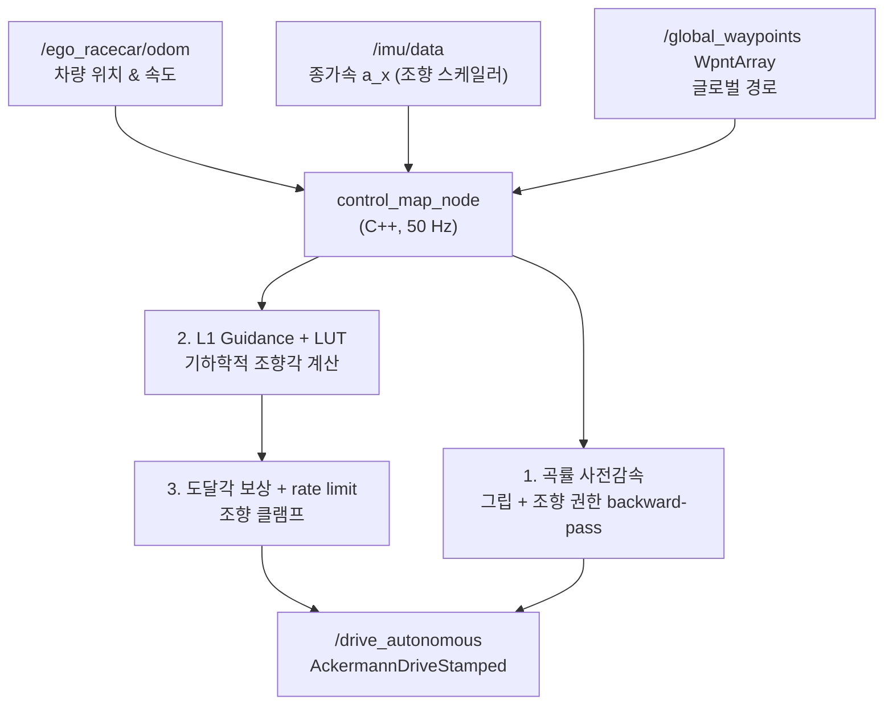

# CLAUDE.md

이 파일은 Claude Code가 이 저장소에서 작업할 때 참고하는 가이드입니다.

## 프로젝트 개요

**2026 IFAC F1TENTH 자율주행 대회**의 **하드웨어 / 제어(Control) 파트** 코드베이스입니다.
ROS 2 패키지 `f1tenth_control` 하나로 구성되며, 플래닝 팀이 발행하는 글로벌 경로를
추종하여 실차(또는 시뮬레이터)를 주행시키는 횡방향(조향)·종방향(가감속) 제어를 담당합니다.
(수동/자율/E-stop Mux(teleop)는 이 저장소 담당이 아님 — 실차는 팀 공용 f1tenth_stack의
drive_mode_manager + ackermann_mux가 수행하며, 2026-07-29에 시뮬용 joy_teleop_monitor도
저장소에서 제거됨. 라이다 기반 자율 비상제동(AEB)도 제어 파트에서 제거됨 — 실제 비상정지는
planning 파트가 판단/발행)

- 언어: C++17 (메인 런타임), Python (참조용 원본 컨트롤러 / LUT 프로토타입)
- 빌드 시스템: `ament_cmake` (ROS 2)
- 코드/주석 언어: **한국어** — 새 코드도 주변 코드의 한국어 주석 밀도·스타일에 맞출 것
- 차량: 휠베이스 0.33 m. **실제 최대 조향각 = 좌우 모두 약 23.5°(0.410 rad)** — 2026-07-31
  각도기 전 구간 실측으로 확정. 시뮬은 대칭 ±0.41. VESC 모터 컨트롤러
  - ⚠️ **구 서술("명령 한계 비대칭 0.5315 / 0.4320")은 2026-08-03에 폐기됐다.** 그건 공용
    게인(`-0.4463`) 하나로 좌우를 다 처리하던 시절의 보정 방식이고, 풀락에서만 맞고 중간각은
    전부 어긋났다(0803 bag: 같은 명령에 좌회전 곡률이 우 대비 17% 부족).
    지금은 젯슨이 **좌/우 개별 게인**(`steering_angle_to_servo_gain_left` −0.5785 /
    `_right` −0.4702)을 쓰므로 `max_steering_*`는 **실제 바퀴 각(rad)** 을 그대로 뜻한다.
  - 🔴 **현재 값: 좌 0.410 / 우 0.410**, 젯슨 `steering_angle_to_servo_offset` = **0.4672**
    (2026-08-07 확정). **이 셋(offset·gain_left/right·max_steering_left/right)은 한 묶음이다** —
    하나만 바꾸면 풀락에서 servo가 `servo_min`(0.23)/`servo_max`(0.66)에 걸려 클리핑되고,
    그 로그가 VESC 시리얼을 굶겨 odom이 조용히 망가진다(아래 "작업 시 주의사항" 참고).
  - 🔑 **offset은 게인·서보창으로부터 유일하게 결정된다.** 대칭 ±0.410 조건을 풀면
    좌 `C − 0.5785×0.410 ≥ 0.23` → C ≥ 0.4672, 우 `C + 0.4702×0.410 ≤ 0.66` → C ≤ 0.4672
    → **C = 0.4672 하나뿐**이다. 여기서 Δ만큼 벗어나면 그만큼 한쪽 가동범위를 그대로 잃는다
    (좌 Δ/0.5785, 우 Δ/0.4702 → servo 0.01당 약 1.0~1.2°). **중립이 어긋나면 offset을
    옮기지 말고 서보암 스플라인/타이로드로** "servo 0.4672 = 직진"을 만들 것. offset은
    마지막 잔차 흡수용이다.
  - ⚠️ **폐기된 서술**: "2026-08-06 우편향 0.8° 좌 트림(offset 0.4591 / 좌 0.395)".
    그 변경은 **이 dev repo에만 있었고 실차엔 한 번도 배포되지 않았다** — 젯슨 백업
    `vesc.yaml.bak.0806_163736`(야간 주행 직전)도, 그 이전 08-05 백업도 전부 0.4672였고
    젯슨 launch도 계속 0.410/0.410이었다. 08-07에 repo를 실차에 맞춰 되돌렸다.
  - 🔴 **서보암이 08-06 야간 주행 중 또 스플라인에서 빠졌다**(07-30 이후 2회째). 재장착
    과정에서 젯슨 offset이 **0.1291**로 바뀌어 있었는데, 이건 `servo_min`(0.23)보다 낮아서
    `ackermann_to_vesc.cpp`의 클램프에 걸려 **중립과 좌조향 전 구간이 servo 0.23에 상시
    고정**됐다(= 전원 켜자마자 한쪽 풀락, 바퀴가 기계 스톱에 물려 서보 스톨). 우조향도
    `|δ| ≥ (0.23−0.1291)/0.4702 = 12.3°`를 넘겨야 겨우 움직였다. 08-07에 0.4672 복구 +
    암 정렬 재확인으로 해결. **"한쪽 풀조향이 걸린다"는 증상을 보면 offset이 서보창
    바깥으로 나가 있는지부터 볼 것.**
  - ✅ **"도달각 74%" 문제는 해결됐다** (2026-07-31). 원인은 타이어 슬립도 링키지 설계도
    아니고 **서보 암이 스플라인에서 풀린 것**이었다(07-30 팀원 주행 중 이탈 → 재장착).
    재장착 후 중간각 실측 11.46° 명령 → 좌 11° / 우 12°, **게인 1.003 = 명령대로 도달**.
    → `steering_reach_ratio`를 0.74에서 되돌렸다(0.74로 두면 1.35배 과조향).
  - 🔵 **`steering_reach_ratio`의 현재 값은 0.85다** — 2026-08-07 사용자 결정으로 **유지**.
    정적 벤치 실측은 이보다 높다(08-07 servo 0.62 → 예측 18.62° / 실측 18° = **0.967**,
    07-31 중간각 1.003). 즉 0.85는 실측치가 아니라 **하중 걸린 주행에서의 도달각 마진**을
    포함한 보수적 설정이다. 실측치(≈1.0)로 바꾸라는 제안은 08-07에 검토 후 기각됐으니
    "실측과 다르다"는 이유만으로 다시 올리지 말 것.
    - 이 상수는 **두 곳을 동시에** 지배한다(`control_map_node.cpp:826`, `:385`):
      ① 조향 명령 보상 `steering_angle /= 0.85` = **×1.176** (클리핑 전)
      ② 조향 권한 캡의 `δ_avail = 0.95 × 0.410 × 0.85` = **0.331 rad**
      → 값을 올리면 **코너 속도 캡이 풀리는 동시에 조향 명령이 18% 줄어든다.** 한 번에 두
        가지가 바뀌므로 바꿀 거면 `steering_reach_ratio:=1.0` 런치 인자로 저속 셰이크다운부터.
    - ⚠️ `δ_avail`은 **조향 리미터가 아니다.** 주행 중 실제 조향 명령 한계는 `:836`의
      `clamp(±0.410)`이고, `δ_avail`(0.331)은 곡률 사전감속이 **코너 진입 속도를 계산할 때
      쓰는 가정치**다(호출부는 `:659` 하나뿐). "0.331까지밖에 못 꺾는다"로 읽으면 틀린다.
  - 🔴 **기계 한계는 24°(간섭)이고 라인은 25.1°를 요구한다** — 아래 ②-d 참고. 차량 쪽에서
    더 짜낼 수 없으므로 **플래너에서 최소 반경 제약(≥0.85 m)**으로 풀어야 한다.

## 워크스페이스 구조 ⚠️ 중요

이 `~/F1tenth_control` 폴더는 **개발/편집용 원본**이며, 루트에 `COLCON_IGNORE`가 있어
**여기서는 colcon 빌드가 되지 않습니다.** 실제 빌드·실행은 상위 ROS 2 워크스페이스
`~/2026_IFAC/`에서 이루어지며, 그 안의 `~/2026_IFAC/src/f1tenth_control/`로 코드가 동기화됩니다.

```
~/2026_IFAC/                  ← 실제 colcon 워크스페이스
├── build/ , install/ , log/
├── src/
│   ├── f1tenth_control/      ← 이 저장소의 동기화 사본 (실제 빌드 대상)
│   ├── local_planning/ , global_planning/ , state_machine/   ← 플래닝 팀
│   ├── opponent_detector/ , wpnt_publisher/ , monte_carlo_localization/
├── offline_trajectory_generator/ , wpnt_publisher/
├── frenet_conversion/        ← Frenet 좌표 변환 (f110 스택)
└── ...                       ← steering_lookup 패키지(LUT cfg) 포함
```

⚠️ **`~/2026_IFAC` 사본이 이 repo보다 앞서있을 수 있음** — `f1up`으로 커밋 전, 두 사본을
diff로 비교해 어느 쪽이 최신인지 확인할 것. 특히 팀 공용 저장소(`2026_IFAC`)의 `main` 브랜치가
다른 팀원의 push로 갱신됐다면, 이쪽(dev repo)의 미커밋 변경을 그대로 덮어쓰지 않도록 주의.

작업 후에는 변경 사항을 `~/2026_IFAC/src/f1tenth_control/`로 반영한 뒤 그쪽에서 빌드해야 합니다.

⚠️ **빌드는 `--symlink-install`로 할 것**(`build` alias가 이미 그렇게 함). 그러면 `install/`의
런치·YAML이 `src/`를 가리키는 심볼릭 링크가 되어 **런치 파일 수정은 재빌드 없이 즉시 반영**된다
(`.cpp`는 당연히 재빌드 필요). 옵션 없이 빌드하면 실제 복사본으로 바뀌어 "src를 고쳤는데
반영이 안 되는" 상태가 된다.

## 빌드 & 실행

```bash
# 빌드 (실제 워크스페이스에서)
cd ~/2026_IFAC
colcon build --symlink-install --packages-select f1tenth_control
source install/setup.bash

# 시뮬레이션 실행 (gym_bridge·global_planner는 별도 기동 필요) — 기동 즉시 자율주행
ros2 launch f1tenth_control control_sim.launch.py
ros2 launch f1tenth_control control_sim.launch.py prebrake_decel:=2.0

# 실차 실행 (하드웨어 브링업·planning이 먼저 떠 있어야 함)
# ⚠️ 실차는 f1tenth_stack(별도 워크스페이스 ~/f1tenth_ws)이 라이다·조이스틱·VESC 드라이버와
#    수동/자율/E-stop Mux를 담당하므로 두 워크스페이스를 다 소싱할 것(순서 무관):
source ~/f1tenth_ws/install/setup.zsh
source ~/2026_IFAC/install/setup.zsh
ros2 launch f1tenth_control control_real.launch.py
ros2 launch f1tenth_control control_real.launch.py max_speed:=4.0 max_lateral_accel:=5.1

# 섹터 scale 자율 학습 (연습 전용 — 차가 스스로 코너 속도를 올린다, E-stop에 손 올릴 것)
ros2 launch f1tenth_control control_real.launch.py \
    sector_learn_mode:=explore sector_learn_out:=~/learned_sectors.yaml
# 결선: 위 결과를 싣고 하향 거버너만
ros2 launch f1tenth_control control_real.launch.py \
    sector_scale_file:=~/learned_sectors.yaml sector_learn_mode:=guard

# 개별 노드 실행 (디버깅용)
ros2 run f1tenth_control control_map_node

# odom 거리 스케일 실측 보정 (별도 터미널에서 — 관찰 전용 노드, 우리 컴에서 실행)
ros2 launch f1tenth_control odom_calib.launch.py
```

- 두 launch 파일의 공용 파라미터·노드 정의는 `launch/_control_common.py`에 있음 — 조정 방법은
  아래 "실차 튜닝 파라미터" 참고.
- CMake가 `-O3 -march=native -flto`로 최적화 빌드합니다 (임베디드 실시간 제어 성능 목적).
- `compile_commands.json`이 생성되어 VS Code linter와 연동됩니다.

⚠️ **2026-08-01: MPPI 컨트롤러, 실차 원격 대시보드, LUT 실측 보정 노드를 저장소에서 전부
제거했다** — 대회가 한 달 앞으로 다가와 MAP(control_map_node) 하나에만 집중하기로 했고, 실시간
모니터링/LUT 보정은 이미 자체 웹앱(`tools/bag_analyzer/`, `tools/lut_calibrator/`)으로 rosbag을
분석하는 방식으로 대체돼 있어 라이브 ROS 노드가 중복이었다. 자세한 배경은 "❌ 제거된 노드/로직"
항목 참고. 되살릴 근거가 생기면 git 이력에서 꺼낼 것.

## 노드 구성 (C++ 4개 + Python 1개)

### 1. `control_map_node` (control_code/control_map_node.cpp) — 메인 자율주행 제어
50 Hz 제어 루프. **L1 Guidance + Steering Lookup Table(LUT)** 기반.
- 구독: `<odom_topic>`(기본 `/ego_racecar/odom`), `/imu/data`, `/global_waypoints`(`f110_msgs/WpntArray`, transient_local QoS), `/local_waypoints`, `/drive_mode`(`std_msgs/String` — 2026-07-28 신설, 자율 미체결 중 속도 램프 와인드업 차단. 발행자 없으면 자동 비활성이라 시뮬 무영향)
  - ⚠️ **`/scan` 구독은 2026-08-04에 없어졌다** — GapFollower 호출부 제거로 라이다를 쓰는 경로가 남지 않았다
  - ⚠️ **`/imu/data`는 이제 종가속(`acc_now_`)만 쓴다** — 2026-08-06 요레이트 카운터스티어
    제거로 자이로(`angular_velocity.z`) 소비처가 사라졌다
- 발행: `/drive_autonomous` (`ackermann_msgs/AckermannDriveStamped`) — `drive_source_selector`를 거쳐 최종 `/drive`로 전달됨
  - ⚠️ `drive.acceleration`은 **명령 속도의 시간미분**이다(2026-07-30 수정). 예전엔
    `(명령 − 실측)/dt`, 즉 추종오차를 dt로 나눈 값을 가속도라고 발행했다 — VESC 속도 PID는
    명령이 실측보다 앞서야 전류가 나오는 구조라 정상 가속 중에도 200 m/s²급이 나오고 odom
    노이즈가 ×50 증폭됐다. 젯슨 `ackermann_to_vesc` 서비스 브레이크 패치가 이 필드로 제동을
    중재하면 그대로 오작동한다 — 🔴 **그 패치는 현재 켜져 있다**(`brake_enabled: true`,
    코드 기본값·`vesc.yaml` 둘 다. 2026-08-07 젯슨 소스 직접 확인). 이 필드를 제동 중재에
    쓰는 변형을 넣지 말 것
- 분리된 알고리즘 모듈(별도 .cpp/.hpp):
  - `SteeringLookupTable` — Pacejka 타이어 모델 기반 (횡가속도, 속도)→조향각 LUT (CSV)
  - `VelocityProfiler` / `geometry` — 곡률 계산 및 Forward-Backward 속도 프로파일링
- ⚠️ **장애물 종방향 soft brake(`obstacle_brake_enable_`)는 2026-08-01 제거됨** — `local_planning`이
  이미 완성된 회피+비상정지 스택(`safe_stop_latch` 등)을 갖췄고 필요시 `vx_mps=0` 웨이포인트를
  직접 발행하므로, control 쪽 자체 장애물 감속은 planning과 겹치는 중복 안전망이었다. 자세한
  배경은 "❌ 제거된 노드/로직" 참고.
- 🔴 **2026-08-04: 주행에 개입하는 안전 레이어를 전부 삭제했다**(팀원 커밋 `a71890c`, 사용자 지시).
  파라미터 21개 + 코드까지 실제로 제거 — 상세는 아래 "❌ 제거된 안전 레이어(2026-08-04)" 참고.

### 2. `drive_source_selector` (control_code/drive_source_selector.cpp) — 자율 명령 포워더 (sim/real 공용)
`control_map_node`의 `/drive_autonomous`를 재스탬프해 `/drive`로 그대로 흘려보내는 슬림 노드 —
수동 조종/E-stop/대시보드 기능이 없다(teleop 아님). 실차는 수동/자율/E-stop Mux를 팀 공용
`f1tenth_stack`(`drive_mode_manager` + `ackermann_mux`)이 맡고, 시뮬은 Mux 없이 이 노드가 자율
명령을 `/drive`로 직결한다.
- 구독: `/drive_autonomous`
- 발행: `/drive`(실차 = `ackermann_mux`의 navigation 채널, 우선순위10 / 시뮬 = gym_bridge가 직접 구독)
- **E-stop을 몰라도 됨** — 실차는 `drive_mode_manager`가 `estop_lock`으로 mux 입력 전체를
  마스킹하므로 제동 중엔 이 노드의 `/drive`도 자동 차단됨.
- ⚠️ 2026-08-01 이전엔 MAP/MPPI 알고리즘을 조이스틱 RB로 고르는 셀렉터였다. MPPI 노드 전체
  제거와 함께 순수 포워더로 단순화됨 — `/joy` 구독, `/mppi_active` 발행, RB 토글 로직은 더 이상
  없다.

### 3. `sim_imu_bridge_node` (control_code/sim_imu_bridge_node.cpp) — 시뮬 전용 odom→IMU 중계
f1tenth_gym(gym_bridge)은 `/imu/data`를 발행하지 않으므로, `control_map_node`의 `use_imu` 경로
(요레이트 카운터스티어 등)를 시뮬에서도 실제 데이터로 검증하기 위한 유틸리티 노드.
- 구독: `<odom_topic>`(기본 `/ego_racecar/odom`) / 발행: `<imu_topic>`(기본 `/imu/data`)
- odom의 `twist.twist.angular.z`(요레이트)만 실측 중계, orientation은 identity 고정
  (2D 물리 시뮬이라 롤이 없다 — 컨트롤러도 2026-07-29부터 롤을 안 쓴다).
- `control_sim.launch.py`에 기본 포함되어 `use_imu:=true`를 안전하게 만들어줌. 실차
  런치(`control_real.launch.py`)에는 넣지 말 것(실제 VESC IMU와 토픽이 충돌).

### 4. `odom_calib_node` (control_code/odom_calib_node.cpp) — odom 거리 스케일 실측 보정 (우리 컴에서 실행)
"명령 주고 자로 재기" 테스트를 자동화한 관찰 전용 노드. 젯슨의 원시 토픽을 직접 구독해
우리 컴에서 조립·계산한다(젯슨 렌더 연산 0). **`/drive` 미발행**이라 주행 중 켜둬도 제어에 영향 없음.
- 구독: `<odom_topic>`(기본 `/pf/pose/odom`), `/drive`, `/odom_calib/reset`(`std_msgs/Empty`) / 발행: 없음
- 한 번의 직선 주행에서 **독립적인 거리 3개를 동시 적분**해 어느 게인이 틀렸는지 분리한다:
  ① 명령 `∫/drive.speed dt` ② 휠 `∫odom vx dt`(VESC `erpm_to_speed` 경로)
  ③ 맵 `|끝−시작|`(MCL 스캔매칭 — 휠과 독립). `/pf/pose/odom` 한 토픽에 twist(VESC 패스스루)와
  pose(MCL 추정)라는 다른 출처가 섞여 있다는 점을 이용 → **자를 대기 전에도** 스케일 오차가 드러난다.
- 판정: 휠≠맵 → 젯슨 `vesc_to_odom`의 `erpm_to_speed` / 맵≠자 → 맵 스케일·MCL / 명령≠휠 → 속도 추종
- 보정: `G_새 = G_기존 × (휠/맵)`. ⚠️ 게인을 고치면 같은 명령에 차가 실제로 빨라지므로 `max_speed`를
  낮춰 재셰이크다운할 것.
- 출발/정지 자동 감지로 구간을 끊고 최근 10건 이력·평균 비율 표시. 경로길이가 아니라 **직선변위**를
  쓴다(MCL 보정 점프가 `Σ|Δpos|`를 부풀림 — 지터 ±5cm에서 경로길이 +14%, 직선변위 +0.45%).
- 실행: `ros2 launch f1tenth_control odom_calib.launch.py` (구 파일명 `dashboard.launch.py mode:=calib`)
- ⚠️ 측정 시: 직선만 / 5~10m(1m는 자 오차가 2%) / **1.0~2.0 m/s**(FOC 센서리스 데드존
  800~2250 ERPM ≈ 0.17~0.49 m/s 회피) / 양방향(오프셋 검출) / 여러 속도(슬립 검출)

### 5. `sector_learner.py` (scripts/, Python) — 섹터 MLA 스케일 발행기 겸 학습기
`/sector_scales`를 발행하는 **유일한** 노드(2026-08-12 `sector_pub.py` 흡수). 실차 런치가
`sector_scale_enable:=true`일 때 자동 기동한다. 기본 모드 `static`은 `config/sectors.yaml`을
그대로 발행할 뿐 값을 안 바꾼다 — 구 `sector_pub` 거동과 동일하다.
- 구독: `<odom_topic>`, `/sensors/imu/raw`, `/scan`, `/drive_autonomous`, `/drive_mode`,
  `/global_waypoints`, `/state` (전부 **BEST_EFFORT** — RELIABLE로 구독하면 센서 발행자와
  QoS 비호환으로 **한 건도 못 받으면서 노드는 정상처럼 보인다**. 실제로 걸렸다)
- 발행: `/sector_scales` (transient_local + **1 Hz 하트비트** — 컨트롤러 데드맨용)
- ⚠️ **`control_code/`가 아니라 `scripts/`인 이유**: ① 50 Hz 제어 경로가 아니다(판단은 랩당
  1회) ② `jetsonup`이 `tools/`를 젯슨에 안 보내므로 런타임 노드는 `scripts/`여야 한다
  ③ 팀 방침 "컨트롤러는 판단하지 않는다"와 물리적으로 정합 — 판단은 여기, 실행은 `control_code/`
- 상세·리플레이 결과·지뢰 넷은 ②-k 참고

## 토픽 데이터 흐름

```
플래닝팀 → /global_waypoints (WpntArray)
                    ↓
        control_map_node ──/drive_autonomous──┐
                                                ↓
  [시뮬] drive_source_selector (순수 포워더) ──/drive──→ gym_bridge
  [실차] drive_source_selector (순수 포워더) ──/drive(navigation,pri10)─┐
         /joy ──→ f1tenth_stack drive_mode_manager ──teleop(pri100)+estop_lock─┤
                                          f1tenth_stack ackermann_mux ──────────┴─→ VESC
```
(2026-08-01 MPPI 제거로 컨트롤러 노드는 control_map_node 하나뿐. drive_source_selector는
 이제 MAP/MPPI 선택 없이 /drive_autonomous를 그대로 /drive로 흘려보낸다.
 수동/자율/E-stop Mux(teleop)는 이 저장소에 없음 — 실차 f1tenth_stack 담당)


```mermaid
graph TD
    SubOdom["/ego_racecar/odom<br>차량 위치 & 속도"]
    SubIMU["/imu/data<br>종가속 a_x (조향 스케일러)"]
    Waypoints["/global_waypoints WpntArray<br>글로벌 경로"]

    Controller["control_map_node<br>(C++, 50 Hz)"]

    SubPrebrake["1. 곡률 사전감속<br>그립 + 조향 권한 backward-pass"]
    SubL1["2. L1 Guidance + LUT<br>기하학적 조향각 계산"]
    SubYawRate["3. 도달각 보상 + rate limit<br>조향 클램프"]

    PubDrive["/drive_autonomous<br>AckermannDriveStamped"]

    SubOdom --> Controller
    SubIMU --> Controller
    Waypoints --> Controller

    Controller --> SubPrebrake
    Controller --> SubL1

    SubL1 --> SubYawRate
    SubYawRate --> PubDrive
    SubPrebrake --> PubDrive
```

## 핵심 제어 알고리즘 (control_map_node)

1. **최근접 웨이포인트 탐색** — 지난 인덱스 주변 윈도우 스캔, 2.5m 초과 이탈 시 전역 재탐색(failsafe)
2. **곡률 룩어헤드 사전 감속** — 제동거리 `v²/2·prebrake_decel`만큼 전방 곡률을 스캔해
   지점별 상한(그립 `√(a_lat/κ)` + 조향 권한, ②-b)까지 감속 가능한 속도의 최소값을 캡으로 씀
3. **L1 Guidance** — 속도 비례 L1 거리 → 전방 목표점 → `sin(eta)` 횡오차 → 목표 횡가속도
4. **Steering LUT 조회** — (횡가속도, 속도) → 조향각 (Pacejka 모델 보간)
5. **동적 스케일러** — 가감속/속도/곡률 FF 보정
6. **조향 트림 자동 보상**(`steering_trim_*`, ②-n) — 자이로 요레이트로 기계 중립 오프셋을
   추정해 발행 조향에 더한다. 08-10 신설, 런치 기본 활성. 0813 실측 수렴 확인
   (~~요레이트 피드백 카운터스티어~~는 2026-08-06 제거 — "❌ 제거된 판단 로직" 참고)
7. **도달각 보상**(`steering_reach_ratio`, ②-e) → **rate limit**(`max_steering_rate`, dt 비례)
   → 좌우 물리 한계 클리핑(real 좌 0.410 / 우 0.410, sim ±0.41)
8. **램프 안티와인드업**(`ramp_lead_max`, 2026-08-08 신설, ②-i) — 램프 상태가 실측보다
   `ramp_lead_max`(2.4 m/s) 이상 앞서지 못하게 자른다. 출발 탈조 중 램프가 감겨 관통 순간
   급발진하는 것을 막는다. 상한만 자르므로 **감속에는 개입하지 않는다**
9. **engage 게이트 (bumpless transfer)** — `/drive_mode`가 `autonomous`가 아니면 속도 램프를
   실측에 고정. 자율 진입 순간 계단 명령이 VESC에 꽂히는 것(급발진)을 막는다. `/drive_mode`
   미수신 시 자동 비활성이라 시뮬은 무영향
10. **런치 킥** (🔵 2026-08-07부터 런치 기본 **false**) — 자율 정지출발 시 짧게 높은 속도를 명령해 VESC 센서리스 데드존을 관통.
    램프 상태(`final_speed`)는 안 건드리고 **발행값만** 덮으므로 킥 종료 후 램프가 이어진다
11. **NaN/Inf 게이트 + odom 초기 대기** — MCL 붕괴로 pose에 NaN이 실려 오면 그 샘플을 콜백에서
    버린다(안 버리면 NaN 조향각이 그대로 발행된다). odom을 **한 번도 못 받은 상태에서는 출발하지
    않는다**(`odom_seen_`). ⚠️ 2026-08-04에 **지속 신선도 검사(`odom_timeout`)는 제거**됐다 —
    이제 odom이 도중에 끊겨도 stale pose로 계속 주행한다
12. **dt 클램프**(2026-07-30, [0.001, 0.1]) — `wall_timer`는 실시간 보장이 없다. dt는 램프
    증분·런치 킥 타이머·발행 가속도에 전부 곱해지므로, 젯슨에서 한 사이클 0.2s 밀리면 램프가
    한 스텝에 1.6 m/s 튄다(= 계단 명령 = 07-27 급발진과 같은 형태)

⚠️ 예전 목록에 있던 **최근접 인덱스 견고화**(헤딩 게이트 + 점프 확인 + 조향 홀드), **odom
워치독**은 2026-08-04에 삭제된 채로 남아 있다. **기동 실패(탈조) 안티와인드업(`stall_guard`)은
08-05에 잠깐 복구했다가 08-06에 다시 제거**했다 — 저속 탈조는 planning이 속도 레버를 쥐고
푸는 게 맞다는 판단. 되살리기 전에 아래 "❌ 제거된 안전 레이어 (2026-08-04)"를 읽을 것.
⚠️ **요레이트 카운터스티어·출발 정렬·데드존 바닥은 2026-08-06에 제거**됐다 — 아래
"❌ 제거된 판단 로직 (2026-08-06)" 참고.

### 제어 이론 상세

#### L1 Guidance (Pure Pursuit 계열)

속도 비례 룩어헤드 거리로 전방 목표점을 선정, 횡가속도 명령을 계산한 뒤 LUT로 조향각을 결정합니다.

$$L_1 = \mathrm{clip}\Big(\big(q + m\,v\big)\cdot s_\kappa,\ \ \max(t_{min},\ \sqrt{2}\,e_{lat}),\ \ t_{max}\Big)
\qquad
a_{lat} = \frac{2\,v_{lu}^2}{\lVert \mathbf{p}_t - \mathbf{p}\rVert}\sin\eta
\qquad
\delta = \mathrm{LUT}(a_{lat},\ v_{lu})$$

- $q$ = `l1_offset`(0.5) = **절편 [m]**, $m$ = `l1_speed_gain`(0.3) = **속도 계수 [s]**
  → $L_1 = 0.5 + 0.3v$ (원본 Python MAP의 `q_l1`/`m_l1` 대응)
  > ℹ️ **2026-07-30 개명**: 구 이름 `l1_gain`/`l1_distance`는 역할과 정반대였다(gain이 절편,
  > distance가 기울기). 구 이름 호환 shim은 2026-08-06에 제거됐다 — 이제
  > 구 이름을 넘기면 **조용히 무시**되니 반드시 새 이름을 쓸 것.
- $s_\kappa$: $|\kappa_{closest}|>0.3$이면 최대 25% 축소(코너 반응성), $t_{min}$=`t_clip_min`(**0.9**), $t_{max}$=`t_clip_max`(5.0)
- $\sin\eta$: 차량 좌표계에서 목표점 방향의 횡성분 / 실제 거리 (+면 목표가 왼쪽)
- **목표점 $\mathbf{p}_t$는 `closest_idx`로부터 경로 호 길이 $L_1$만큼 전진한 점**(`walk_forward`).
  차량 기준 직선거리가 아니다.
- ⚠️ **분모는 명목 $L_1$이 아니라 목표점까지의 실제 거리 $\lVert\mathbf{p}_t-\mathbf{p}\rVert$다**
  (2026-07-28 수정, `l1_use_actual_distance`=false면 구 거동). 호 길이로 고른 목표점의 실제
  거리는 웨이포인트 이산화(1점 간격까지 초과) + 차량 오프셋 때문에 $L_1$보다 길다 —
  07-27 실차 bag 실측 비율 중앙 1.06~1.31·p95 최대 1.72. 명목값을 쓰면 횡가속 명령이 그만큼
  과대해지고 **경로에서 벗어날수록 = 복귀가 필요한 순간에 더 심해진다.**

#### 🔴 ❌ 제거된 판단 로직 (2026-08-06) — "컨트롤러는 판단하지 않는다"

**팀 방침**: 주행에 관한 **판단은 planning이 전담**하고, control은 주어진 경로·속도를 충실히
실행만 한다. 그 기준으로 컨트롤러가 자체 판정을 하던 항목을 코드·파라미터·런치 인자까지 실제로
삭제했다. **셋 다 런치 기본값이 비활성이라 실거동 변화는 0이다.** git 이력에서 꺼낼 수 있다.

| 제거한 것 | 무엇이었나 | 왜 뺐나 |
|---|---|---|
| **요레이트 피드백 카운터스티어** (`yaw_rate_gain` + `StabilityController` 헤더 + `imu_angular_scale`) | 명령 조향각이 의도하는 기대 요레이트 `v·tanδ/L` 대비 IMU 실측 오차에 비례해 조향을 보정 — 언더스티어(실측<기대) 시 더 꺾음 | ① 런치 기본 **0.00 = 비활성**이라 실거동 변화 0. ② **"지금 언더스티어다"를 컨트롤러가 판정**해 조향을 덧대는 항이라 방침과 정면 충돌. ③ 애초에 오버스티어 보정인데 우리 크래시는 전부 언더스티어였고, 게인을 검증할 저마찰 드리프트 bag이 없었다(07-29) |
| **출발 정렬** (`launch_align_enable`/`_speed`/`_time`) | 정지출발 직후 조향을 0에서 시작해 `v/launch_align_speed`로 채움 | 기본 `false`. 정상 출발에서 효과 **0~25%**(블렌딩이 0.46~0.70s밖에 안 사는데 큰 조향은 그 뒤 v 2.8~4.8에서 나온다). 효과가 컸던 52~75% 케이스는 전부 **탈조로 못 나간** bag이라 조향과 무관 — 출발 덜그럭의 정체는 VESC 오픈루프 기동 시퀀스다 |
| **데드존 바닥** (`deadzone_floor_speed`) | `0 < 목표 < 이 값`이면 이 값으로 올려 FOC 데드존(0.17~0.49 m/s)에 걸터앉는 것을 방지 | 기본 0(비활성). **플래닝이 요구한 속도보다 빠르게 가는 것 = 회피 중 권한 침범**이다(코드 주석이 원래 달고 있던 경고 그대로). 저속 탈조는 planning이 속도 레버를 쥐고 푸는 게 맞다 — 08-06 `stall_guard` 재제거와 같은 판단 |

같이 정리한 죽은 코드(거동 변화 없음):
- **`GapFollower` 전체**(`gap_follower.cpp`/`.hpp`) — 08-04에 호출부가 사라진 뒤 CMake 타겟에만
  남아 **컴파일만 되던** 코드. CMake 소스 목록에서도 제거
- **`l1_gain`/`l1_distance` 호환 shim** — 07-30 개명 잔재. 런치가 새 이름만 넘긴 지 오래됨

⚠️ 자이로를 다시 쓰게 되면 **VESC는 deg/s로 발행한다**(2026-07-19 실차 확인, `sensor_msgs/Imu`의
rad/s 규약 위반). `imu_angular_scale`을 real = π/180 = 0.0174533, sim = 1.0(`sim_imu_bridge_node`는
이미 rad/s 중계)로 되살릴 것. 부호는 정상(반시계 양수, REP-103 일치).
⚠️ **이 문단의 "자이로 소비처가 없다"는 서술은 2026-08-10에 뒤집혔다** — 조향 트림 적응기
(②-n)가 자이로 요레이트를 쓴다. 현재 IMU 소비처는 **둘**이다: 종가속(`acc_now_` → 조향
가감속 스케일러)과 요레이트(`yaw_rate_now_` → 트림 추정). `imu_angular_scale`도 복원돼 있다.

🔵 **아직 남아 있는 최대 '판단'은 곡률 사전감속이다**(②-b). 전방 κ로 그립·조향 권한 상한을
자체 계산해 플래닝 `vx_mps`를 `min()`으로 덮는 유일한 경로다. 같은 방침을 끝까지 적용하면
다음 제거 대상이지만, 지우면 플래너 프로파일이 물리 한계를 넘는 지점(②-d)에서 방어가 0이
되므로 **팀장·플래닝과 합의 후** 별도로 진행할 것. 중간 단계로 `understeer_gradient:=0.0`
(조향 축만 끄기) + `max_lateral_accel`을 플래너와 동일한 7.0으로 맞추는 무해화가 가능하다.

#### ❌ 제거된 감속 로직 (2026-07-29) — 다시 넣기 전에 읽을 것

레이싱에 불필요하다고 판단해 **코드에서 삭제**했다. 되살릴 근거가 생기면 git 이력에서 꺼낼 것.

| 제거한 것 | 무엇이었나 | 왜 뺐나 |
|---|---|---|
| **롤 인지 ESC** (`max_roll_limit` 0.15 / `decel_attenuation` 0.6) | 롤각 비율로 가속·감속 한계를 축소하고 롤 비율 0.8 초과 시 목표속도까지 깎던 전복 방지 | 1/10 차량은 서스펜션이 단단해 임계각(8.6°)까지 안 기운다 → **사실상 상시 비활성**. 시뮬은 2D라 롤이 아예 0. 얻는 것 없이 코너 속도만 깎을 위험 |
| **언더스티어 가드** (`understeer_guard_enable` 외 8개) | 요레이트 결손(`\|ψ̇_ref\|−\|ψ̇_meas\|`)을 EMA로 잡아 최대 25% 감속(+선택적 조향 완화) | bag 재생만 했고 **시뮬 폐루프·실차 둘 다 미검증**(발동률 24~42%, 발동 시 평균 −19%). 기본값도 `false`였다. 조향 완화는 `yaw_rate_gain`과 같은 신호에 반대로 반응해 서로 싸움 |

⚠️ 언더스티어 자체는 실재하는 문제다(07-25 시케인·07-26 헤어핀 크래시). 다만 **반응형 감속이
아니라 사전 대응**으로 푼다 — 곡률 사전감속의 조향 권한 캡(②-b)이 코너 **진입 전에** 속도를
낮추므로 원인 쪽에서 막는다. 요레이트 결손 신호의 실측 근거는 WORKLOG 2026-07-29 항목 참고.

## 실차 튜닝 파라미터 (control_map_node)

- `control_map_node`의 나머지 파라미터는 전부 코드 내 `declare_parameter` 기본값(별도 YAML
  미연결). **전부 생성자에서 1회만 읽음**(파라미터 콜백 없음) — 값을 바꾸려면 노드 재시작 필요,
  런타임 `ros2 param set`은 무효. 조정 경로에 따라 3그룹으로 나뉨:

### ① 터미널 인자로 즉시 조정 (파일 수정·재빌드 불필요)
`control_real.launch.py`/`control_sim.launch.py` 실행 시 `param:=value`로 바로 오버라이드.
전체 목록은 `ros2 launch f1tenth_control control_real.launch.py --show-args`로 확인:

⚠️ 아래 기본값은 **런치 인자 기본값**(= 실제로 적용되는 값)이다. `control_map_node.cpp`의
`declare_parameter` 기본값과 다를 수 있는데, 런치가 항상 덮어쓰므로 **이 표가 정답**이다.
직접 확인: `ros2 launch f1tenth_control control_real.launch.py --show-args`

| 파라미터 | 기본값 | 설명 |
|---|---|---|
| `max_speed` | **8.0**(real) / 12.0(sim) | 직선 최고속도 캡 [m/s]. 곡률 제한은 코너에서만 걸리므로 직선 상한은 이 값이 유일하다. real 8.0 = ERPM 상한(바퀴 ~9 m/s)의 89% (2026-07-30 5.0→8.0 상향) |
| `min_speed` | **2.0** (real·sim 공통) | 최저 순항 속도 [m/s] (곡률 감속 하한). ⚠️ 이 값이 조향 권한 캡보다 높으면 캡이 무력화된다(②-b). ⚠️ 정지가 필요하면 `local_planning`이 `vx_mps=0` 웨이포인트를 발행하고, 그 경로는 이 하한을 무시하고 0까지 내려간다 |
| `max_lateral_accel` | **6.0**(real) / 10.0(sim) | 코너 그립 클램프 a_lat [m/s²]. 🔴 **2026-08-17에 7.0 → 6.0 하향**(런치 기본값). 근거는 같은 날 같은 트랙 15랩의 대조다 — MLA 6.0으로 **13랩 무사고**(165246 5랩 10.425 s / 165444 8랩 **8.485 s**, 최고 7.18 m/s)인데, 인자를 빼고 디폴트 7.0으로 돌린 판(165701)은 **2랩째 코너 안쪽벽에 접촉**했다. 차이는 코너(κ=0.42) 명령속도 3.91 → **4.25 m/s**(=√(7/6)=1.080 그대로)뿐이고, 그 8%가 안쪽 파고듦 d max 0.38~0.51 → **0.82~0.89 m**, 좌벽 여유 0.28~0.44 → **0.18 → 0.12 m(접촉)**로 증폭됐다. 🔑 **MLA 7.0은 그 코너에서 a_lat 7.59를 요구하는데, 신 프런트의 실측 그립 포락선이 p95 6.25 / max 7.58(②-q, 0816)이라 마진이 0이 아니라 음수였다.** 대가는 랩당 약 0.2 s(코너 10 m 구간 `10/3.91 − 10/4.25`)뿐이다. ⚠️ **인자로만 막아두지 말 것** — 165701이 정확히 "기본값이 위험한데 런치 인자로만 가려둔" 사고다. 아래는 하향 전 기록: <br>🔴 **2026-08-12 정정: 문서가 6.0으로 stale이었다** — `control_real.launch.py`의 실제 기본값은 07-30부터 **7.0**이다(5.0→7.0 상향). 6.0 기준으로 한 분석은 전부 다시 볼 것: 0811 bag 재계산에서 기준 랩타임이 8.418→**7.980 s**(실측 중앙 8.10과 오차 1.2%)로 바뀌고 섹터 스케일의 이득이 30% 줄었다. 🔴 **그리고 이 값을 올려도 조향 LUT가 6.6에서 막는다** — 08-11에 8.6으로 주행하다 첫 코너 벽을 스쳤다. 상한을 정하는 건 이 파라미터가 아니라 LUT다. "Steering Lookup Table" 절 참고 sim은 랩타임 튜닝 기준 유지차 10.0 낙관치 그대로. ✅ **2026-08-01 실차 bag(172.8s, 34코너)으로 재검증**: `bag_analyzer` IMU 실측 피크 a_lat **6.8 m/s²**, 대부분 코너의 피크는 **5.7~6.3 m/s²** 대역 — real 6.0은 이제 이 실측 범위 **안쪽**이라 보수적인 쪽에 가깝다. 6.8은 두 코너(요레이트 추종률 100%인데도 "그립 초과 1.0×" 판정)에서만 나온 순간 피크라 지속 가능한 여유치로 보긴 어렵다. ⚠️ **구 문서치 "~3.1"은 이 bag으로 stale 확정** — 07-25 이전, 이후 가속 램프·사전감속 튜닝 전 데이터였다 |
| `base_max_accel` | **3.5**(real) / 9.0(sim) | 종방향 가속 rate limit [m/s²]. 🔑 **천장은 VESC의 `s_pid_ramp_erpms_s`(21160 ÷ 4336 = 4.88 m/s²)** — 넘겨 줘도 VESC가 깎고 와인드업 위험만 커진다. 2026-07-31 2.5→3.5. **2026-08-05에 램프를 15600→21160으로 올려 여유를 만들어 뒀으므로 3.5는 이제 천장의 72%다** — 인자로 올릴 여지가 있다(단 컨트롤러가 제한을 쥐고 있어야 사전감속 예측이 맞으니 천장까지 다 열지는 말 것). ⚠️ `_control_common.py`가 아니라 **각 진입점 런치**의 인자 |
| `use_imu` | true | IMU 종가속(조향 가감속 스케일러) 사용 여부. 2026-08-06 요레이트 카운터스티어 제거로 이제 이 용도 하나뿐 — false면 `acc_mean=0`으로 스케일러가 중립이 된다 |
| `odom_topic` | `/pf/pose/odom` | 위치추정 odom 소스 (real만 인자, sim은 `/ego_racecar/odom` 고정) |
| `lookup_table_file` | `''` | 보정 LUT CSV 경로 (`tools/lut_calibrator/`의 오프라인 웹앱 결과 적용 시, real만) |
| `acceleration_scaler_for_steering` | 1.0 | 가속 중 조향각 스케일러 (acc_mean 0→`steering_scaler_accel_ref` 구간 선형 블렌딩) |
| `steering_scaler_accel_ref` | 1.0 | 위 두 스케일러가 완전 적용되는 기준 \|a_x\| [m/s²]. 2026-07-30 신설 — 예전엔 ±1.0 하드 임계라 넘는 순간 조향이 5% 계단 점프했다 |
| `steering_reach_ratio` | **1.0** | 명령 조향각 중 **바퀴가 실제 도달하는 비율**. 2026-07-30 신설. 🟢 **2026-08-17에 0.85 → 1.0**. ②-p가 "재검토 대상"으로 남겨둔 이중보정이 실측으로 확정됐다 — LUT를 지운 자전거 역모델은 필요 조향을 다 내는데 `1/0.85`(×1.176)가 그대로 남아 **경로가 요구하는 것보다 17~54% 큰 a_lat**을 만들고 있었다(0817 오전 3판 전부 그립 초과로 크래시. 실측/경로 a_lat 비 1.54·1.17, 도달비 δ_meas/δ_pub **1.17~1.30 = 1.0 초과**, 유효 K_us 0.0061~0.0090 vs 설정 0.014). 1.0으로 바꾼 오후 13랩은 그 비가 **1.04~1.05**로 내려오고 무사고였다. ⚠️ **부작용 없음을 계산으로 확인하고 바꿨다** — 이 값은 δ_avail(조향 권한 캡)도 지배하지만 이 트랙에선 168점 중 **0점**을 구속한다(어느 값에서도 그립 캡이 항상 더 낮다). 즉 속도 캡은 안 움직이고 조향 명령만 −15%. 아래는 변경 전 기록: 조향 명령 보상(×1/ratio)과 조향 권한 캡의 δ_avail(×ratio)을 **한 상수로 지배**. 1.0 = 보상 없음(구 낙관 거동). ⚠️ 아래 "하드코딩 게인 제거" 참고. 🔴 **2026-08-15~16에 근거 문서 없이 0.85→1.0(08-15 21:38)→0.9(08-16 13:16)→0.85(08-16 21:01, 크래시 2시간 전 원복)로 하루 만에 세 번 왕복**했다(코드 주석에 "08-07에 기각된 결정을 근거 없이 뒤집은 것"이라 자체 기록됨). 값 자체는 다시 0.85로 맞지만, **조향 파이프라인 상수를 실차 세션 당일에 저속 검증 없이 바꾸지 말 것**(작업 시 주의사항 참고). 🔴 **②-p 재검토 대상**: LUT가 12~36% 덜 꺾고 있었고 1/0.85=+17.6%가 그 한복판이라, 이 값이 링키지가 아니라 **LUT 부족분**을 보정해 왔을 가능성이 크다 |
| `steering_fb_gain` | **1.0** | FF/FB 분리 게인. L1 명령 중 경로 곡률로 설명 안 되는 보정분에만 곱한다. 🔑 **1.0 = 분리 전과 수학적으로 동일**(선형 모델이라 성립)이라 안전한 출발점이고, 내려가며 A/B 할 수 있는 연속 노브다. ②-m의 `l1_offset` 트레이드오프가 여기서 분리된다 |
| `curvature_ff_preview` | 0.0 | FF가 곡률을 읽을 전방 거리 [m]. 0 = 최근접점(정상상태 정의에 충실). 조향→요레이트 지연 실측 140 ms 보상이 필요하면 v·0.14 부근부터 |
| `understeer_gradient_adapt_gain` | **0.0** | K_us 온라인 적응 LPF 게인 1/τ [1/s]. **0 = 관측 전용**(추정·로그만, 적용 안 함). ⚠️ 켜면 조향 권한 캡(코너 진입속도)까지 함께 지배 — 상태 로그로 수렴을 먼저 볼 것 |
| `understeer_adapt_min_lat_acc` | 3.0 | K_us 학습 관측성 게이트 [m/s²]. 코너에서만 배운다 — 직선에서 배우는 트림 추정기(②-n)와 영역을 갈라 둔 것 |
| `steering_speed_floor` | **0.5** | 🔴 2026-08-17 신설. 조향 계산에 쓰는 속도의 하한 [m/s], 0이면 구 거동. `local_planning`이 safe stop으로 `vx_mps=0`을 발행하면 조향까지 0이 되어 **굴러가는 중에 바퀴가 곧게 펴진다**(코너 비상정지 = 바깥 벽 직진). ②-r 참고 |
| `understeer_curve_enable` | **false** | 🟢 2026-08-17 신설. K_us를 하중별 곡선 `K_us(a_lat)`로 쓴다 — **LUT가 담으려던 타이어 비선형성의 1차원 대체**(②-q). false = 관측 전용(빈별 학습·로그만, 조향엔 스칼라). 실측상 K_us는 a_lat 5부터 0.0128 → 0.0197로 오른다 |
| `understeer_curve_min_samples` | 300 | 곡선 빈을 실제로 쓰기까지 필요한 빈당 샘플 수. **미달 빈은 스칼라로 폴백**하므로 학습이 덜 된 하중대에선 정확히 구 거동이다 |
| `max_steering_rate` | 20.0 | 조향 rate limit [rad/s], dt 비례. 2026-07-30 신설 — 예전엔 "사이클당 0.4 rad" 하드코딩(50Hz에서 20 rad/s = 사실상 무제한, dt 무관). 기본값은 구 거동과 동일 |
| `deceleration_scaler_for_steering` | 0.95 | 감속 중(acc_mean≤-1.0) 조향각 스케일러 |
| `start_scale_speed` / `end_scale_speed` | 7.0 / 8.0 | 속도 비례 조향 다운스케일 구간 [m/s] |
| `downscale_factor` | 0.10 | 고속 구간 조향각 다운스케일 최대 비율 |
| `speed_lookahead` / `speed_lookahead_for_steering` | 0.15 / 0.0 | 종방향/조향용 속도 예측 룩어헤드 시간 [s] |
| `l1_offset` / `l1_speed_gain` | **0.6** / **0.4** | L1 = `l1_offset`[m] + v·`l1_speed_gain`[s]. 2026-07-30 `l1_gain`/`l1_distance`에서 개명(구 이름 호환 shim은 08-06 제거 — 새 이름만 먹는다). 🔴 **2026-08-14 정정: 실제 런치 기본값은 0.6이다**(`_control_common.py:62`) — 문서가 0.4로 stale이었다. 08-13에 ②-m 근거로 0.70 → 0.4를 넣었지만 **실차에서 횡진동이 커져 기각**됐고 0.6으로 되돌아왔다. `l1_offset`은 속도와 무관한 상수라 저속 추종오차의 바닥을 직접 정하지만(②-m), **그 바닥을 이 노브로 내리는 길은 막혔다** — 추종오차를 더 줄이려면 라인/`curvature_ff_blend` 쪽으로 갈 것. 🔴 **`l1_speed_gain`은 문서가 0.3으로 stale이었다** — 실제로는 0.3(08-15 21:38)↔0.4(08-16, 현재)로 왕복했다. 방향상 0.4가 0.3보다 L1을 크게(=덜 공격적으로) 만들어 회귀는 아니다 |
| `t_clip_min` / `t_clip_max` | **0.9** / 5.0 | L1 룩어헤드 거리 하한/상한 [m]. ⚠️ **웨이포인트 간격(0.25 m)에 양자화된다** — 목표점은 호 길이로 전진해 잡으므로 0.8/0.9/1.0이 전부 같은 점(1.004 m)을 고른다. 값을 바꿔 효과를 보려면 **한 칸(0.25 m) 이상** 움직일 것. 또 `0.5+0.3v`가 하한보다 작을 때만 바인딩하므로 0.9는 **v < 1.33 m/s에서만** 작동한다(레이싱 무영향, 정지출발·회피 서행 전용) |
| `l1_min_denom` | **0.9** | L1 횡가속 분모 하한 [m]. 2026-07-30 신설 — 예전엔 `t_clip_min`을 재사용해서, **룩어헤드 노브**를 낮추면 횡가속 명령 상한이 조용히 올라갔다(0.6이면 6 m/s에서 최대 lat_acc 120 m/s²) |
| `local_fresh_timeout` | 0.3 | `/local_waypoints` 신선도 타임아웃 [s] |
| `launch_boost_enable` | **true** | 런치 킥 — 자율 정지출발 시 데드존 관통 펀치. 08-07에 false로 껐다가 **다시 true**(런치 기본값 기준). 🔴 **2026-08-11: 실측상 사실상 무효(inert)다.** 킥은 `publish = max(램프, launch_boost_speed 2.0)`인데, 0811 bag 6회 전부 탈조 중 램프가 이미 **3.29~4.48 m/s**라 `max()`가 킥을 고른 적이 없다. `ramp_lead_max`(2.4)를 복구해도 2.0 < 2.4라 여전히 무효 — 유일한 발동 창은 **체결 직후 램프가 2.0에 도달하기 전 ~0.57 s**이고, 그 구간은 VESC 오픈루프라 전류가 `max_q`에 잘려 명령이 의미 없다. → **켜고 끄는 것으로 출발이 바뀌지 않는다. A/B의 변수로 쓰지 말 것.** |
| `launch_boost_speed` / `launch_boost_time` | **2.0** / **1.5** | 펀치 속도 명령 [m/s] / 포기까지 최대 시간 [s] |
| `launch_exit_speed` / `launch_standstill_speed` | **1.2** / 0.3 | 관통 성공 판정 속도 / 정지 판정 속도 [m/s] (히스테리시스) |
| `base_max_decel` | 8.0 | **명령 속도 하강 rate limit** [m/s²]. 낮추면 감속 명령이 늦게 도달 → 높게 유지 (②-a) |
| `ramp_lead_max` | **2.4** | 🔴 2026-08-08 신설. 속도 램프가 **실측보다 앞설 수 있는 최대폭** [m/s], 0이면 비활성. 출발 탈조 중 램프 와인드업 → 관통 순간 급발진을 막는다(②-i). **상한만 자르므로 감속에는 개입하지 않는다** |
| `prebrake_decel` | **2.6** | **곡률 사전감속 제동거리 산출용 감속 권한** [m/s²]. 낮을수록 코너를 일찍 봄. 2026-07-30 1.0→2.5 상향 → 08-01 1.0으로 잠깐 되돌림 → 08-02 **2.6**(젯슨 `brake_gain` 페어링, ②-a 하단 표 참고). 실측 coast ~0.4 대비 여전히 낙관치라, 코너 진입 언더스티어 시 **가장 먼저 되돌릴 값** (②-a) |
| `curvature_lookahead_count` | **80** | 곡률 룩어헤드 스캔 거리 하한 (×0.1m → **8m**) |
| `understeer_gradient` | **0.014** | **조향 권한 속도 캡**의 K_us [rad/(m/s²)]. ⚠️ 2026-08-13에 0.018 → **0.014**로 다시 내려갔다(실측 0.0135~0.0153의 하단). 🔑 **이 값은 조향 트림 추정기도 쓴다**(`update_steering_trim`의 `δ_wheel = ψ̇·(L/v + K_us·v)`) — 바꾸면 트림 학습값도 같이 움직인다. 🔴 **2026-08-05 0.028 → 0.018 하향** — 08-04 세미슬릭 교체 후 실측이 **0.0135~0.0153**(자전거모델 회귀, R²=0.957)이라 0.028은 **2배 비관적**이었다. 0.018은 실측의 1.7배 마진. 이 값이 랩타임의 최대 단일 레버다(146점 중 가장 느린 20점 중 19점을 이 캡이 구속했다). 경위는 ②-b·"세미슬릭 재측정" 참고. 🔴 **2026-08-12: 현재 트랙(35.59 m 라인)에서는 이 캡이 완전히 무효다** — 144점 중 **0점**을 구속하고, 0.018 → 0.015 → 0.0135로 낮춰도 랩타임이 **정확히 0.000 s** 변한다(0811 bag 전방-후방 패스). "랩타임의 최대 단일 레버"는 라인이 바뀌기 전 서술이다. 지금 레버는 `max_lateral_accel` 하나뿐 |
| `steer_authority_ratio` | **0.95** | δ 중 곡률 추종에 배정할 비율. 나머지 5%는 횡오차 보정 여유. ⚠️ 2026-07-30부터 δ_avail = `steer_authority_ratio` × min(좌,우) × **`steering_reach_ratio`** (명령각이 아니라 도달각 기준) = 0.95 × 0.410 × 0.85 = **0.331 rad**. ⚠️ 이건 조향 리미터가 아니라 **곡률 사전감속의 속도 캡 입력**이다(문서 최상단 참고) |
| `l1_use_actual_distance` | true | L1 횡가속 분모로 목표점까지의 **실제 직선거리** 사용. false면 구 거동(명목 L1 거리) |
| `status_log_period_ms` | **2000** | 🔵 2026-08-07 신설. 상태 한 줄(`Pose/Target WP/Idx/Steer/L1_dist`) 로그 주기 [ms], 0이면 끔. 구 500ms 고정에서 완화 — 0807 실차 로그 1007줄 중 **617줄(61%)**이 이 줄이었다. ⚠️ **지우지 말 것**: rosbag에 없는 `closest_idx`/`idx_a`/`L1_dist`를 보는 유일한 창구고 ②-f를 이걸로 규명했다. 디버깅 시 500 |
| `l1_jump_warn_m` | **1.0** | 🔵 2026-08-07 신설. L1 목표점이 차량보다 이만큼[m] 더 튀면 경고+카운트, 0이면 끔. **진단 전용 — 주행 개입 없음**. ⚠️ 판정은 **인덱스 번호가 아니라 좌표**로 한다(아래 "룩어헤드 점프" 참고) |
| `closest_idx_max_heading_err` | **1.40** | 🔴 2026-08-07 신설(**복원**). 경로 접선과 차량 헤딩의 허용 오차 [rad]. 이 값을 넘는 웨이포인트는 최근접 후보에서 제외하고, **로컬 경로에 정합 후보가 하나도 없으면 로컬을 통째로 버리고 글로벌로 폴백**한다. 0이면 비활성(구 거동). 08-04 `a71890c`에서 제거됐던 게이트를 되살린 것이지만 **기본값이 구 1.75가 아니라 1.40**이다 — 아래 ②-h 참고 |
| `steering_trim_adapt_gain` | **0.25** | 🟢 2026-08-10 신설. 조향 트림 자동 보상 LPF 게인 1/τ [1/s]. 0 = 비활성. **런치 기본이 0.25(τ 4초)로 활성**이다 — 코드 `declare_parameter` 기본값은 0.0이라 헷갈리지 말 것. L1 대역(0.5~1 Hz)보다 한 자릿수 아래라 안 싸운다. ⚠️ 게이트 듀티가 20~42%라 **실효 수렴은 30~40초(≈2랩)**. 상세는 ②-n |
| `steering_trim_limit` | 0.06 | 추정 트림 절대값 상한 [rad] ≈ 3.4° = 조향 권한의 8%. 발산 방지 하드캡 |
| `steering_trim_max_steer` / `steering_trim_max_lat_acc` | 0.15 / 2.0 | 학습 정지 임계 — 조향각[rad] / 횡가속[m/s²]. **선형 자전거모델이 유효한 영역에서만 배운다.** 이 둘이 게이트 듀티를 지배한다(0813 레이스에서 각각 47%/23% 통과) |
| `steering_trim_min_speed` | 2.0 | 이 속도[m/s] 미만이면 학습 정지 (저속은 요레이트 역산 `L/v`가 폭발) |
| `steering_trim_lag` | 0.14 | 조향→요레이트 지연 [s]. 0810 bag 상호상관 실측 140 ms(상관 0.96~0.98). ⚠️ ②-k 지뢰 1번과 같은 값 — 이걸 0으로 두면 자전거모델 회귀가 거짓말한다 |
| `sector_scale_file` | `''` | 섹터 테이블 YAML 경로. 비우면 패키지 share의 `config/sectors.yaml`을 자동 탐색한다(`sector_learner.py:201`) |
| `steering_speed_cap_measured` | **true** | 🔴 2026-08-07 신설. 조향용 속도(`speed_for_lu` — 횡가속 게인 **과** LUT 조회 양쪽)를 **실측 속도로 상한**. `L1_distance`는 실측 속도로 계산되는데 게인만 프로파일 속도를 써서, 둘이 갈라지면 게인이 `(v_prof/v_meas)²`배로 뛰던 것을 막는다(정지출발 실측 0.9 vs 프로파일 3.6 = **15배**). false면 구 거동(롤백용). 아래 "정지 상태 풀락" 참고 |
| `engage_gate_enable` | true | 자율 미체결(`/drive_mode` != autonomous) 중 속도 램프를 실측에 고정(bumpless transfer) |
| `drive_mode_topic` / `engaged_mode_value` / `drive_mode_timeout` | `/drive_mode` / `autonomous` / 1.0 | engage 게이트 입력. timeout 넘게 미수신이면 게이트 자동 비활성(시뮬 호환) |
| `max_steering_left` / `max_steering_right` | **0.410 / 0.410** (real·sim 공통) | 좌/우 조향 한계 [rad] = **실제 바퀴 각**(젯슨 좌우 개별 게인이 변환). **젯슨 `vesc.yaml`의 `offset`(0.4672)·`gain_left`(−0.5785)/`gain_right`(−0.4702)·`servo_min`(0.23)/`servo_max`(0.66)과 반드시 한 묶음** — 이 조합에서만 좌우가 대칭 0.410이 된다(유도는 문서 최상단 참고). 조향 권한 캡은 둘 중 작은 쪽을 쓰는데 지금은 좌우가 같다. ⚠️ **servo 값은 좌우 대칭이 아니다**: 같은 18.6°가 좌 servo 0.279 / 우 0.620이다. 벤치 실측 시 헷갈리지 말 것(2026-08-07 우 0.62 실측 18°, 예측 18.62°로 우측 게인 검증됨) |
| `sector_scale_enable` | **true**(real) / false(sim) | 🔴 2026-08-11 신설. 섹터별 `max_lateral_accel` 스케일 사용. real 런치는 기본 `true`이며 **`sector_learner` 노드가 자동 기동**되어 `config/sectors.yaml`을 발행하고, 파일 저장 시 라이브 재발행한다. (기본 `sectors.yaml`은 scale 1.0이라 기존 거동과 완전히 동일) ⚠️ 2026-08-12에 `sector_pub.py`가 여기 흡수돼 **은퇴**했다 — ②-k 참고 |
| `sector_scale_timeout` | **3.0** | 🔴 2026-08-12 신설. **테이블 데드맨** [s], 0이면 비활성. 발행자가 이만큼 조용하면 스케일을 버리고 전역 MLA로 복귀한다. 학습기가 코너 직전에 scale을 올린 채 죽으면 latch된 표가 거버넌스 없이 영구히 사는데, 그게 "모든 실패는 느려지는 방향" 불변식의 유일한 구멍이었다. 발행자는 1 Hz로 같은 표를 재발행한다(컨트롤러는 내용이 바뀔 때만 로그를 찍으므로 로그가 안 늘어난다) |
| `sector_learn_mode` | **static**(real) | 🔴 2026-08-12 신설. `static`=표를 그대로 발행, 값 안 바꿈(구 `sector_pub` 거동 + 랩별 게이트 진단 로그) / `guard`=하향만(결선) / `explore`=상향+하향(**연습 전용**, 차가 스스로 코너 속도를 올린다) |
| `sector_learn_watch` / `sector_learn_out` | true / `''` | YAML 저장 감시 재로드(라이브 튜닝) / 학습 결과 저장 경로. ⚠️ 재로드는 **학습 상태(K_us 기준선·잠금)를 초기화**한다 — 경계가 바뀌면 기존 통계가 다른 구간의 것이 되기 때문. 🔵 **2026-08-13: `sector_learn_out`이 비어 있어도 자동 저장**한다(끄려면 `--no-auto-save`) — 인자를 깜빡한 주행의 학습 결과가 통째로 사라지던 것을 막는다. 위치는 **dev repo가 있으면 `~/F1tenth_control/learned/`**(= `f1up`이 개인 저장소로 올리는 정본), 없으면 패키지 소스의 `learned/`(젯슨 = `~/2026_IFAC/src/f1tenth_control/learned/`), 둘 다 아니면 `~`. 🔑 **젯슨 것은 `f1learn`으로 회수한다** — 노드가 젯슨에서 돌아 파일도 거기서 태어나는데 `jetsonup`/`f1up`/`f1down`은 전부 랩탑→젯슨 단방향이라 되가져오는 경로가 없었다. 🔴 `learned/`는 세 함수의 `rsync --delete` exclude에 들어있다(지우지 말라는 뜻) — 반면 **`.gitignore`에는 일부러 안 넣었다**(올리라는 뜻). 목적이 반대니 헷갈리지 말 것 |
| `sector_scale_topic` | `/sector_scales` | 섹터 테이블 토픽. `std_msgs/Float32MultiArray`, 레이아웃 `[track_length, (s0,s1,scale)×N]`, transient_local. ⚠️ f110_msgs를 안 건드리려는 선택 — 검증 후 타입 있는 msg로 승격할 것 |
| `sector_scale_max` | 1.5 | 허용 최대 scale. 넘으면 **테이블 전체를 버린다**(부분 적용 금지) |
| `sector_scale_blend` | 0.5 | 전이점 선형 블렌딩 폭 [m]. ⚠️ 근본 대책은 이 필터가 아니라 **경계를 κ 최소점에 두는 것** — bag_analyzer가 그렇게 스냅해서 준다 |
| `sector_scale_track_len_tol` | **0.02** | 테이블 선언 랩길이 vs 실제 글로벌 경로 길이 허용 오차 [m]. 넘으면 폐기 — 라인을 재생성하면 같은 s가 다른 코너를 가리킨다 |
| `sector_scale_global_only` | true | 회피/추월(`/state` != GLOBAL) 중 스케일을 끄고 전역 MLA로 복귀 |
| `sector_scale_state_topic` / `sector_scale_state_timeout` | `/state` / 1.0 | 회피 판정 입력. **미수신이면 자동 비활성**(모르면 끈다 → 시뮬은 항상 꺼짐) |

### ② `launch/_control_common.py` 수정 필요 (sim/real 둘 다 반영, 재빌드는 파일 복사라 가벼움)
`build_control_map_node()` 안에 고정 정의된 공통 파라미터 — 여기 고치면 시뮬·실차 둘 다 바뀜:

`wheelbase`(0.33), `curvature_ff_blend`(0.0), `heading_damping_gain`(0.0)
(⚠️ `lateral_error_coeff`는 2026-07-30 폐지 — 아래 "제거한 조향 로직" 참고.
 ⚠️ `wall_safety_margin`은 2026-08-04 폐지 — 아래 "❌ 제거된 안전 레이어" 참고)

### ②-a 감속도 파라미터가 두 개인 이유 (2026-07-25 분리)
전엔 `base_max_decel` 하나가 두 역할을 겸했는데, **튜닝 방향이 정반대**라 반드시 한쪽이 손해를 봤다.

| 파라미터 | 의미 | 쓰이는 곳 | 방향 |
|---|---|---|---|
| `base_max_decel`(8.0) | 명령 속도를 초당 얼마나 빨리 떨어뜨릴 수 있나 (램프 rate limit) | control_loop 8 | **높게** 유지 — 낮추면 감속 명령이 늦게 도달 |
| `prebrake_decel`(2.6) | 차가 **실제로 낼 수 있는** 감속도 (제동거리 `v²/2a`) | control_loop 1.5 (룩어헤드 거리 + backward-pass `v_reach`) | **실측값**에 맞춤 — 낮을수록 코너를 멀리서 보고 일찍 감속 |

⚠️ `prebrake_decel`에 8.0(구 동작)을 쓰면 4 m/s에서 제동거리를 1.0m로 착각한다. 07-25 실차 bag
실측 감속은 **-0.4 m/s²**(명령 4.00→3.11로 내렸는데 실속 4.03→3.80, 주행 중
`/commands/motor/brake`는 0건 — VESC 속도모드는 회생제동이 거의 없어 사실상 coast)이라 실제로는
~8m가 필요하다. 사전감속이 0.5초 앞만 보고 시작 → 시케인 언더스티어 크래시의 직접 원인.
`curvature_lookahead_count`(현재 80 = 8m)는 그 스캔 거리의 하한(×0.1m)이라 같이 올렸다.
(장애물 감속용 `obstacle_brake_decel`은 2026-08-01 obstacle_brake_enable_ 경로 전체 제거와
함께 없어졌다 — local_planning의 safe_stop 스택이 이 역할을 대신 맡는다.)

### ②-b 곡률 속도 캡이 두 개인 이유 — 그립 ≠ 조향 (2026-07-26 신설)
곡률 사전감속의 지점별 상한 `v_cap[i]`가 그동안 **그립 한 축만** 봤다: `√(a_lat_max/κ)`.
그런데 코너에서 걸리는 물리 제약은 둘이고, 서로 다르다.

| 축 | 질문 | 상한 |
|---|---|---|
| 그립 | 타이어가 그 횡가속을 **낼 수 있나** | $v \le \sqrt{a_{lat,max}/\kappa}$ |
| **조향** | 바퀴가 그만큼 **꺾일 수 있나** | $v \le \sqrt{\dfrac{r\,\delta_{max} - L\kappa}{K_{us}\,\kappa}}$ |

정상상태 자전거 모델 $\delta = L\kappa + K_{us}\,a_{lat} = L\kappa + K_{us}\kappa v^2$ 를
$\delta \le r\cdot\delta_{max}$ 로 푼 것 (`r` = `steer_authority_ratio`).

⚠️ **조향이 먼저 걸리는 구간이 실제로 있다.** 2026-07-26 실차 bag(`run_0726_181747`)의
κ=1.190(R=0.84m) 헤어핀: 그립 한계 2.11 m/s인데 **조향 한계 0.87 m/s**. 그립만 보고 2배
빠르게 진입한 결과 조향이 풀락(0.410)에 붙고도 안 돌아가 크로스트랙이 0.11 → 2.07m로
발산했다(실제 이탈·정지). 그 트랙 127점 중 **9점(7%)에서 조향이 구속**한다.

- `understeer_gradient`(K_us) — ✅ **2026-08-01부터 런치 기본 0.028로 활성**(현재 상태).
  07-28에 `steer_budget` 속도 붕괴로 한 번 0.0으로 껐었지만, 그 붕괴의 진짜 원인이었던
  `steering_reach_ratio`(서보암 이탈로 0.74까지 떨어졌던 것)가 07-31에 1.0으로 복구되면서
  δ_avail이 다시 커져 08-01에 재활성했다. 값 자체는 07-26 bag 회귀치 0.019에서 이후
  재추정 0.029 → 미세조정 0.028로 이어짐(`tools/bag_analyzer`가 뽑아준다). 아래
  "지금 켜면 안 되는 이유" 표는 **재활성 전(δ_avail=0.238) 기준 기록**이니 현재 상태와
  헷갈리지 말 것.
- `steer_authority_ratio` — 1.0으로 두면 곡률 추종에 δ_max를 다 써서 횡오차 보정 여력이
  0이 된다. **현재 기본값 0.95** = δ_max의 5%만 보정 예산으로 남긴다(요레이트 피드백은
  2026-08-06에 제거됐으므로 이 예산의 소비처는 횡오차·heading 보정뿐이다).
- ⚠️ **`min_speed`가 조향 한계보다 높으면 캡이 무력화된다** — 최종적으로
  `max(min_speed, cap)`을 하기 때문. 위 헤어핀(0.87)은 현재 `min_speed=1.0`으로도 못 돈다.
  이 상황이면 노드가 2초 throttle로 `조향 권한 한계 ... < min_speed — 하한이 캡을 무력화 중`
  경고를 띄운다. 고곡률 트랙에선 `min_speed`를 함께 낮출 것.
- ⚠️ `δ_avail/L`보다 큰 κ는 **기구학적으로 불가능**하다. 이때 `v_cap=0`이 되고 backward-pass가
  최대한 감속시킨 뒤 `min_speed`가 정지를 막는다. 근본 해결은 플래너 쪽에서 반경을 키우는 것.
  - 🔴 **2026-07-30 수정**: 예전 코드는 이 경우(`steer_budget <= 0`) 캡을 **통째로 건너뛰어서**,
    가장 급한 코너만 조향 캡을 못 받고 그립 캡만 받았다(문서는 위처럼 "v_cap=0"이라 적어놨는데
    코드가 반대였다). `v_steer = 0`으로 이어 붙여 연속화했다 — budget→0에서 √항도 0이므로
    수학적으로도 이게 맞는 접합이다.
- ⚠️ **δ_avail은 명령각이 아니라 도달각이다**(2026-07-30):
  δ_avail = `steer_authority_ratio` × min(좌,우) × `steering_reach_ratio` = 0.85 × 0.379 × 0.74
  = **0.238 rad**. 예전엔 0.322(도달각 무시)로 잡아 코너 진입 속도를 그만큼 과대 허용했다.

#### ✅ (해결됨, 2026-08-01) `understeer_gradient`를 껐던 이유 — 재활성 전 기록

당시(2026-07-30) `ifac_track_v2`(187점)에 아래 두 구성으로 캡을 계산해 봤었다:

| 구성 | 최소 캡 | 2.0 m/s 미만 점수 | 0 m/s 점수 |
|---|---|---|---|
| 구(δ_avail 0.322, budget≤0 스킵) | 0.43 m/s | 8 | 0 |
| 신(δ_avail 0.238, budget≤0 → 0) | 0.00 m/s | **34** | **20** |

당시 δ_avail=0.238이었던 건 `steering_reach_ratio`가 (서보암 이탈로) 0.74까지 떨어져 있어서였다.
K_us=0.019를 그 상태로 켜면 187점 중 34점이 2 m/s 미만으로 눌려 **캡이 옳아진 결과지 캡이 잘못된
게 아니다** — 진짜 원인은 도달각 손실이었다(아래 ②-d). **07-31 서보암 재장착으로 도달각이 1.0으로
복구되면서 δ_avail이 다시 0.322대로 돌아왔고, 08-01에 K_us를 재활성했다**(현재 기본 0.028).
②-d의 "물리적으로 불가능한 극소수 지점"(187점 중 2~9점)은 여전히 남아있지만, 서보암 문제 때문에
**멀쩡한 지점까지 34점으로 부풀려졌던 문제는 해소**됐다.

#### 🔵 사전감속은 작동한다 — 다만 이 트랙에선 조향 축이 무효다 (2026-08-17 실측)

0816 크래시 bag에 캡 계산을 그대로 재현해 실측 속도와 대조했다:

| t [s] | 실측 v | κ | 그립캡 | 조향캡 | 최종캡 | 캡이 구속? |
|---|---|---|---|---|---|---|
| 12.00 | 4.46 | 0.113 | 7.85 | 13.60 | 5.55 | 예 |
| 12.30 | 4.45 | 0.302 | 4.81 | 7.39 | 4.80 | 예 |
| 12.50 | 4.43 | 0.336 | 4.56 | 6.84 | 4.56 | 예 |
| 12.70 | 4.00 | 0.372 | 4.34 | 6.32 | 4.34 | 예 |

🔑 **캡은 정상 작동했고 실측 속도가 캡 아래에 있었다** — "사전감속이 고장났다"는 진단은 틀렸다.
🔑 **조향 캡은 한 번도 구속하지 않았다**(그립캡 4.3~4.8 vs 조향캡 6.3~13.6). ②-j가 기록한
"현 트랙 144점 중 0점 구속"과 일치 — 즉 `understeer_gradient`·`δ_avail`은 이 트랙에서
**무효**이고, ②-p의 모델 일원화도 사전감속 쪽 거동은 바꾸지 않는다.
🔴 **진짜 문제는 캡 값 자체가 그립 한계 그대로라 마진이 0이라는 것이다.** κ=0.372에서
그립캡 4.34 m/s는 요구 a_lat이 정확히 MLA(7.0)가 되는 속도다. 거기에 구 LUT가 조향을
12~36% 덜 내고 있었으니 라인을 유지하지 못하고 바깥으로 밀렸다(횡오차 0.15 → 2.06 m).
→ ②-p가 고치는 건 **캡이 아니라 그 캡 속도에서 조향을 실제로 낼 수 있게 하는 것**이다.

### ②-d 🔴 이 레이싱 라인은 차의 최소 선회반경보다 급하다 (2026-07-30 확인)

컨트롤러 튜닝으로 못 고치는 문제라 여기 적어 둔다. 기구학 $R_{min} = L/\tan\delta$:

| 조향각 | R_min | 그 이상 κ |
|---|---|---|
| 0.30 rad (**당시 실측 도달각** — 서보암 이탈 상태, 07-31 해소) | **1.067 m** | κ > 0.937 |
| 0.379 rad (**당시** 우 명령 한계 — 08-03 좌우 개별 게인 도입으로 폐기) | 0.829 m | κ > 1.207 |
| **0.410 rad (현재 좌우 공통 한계)** | **0.759 m** | κ > 1.317 |

그런데 `ifac_track_v2`가 요구하는 곡률은 **최대 κ=1.485(R=0.673 m)**, 평활 후에도
**κ=1.419(R=0.705 m)**다. 즉:

- 실측 도달각 0.30에서는 **187점 중 9점이 물리적으로 불가능**
- **풀 명령 0.41을 다 낸다 해도 2점은 여전히 불가능** (0.759 > 0.705)
- 그 지점의 프로파일 속도는 `vx = 8.0 m/s`다(프로파일이 그 코너를 곡률 제한하지 않았다)

07-25 시케인·07-26 헤어핀 언더스티어 크래시(크로스트랙 0.11 → 2.07 m 발산)와 정합한다.
**어떤 조향 게인·감속 튜닝으로도 이 점들은 돌 수 없다.** 해결 순서:
1. **플래너/트랙 라인 쪽에서 최소 반경을 1.1 m 이상으로 제한** (가장 근본적. 오프라인
   trajectory generator의 곡률 제약) — 미착수
2. ✅ (2026-07-31 완료) 각도기로 풀락 도달각 실측 → 원인은 도달각 손실이 아니라 서보암
   스플라인 이탈이었다(문서 최상단 참고). 재장착으로 도달각 100% 회복(`steering_reach_ratio`
   0.74→1.0) — 이 표의 앞 두 행("실측 도달각 0.30", "우 0.379")은 이제 해당 없음.
   유효한 건 **0.410 행 하나**다(08-03 좌우 개별 게인 + 08-07 offset 0.4672로 좌우 대칭)
3. ✅ (2026-08-01 완료) `understeer_gradient` 재활성 — 현재 기본 0.028(②-b 참고)

### ②-f 🔴 정지 상태에서 조향이 풀락에 붙던 버그 (2026-08-07 수정)

`run_0807_140513`(자율 2.8초 중 **61%가 풀락 ±0.410**, 부호반전 6회, 크로스트랙 0.03→2.0 m 발산)의
원인. 젯슨 컨트롤러 로그가 메커니즘을 직접 찍어놨다:

```
LUT 그립 포화: 요구 a_lat 13.93 m/s² @ 4.01 m/s (조향 0.203 rad에서 saturate)
Pose: (-0.97, 4.04, 2.83) | Idx: 133 -> 1 | Steer: -0.3866 | Speed: 0.00 / 0.00 | L1_dist: 0.90
```

**차가 완전히 정지(실측 0.00)했는데 조향이 −0.387(풀락의 94%)이다.** 원인은 두 속도의 불일치:

| | 쓰는 속도 | 정지 시 값 |
|---|---|---|
| `L1_distance` (`:690`) | **실측** `current_speed_` | `t_clip_min`인 **0.90 m**에 바닥 |
| 횡가속 게인 `2·v²/L1_norm` (`:736`) | **프로파일** `wps[].speed` | **4.01 m/s** |

게인이 `(v_prof/v_meas)²`배로 뛴다 — 정지출발에서 **15배**. LUT가 포화하면 조향 피드백이
개루프가 되고, 그 상태로 자율에 진입하면 rate limit(20 rad/s = 0.4 rad/cycle)이 ±0.82 스윙을
계단으로 썰면서 리미트사이클이 된다.

**수정**: `steering_speed_cap_measured`(기본 true)로 `speed_for_lu`를 실측 속도로 상한.
v→0에서 a_lat→0이 되어 포화가 원천 차단된다.
- 🔵 같은 날 `launch_boost_enable`도 false가 됐다. **둘 다 "출발을 부드럽게" 만드는 방향**이고
  아직 **함께 실차 검증되지 않았다** — 다음 셰이크다운에서 정지출발이 여전히 데드존을
  뚫는지(실측 v가 0.5 m/s를 몇 초에 넘는지) 같이 볼 것.
- ⚠️ 상한은 **lat_acc 계산과 LUT 조회 양쪽에 동시에** 걸어야 한다. LUT는 `(a_lat, v)`를 함께
  받아 `δ ≈ L·a/v² + K_us·a`를 주므로, 두 곳이 같은 v를 쓸 때만 `δ → L·κ`로 올바르게 수렴한다.
  한쪽만 바꾸면 상쇄가 깨져 **오히려 나빠진다.**
- ⚠️ 이 버그는 **정지·저속 전용**이다. 정상 주행(`run_0805_210012` 192초)에는 조향 진동이
  없다 — 2~12 Hz 에너지 0.2%, 고주파 조향 RMS 0.005~0.016 rad(0.3~0.9°). L1 설계 모드도
  건전하다(ω_n = √2·v/L1 = 3.08 rad/s, ζ=0.707, 지연 τ≈0.13 s에서 **ω_n·τ = 0.29~0.44**).
  **그러니 이 증상을 `t_clip_min`·`l1_offset` 튜닝으로 잡으려 하지 말 것** — 룩어헤드를 줄이면
  ω_n·τ만 올라가 마진을 깎는다.

### ②-g 🔵 "룩어헤드가 트랙 반대쪽으로 튄다" — 대부분 오독이다 (2026-08-07 검증)

08-04에 인덱스 점프 가드가 제거된 뒤 팀에서 나온 보고. 젯슨 컨트롤러 로그 **40개(상태샘플
22,851 / 주행중 2,327)** 전수 분석 결과:

| 관측 | 결과 |
|---|---|
| 목표점 거리 > `L1_dist`×2+0.5 (= "트랙 반대쪽") | **0회 / 2,327** — 확인 안 됨 |
| 인덱스 대점프(>20 wp) 24건 중 **좌표가 연속**인 것 | **20건 (83%)** |
| 목표점 순간이동(목표점 이동 − 차량 이동 > 1.5 m) | 34회 (1.46%) |
| 목표점이 차량 **뒤**에 찍힘 | **107회 (4.60%)** ← 실제 문제 |

🔑 **인덱스 번호로 판정하면 안 된다.** 로컬(재기준 배열)과 글로벌(146점)은 인덱스 체계가
달라, 소스가 바뀌는 순간 번호가 크게 튄다(실측 `L53→G134`, `L126→G10`) — 그런데 목표점
**좌표는 연속**이다. 상태 로그가 어느 배열인지 안 찍어서 "반대쪽으로 튀었다"로 읽혔다.
→ 로그에 소스 접두사(`Idx: L53 -> L61` / `G134 -> G142`)를 넣었다.

🔴 **단 이 측정은 하한이다.** 상태 로그가 500 ms 주기라 50 Hz에서 일어나 자기수복되는
점프를 통째로 놓친다(사이클 25개당 1개만 봄). 그래서 두 가지를 추가했다:
- **컨트롤러 내부 50 Hz 검출기**(`l1_jump_warn_m`) — 좌표 기준으로 세고 상태 줄에 `점프 N/뒤쪽 M` 누적 표시
- **`/debug/l1_lookahead`(50 Hz)를 녹화 대상에 추가** — `tools/jetson_rec.sh` TOPICS와
  `~/.zshrc`의 `f1rec_here` **양쪽**(둘은 한 쌍이다). 이게 없어서 0805~0807 bag 7개
  전부로도 "몇 번 튀었나"조차 셀 수 없었다. 비용 ≈20~30 KB/s

⚠️ **`idx_jump_confirm_*`·`recovery_*`는 아직 복구하지 않았다.** 다만 진행방향 게이트
(`closest_idx_max_heading_err`)는 **2026-08-07에 복구했다** — 아래 ②-h.

### ②-h 🔴 경로가 반대 브랜치로 뒤집혀 벽에 박았다 (2026-08-07 `run_0807_174227`, 수정 완료)

**컨트롤러는 무죄였다** — 명령속도가 프로파일을 초과한 샘플 **0/425 (0.0%)**. 체인은 이렇다:

```
frenet_odom_node    s: 12.163 → 25.209 m (0.05초 = 261 m/s) / v_s +2.18 → −2.88
  ↓                 (global_planning/src/clcs_frenet_converter.cpp:142 —
  ↓                  convertToCurvilinearCoordsAndGetSegmentIdx는 직전 s를 안 보는 무상태 전역 투영)
state_machine_node  이 s로 /local_waypoints 윈도우를 잘라 발행 → 경로 전체가 반대 브랜치
  ↓                 (local[0]이 2.58 m 점프, 경로 heading −1.79 → +1.74 rad)
control_map_node    충실히 추종 → 조향 −0.30 → +0.39 → 좌 풀락 0.410 고정 → 벽
```

🔑 **`/local_waypoints`의 발행자는 `local_planner_node`가 아니라 `state_machine_node`다.**
로컬 플래너를 안 켜도 이 토픽은 나온다 — 발행자는 `ros2 topic info --verbose`로 확인할 것.
`publish_selected_waypoints()`가 `has_fresh_frenet()`를 요구하고 s로 윈도우를 자르므로
**Frenet s 하나가 틀어지면 경로 전체가 딸려간다.**

원인 기하: 마주 보는 두 브랜치가 **2.54 m 간격 / 진행방향 157° 차**로 지나간다. 차의 `d`가
절반인 1.27 m를 넘으면 투영이 반대쪽으로 넘어간다(실측 d 0.55 → 0.82 → 1.15 → **1.278**).

⚠️ **`max_projection_distance`(20.0)를 조여도 못 잡는다** — 게이트는 투영 *후*의 |d|를 보는데
스냅 후 d는 1.278로 작다. 올바른 브랜치에 남아도 d≈1.27이라 두 경우가 구분되지 않는다.

**컨트롤러 쪽 수정(적용됨)**: `closest_idx_max_heading_err` 복원 + **경로 소스 중재 단계
(control_loop 0-b)에 게이트 추가**. 후자가 핵심이다 — `scan_closest_heading_gated`는 후보가
전무하면 무제한 스캔으로 폴백하므로, **배열 전체가 뒤집힌 경우는 그 함수만으로는 못 막는다.**
`gated==false`를 "이 로컬 경로는 믿을 수 없다"는 신호로 읽어 글로벌로 갈아타야 한다.

🔑 **기본값을 구 1.75(100°)가 아니라 1.40(80°)으로 낮췄다.** 50 Hz 전수 재생 근거:

| | 로컬 경로 최소 헤딩오차 |
|---|---|
| 정상 주행 159샘플 | 중앙 1.1° / p95 18.9° / **최대 24.3°** |
| 경로 반전 10샘플 | **88 ~ 107°** |

80°에서 **오탐 0/159 · 검출 10/10**이고 반전 구간(13.38~13.83 s) 내내 게이트가 유지된다.
100°는 3/10만 잡고 **13.60 s에 풀린다**(그때쯤 차가 이미 풀락으로 뒤집힌 경로에 정렬해서다).
→ "원래 기본값이 1.75였다"는 이유로 되돌리지 말 것.

⚠️ **이건 하류 방어일 뿐 근본 수정이 아니다.** 진짜 고칠 곳은 `frenet_odom_node`의 s 연속성
게이트(`|Δs| > |v|·Δt + 여유`면 거부/직전값 유지, 랩 wrap-around만 예외)다 — 이번 점프는
261 m/s라 검출이 자명하다. `global_planning`은 플래닝 팀 소유라 합의 필요.

ℹ️ 같은 bag의 별개 문제: 출발 탈조 **3.68 s**(자율 체결 → v>2.0), 그 사이 명령이 5.66 m/s까지
감겼다. `launch_boost_enable`을 08-07에 false로 끈 뒤 첫 주행이다(문서상 "덜그럭" 0.44~0.75 s의 5배).

### ②-i 🔴 출발 급발진 = 램프 와인드업 (2026-08-08 `ramp_lead_max` 신설)

"자율 버튼 누르면 잠깐 움직이다 멈췄다가 4초 뒤 튀어나가고, 그대로 첫 코너에 언더스티어로
진입한다"의 종방향 쪽 원인. **0807 bag 10회 전수 분석.**

`ramp_speed()`는 **차가 서 있든 말든** `base_max_accel`(3.5)로 계속 올라간다. VESC 센서리스
탈조로 출발이 0.6~5.4 s 지연되는 동안 램프가 통째로 감기고, 바퀴가 물리는 순간엔
**rate limit이 이미 소진된 상태**라 물리 한계까지 가속한다.

| 0807 10회 실측 | 값 |
|---|---|
| 관통 순간 쌓여 있던 명령 | **2.85 ~ 5.81 m/s** |
| 관통 후 실가속 | **3.6 ~ 6.4 m/s²** (의도한 3.5의 최대 1.8배, VESC 램프 천장 4.88도 초과) |
| 첫 대조향(\|δ\|>0.30) 시점 / 그때 속도 | 관통 +0.34~1.42 s / **3.5 ~ 4.7 m/s** |
| 실측 − 명령 (오버슛) | **+0.02 ~ +0.38 m/s** |

🔑 **VESC 오버슛이 아니다.** 실측이 명령을 거의 안 넘는다 = 컨트롤러가 진짜로 그 속도를
명령하고 있었다. 그래서 VESC가 아니라 컨트롤러에서 막는 게 맞다.
요구 a_lat은 v²이므로 4.7 vs 3.4로 진입하면 **1.9배**다 — 언더스티어의 직접 원인.

🔑 **`ramp_lead_max`의 값은 취향이 아니라 VESC에서 유일하게 결정된다.**
`s_pid_kp`(0.006)로 `l_current_max`(60 A)를 뽑는 데 필요한 명령 선행이
`60/0.006 = 10000 ERPM ÷ 4336 = 2.31 m/s`다. **이걸 넘는 선행은 전류를 1 A도 더 만들지
못하는 순수 와인드업**이라, 2.4는 가속 권한을 100% 남기고 자른다.
⚠️ 젯슨 `s_pid_kp`·`l_current_max`·`speed_to_erpm_gain`이 바뀌면 같이 재계산할 것.

⚠️ **`ramp_speed()`의 "lead-clamp 금지" 주석과 모순이 아니다.** 그 경고(07-22)는 선행을
**좁혀** 전류를 굶기는 것(당시 시도값 0.5급)을 말하고, 2.4는 포화점 **위**다.

**0807 bag에 클램프를 되짚어 적용한 결과** — 문제 구간만 정확히 때리고 순항엔 무해하다:

| | 관통 시 명령 삭감 | 순항(관통+4s 이후) 발동률 / 평균 삭감 |
|---|---|---|
| 급발진한 4회(142905/174227/204733/211009) | **−1.37 ~ −2.36 m/s** | — |
| 정상 출발 6회 | 0.00 ~ −0.45 m/s | **0.0 ~ 10.2% / 0.000 ~ 0.027 m/s** |

ℹ️ **08-06에 제거한 `stall_guard`와 다르다.** "지금 탈조다"를 판정하지 않고 플래닝의
`vx_mps`도 건드리지 않는다 — 컨트롤러가 **자기 램프 상태**가 현실에서 벗어날 수 있는 폭만
제한하는 액추에이터 포화 안티와인드업이라, 속도 레버는 planning에 남는다.
⚠️ `final_speed`만 자르고 `last_target_speed_`를 안 되감으면 램프 상태에 와인드업이 그대로
남아 관통 순간 다시 계단으로 튄다. **둘 다** 되감아야 한다.

🔵 상보 조치(스톨 시간 자체를 줄여 감길 시간을 없앤다): VESC `foc_sl_openloop_time`
0.1→**0.2**(08-08 적용), `launch_boost_enable:=true`. 아래 "출발 시 덜그럭" 참고.

### ②-j 🔴 섹터별 횡가속 권한 스케일 (2026-08-11 신설, 기본 꺼짐)

전역 `max_lateral_accel` 하나로는 "이 코너는 여유가 있고 저 코너는 없다"를 표현할 수 없다.
`run_0810_205943`(12랩) 실측: 같은 라인에서 **코너별 벽 여유 p5가 0.145~0.453 m로 3배** 갈렸다.
그래서 s 구간별 스케일을 **외부에서 받아 그립 캡에만** 곱한다.

**적용 지점은 `control_map_node.cpp:908` 한 줄**이지만, 해소는 **웨이포인트 수신 콜백**에서
한다(`Waypoint::mla`). 50 Hz 루프에 검색·분기가 안 들어가고, 조회 키가 `wps[i].s`
(**룩어헤드 지점**)로 구조적으로 고정된다 — 에고 s로 조회하면 빠른 섹터→느린 섹터 진입에서
사전감속이 통째로 무효가 되는데 그 실수를 못 하게 된다.

🔑 **안전 불변식 3개. 이게 이 설계의 전부다.**
1. **`scale ≥ 1.0`만 허용**(clamp). 전역 MLA는 **보수값 그대로** 두고 여기서만 연다
   → 토픽 미수신·라인 불일치·`/state` 두절·노드 재시작이 **전부 "느려지는 방향"**이다.
   반대로 짜면(전역 7.0 + 위험코너 0.85) 메시지를 잃는 순간 위험 코너가 빨라진다.
2. **`v_cap = min(프로파일, √(MLA·scale/κ))`는 여전히 `min()`** → 플래너의 속도 인하
   (장애물·`vx_mps=0`)를 절대 못 덮는다. 회피 중 권한 침범이 원리적으로 불가능하다.
3. **`track_length` 검증.** s 구간은 특정 글로벌 라인에 묶여 있다 — 라인을 재생성하면
   (34.93 → 35.40 같은 일이 실제로 있었다) 같은 s가 다른 코너를 가리키고, `scale ≥ 1.0`이라
   그 오적용은 "빨라지는" 쪽이다. 길이가 다르면 **테이블을 통째로 버린다.**

⚠️ **회피 중에는 꺼야 한다**(`sector_scale_global_only`, 기본 true). scale의 근거인 벽 여유는
**차가 라인 위에 있을 때** 잰 값이다 — 0810 섹터2는 여유 p5 0.453인데 벽 쪽으로 0.4 m 밀리면
0.05가 된다. `/state`를 못 받으면 회피 여부를 모르므로 **자동 비활성**(시뮬은 항상 꺼짐).

⚠️ **블렌딩은 값이 실제로 바뀌는 전이점에만** 걸어야 한다. 첫 구현은 섹터의 `s0`/`s1`마다
무조건 램프를 걸었는데, 그러면 ① 인접 두 섹터가 같은 scale이어도 이음매에서 절반으로 파이고
② 랩을 넘는 구간을 둘로 쪼개 보내면 결승선에서 파인다 — 그 파임이 하필 코너 한복판에 생긴다.
런타임 검증에서 **전 구간 ×1.20을 줬는데 ×1.10이 적용**되며 잡혔다.

**랩타임 감도**(0810 라인, 컨트롤러 모델): 전 구간 6.0 → 7.0이 −0.505 s인데 그중 **83%가 코너
3개**에 있고 **직선 5개는 정확히 −0.000 s**다(κ≈0에서 그립 캡이 비활성이라 구조적으로 그렇다).
즉 `a_lat_scale`은 직선에서 무해하고, 폭발 반경이 코너로 한정된다.

| 섹터 | s 구간 | 그 섹터만 7.0 | 그 섹터만 8.0 |
|---|---|---|---|
| 코너 (κp90 0.548) | 15.3~23.8 | −0.169 s | −0.300 s |
| 코너 (κp90 0.470) | 26.4~28.9 | −0.053 s | −0.093 s |
| 코너 (κp90 0.630) | 33.4~5.3 | −0.196 s | −0.331 s |
| 직선 5개 | — | **0.000 s** | **0.000 s** |

**쓰는 법**: `analyze_sector_clearance.py --yaml sectors.yaml`(또는 웹앱의 '섹터 YAML 내려받기')로
초안을 받아 🟢 섹터의 `scale`만 올리면, 실차 런치가 이미 띄워 둔 `sector_learner`가 파일 저장을
감지해 즉시 재발행한다(별도 터미널 불필요). 발행기가 컨트롤러와 **같은 검증을 먼저** 걸어 이유를
찍어주고(`scale < 1.0`, 랩 넘는 구간, 겹침, 랩길이 누락), 재로드에 **실패하면 직전 테이블을
유지**한다 — 차 옆에서 오타 한 번에 스케일이 통째로 날아가지 않는다. 주행 전 사전 점검은
`python3 scripts/sector_learner.py --dry-run`.

**값을 정하는 절차**: `analyze_sector_clearance.py`가 섹터별로 벽 여유(p5/min·랩 추세)·실측
a_lat·횡오차를 내고 🟢/🔴을 판정한다. 기준은 여유 p5 ≥ 0.20 · min ≥ 0.12 · 횡오차 p95 ≤ 0.35 ·
랩 추세 ≥ −1 cm/랩 — **0807 전복이 실측 여유 0.117 m에서 접촉**했고 직전 랩들이 이미
0.381 → 0.187로 깎이고 있었던 데서 잡은 값이다. 통과해도 **한 섹터씩 +0.1만** 올리고 매번
재측정할 것. ⚠️ 플래너의 `d_left`/`d_right`로 판정하지 말 것(0.16~0.23 m 낙관적) — 반드시 `/scan`.

ℹ️ 옆팀(ForzaETH 계열)은 이걸 **플래너가 `vx_mps`를 스케일**하는 방식으로 한다. 그게 장기적으로
더 옳은 구조지만 **우리한테 그대로는 안 먹는다** — 컨트롤러 그립 캡이 코너에서 프로파일을 이미
덮고 있어서(실측: 프로파일 4.42 / 캡 3.35 / 실측 3.77) 플래너가 올려도 이득이 0이다. 그 방식으로
가려면 그립 캡을 포기해야 하는데, 경계 데이터가 낙관적인 지금은 순서가 틀렸다. **경계 데이터가
고쳐진 뒤 이관**하고, 그때 컨트롤러 쪽은 전부 1.0으로 두면 된다. ⚠️ **둘을 동시에 켜면 이중 적용**된다.

### ②-k 🔴 섹터 scale 온라인 학습기 (2026-08-12 신설, 기본 static = 학습 안 함)

②-j의 섹터 테이블을 매 주행마다 bag으로 다시 뽑는 게 번거로워 만든 것. `sector_pub.py`를
흡수해 **발행기는 이제 `scripts/sector_learner.py` 하나뿐**이다(구 `sector_pub.py`는 은퇴,
git 이력에서 꺼낼 수 있음).

🔑 **컨트롤러는 학습기를 모른다.** 발행 토픽·레이아웃이 동일해서 컨트롤러의 검증
(`scale ≥ 1.0` clamp / `track_length` 대조 / `/state` 회피 게이팅 / 데드맨)이 학습기 출력에도
그대로 걸린다. 이게 이 설계의 전부다 — 판단은 `scripts/`에, 실행은 `control_code/`에.

**모드 3단계** (`sector_learn_mode`, 실차 기본 `static`):

| 모드 | scale | 쓸 때 |
|---|---|---|
| `static` | **안 바꿈** | 기본. 구 `sector_pub` 거동 + 랩별 게이트 진단 로그 |
| `guard` | 하향만 | 결선. 연습에서 수렴한 표를 싣고 위험할 때만 되돌림 |
| `explore` | 상향+하향 | **연습 전용.** 차가 스스로 코너 속도를 올린다 |

**AIMD** — 올릴 땐 조금씩(+0.05, 게이트 연속 2랩 통과), 내릴 땐 왕창(−0.15, 즉시 + 그 섹터
잠금). 너무 높을 때의 비용은 벽이고 너무 낮을 때의 비용은 랩당 0.05 s라 **비대칭이 맞다.**
게이트는 ②-j와 같다(벽 여유 p5 ≥ 0.20 · min ≥ 0.12 · 횡오차 p95 ≤ 0.35) + 조향 포화 ≤ 2%
+ K_us 비상승.

#### 🔴 2026-08-14: explore가 순 효과 0이었다 — 잠금·K_us 두 곳을 고쳤다

0814 마지막 두 판(`run_0814_200000` 11랩 / `run_0814_200740` 8랩)을 explore로 돌렸는데
**최종 scale이 전 섹터 1.00**으로 끝났다. 랩타임도 그대로다(중앙 9.400 / 9.413 s vs 같은
라인 17:24 static 주행 9.324 s — 산포 안, 이득 0). 게이트 재생 결과 **상향 6 : 하향 34**.

원인 둘 다 게이트 임계가 아니라 **판정을 둘러싼 상태 관리**에 있었다:

| | 무엇이 문제였나 | 고친 것 |
|---|---|---|
| **잠금이 안 풀린다** | `sec.locked`가 한 번 서면 주행 내내 안 내려갔다(설정 코드만 있고 해제 코드가 없었다). 200000은 **랩6에 5개 섹터가 전부 잠겨** 남은 5랩이 학습 능력 0인 채로 돌았다 | explore에서만 ① **연속 2랩** breach일 때 잠그고 ② 잠긴 뒤 깨끗한 랩 **3랩**이면 해제 (`BREACH_LOCK_CONSEC` / `LOCK_RELEASE_LAPS`). **guard(결선)는 종전대로 1회 breach에 영구 잠금** |
| **K_us 게이트 오탐 9회** | 기준선(초기 3랩 중앙값)이 0.0039 / 0.0060 = 노이즈 바닥으로 잡히면 상대 30%가 절대값 0.0012~0.0018밖에 안 된다. 이후 정상 랩이 전부 트립했고, 200740은 섹5를 **1.15까지 올려놓고 랩9에 이걸로 통째로 되돌렸다** | ① 기준선 < `KUS_BASE_MIN`(0.008)이면 그 섹터의 K_us 판정을 **끈다** ② 허용폭 = base + max(30%, `KUS_RISE_ABS` 0.004) |

⚠️ **하향은 조금도 완화하지 않았다.** breach가 나면 그 랩에 즉시 −0.15가 걸린다. 완화한 건
"다시 시도해도 되는가"뿐이라 **"모든 실패는 느려지는 방향"** 불변식은 그대로다.

**같은 두 bag 재생(수정 후)**: 상향 6:34 → **28:25**, K_us 오탐 **0회**, 최종 scale이
200000 `섹1 1.25 / 섹3 1.05 / 섹5 1.25`, 200740 `섹1 1.15 / 섹5 1.20`으로 열린다.
K_us 게이트는 죽지 않았다 — 10개 섹터 중 **7개에서 여전히 ON**이고(기준 0.0102~0.0149 →
임계 0.0142~0.0194) 바닥으로 잡힌 2개만 꺼진다. guard·static 재생은 **거동 변화 0**으로 확인.

🔴 **이 재생은 반사실(counterfactual)이라 상한이다** — bag은 scale 1.0으로 달린 기록이라,
실제로 열면 그 코너가 빨라지면서 벽 여유·횡오차가 나빠져 더 일찍 멈춘다(②-k 리플레이 항목과
같은 한계). **실차에서 E-stop에 손 올리고 재확인할 것.**

🔵 **남은 최대 블로커는 여전히 횡오차다** — 수정 후에도 하향 25회 중 대부분이 횡오차 p95
> 0.35이고, 특히 섹2(s 2.26~9.02)가 랩마다 0.42~0.58이라 이 코너는 끝내 안 열린다.
②-m의 `l1_offset` 하향이 정공법이지만 **횡진동이 커져 실차에서 기각됐다**(2026-08-14 사용자
판단, 현재 런치값 0.6). 다른 축(라인 재생성 / `curvature_ff_blend`)으로 풀어야 한다.

**0811_194828(13랩) 리플레이 결과** — 컨트롤러 전방-후방 패스 모델, MLA 7.0 기준:

| | 랩타임 |
|---|---|
| 기준 (scale 1.0) | 7.980 s (실측 중앙 8.10 → 모델 오차 1.2%) |
| AIMD가 연 것 (s27.98~35.35만 12랩에 걸쳐 ×1.30) | **7.787 s (−0.193 s)** |
| 코너 5개 전부 ×1.30 (상한) | 7.673 s (−0.307 s) |

🔴 **−0.193 s는 상한이다.** bag은 scale 1.0으로 달린 기록이라, 실제로 올리면 그 코너가
√1.3 = 14% 빨라지고 벽 여유·횡오차가 나빠져 더 일찍 멈춘다. 실제는 0 ~ −0.19 s.
그리고 못 연 코너 4개의 사유는 **그립이 아니라 벽 여유·횡오차·조향 포화**다 — 남은
−0.11 s는 MLA로 못 따고 라인/추종 정확도로만 딸 수 있다.

#### 🔑 여기서 밟은 지뢰 넷 (다시 밟지 말 것)

1. **조향→요레이트 지연 140 ms를 안 넣으면 자전거모델 회귀가 거짓말한다.** L이 0.33이
   아니라 **0.16**으로 나온다(지연 0). 0811 스윕에서 R²가 0.774 → **0.887**(140 ms)로 오른다.
   ②-c가 "기준은 직전 사이클의 조향"이라고 경고한 그것이다.
2. **K_us의 절대값은 못 믿는다 — 추세만 쓸 것.** `steering_reach_ratio` 가정에 비례해
   0.0037~0.0301까지 흔들린다(reach 0.80~1.10 스윕). 다만 **하중에 따른 방향은 견고**하다
   (저하중→고하중 −55~−76%, 전 가정에서 부호 불변) → 게이트는 방향만 본다.
   ✅ 이 트랙에서도 그립 포화 신호는 없다(08-05 세미슬릭 결론과 일치).
3. **K_us 기준선을 러닝 최소값으로 잡으면 게이트가 스스로 목을 조른다.** 랩마다 기준이
   내려가 점점 엄격해지고 12랩 뒤엔 **전 섹터를 거부**한다(통합시험에서 실제 발생).
   초기 3랩 중앙값으로 **고정**하고, 판정은 최근 3랩 중앙값, 허용폭 30%
   (랩별 산포가 4배라 15%로는 노이즈만 잡는다).
4. **🔴 섹터 경계 품질이 학습 수익을 지배한다.** 같은 bag·같은 알고리즘인데
   `config/sectors.yaml`의 거친 경계(s26.48~35.59)로는 **아무것도 안 열리고**(횡오차 p95가
   0.35를 간헐적으로 넘어 2랩째 영구 잠금), κ 기반 조밀 경계(s27.98~35.35)로는 1.30까지
   열린다. 차이는 앞쪽 **1.5 m**뿐인데 그 구간의 큰 횡오차가 섹터 전체 통계를 오염시켜
   같은 주행의 횡오차 p95가 0.360 → 0.233으로 바뀐다.
   → **경계를 κ 최소점에 스냅하는 것이 학습기보다 우선이다.**

#### 🟢 라인이 바뀌면 섹터 경계를 자동 재생성한다 (2026-08-13)

예전엔 라인 재생성마다 학습기가 **발행을 중단**했고(`cb_wpnts`의 랩길이 검사), 그때마다
bag 녹화 → `analyze_sector_clearance.py --yaml` → 손편집 → 재기동을 돌아야 했다. 라인은
자주 바뀐다 — **0813 하루에만 33.62 → 33.87** — 그래서 이 왕복이 자동화의 실질적 장벽이었다.

이제 랩길이가 안 맞으면 `autobuild_sectors()`가 `/global_waypoints`의 κ로 **그 자리에서
경계를 새로 만든다**. 오프라인 도구의 `split_sectors()` + κ 최소점 스냅과 **같은 규칙**이라
둘이 갈라지지 않는다(0813 검증: 같은 라인에서 코너 4개·κp90 0.498/0.380/0.676/0.627 일치).

🔑 **안전은 `scale 1.0`에서 온다.** 새로 만든 섹터는 전부 1.0으로 시작 = 전역 MLA와 동일 =
"표가 없는 것과 같다". 그리고 **옛 표는 재해석이 아니라 폐기**다 — 기존 track_length 검증이
막으려던 위험("같은 s가 다른 코너를 가리킨다")은 조금도 완화되지 않는다. 컨트롤러 쪽 검증
(clamp·랩길이 대조·`/state` 게이팅·데드맨)도 그대로 걸린다.

- 끄려면 `--no-auto-sectors`(구 거동 = 발행 중단). 판정 κ는 `--corner-kappa`(기본 0.30)
- **`static` 모드에서도 유효하다** — 그냥 한 바퀴 돌면 그 라인용 유효한 표가 파일로 나온다
- ⚠️ 직선은 안 만든다(그립 캡이 비활성이라 scale을 걸어도 이득 0)

#### ⚠️ 데드맨이 필요했던 이유

스케일은 **수신 콜백에서 웨이포인트에 구워진다**(50 Hz 루프를 가볍게 유지하려는 ②-j 설계).
그래서 발행자가 죽어도 마지막 표가 배열에 영원히 남는다 — latch라 토픽도 살아있다.
학습기가 코너 직전에 올리고 죽는 시나리오가 **불변식의 유일한 구멍**이었다.
→ 발행자 1 Hz 하트비트 + 컨트롤러 `sector_scale_timeout`(3.0 s) + 전이 감시 타이머로 되굽기.
⚠️ latch는 "늦게 뜬 구독자도 받는다"를 보장할 뿐 **"발행자가 살아있다"를 말해주지 않는다.**
둘은 다르고, 데드맨이 필요한 건 후자다.

### ②-n 🟢 조향 트림 자동 보상 (2026-08-10 신설, **런치 기본 활성**)

조향 기계 중립이 **매 주행마다 다르다** — 0810 bag 실측 −2.2° / −1.9° / +1.6°, 21분 사이에도
+0.5° 이동. 프레임 유격이라 정적 정렬로는 못 잡는다. L1에는 적분기가 없어서 이 상수 외란을
**정상상태 횡오차 21~28 cm**로 버티고 있었다.

⚠️ 백래시(데드밴드)가 **아님을 먼저 확인**했다 — 조향 증가/감소 이력폭이 0805 bag(10,902샘플)
기준 +0.04°뿐이다. 그래서 데드존 보상이 아니라 **오프셋 보상**이 맞는 처방이다.

**원리** (`update_steering_trim`, `control_map_node.cpp:642`):
```
published = ratio·δ_wheel + b        (b = 기계 중립 오프셋)
δ_wheel_meas = ψ̇·(L/v + K_us·v)      (자이로 실측 요레이트 → 자전거모델 역산)
e = published(t−lag) − δ_wheel_meas/ratio = −b/ratio
steering_trim += gain·(e − steering_trim)·dt     → 발행 조향에 그대로 더한다(`:1238`)
```
🔑 `e`가 현재 trim이 안 들어간 **순수 측정치**라 되먹임이 아니라 **1차 LPF**다(τ = 1/gain).
구조적으로 발산하지 않고 최악에도 ±`steering_trim_limit`에서 멈춘다.
🔑 **MCL을 안 쓴다** — 자이로 기반이라 우리가 줄이려는 대상(위치추정 오차)에 의존하지 않는다.

**게이팅이 이 기능의 본체다.** 없으면 코너에서 모델 오차를 트림으로 오학습한다:
자율 체결 + 런치 킥 종료 / `v ≥ min_speed`(저속은 ψ̇ 역산이 폭발) / `|δ| ≤ max_steer` ·
`|a_lat| ≤ max_lat_acc`(선형 자전거모델 유효 영역) / 자이로 신선도 0.2 s.

🔴 **실효 시상수는 τ가 아니라 τ/듀티다.** 0813 실측 게이트 동시 통과율이 레이스 **20.4%** /
3.0 m/s **41.8%**라, `gain 0.25`(τ=4 s)여도 실제 수렴에 **30~40초(≈2랩)** 걸린다.

**0813 실측 수렴** (직선 구간 평균 횡오차, `run_0813_154525` 95초):

| 자율 경과 | 0~16 s | 16~32 s | 32~48 s | 48~63 s | 63~79 s | 79~95 s |
|---|---|---|---|---|---|---|
| 직선 평균 d | **+0.126** | +0.069 | +0.015 | +0.018 | +0.012 | **+0.010** |

`run_0813_154219`도 동일(+0.130 → +0.023). **작동이 실측으로 확인됐다.**

🔴 **미체결(`/drive_mode` != autonomous) 시 `steering_trim_`이 0으로 리셋된다**(`:1311`).
미체결 구간의 "명령 vs 요레이트"는 물리적 의미가 없고, 재체결 시 남은 값이 계단으로 나가기
때문이다. **그래서 랩마다 재체결하는 측정 하네스는 매 랩을 웜업 구간에서 재게 된다** —
0813 플래닝 팀 trace의 직선 편향이 랩마다 +0.057~+0.115로 들쭉날쭉한 게 이 패턴이다.
- 🔵 **개선 여지**: 수렴값을 파일로 저장했다가 다음 기동에 초기값으로 싣으면 웜업이 사라진다.
  회피처럼 짧게 지나가는 상황에서는 웜업 30초가 통째로 손해다. 미착수.

⚠️ `understeer_gradient`가 이 추정기에 직접 들어간다 — 그 값을 바꾸면 학습되는 트림도 바뀐다.

### ②-m 🔴 저속 추종오차의 바닥은 `l1_offset`이다 (2026-08-13)

플래닝 팀이 "규정 최소통로(자유폭 0.5 m)를 지나려면 추종오차 ≤ 0.109 m여야 하는데 실측이
0.205 m이고 **속도를 낮춰도 0.16 m 밑으로 안 내려간다**"고 보고했다. 원인은 차량 성능이 아니라
컨트롤러 상수 하나였다.

**오차 분해** (0813 실차, 자율 구간, 우리 4랩 + 플래닝 6랩 독립 확인):

| | 우리 3.0 m/s | 우리 레이스 | 플래닝 2.0 m/s | 플래닝 2.5 m/s |
|---|---|---|---|---|
| 직선 편향(런 평균) | +0.040 | +0.039 | +0.057~0.059 | +0.065~0.091 |
| **코너 안쪽 파고듦** | **+0.083** | +0.010 | **+0.087~0.110** | +0.079~0.096 |
| 고주파(MCL) 분산 기여 | **1 %** | 1 % | **0.2~1.2 %** | 1.4~1.5 % |
| 랩간 재현성 | 84 % 위치고정 | 72 % | r = **+0.864** | r = +0.498 |

🔑 **MCL은 범인이 아니다** — 오차의 92~93%가 저주파 추세이고 랩마다 같은 자리에서 재현된다.
🔑 **최대 성분은 코너 안쪽 파고듦**이고, 이건 pure-pursuit의 룩어헤드 과다 증상이다.

🔴 **`l1_offset`이 속도와 무관한 상수라 "floor"를 만든다.** `L1 = l1_offset + 0.3v`이므로
v→0에서도 L1이 `l1_offset`(그리고 `t_clip_min`)에 수렴할 뿐 0이 안 된다. 안쪽 파고듦은
대략 **κL²/8**이라 오차도 같이 바닥을 친다 — 이게 플래닝이 관측한 그 floor다.
- 모델 검증: κ≈0.55, L1=1.30 → 예측 **0.116 m** vs 실측 **0.087~0.110 m**
- → 2026-08-13에 `l1_offset` **0.70 → 0.4** 하향. 2 m/s에서 L1 1.30 → 1.00, 예측 오차 ≈0.069

🔴 **2026-08-14: 이 처방은 실차에서 기각됐다.** 0.4로 내리니 **횡진동이 너무 커졌다**(사용자
실차 판단). 예상된 부작용이 그대로 나온 것이다 — `l1_offset`은 전 속도에 걸려 레이스 페이스의
감쇠 여유를 깎는다(4 m/s에서 ω_n·τ 0.39 → 0.46, ②-f의 건전 대역 0.29~0.44 상단). 현재 런치
기본값은 **0.6**이다.
→ **추종오차 floor를 이 노브로 내리는 길은 막혔다.** 남은 축은 ① 라인 재생성(코너 반경·경계
품질) ② `curvature_ff_blend`(현재 0.0 — 직선 κ≈0이라 무영향, 코너에만 작용해 감쇠 여유를
안 깎는다). ⚠️ 이 오차는 섹터 학습기의 최대 블로커이기도 하다(②-k 08-14 항목).

⚠️ **L1은 속도 계산에 안 들어간다** — `l1_offset_`/`l1_speed_gain_`/`t_clip_min_`의 소비처는
`:1059`(L1 계산) `:1064-65`(클램프) `:1067`(목표점) `:1138`(횡가속 분모) `:1373`(로그)뿐이고
`final_speed`·속도 프로파일·곡률 캡 어디에도 없다. **줄여도 랩타임이 직접 느려지지 않는다.**
오히려 안쪽 파고듦은 실제 반경을 줄여 계산보다 큰 a_lat을 요구하므로(0813 실측: MLA 6.5인데
실측 a_lat p90 7.59) 정확해지면 그립 여유가 는다.

ℹ️ 대안 레버: `curvature_ff_blend`(현재 0.0). 직선에서는 κ≈0이라 무영향이고 코너에만 작용해
감쇠 여유를 안 깎는다. L1 축소가 레이스 페이스에서 막히면 이쪽으로 갈 것.
🔴 **단 이 항은 지금 상태로는 못 쓴다** — ②-p 참고. `atan(L·κ)`뿐이라 언더스티어 항이
빠져 있고(4.5 m/s에서 필요 조향의 53%), 가중평균이라 켤수록 조향이 **줄어든다**.

### ②-p 🟢 조향 생성 = 자전거 역모델 + FF/FB 분리 (2026-08-17, LUT 대체)

**컨트롤러 안에 서로 다른 차량 모델이 둘 있었고, 그게 코너에서 조향이 모자란 직접 원인이다.**

| | 모델 | 쓰는 곳 |
|---|---|---|
| 종방향(곡률 사전감속) | 해석적 자전거모델, `δ_avail`=0.331 rad 쓸 수 있다고 가정 | `:833` |
| 횡방향(실제 조향 생성) | LUT 역조회 — **NaN 절단으로 속도별 천장이 제각각** | `steering_lookup_table.hpp` |

LUT의 속도별 조향 천장 실측(현재 `LUT_calibrated.csv`, `build_columns()` 재현):

| v [m/s] | 3.0 | 3.5 | 4.0 | 4.5 | 5.0 | 5.5 | 6.0 |
|---|---|---|---|---|---|---|---|
| LUT 조향 천장 [rad] | 0.31 | 0.36 | 0.31 | 0.28 | **0.15** | **0.13** | **0.12** |
| 사전감속이 요구(κ=0.548) | 0.25 | 0.28 | 0.30 | 0.33 | 0.37 | 0.41 | 0.46 |
| | OK | OK | OK | −3% | **−52%** | **−62%** | **−69%** |

**종방향이 "이 속도면 꺾인다"고 허용한 코너를 횡방향이 구조적으로 못 꺾는다.** 그리고 이건
잠재 폭탄이 아니라 상시 발동 중이었다 — 조향 사이클 중 LUT 천장에 붙은 비율:

| bag | 천장 구속 | 비고 |
|---|---|---|
| `run_0814_214021` | **34.1%** | 7.71 m/s 최고 기록 |
| `run_0814_214351` | **37.2%** | 7.73 m/s 최고 기록, 4~6 m/s 구간만 보면 **45~46%** |
| `run_0816_225916` | 18.7% | 4.5 m/s 캡 크래시 |

🔑 **최고속 기록 주행이 천장 구속이 가장 심했다.** 잘 돈 게 아니라 LUT가 허용하는 만큼만
꺾으며 밀린 채 버틴 것이고, 마진이 남은 트랙이라 안 박았을 뿐이다.

**LUT가 정작 값을 못 한다는 근거**(각 속도 열을 자전거모델로 회귀):
- 함의하는 K_us가 속도 따라 **4.6배 요동**(2 m/s 0.0029 → 4 m/s 0.0135 → 6 m/s 0.0069).
  물성이라 대체로 일정해야 하고 실측은 0.0135~0.0153 — **보정 노이즈를 물리인 척 담고 있다.**
- 레이싱 속도대 R² **0.82~0.91**, 최대잔차 25~32%.
- 반대로 R²=0.9999인 저속 구간은 `prior_weight 1e9`로 보존된 원본 Pacejka 부분인데,
  **거기선 자전거모델과 정확히 같다** → 정확한 곳에선 2-파라미터 모델과 동일, 나머지는 틀림.

#### 무엇으로 바꿨나

$$\delta = a_{lat}\left(\frac{L}{v^2} + K_{us}\right)$$

`:833` 조향 권한 캡이 **이미 쓰던 그 모델**이다(모델 일원화). L1 유도법칙을 대입하면:

$$\delta = \underbrace{\frac{2L\sin\eta}{L_1}}_{\text{pure pursuit}} + \underbrace{\frac{2K_{us}v^2\sin\eta}{L_1}}_{\text{언더스티어 보정}}$$

🔑 **$v^2$이 첫 항에서 소거된다** → $v\to0$에서 게인이 폭발하지 않고 pure pursuit 기하로
수렴한다. ②-f의 "정지 상태 풀락"이 **구조적으로 발생 불가능**해진다
(`steering_speed_cap_measured` 패치가 불필요해짐).

#### FF/FB 분리 — `l1_offset` 트레이드오프를 푸는 열쇠

```
a_ff  = κ_path · v²              (경로 자체가 요구하는 몫 — 오차 없이도 작동)
a_fb  = a_lat − a_ff             (순수 보정분)
a_cmd = a_ff + steering_fb_gain · a_fb   → clamp(±mla) → 자전거 역모델
```
🔑 **모델이 선형이라 `steering_fb_gain=1.0`이면 분리 전과 수학적으로 완전히 동일하다**
(a_ff + 1.0·(lat_acc − a_ff) = lat_acc). 1.0에서 시작해 내려가며 A/B 할 수 있는 연속 노브다.
낮추면 경로 추종은 FF가, 오차 보정은 L1이 맡아 **L1을 크게 유지한 채(감쇠 여유 = 횡진동
없음) 곡선 추종 정확도를 올릴 수 있다** — ②-m에서 `l1_offset` 0.70→0.4가 횡진동으로 기각된
그 트레이드오프가 여기서 분리된다.

#### 오프라인 검증 (`tools/bag_analyzer/compare_steering_model.py`, 차 시간 0)

같은 bag·같은 순간에 두 모델이 낼 조향을 재구성 비교(재구성 신뢰도 r=0.86~0.93):

| 속도대 | LUT 중앙 | bicycle 중앙 | 차이 | 천장구속 |
|---|---|---|---|---|
| 3~4 | 0.169 | 0.207 | +22.0% | 30.1% |
| 4~5 | 0.152 | 0.188 | +24.2% | 45.7% |
| 5~6 | 0.094 | 0.131 | **+39.9%** | 46.4% |
| 6~9 | 0.030 | 0.051 | **+68.6%** | 21.0% |

(`run_0814_214351`. 0813·0816 bag도 같은 패턴 — 고속일수록 격차가 벌어진다.)
- FF 기여도 `a_ff/a_lat` 중앙 **0.79~0.96** → 경로 곡률이 명령의 대부분을 설명한다.
- bicycle의 조향 **p95는 오히려 더 낮다**(0.243 vs LUT 0.307) — LUT는 천장에 반복적으로
  때려박고, bicycle은 더 고르게 분포한다. 풀락 초과는 두 모델 다 0%.

#### ✅ `steering_reach_ratio` 재검토 — 2026-08-17 실측으로 확정, 1.0으로 변경됨

**의심이 맞았다.** 0817 오전 3판(max 4.0 / min 2.0)이 전부 같은 코너에서 그립 초과로 크래시했고,
원인은 조향 부족이 아니라 **과조향**이었다(조향 풀락 비율 0%, 최대 0.369).

| 검증 | 결과 |
|---|---|
| 경로 κ=0.42가 4.0 m/s에서 요구하는 a_lat | 6.5~6.8 (MLA 7.0 **아래** → 사전감속이 안 거는 게 맞다) |
| **실측** a_lat 피크 | **10.2 ~ 12.6** |
| 실측/경로 비 (라인 위 `\|d\|<0.3`만) | **1.17 ~ 1.54** |
| **도달비 δ_meas/δ_pub** | **1.17 ~ 1.30** ← 1.0을 넘는다 = 차가 명령보다 **더** 돈다 |
| 유효 K_us 역산 | **0.0061 ~ 0.0090** (설정 0.014의 절반, ②-q 신 프런트 0.0080~0.0094와 일치) |

즉 `0.85`("명령의 85%밖에 안 간다")는 실측과 **반대 방향**이었다. 1.0으로 바꾼 오후 13랩에서
실측/경로 비가 **1.04~1.05**로 내려오고 크래시가 사라졌다.

🔑 **δ_avail 부작용은 계산으로 먼저 배제했다**: 이 트랙 168점에서 조향 권한 캡이 구속하는 점은
reach 0.85·1.0, K_us 0.014·0.009, MLA 6.0·7.0 **어느 조합에서도 0점**이다(그립 캡이 항상 더 낮다).
그래서 이번 변경은 속도 캡을 건드리지 않고 조향 명령만 −15% 한다.

🔵 **다음 후보는 `understeer_gradient` 0.014 → 0.009다**(실측 0.0061~0.0090). 다만 위 변경과
겹치면 조향이 −32%까지 내려가 이번엔 반대로 언더스티어가 날 수 있고, 이 값은 조향 트림
추정기(②-n)도 같이 쓴다. **한 번에 하나씩.**

<details><summary>변경 전 서술 (기록용)</summary>

LUT가 전 속도에서 **12~36% 덜 꺾고** 있었고 `1/0.85 = +17.6%`가 그 범위 한복판이다 —
이 상수가 링키지 손실이 아니라 **LUT 부족분**을 보정해 왔을 가능성이 크다(07-31 각도기
실측은 링키지 정상 1.003). 게다가 부족분이 속도에 따라 12%→36%로 변하는데 보정은 상수라
**저속 과보정 / 고속 부족보정**이 되고, 이는 관측된 증상(저속 횡진동 / 고속 코너 밀림)과
정합한다. ⚠️ 단 `δ_avail`(조향 권한 캡)까지 같이 움직이므로 **단독으로 바꾸지 말 것.**

</details>

#### 3단계 K_us 온라인 적응 (`understeer_gradient_adapt_gain`, 기본 0 = 관측 전용)

`K_us = (δ_wheel − L·κ)/a_lat`, `κ=ψ̇/v`, `a_lat=v·ψ̇`. **자이로만 쓴다** — MCL에 의존하지
않는다. 실측 K_us가 하중 따라 0.0168(a_lat 3~4) → 0.0091(8~10)로 변하는 걸 정적 상수는
못 따라간다.
- 🔴 **기본 0 = 추정·로그만 하고 적용 안 함.** 상태 로그의 `K_us ...(관측)`으로 수렴을 먼저 볼 것
- 게이트가 **조향 트림 추정기(②-n)와 배타적**이다: 트림은 직선(`|a_lat| ≤ 2.0`), K_us는
  코너(`|a_lat| ≥ 3.0`) — 두 추정기가 같은 신호를 두고 싸우지 않게 영역을 갈랐다
- 지연은 트림과 **같은 이력·같은 140 ms**(`steer_at_lag` 공유). ②-k 지뢰 1번(지연 0이면
  회귀가 L=0.16으로 거짓말)을 두 번 밟지 않기 위함
- ⚠️ 켜면 조향 생성뿐 아니라 **조향 권한 캡(코너 진입속도)까지 함께 지배**한다

#### 쓰는 법

🔴 **LUT는 2026-08-17에 삭제됐다** — 이제 이 경로가 유일하다(런타임 스위치 없음).
롤백이 필요하면 git `0d16173`("❌ Steering Lookup Table" 절 참고).

```bash
# 첫 주행은 반드시 저속으로. 구 LUT 대비 조향이 12~36% 커진다(고속일수록).
ros2 launch f1tenth_control control_real.launch.py \
    max_speed:=3.5 max_lateral_accel:=5 min_speed:=1.5
```
⚠️ `curvature_ff_blend`도 함께 제거됐다 — `atan(L·κ)`뿐이라 언더스티어 항이 빠져 있었고
(정상상태 필요 조향의 85%@2 m/s ~ 44%@5.5 m/s), 가중평균이라 켤수록 조향이 줄었다.
지금은 `a_ff`가 그 역할을 완전한 형태로 대체한다.

### ②-r 🔴 회피 경로 추종에서 찾은 결함 둘 (2026-08-17, 둘 다 수정 완료)

②-p 도입 후 "로컬 플래닝 회피 경로를 따라갈 때 문제가 없나"를 점검하다 나온 것.
**둘 다 실차 주행 전에 잡혔다.**

#### ① FF가 부호 없는 곡률을 읽고 있었다 (내가 ②-p에서 심은 버그)

`smooth_curvature()`는 `sum += std::abs(wps[idx].curvature)`로 **|κ|를 평활**한다 —
곡률 사전감속은 크기만 쓰기 때문에 원래 그게 맞고, 기존 소비처 3곳은 전부
`std::abs()`로 한 번 더 감싸고 있었다. 그런데 ②-p의 `a_ff = κ·v²`는 **부호가 필요하다.**

🔑 **`steering_fb_gain = 1.0`(기본)에서는 이 버그가 보이지 않는다** —
`a_cmd = a_ff + 1.0·(lat_acc − a_ff) = lat_acc`로 `a_ff`가 소거되기 때문이다.
**FF/FB 분리의 목적인 `steering_fb_gain < 1.0`으로 내리는 순간** 터진다:
`a_cmd = k·lat_acc + (1−k)·a_ff`인데 우코너에서 `a_ff` 부호가 반대라 상쇄된다.
(k=0.5, 우코너 lat_acc −6이면 a_cmd가 −6이 아니라 **−0.25** — 조향이 거의 사라진다.)

**수정**: `Waypoint::smoothed_curvature_signed` 신설, `curvature_for_ff`가 그걸 쓴다.
⚠️ **|κ| 평균에 부호를 붙이는 방식은 틀린다** — S자에서 좌우가 상쇄되지 않아 크기가
부풀고 부호 출처도 애매하다. 부호 있는 평균을 **따로** 낸다.

**부호 규약은 실측으로 확인했다**(가정 금지): bag 3개에서 κ↔조향 부호일치 **92~99%**,
상관 +0.72~+0.86, κ↔요레이트 일치 94~98%. 즉 `κ>0 = 좌선회 = +요레이트`로 `lat_acc>0`과
같은 규약이다.

#### ② safe stop에서 바퀴가 곧게 펴졌다 (기존 결함, LUT 시절부터 있던 것)

`local_planning`은 safe stop과 제동경로 말단에서 **`vx_mps = 0.0`을 발행**한다
(`raceline_spline_planner.cpp:1190, 1238, 1330, 2272`). 그런데 조향용 속도
`speed_for_lu`는 그 프로파일 속도를 그대로 받는다 → `lat_acc = 0` → `a_cmd = 0` →
**조향 0**. 차는 아직 4 m/s로 굴러가는 중인데 바퀴가 곧게 펴진다 =
**코너 한복판 비상정지가 바깥 벽으로의 직진**이 된다.

🔑 종방향은 그 0을 그대로 따라야 맞다(정지는 planning의 권한). **조향까지 버릴 이유는 없다.**
**수정**: `steering_speed_floor`(기본 0.5 m/s, 0이면 구 거동)로 조향용 속도만 바닥을 준다.
자전거 역모델에서 v²이 소거되므로(`δ = 2L·sinη/L1`) **바닥값이 얼마든 pure pursuit
기하는 그대로 나온다** — `K_us·v²` 항만 미미하게 줄어든다.
⚠️ ②-f의 "정지 상태 풀락"과 **반대 방향으로 안전**하다: 거기선 v²이 안 나뉘어 게인이
폭발했고, 여기선 소거되어 기하로 수렴한다. 같은 증상으로 오해하지 말 것.

#### 점검했고 문제 없었던 것

- **회피 경로의 κ는 진짜다** — `raceline_spline_planner.cpp:1752`가 3점 Menger 곡률로
  **회피 기하에서 새로 계산**하고(cross product라 부호도 맞다), `state_machine`의
  `convert_ot_waypoints`가 그대로 전달한다. FF가 글로벌 라인 곡률을 잘못 먹지 않는다.
- **`walk_forward`는 열린 경로 끝에서 정지**한다(`idx+1 >= n` 종료) — FF 프리뷰가 로컬
  경로 밖으로 안 나간다.
- **`mla`는 회피 중에도 항상 ≥ 전역 MLA** — `apply_sector_scales`가 비활성 시
  `max_lateral_accel_`을 넣으므로 `a_cmd` 클램프가 0으로 붕괴하지 않는다.
- **`vx_mps=0`의 종방향 경로는 정상** — `min_speed_` 바닥은 *곡률 캡*에만 걸리고
  프로파일 0은 그대로 통과한다.
- **프로파일 속도 ≠ 실측 속도여도 조향이 안 튄다** — v²이 소거되므로 회피 서행
  (프로파일 1.0 vs 실측 4.0)에서도 pure pursuit 항이 동일하다. **②-f에서 15배 게인
  폭발을 일으켰던 그 불일치가 ②-p로 구조적으로 무해해졌다.**

### ②-s 🟢 MCL 정확도 실측 — 로컬플래닝 인계용 (2026-08-17, bag 3개)

로컬플래닝이 회피 통로를 계산하려면 "MCL을 어디까지 믿을 수 있나"가 숫자로 있어야 해서
`run_0817_165246`(5랩) / `165444`(8랩, 최고 7.18 m/s) / `165701`(크래시)로 쟀다.

**측정을 믿을 수 있게 만든 것 (없이 재면 거짓말한다)**
- **맵 정합성 자체검증**: 직선 잔차 p50 **2.5~3.0 cm** = 맵 셀(5 cm)의 절반 → 랩탑 맵 = 실차 맵
- **자이로는 MCL과 독립**(07-28 닫힌루프 +0.06% 검증) → 정답 없이 헤딩을 잴 수 있다
- **아티팩트 배제**: 스캔↔포즈 시각보간 + 빔별 모션보정(스윕 18.8 ms)을 해도 코너 잔차가
  안 줄었다(−7~−15%) → 시각정렬·왜곡 탓이 아니라 실제 오차
- 🔴 **폐기한 측정 1건**: 무제한 격자정합이 낸 "종오차 25~43 cm"는 **개구 문제로 탐색 경계까지
  달아난 값**이다(max가 정확히 경계 50 cm). 오차가 아니라 **관측 불가**다 — 쓰지 말 것

**결과**

| | 165246 (4.2 m/s) | 165444 (**7.2 m/s**) |
|---|---|---|
| 직선 잔차 p50 / p90 | 2.4 / 2.9 cm | 2.6 / 6.5 cm |
| **고속 직선(v>5)** p50 / p90 | — | **2.7 / 8.0 cm** |
| **코너(κ>0.30) 잔차 p50 / p90 / p99** | **2.5 / 5.6 / 9.5 cm** | **2.8 / 10.7 / 15.4 cm** |
| 헤딩오차(0.5 s창) p50 / p95 / max | 0.69 / 2.58 / 5.18° | 0.91 / 2.83 / 5.44° |
| 사이클당 점프 `\|Δp_mcl−Δp_odom\|` p50 / p99 | 2.2 / 8.9 cm | 2.8 / 12.9 cm |
| 파티클 분산 p50 / p95 | 0.078 / 0.359 m | 0.078 / 0.424 m |

🔴 **정정 (2026-08-17): 초판의 "코너 잔차 p50 11.3 / 13.2 cm"는 틀렸다.** 꼬리에 민감한
통계(스캔별 **평균**)를 중앙값으로 적어 4배 부풀렸다. 재측정에서 코너 p50은 **2.5~2.8 cm로
직선(2.4~2.6)과 사실상 같고**, 열화는 **꼬리에만** 나타난다(p90 5.6~10.7 / p99 9.4~15.4).
검증: 빔 사거리 상한 5/10/30 m에서 p50이 2.5→2.5→2.5로 불변, 빔별 pooled로 바꿔도
2.6~3.0, 스캔별 평균으로 바꿔야만 5.3~7.2로 오른다. **분류 축을 경로 κ에서 실제 요레이트
`\|ψ̇\|>1.5`로 바꿔도 결론이 같다**(2.7 / 3.2 cm).
→ 🔑 **로컬플래닝에 넘길 숫자는 "코너 전형 3 cm, 꼬리 15 cm"다.** 이전 표를 근거로 코너
장애물 마진을 잡았다면 다시 볼 것.

🔑 **속도는 원인이 아니다** — 7.2 m/s 직선 잔차(2.7 cm)가 4.2 m/s(2.5 cm)와 같다. 나빠지는
축은 **곡률**인데, 그것도 중앙값이 아니라 **꼬리**다. 그리고 **발산·리로컬라이즈는 3판 모두 0건**이다.

**코너 꼬리의 정체 = 헤딩 지연 10~25 ms.** 격자정합이 요구한 헤딩 보정량이 요레이트와
상관 **r = +0.83~0.89**(= 순수 시간지연 서명)였고, 자이로로 직접 재니 최적 τ가 **10 ms**
(클린 2판) / 25 ms(크래시 판)다. 지연 오차는 **빔 거리에 비례**하므로 근거리는 거의 안 다친다 —
빔 거리별 코너 p90이 0.5~1.5 m에서 **10~15 cm**인데 3.5~5.0 m에서 **20~21 cm**로 벌어진다
(같은 구간 직선은 2.7~2.9 cm로 평평). 🔑 **"틀린" 게 아니라 "늦은" 것이라 자이로로 보상 가능하다.**
⚠️ 10 ms는 40 Hz 사이클(25 ms)의 0.4배라 **MCL 쪽에 더 짜낼 여지가 거의 없다.**

#### 🔑 코너 장애물 회피에 실제로 전달되는 오차 (로컬플래닝용)

`obstacle_detector`는 **스캔 frame → `map` TF**로 장애물을 놓는다(`docs/obstacle_detector_node.md:30`).
따라서 **ego 포즈 오차와 장애물 포즈 오차는 공통모드**다 — ego↔장애물 **상대** 기하는 순수
스캔 기하라 MCL과 무관하게 정확하고, MCL이 오염시키는 건 그 쌍이 **글로벌 라인 대비 어디에
놓이는가**(= 장애물의 Frenet `d`)뿐이다.

상대 배치 오차는 `R·ψ̇·τ`(τ=10 ms)이고, 이 트랙의 실측 요레이트로 환산하면:

| `\|ψ̇\|` | Δψ | R=2 m | R=3 m | R=5 m |
|---|---|---|---|---|
| p50 0.93~1.04 rad/s | 0.55° | **2.0 cm** | 3.0 cm | 4.9 cm |
| p90 1.69~1.83 | 1.01° | 3.5 cm | 5.3 cm | 8.8 cm |
| p99 1.97~2.34 | 1.24° | 4.3 cm | 6.5 cm | 10.8 cm |

전방 ±60° 벽 거리 중앙이 **1.95~2.01 m**라 장애물은 대부분 R 1~3 m 대역에 들어온다
→ **코너 장애물 배치 오차 예산 ≈ 3 cm(전형) / 7 cm(p99).**
✅ `obstacle_detector`는 이미 `meas_yaw_rate_var_scale`로 요레이트에 비례해 측정 분산을
키우므로 이 꼬리를 설계상 흡수한다.

⚠️ **더 큰 항이 따로 있다**: ① 컨트롤러의 코너 안쪽 파고듦 **8~11 cm**(②-m) — MCL보다
3배 크고, "차가 라인 위에 있다" 가정이 깨지는 쪽이다 ② `odom→base_link` 이중발행의
**8.5 cm p50 / 18.5 cm max** 톱니(아래) — 오늘 고쳤으니 **포팅해 간 워크스페이스에도
반드시 반영**할 것.

**관측성이 직선/코너에서 정반대다** (비용 분지폭, 최소의 +10% 이내):

| | 종 | 횡 | 헤딩 | MCL 포즈 비용 → 달성 가능 최적 |
|---|---|---|---|---|
| 직선 | 20~26 cm (약함) | **6~7 cm** (강함) | 3.0° | 0.037~0.045 → 0.029~0.033 |
| 코너 | **4 cm** (강함) | 14~17 cm (약함) | 4.5~6° | **0.130** → 0.033~0.044 |

🔴 **직선에서 종방향(s)은 스캔이 구속하지 못한다.** 즉 s 정확도는 MCL이 아니라 **휠 오도메트리
게인**(`speed_to_erpm_gain` 4336, 라이다 대조 ±0.3% 검증)이 쥔다 — **타이어를 갈면 s가 통째로
틀어진다.**

**②-h(Frenet s 스냅 → 경로 반전) 재발 여부**: 클린 13랩에서 s 불연속은 전부 0.20~0.32 m /
20~30 ms = **타이밍 지터**이고 경로 90°+ 반전 **0건**이다. 크래시 판만 −13.14 / +12.41 m 점프와
반전 2건이 나오는데, 그 시각(t=10.60 s)은 **이미 `|d|`=2.24 m로 벗어난 뒤**다 → ②-h는
**원인이 아니라 결과**다. 다만 근본 수정(s 연속성 게이트)은 여전히 미착수이고, 이번 13 m
점프는 그 게이트로 자명하게 잡히는 크기다.

#### 🔴 `odom→base_link` 이중발행 (2026-08-17 수정)

`mcl_launch.py:204`가 real에서 `publish_odom_base_tf`를 **true로 덮고 있었다.** 그런데
`config/mcl_config.yaml:23`은 `false`이고 주석이 *"Let F1Tenth stack handle odom->base_link"*다 —
real은 f1tenth_stack의 `vesc_to_odom`이 이미 그 변환을 낸다. 결과(`run_0817_165444` 실측):

| | 값 |
|---|---|
| `odom→base_link` 발행률 | **89.5 Hz** (= vesc_to_odom 50 + MCL 40) |
| 두 발행자가 6 ms 안에 겹친 비율 | **24.7%** |
| 그때 위치 불일치 | p50 **8.5 cm** / p90 12.7 / max 18.5 |
| 그때 헤딩 불일치 | p50 **1.01°** / p90 2.18 / max 4.14 |

6 ms에 8.5 cm는 14 m/s가 필요하니 이동이 아니라 **불일치**다. tf2 버퍼는 (parent,child) 하나에
두 소스를 섞으므로 조회 결과가 "어느 발행자가 마지막이냐"로 갈린다 → 로컬플래닝이 장애물을
map 프레임으로 옮길 때마다 **90 Hz 톱니 8.5 cm**(코너 MCL 전형 오차 3 cm의 세 배다).
→ `publish_odom_base_tf`를 sim/real 모두 **false**로 고정했다.
⚠️ `publish_map_odom_tf`는 MCL만 내므로 real=true 그대로 둘 것.

⚠️ 감시 항목: `map→odom`과 `odom→base_link` **양쪽에 동시에** 306~307 ms 공백이 1회 있었다.
1건이라 원인 미상이지만, 재발하면 로컬플래닝이 0.3초간 눈이 먼다.

### ②-q 🟢 자이로가 LUT를 대체한다 — K_us(a_lat) 곡선 (2026-08-17, 기본 관측 전용)

LUT를 지우고 나서 남은 질문: **타이어 비선형성은 누가 담나?** 답은 자이로다.
`tools/bag_analyzer/analyze_grip_envelope.py`로 0813/0814/0816 bag 6개를 실측했다.

#### 측정을 믿을 수 있게 만든 게이트 둘 (이거 없이 재면 거짓말한다)

1. **추종 게이트** — 크래시 후 회전이 섞이면 `a_lat = v·ψ̇`가 22~37 m/s²로 나온다(그립이
   아니라 차가 도는 것). 조향이 요구하지 않는 요레이트를 배제한다.
2. **준정상상태 게이트** (`|dψ̇/dt| < 3 rad/s²`) — 🔑 **`a_lat = v·ψ̇`는 β̇=0에서만 참이다.**
   실제로는 `a_y = v·(ψ̇+β̇)`라 요레이트가 빠르게 쌓이는 과도구간에서 과대평가한다.
   이 게이트를 넣자 **자이로↔가속도계 상관이 0.86 → 0.97~0.99**로 올랐다 = 독립인 두
   센서가 비로소 일치했다. 이게 측정이 옳다는 증거다.

#### 실측 결과

**① 그립 포락선** (준정상 + 추종):

| bag | 하드웨어 | a_lat p95 | max | 자이로/가속도계 스케일 |
|---|---|---|---|---|
| `run_0813_154525` | 구 프런트 | 7.59 | 8.91 | **1.000** |
| `run_0814_214021` | 구 (7.7 m/s 기록) | 9.39 | 12.52 | 0.922 |
| `run_0816_230340` | 신 프런트 | 6.25 | 7.58 | **1.030** |

🔑 **스케일이 1.0에서 벗어난 bag은 그만큼 과대평가다** — 휠속(v)이 부풀거나 β̇가 남은 것.
스케일 1.00인 0813이 가장 믿을 만하고, 거기서도 **max 8.91**이다.
→ **MLA 7.0은 실측 그립보다 최소 27% 보수적이다.** CLAUDE.md 08-05 "실그립 ≥ 9.1"과 일치.

**② 요레이트 결손비** `|ψ̇_meas|/|ψ̇_ref|` — **LUT 없이 관측되는 비선형성 그 자체다**:

| 조향각 δ | 0.05~0.12 | 0.12~0.20 | 0.20~0.28 | 0.28~0.36 | 0.36~0.45 |
|---|---|---|---|---|---|
| `run_0814_214351` | 0.75 | 1.09 | 0.89 | 0.84 | **0.71** |
| `run_0814_214021` | 0.96 | 1.13 | 0.90 | 0.83 | **0.76** |
| `run_0813_154525` | 0.55 | 1.21 | 1.00 | 0.82 | **0.68** |

**세 bag 모두 δ 0.12~0.20에서 정점(1.1~1.2)을 찍고 풀락으로 갈수록 0.68~0.76까지 단조 감소**한다
= 풀락에서 선형모델이 약속한 요레이트의 70%밖에 못 낸다. 이게 타이어 포화다.

**③ K_us(a_lat) 곡선** — 위 결손을 K_us로 환산한 것. `r`(reach) 가정에 절대값은 비례하지만
**모양은 불변**이다(②-k 지뢰 2번):

| a_lat | 4~5 | 5~6 | 6~7 | 7~8 | 8~10 |
|---|---|---|---|---|---|
| K_us (구 프런트, r=1.0) | 0.0127 | 0.0128 | **0.0168** | **0.0197** | 0.0185 |

a_lat 5부터 확실히 **상승** = 포화. 저하중(2~4)의 큰 값은 작은 `a_lat`으로 나누는 데서 오는
노이즈·트림 잔차라 학습 대상이 아니다 — 그 영역은 조향 트림 추정기(②-n)가 이미 맡는다.

🔵 **신 프런트(0816)는 같은 하중대에서 K_us 0.0080~0.0094로 구 프런트(0.0127~0.0197)보다
확연히 낮다** = 프런트가 덜 밀린다. 다만 유효 샘플이 584개뿐이고 크래시 bag 2개가 섞여
있으니 **클린 주행으로 재확인할 것.**

#### 그래서 무엇을 만들었나

$$\delta = a_{lat}\left(\frac{L}{v^2} + K_{us}(|a_{lat}|)\right)$$

스칼라 `K_us`를 **4구간 조각선형 곡선**으로 확장했다(빈 중심 3.5 / 5.0 / 6.5 / 8.5 m/s²).
LUT보다 나은 이유가 구조적이다:

| | 구 LUT | K_us(a_lat) 곡선 |
|---|---|---|
| 차원 | 2-D (a_lat × v), 900+ 칸 | **1-D, 4점** |
| 동정 가능성 | 셀 대부분이 미관측 → 보간 아티팩트 | 몇 랩이면 전 빈이 찬다 |
| 정의역 구멍 | **NaN 절단으로 속도별 천장 붕괴** | 함수라 항상 정의됨 |
| 단조성 | 없음 → 그립피크 이후 접힘 | **단조 비감소 강제** |
| 센서 | 오프라인 Pacejka 피팅 | **자이로만**(MCL 무관) |
| 역해 | 표 역조회 | 요구 a_lat에서 읽으므로 **반복 불필요** |

🔴 **기본 `understeer_curve_enable:=false` = 관측 전용.** 빈별 학습과 로그는 항상 돌지만
조향은 스칼라를 쓴다. 켜도 **`understeer_curve_min_samples`(300) 미만인 빈은 스칼라로
폴백**하므로 학습이 덜 된 하중대에선 정확히 구 거동이다.
⚠️ 켜면 고하중에서 조향이 **커진다**(K_us 0.014 → 0.0197이면 a_lat 7.5에서 +4%). 저속부터.

**④ 슬립 잔차** `|a_y − v·ψ̇|` — 상태 로그에 `슬립 x.xx(peak x.xx)`로 나온다.
**진단 전용, 주행 개입 없음.** 자이로와 가속도계라는 **서로 독립인 두 경로**가 갈라지는
정도가 곧 미끄러진 정도다(둘 다 MCL과 무관). 실측 분리도:

| | 준정상 σ | 과도 σ | 스핀 σ | 스핀/준정상 |
|---|---|---|---|---|
| `run_0816_225916`(크래시) | 1.18 | 3.29 | 4.20 | **3.56×** |
| `run_0813_154525`(클린) | 0.97 | 1.48 | 1.12 | 1.15× |

⚠️ **β를 적분하지 말 것** — 07-29에 게이트 불통과했다(언더스티어는 β가 안 커진다, ②-c).
**순간 잔차로만** 쓴다.

#### IMU 신뢰도 (2026-08-17 실측, bag 6개)

| | 실측 | 문서 기록 |
|---|---|---|
| 정지 자이로 바이어스 | 0.036~0.113 deg/s | 0.049~0.080 ✅ 일치 |
| 정지 자이로 σ | 0.12~0.42 deg/s | 0.058 |
| 닫힌루프 360° 스케일 오차 | — | +0.06% (07-28) |

🔑 **자이로는 어디서나 믿고, 가속도계는 높은 g에서만 믿는다.** 가속도계는 편향은 없으나
(스케일 ≈1.0) 저 g에서 상관이 0.38~0.80으로 떨어진다 — 신호가 노이즈에 묻힌다. 15 Hz LPF가
걸려 있어 그 위 대역은 원리적으로 안 보인다.

⚠️ **서스펜션 교체 효과는 주행 bag으로 확인되지 않았다.** 같은 속도대(3.0~4.5)로 정합해도
`a_z` RMS는 구 3.4~4.7 / 신 2.6~5.0으로 겹친다. 피크 주파수만 10.5~12.6 → **9.3~9.7 Hz**로
일관되게 내려갔다(강성이 실제로 바뀐 신호). 정작 중요한 **ζ는 이 방법으로 못 잰다** —
`tools/bench_damping.py` pluck 테스트를 쓸 것(주행 스펙트럼은 노면 백색잡음 가정이 필요).

### ②-e ❌ 제거한 조향 로직 (2026-07-30) — 다시 넣기 전에 읽을 것

| 제거한 것 | 무엇이었나 | 왜 뺐나 |
|---|---|---|
| **하드코딩 속도 조향 게인** `*= clamp(1 + v/10, 1.0, 1.4)` | LUT 출력에 곱하던 이름 없는 게인 | 값 자체(1.4)는 **1/0.74 = 1.35 ≈ 도달각 보상**이라 의미가 있었지만, 기계적 손실인데 **속도 램프 모양**이라 4 m/s에서 천장에 붙었고(= 사실상 상시 +40% 상수), 바로 윗줄 `downscale_factor`(−10%)와 정면으로 싸웠고, 파라미터·문서가 없었고, 조향 권한 캡의 δ_avail과 어긋나 있었다 → `steering_reach_ratio` 상수 하나로 통합 |
| **`lat_err_scale`** (`lateral_error_coeff` 외 곡률 게이트) | 횡오차·평균곡률로 조향용 속도와 target_speed를 감쇠 | ① **죽은 코드**였다 — 발동 조건이 랩 평균 \|κ\| ≥ 0.8 rad/m인데 `ifac_track_v2` 실측 평균은 **0.273**(2.9배 더 꼬여야 켜짐) → 항상 정확히 1.0. ② 모양이 레이싱에 부적합(완전 발동 시 횡오차 0.5m에서 속도 −63%, MCL 지터로도 랩타임 붕괴). ③ 라인 복귀 감속이 이미 둘 있다(heading 오차 감속 + 이탈 복구 가드) — 같은 신호에 셋을 걸면 서로 싸운다. ⚠️ **그 둘도 2026-08-04에 제거됐다** — 지금은 라인 복귀 감속이 하나도 없다 |

⚠️ 도달각 보상 위치는 **모든 보정항 뒤, pose 홀드/클리핑 앞**이 유일하게 맞는 자리다.
pose 홀드 뒤에 두면 `last_steering_angle_`(이미 보상된 값)에 매 사이클 1/0.74가 다시 곱해져
**100 사이클에 풀락(0.41)까지 발산한다** — 등가 모델로 실제 확인했다.

### ②-c 언더스티어는 왜 β가 아니라 요레이트 결손으로 봐야 하나 (2026-07-29, 가드는 제거됨)

가드 코드 자체는 뺐지만(위 "제거된 감속 로직" 참고) **왜 β로는 안 되는지**는 다시 같은 길을
가지 않도록 남겨 둔다. 07-29에 횡슬립각 β 추정기(`v̇_y = a_y − v·ψ̇` 누설적분)를 만들어 bag
20여 개에 돌리고 MCL 궤적으로 독립 검증했으나 **게이트 불통과**(상관 r=0.13~0.43, 기울기 음수).
이유가 구조적이다:

| | β 신호 | 요레이트 결손 |
|---|---|---|
| 오버스티어(드리프트) | 큼 (10~30°) ✅ | 작음 |
| **언더스티어(밀림)** | **작게 유지** ❌ | 큼 ✅ |

언더스티어는 차가 **향한 곳으로 가되 덜 도는** 것이라 정의상 β가 안 커진다. β는 오버스티어의
신호지 언더스티어의 신호가 아니다.

반면 요레이트 결손은 **자이로만으로** 깨끗하게 나온다(가속도계 불필요 → 축·배율·바이어스
불확실성을 전부 우회. 자이로는 07-28 닫힌루프로 +0.06%까지 검증됨).
**bag 4개 독립 재현** (완만 δ<0.15 vs 한계 δ>0.30): 결손 +0.03~+0.07(≈0) vs **+0.29~+0.32 rad/s**,
ψ̇/ψ̇_ref ~1.0 vs **0.82~0.87**.

다시 구현하게 되면 반드시 지킬 것 (전부 07-29에 실제로 밟은 지뢰):
- 기준은 **직전 사이클의 조향**. 조향→요레이트 지연이 ~100 ms라 방금 만든 값과 비교하면
  지연을 통째로 "결손"으로 오판한다.
- **도달각 74%를 곱한다.** 명령각 그대로 쓰면 코너마다 상시 언더스티어로 오판한다
  (07-28에 고친 odom 헤딩 버그 = 명령을 측정으로 착각과 같은 병).
- **최소 요구 요레이트 게이트(1.0 rad/s)가 필수다.** 없으면 완만한 조향에서 **오발동 38.5%**,
  넣으면 2.4%로 떨어지면서 한계 검출은 71.8% 유지된다.
- 대응은 **감속만**. 조향 완화는 피크 슬립각 전/후를 데이터로 못 갈랐고, `yaw_rate_gain`과
  같은 신호에 반대로 반응해 서로 싸운다.

- `heading_damping_gain` — Stanley형 heading 정렬항. 시뮬에서 효과 미미/역효과로 기본 비활성,
  실차 튜닝용으로만 보존
  - 🔴 **2026-08-05 "sync: 08/05" 커밋(LUT calibrator 툴 변경이 메인이었던 커밋)에 묻혀
    `_control_common.py`의 런치 하드코딩값이 0.0→0.2로 미문서화 변경**됐다가, 0816 크래시
    분석에서 이 문서와의 불일치가 드러나 원복됐다(현재 다시 0.0). 코드 `declare_parameter`
    기본값은 그 사이에도 계속 0.0이었다 — 어긋난 건 런치 파일 하드코딩뿐.
  - 0816 크래시(κ≈0.34~0.47 코너, max_speed 4.5 캡) 재구성: 진입 시 사전감속 부족으로 슬립이
    시작된 순간, 헤딩오차 기반 이 항이 0.2 게인으로 최대 −0.220 rad을 추가해 조향을 풀락에
    박고 유지시키는 증폭 경로로 작동했다. 단 **08-14 21:40 7.71~7.73 m/s 무사고 기록 run에도
    이미 0.2였다** — 그러니 이 값 하나가 "그때는 되고 이번엔 안 된" 이유는 아니다(그 차이는
    트랙 자체가 바뀐 것 + 08-16 당일 조향 상수 요동, 아래 steering_reach_ratio 참고). 슬립
    발생 시 증폭 경로를 없앤다는 의미에서 0.0 원복 자체는 유효한 저위험 조치.
- `curvature_ff_blend` — 곡률 피드포워드 비중. 0이면 순수 L1 격리(검증된 상태 유지)

⚠️ **`base_max_accel`·`max_lateral_accel`·`max_speed`는 예외** — `_control_common.py`가 아니라
**각 진입점 launch 파일**(`control_sim/real.launch.py`)이 환경별로 다르게 선언한다.
현재 `base_max_accel`은 **sim 9.0 / real 3.5**. 바꾸려면 해당 launch 파일을 직접 수정할 것.

#### 🔑 실차 종방향 성능의 진짜 한계는 VESC에 있다 (2026-07-31 정리)

컨트롤러 값을 올려도 아래 하드웨어 한계를 못 넘는다. 튜닝 전 반드시 확인할 것:

⚠️ 아래 환산은 전부 `speed_to_erpm_gain` = **4336** 기준이다(2026-08-04 세미슬릭 타이어
교체 재보정, 08-05 확정. 구 오프로드 타이어 값 4232 대비 +2.46%). 게인이 바뀌면 이 표를
전부 다시 계산할 것.

| 한계 | 값 | 환산 | 어디 |
|---|---|---|---|
| 가속 램프 | `s_pid_ramp_erpms_s` **21160** | **4.88 m/s²** | VESC mcconf |
| 제동 전류 | `brake_max_current` 8.0 A | **~4.8 m/s²** | 젯슨 `vesc.yaml` |
| 최고속 | `l_max_erpm` **45000** / 젯슨 `speed_max` **40000** | **9.22 m/s**(젯슨이 구속) | VESC mcconf / 젯슨 `vesc.yaml` |
| 오픈루프 전류 | `foc_sl_openloop_boost_q` **30** / `max_q` **40** A | 정지출발 구간에만 적용. ⚠️ **상향은 07-08·07-25 두 번 무효 확인** — 판별 변수가 아니다 | VESC mcconf |
| 전체 전류 | `l_current_max` 60 A | — | VESC mcconf |

- 🔑 **젯슨 `speed_max`는 더 이상 병목이 아니다** — 07-26 후속과제로 23250(5.49 m/s) →
  **40000**으로 이미 풀렸다(08-05 젯슨 직접 확인). "5.49에서 잘린다"는 옛 서술은 폐기.
  ⚠️ 08-05부터 `l_max_erpm`이 45000(10.38 m/s)이라 **이제 최고속을 구속하는 건 젯슨 쪽 40000**이다.
- ⚠️ **`s_pid_kp`가 0.003 → 0.006으로 배가됐다**(08-05 mcconf 실물 확인). 같은 전류를 뽑는 데
  필요한 명령 선행이 **절반**이 된다(60A에 4.7 → **2.31 m/s**). stall guard·서비스 브레이크
  등 "명령 선행 폭"을 전제로 한 설계는 전부 이 값에 걸려 있으니 같이 갱신할 것.
- `base_max_accel` 3.5는 이제 가속 램프 천장의 **72%**다(08-05 램프 15600→21160 상향).
  올릴 여지가 있지만 **컨트롤러가 제한을 쥐고 있어야** 곡률 사전감속의 전방-후방 패스
  예측이 실제와 맞으므로, 천장(4.88)까지 다 열지는 말 것.
- ℹ️ `throttle_interpolator`(`max_acceleration: 2.5`)는 젯슨 `bringup_launch.py:138`에서
  주석 처리돼 **꺼져 있다**(08-05 재확인) — 이 2.5는 무효다.
- **`max_speed`(8.0)는 이 트랙에서 무의미하다.** 총 46.9 m·최장 직선 13.3 m라 실제 도달
  최고속이 7.4 m/s다 — 8.0에 닿기 전에 다음 코너 제동이 시작된다. 최고속 레버는 가속도다.
- **제동에 여유가 더 많다.** 하드웨어는 4.8까지 되는데 `brake_gain`(0.0024)은 −2.5 목표로만
  튜닝돼 있다. ✅ **2026-08-07 `run_0805_160913`(233s·23랩) 실측으로 재확인**: 서비스
  브레이크가 VESC 명령 사이클의 **38.1%**를 차지하고(4290건), 전류는 중앙 4.34 A / p90
  6.57 / p99 7.90인데 **상한 8.0 A에 닿는 건 0.9%(37건)뿐**이다. 즉 **게인이 아니라
  프로파일이 병목**이다 — 지금 게인으로도 필요한 전류를 다 만들고 있다. 전방-후방 패스
  시뮬(ifac_track_v2) 기준 랩타임:

  | | 랩타임 | 이득 |
  |---|---|---|
  | 가속 2.5 / 제동 2.5 (07-31 이전) | 11.97 s | — |
  | 가속 3.5 / 제동 2.5 (07-31~08-01) | 11.63 s | −0.34 s |
  | **가속 3.5 / 제동 2.6 (08-02, 현재)** | — | 젯슨 `brake_gain` 페어링해서 한 단계 상향. 4.8까진 아직 |
  | 가속 3.5 / 제동 4.8 | 10.93 s | −1.04 s |
  | 가속 4.88 / 제동 4.8 (08-05 램프 상향 후 하드웨어 한계) | ~10.8 s 이하 | −1.2 s 이상 |

  🔴 **단 이 표는 `ifac_track_v2`(187점) 기준이다.** 08-04 실측 트랙(143점 / 35.31 m)에서
  전방-후방 패스로 재계산하면 **가감속 권한이 아예 안 걸린다**(accel 3.5·prebrake 2.6이나
  2.5·2.5나 랩타임 10.11 s로 동일). 직선이 짧아 권한을 다 쓰기 전에 다음 코너 제동이
  시작되기 때문이다. 그 트랙의 병목은 종방향이 아니라 **조향 권한 캡(≈1.3 s) + 헤어핀
  (≈1.6 s)**이다 — 가감속을 올리기 전에 플래너 프로파일부터 올려 권한이 실제로
  바인딩되게 만들 것.

  ⚠️ 제동을 올리려면 젯슨 `brake_gain`과 컨트롤러 `prebrake_decel`을 **한 쌍으로** 올려야
  한다. `brake_max_current`는 락업 방지 하드캡이므로 8.0을 넘기지 말 것.

#### 젯슨 서비스 브레이크 현재값 (2026-08-07 소스·yaml 직접 확인)

`~/f1tenth_ws/vesc/vesc_ackermann/src/ackermann_to_vesc.cpp` + `f1tenth_stack/config/vesc.yaml`.
순정은 `commands/motor/speed`·`commands/servo/position` 둘만 발행했다(3.5 KB → 현재 11 KB).

```yaml
brake_enabled: true       # 🔴 켜져 있다. 코드 declare 기본값도 true
brake_gain: 0.0024        # [A/ERPM] 07-27 0.0012→0.0024
brake_max_current: 8.0    # [A] ≈4.8 m/s². 락업 방지 하드캡 — 올리지 말 것
brake_deadband_erpm: 500  # 0.115 m/s. 정상 추종 중 채터링 방지
brake_min_erpm: 1000      # 0.231 m/s 미만은 제동 대신 coast
brake_state_timeout: 0.2  # [s] sensors/core 신선도. 끊기면 speed 전용 폴백(=순정 거동)
```

동작: `erpm_over = dir·(erpm_실측 − erpm_명령)`이 데드밴드를 넘으면
`brake = min(gain·erpm_over, max_current)`를 발행하고 **speed는 발행하지 않는다**(`return`).
VESC는 speed/brake 모드가 배타적(나중 명령이 이김)이라 이 중재를 별도 노드로 빼면 두 노드가
50 Hz로 서로를 덮어써 둘 다 망가진다 — 이 지점이 유일하게 올바른 위치다.
- `dir` 투영이 핵심이다. 단순 `실측 − 명령`이면 **후진 중 부호가 뒤집혀** 더 세게 후진을
  요구했는데 제동이 걸린다(07-26 조이스틱에서 실제로 발생).
- `brake=0`을 **절대 발행하지 않는다** → 남의 브레이크를 해제할 일이 없다.
- E-stop 시 `ackermann_mux`가 입력을 통째로 마스킹해 **이 콜백 자체가 안 돈다** → 20 A 무경쟁.
- 환산: 데드밴드 통과 순간 최소 **1.2 A**, `erpm_over` **0.77 m/s**에서 상한 8 A.
  실측 제동 중 과속량은 중앙 **0.42 m/s**(= 코너 진입에서 프로파일보다 그만큼 빠르다).
- 같은 파일에 좌/우 개별 조향 게인 + **`servo_min/max` 사전 클램프**도 들어있다(08-03).
  `vesc_driver`가 자르며 찍는 클리핑 로그가 VESC 시리얼을 굶겨 odom을 무너뜨리던 경로를
  드라이버 도달 **전에** 막는다.

### 🔴 세미슬릭 재측정 (2026-08-05, `run_0805_160913` 233s·23랩·사고 0)

08-04 오프로드 → 세미슬릭 교체 후 **그립 관련 상수가 전부 구 타이어 기준으로 남아 있었다.**

**실그립 ≥ 9.1 m/s² (한계 미도달)** — 독립 근거 4개가 일치:
- a_lat 두 실측원 일치: 자이로 `v·ψ̇` vs 가속도계 `−a_y` 회귀 스케일 **1.001**, r 0.929 (n=10916)
- **K_us가 하중이 커져도 안 오른다**(포화하면 급증한다): a_lat 3–4에서 0.0168 → 8–10에서 **0.0091**
- 조향 포화 0회. 최대 하중에서도 δ 0.254 / 0.410 = **38% 여유**
- 랩타임 8.95~9.35 s(23랩), 이론 전방·후방 패스 9.19 s → **컨트롤러가 이미 봉투의 100%를 쓴다**

| 상수 | 구값(오프로드) | 실측(세미슬릭) | 조치 |
|---|---|---|---|
| 실그립 | 6.0~6.8 | **≥ 9.1** | `max_lateral_accel`을 7.5까지 올릴 근거 (미적용) |
| K_us | 0.028 | **0.0135~0.0153** | `understeer_gradient` **0.018로 하향 완료** |

**최고속의 천장은 플래너 프로파일이다.** 실측 최고 5.71 / 프로파일 최대 6.16 / `max_speed` 8.0은
**한 번도 안 걸린다**(8→12 스윕 −0.00 s). 전방·후방 패스 스윕: `understeer_gradient` 0.018 +
`max_lateral_accel` 7.5로 −0.72 s, 그 뒤 구속이 **프로파일 137/146점**으로 넘어가 나머지는
플래너 몫이다. ⚠️ 플래너 Lateral accel은 이미 7.0인데(프로파일 요구 a_lat max·p95 둘 다 정확히
7.00) 컨트롤러 6.0이 되돌리고 있다 — 둘을 맞출 것.

### 🔴 출발 시 "덜그럭"은 조향이 아니라 VESC 오픈루프다 (2026-08-05 규명)

"글로벌 패스 잡느라 바퀴가 덜그럭거린다"는 증상을 0805 bag 10개로 갈랐다 — **조향은 무죄다.**

| 정지(자율 체결~실제 출발) 구간 측정 | 값 |
|---|---|
| 조향 **명령** 범위 | 0.000~0.006 rad (최대 **0.34°**), 부호교차 **0회** |
| **서보 출력**(`/commands/servo/position`) 범위 | 0.0000~0.0028 (풀스트로크의 0.65%), 꺾임 **0회** |
| MCL pose 지터 | yaw σ 0.02~0.39°, 위치 σ 2~5 mm |
| 모터 실측 ERPM | **−10 ~ 730**을 오감 (데드존 하단에서 미끄러짐) |
| 모터 전류 | **57.8 A** (하드 한계 60 A의 97%) |
| 지속 시간 | **0.44~0.75 s** |

**정체는 `vesc_mcconf.xml`의 오픈루프 기동 시퀀스다**:
`time_lock` + `time_ramp` + `time` — 08-05 당시 0.2+0.3+0.1 = **0.6 s**로 측정된 덜그럭
길이와 일치했다. 센서리스 FOC가 로터 위치를 모르니 자기장을 강제로 돌려 끌고 가는 구간이고,
부하가 크면 로터가 미끄러지며 덜덜거린다.

- 🔑 **`foc_sl_erpm_start` = 2250이 문서의 "데드존 상단 2250"과 같은 숫자다** — 데드존은 경험칙이
  아니라 **이 설정값 그 자체**다(`foc_openloop_rpm` 2500까지 끌어야 폐루프로 넘어간다).
- ❌ **`launch_align_enable`·`t_clip_min`은 이 증상과 무관하다**(조향이 원인이 아님).
  ⚠️ `launch_align_enable`은 2026-08-06에 제거됐다.
- ⚠️ **`launch_boost_speed`를 낮추면 덜그럭이 길어진다** — 킥이 약하면 관통이 늦어진다.
  "급발진 같다"와 "덜그럭"은 같은 원인의 앞뒤다(60 A로 겨우 뚫으니 뚫리는 순간 튄다).
  단 **오픈루프 구간 안에서는 킥이 `max_q`에 잘린다** — 킥이 진짜 레버가 되는 건 핸드오버 **후**다.
- ℹ️ R은 주범이 아니다: 08-05 R/L 재검출 **5.96 mΩ** vs 플래시 6.3(−5.4%), L 2.64 vs 2.75(−4%).
  07-23의 8.8 vs 7.23(−18%) 같은 수준이 아니다.
  🔴 **R/L만 돌린 상태로 `Apply`를 누르면 안 된다** — λ가 0.000이라 flux linkage와 옵저버 게인이
  0으로 덮여 모터가 안 돈다. **`Calc Apply Old`**(기존 λ 0.702 mWb로 옵저버 게인 재계산)를 쓸 것.

#### 🔴 2026-08-06: ①+②를 **동시에** 적용했더니 데드존이 더 심해졌다

당시 플래시 = `boost_q` **25** / `max_q` **40** / `time_lock` **0.1** / `time_ramp` **0.2**
(= ①과 ②를 한 번에 넣음. `vesc_mcconf.xml` 사본도 이 값으로 갱신됨). 결과는 **악화**.

원인은 ②다. 핸드오버 조건이 "**로터**가 `foc_sl_erpm_start`(2250) 이상"인데, 오픈루프 램프를
줄이면 자기장만 빨라지고 로터는 그만큼 더 뒤처진 채로 릴리스된다:

| | 구(0.3 s) | 신(0.2 s) |
|---|---|---|
| 자기장 가속률 | 8333 ERPM/s (차량 환산 1.92 m/s²) | **12500 ERPM/s (2.88 m/s²)** = +50% |
| 오픈루프 전류 | 18 A | 25 A = **+39%** |

**요구(+50%)가 공급(+39%)보다 더 올랐다.** 게다가 `time_lock` 0.2→0.1은 로터가 정렬 각으로
스냅할 시간을 반으로 줄여, 램프가 **정렬이 덜 끝난 로터**에서 출발하게 만든다.

**되돌리는 순서**:
1. `time_lock` 0.1→**0.2** / `time_ramp` 0.2→**0.3** 복구, `boost_q` 25 / `max_q` 40은 **유지**
   → ①만 남긴 상태. 이게 07-28 이래 원래 의도했던 구성이다
2. 그래도 남으면 `foc_sl_openloop_time` 0.1→**0.2** (램프 끝난 뒤 **로터가 자기장을 따라잡는
   dwell**. 램프를 늦추지 않고 지연만 흡수하므로 위 메커니즘에 가장 직접적이다)
3. 그래도면 `boost_q`/`max_q`도 18/30으로 되돌려 ① 자체를 의심 — 40 A에서 자기포화
   (Saturation Compensation **Disabled**)로 실효 λ가 떨어지면 핸드오버 시 옵저버 각도가 틀어진다

⚠️ **한 번에 하나씩 바꿀 것.** 이번에 ①②를 같이 넣어서 어느 쪽이 악화 원인인지 bag 없이는
가릴 수 없게 됐다(07-28 스윕이 이 값들을 **올린** 것도 같은 이유였다).

#### 🔴 HFI는 이 모터에서 불가능하다 — 다시 제안하지 말 것 (2026-08-11 최종)

`vesc_mcconf.xml`에 HFI 파라미터가 **전부 들어 있어서** "켜면 되지 않나"로 보이지만,
**`foc_sensor_mode`가 0(순수 센서리스)인 건 의도된 상태다.**

- 07-25 실차에서 **기본 HFI와 Coupled V0V7 HFI 둘 다 시험했고 부하(땅) 위에서 붕괴**했다
  (기본: ERPM ±1100/−700 왕복 25~30 A로 안 나감 / Coupled: ERPM ±200 왕복, 25~50 A, 회전 0).
- 원인은 **돌극성 부족**: 실측 Lq−Ld = **0.39 µH**. 무부하에선 깨끗한데 기동 전류의
  **자기포화에 먹혀** 위치추정이 무너진다. 시험 후 Sensorless로 원복+Write 했다.
- **2026-08-08, 2026-08-11 두 번 재확인** — 사용자가 "어떻게 해도 안 됐다"고 확정.
- ⚠️ XML의 `foc_motor_ld_lq_diff`(3.2e-07 / L 대비 11.9%)만 보고 "돌극성 충분하니 되겠다"고
  판단하면 안 된다. **무부하 인덕턴스 비율이지 부하 시 유효 돌극성이 아니다** — 실차에서
  이미 두 번 실패한 게 정답이다.

남은 카드는 ① 오픈루프 시퀀스 품질(dwell·램프율) ② 런치 킥 ③ **센서드 모터 교체**뿐이다.

#### 🔑 오픈루프 전류는 판별 변수가 아니다 (A/B에서 고정할 것)

`foc_sl_openloop_boost_q`/`max_q` **상향은 이미 두 번 무효 확인**됐다 — 07-08(15 A)·07-25(~20 A).
그런데도 08-06에 18/30 → 25/40, 이후 **30/40**까지 올라가 있다. 기동 성공률은 이걸로 안 바뀌고,
**수동 조종에서 저속 덜그럭만 사납게** 만든다(오픈루프가 가벼운 스로틀 명령과 싸운다).
→ 출발 튜닝 A/B에서는 **전류를 고정**하고 `time_*`·`foc_openloop_rpm`만 움직일 것.

#### ⚠️ 자율과 수동은 오픈루프에 정반대를 원한다 (2026-08-11)

- **자율**: 체결 직후 명령이 램프 선행 상한(`ramp_lead_max` 2.4)까지 즉시 올라가므로 부하가
  크다 → 길고 센 오픈루프가 관통에 유리
- **수동**: 사람이 스로틀을 살살 주므로 부하가 가볍다 → 길고 센 오픈루프가 **명령과 싸워
  덜그럭**으로 체감된다. 실제로 "이전 설정에선 수동이 매끄러웠다"는 보고가 있다
- ⚠️ **수동에서 버벅인다 = 컨트롤러 무죄**다. Mux(`ackermann_mux`)가 `ackermann_to_vesc`
  **위**에 있어 수동도 자율과 똑같이 VESC 속도모드를 타므로, `control_map_node`와 무관하다

### ⚠️ 젯슨 odom은 2026-07-28부터 자이로 기반이다 (제어 전제 조건)

`<odom_topic>`(`/pf/pose/odom`, `/odom`)의 **헤딩이 무엇으로 만들어지는지**는 이 저장소의
모든 제어·분석의 전제라서 여기 적어둔다. 코드는 젯슨 `~/f1tenth_ws`(팀 공용 f1tenth_system)에 있다.

- **구 거동(~07-28 낮)**: `vesc_to_odom`이 헤딩을 조향 **명령**에서 기구학으로 합성했다
  (`yaw += v·tan((servo_cmd−offset)/gain)/L·dt`). 측정이 하나도 안 들어가서 조향 트림 오차·
  조향 이득 손실·타이어 슬립이 통째로 헤딩 오차가 됐고, **선회 중 +36~39% 과대 적분**했다.
- **현 거동**: `vesc.yaml`의 `use_imu_for_angular_velocity: true`로 **실측 자이로**(`/sensors/imu`,
  50 Hz, 정지 노이즈 σ=0.058 deg/s)를 쓴다. `imu_angular_scale: π/180`(VESC는 deg/s 발행),
  IMU가 `imu_timeout`(0.2 s) 넘게 끊기면 기존 조향명령 방식으로 **자동 폴백**.
  기본값은 `false`(구 거동)이라 팀원이 pull 해도 거동이 안 바뀐다.
- **검증치(닫힌 루프 = 정확히 360°를 절대 기준자로)**: 요레이트 배율 1.36→**0.998**,
  랩당 헤딩 오차 **0.21°**, 자이로 스케일 오차 **+0.06%**, 34 m 경로 위치 폐합 **15.6 cm**.
- ⚠️ **헤딩이 순수 적분이라 바이어스 드리프트가 유일한 장기 위협이다.** 정지 중에만
  학습하므로(τ=10 s) **경기처럼 안 서는 주행에서는 갱신이 안 된다**. 실측 바이어스는
  0.049~0.080 deg/s(기록 간 변동 0.031) → 보정 없으면 10분에 48°, 보정해도 잔차가
  10분에 ~19°. **랩(15초)에는 0.5°라 충분하지만 긴 매핑은 중간에 한 번 세울 것.**
- 진단·재보정 도구는 `tools/odom_diag/` (아래 참고).

### VESC 게인 파라미터 (`speed_to_erpm_gain`)
속도[m/s]→VESC ERPM 변환 게인. 실차 실값은 젯슨 `f1tenth_stack/config/vesc.yaml`에 있다.

| 시점 | 값 | 근거 |
|---|---|---|
| ~2026-07-20 | 4614.0 | 이론값 |
| 07-20 ~ 08-03 | 4232.0 | 줄자 실측 → **07-28 라이다 대조로 ±0.3% 검증**(잔차 11·28 mm) |
| **2026-08-04 ~ (현재)** | **4336.0** | **오프로드 → 세미슬릭 타이어 교체 후 재보정**(+2.46%). 세미슬릭 외경이 ~2.4% 작다는 계산과 방향 일치 |

🔑 **이 게인은 표시용이 아니라 제어 전제다.** 젯슨 `vesc_to_odom`이 ERPM→속도 역변환에
쓰므로 **`odom`의 vx가 통째로 이 값에 비례**한다 — 틀리면 속도 추종률·랩타임 분석·
프로파일 비교가 전부 같은 비율로 오염된다.

⚠️ **타이어를 갈면 반드시 재보정할 것.** 그리고 게인을 바꾸면 아래를 **같이** 갱신:
`tools/bag_analyzer/check_ramp_step.py`(`G`), `analyze_longitudinal.py`(`--erpm-gain` 기본),
`tools/odom_diag/lidar_fit.py`·`lidar_odom_calib.py`(`GAIN`),
`launch/control_real.launch.py`의 가속 천장 주석, 그리고 위 "하드웨어 한계" 표.

⚠️ 줄자 방식으로는 재지 말 것(같은 차에서 −5.6%/−19.0%로 갈렸다, 출발 임계 이전 누락·
정지 판정·저속 ERPM이 섞임). `tools/odom_diag/lidar_odom_calib.py` 사용.
⚠️ **이 저장소는 더 이상 `ackermann_to_vesc_node`를 띄우지 않는다**(2026-07-17부터 f1tenth_stack이
담당). 따라서 이 인자는 **시뮬 대시보드의 "Commanded RPM" 표시에만** 쓰이고, 실제 VESC 변환
게인은 젯슨 `f1tenth_stack`의 `vesc.yaml`에 있다. 표시가 실제와 맞으려면 그쪽 값과 같아야 한다.

### IMU 각속도 단위 보정 (`IMU_ANGULAR_SCALE`) — 08-06 제거 → **08-10 복원(현재 활성)**
`_control_common.py:21-22`의 하드웨어 상수. VESC는 `sensor_msgs/Imu`의 rad/s 규약을 어기고
**deg/s로 발행**한다(2026-07-19 실차 확인). real = `π/180 = 0.0174533`,
sim = `1.0`(`sim_imu_bridge_node`는 이미 rad/s로 중계). 빠뜨리면 요레이트가 57.3배가 된다.
- 08-06에 요레이트 카운터스티어와 함께 지웠다가, **08-10 조향 트림 적응기가 자이로를 다시
  쓰게 되면서 복원**했다(`control_real.launch.py:113`). 컨트롤러가 1.0을 받으면 기동 로그에
  경고를 찍는다(`control_map_node.cpp:540`).
ℹ️ 젯슨 `vesc_to_odom`의 `imu_angular_scale`은 **별개**다(그쪽도 π/180) — 이름만 같다.
ℹ️ 젯슨 `vesc_to_odom`의 `imu_angular_scale`은 **별개**다(그쪽은 계속 π/180으로 살아 있다) —
같은 이름이지만 이 저장소 상수와 무관하니 헷갈리지 말 것.

### IMU 선형가속도 단위 보정 (`IMU_LINEAR_SCALE`) — 2026-07-19 추가
같은 자리의 하드웨어 상수. **VESC 가속도계는 m/s²가 아니라 g로 발행한다**(자이로의 deg/s와
같은 계열의 비-SI 발행). 팀 저장소 커밋 `148e9ea`의 `vesc_packet.cpp`에서 확정 —
`acc_x()` getter에 `// g/s` 주석(물리적으로 성립하지 않는 오타, 단위는 g)이 있고
`vesc_driver.cpp`가 `linear_acceleration`에 변환 없이 그대로 대입한다. 따라서 실차는
`9.80665`, 시뮬은 `1.0`(`sim_imu_bridge_node`가 linear_acceleration을 안 채워 0 고정).
- 소비처는 `control_map_node`의 `acc_now_`(→`acc_mean`) 하나 — 가감속 조향 스케일러 판정용.
- 🔴 **2026-07-29 축 수정**: 예전엔 "장착 90° 회전"으로 보고 `-linear_acceleration.y`를 썼는데
  **y는 종방향이 아니라 횡방향**이다. 실제 회전은 **180°**(x·y 둘 다 부호 반전) →
  **전방 = `-a_x`, 좌측 = `-a_y`, 위 = `+z`**. 독립적인 두 방법이 부호까지 일치:
  ① bag 회귀(0726~0728) `-a_x`↔`dv/dt` R²=0.787, `-a_y`↔`v·ψ̇` R²=0.958
  ② VESC Tool 정지 자세 — 수평 z=+1.04 / 앞코위 x=−1.00 / 좌측눕힘 y=+0.95
  (정지 가속도계는 **위를 향하는 축**에 +1g를 읽는다)
  - **수정 전 증상**: `acc_mean`이 횡가속과 상관 **+0.99**(종가속과는 −0.09)여서 스케일러가
    **우선회에서만** 걸렸다(우 56~95% vs 좌 0%) → 우조향만 5% 깎임. 이미 있는 우조향
    결손(vesc_driver가 0.379로 클립)과 **같은 방향으로 겹치던** 버그다.
  - ⚠️ 이 매핑은 젯슨 VESC 설정 **`Imu Rotation Yaw`(현재 −90°)와 한 쌍**이다. 그 값이
    바뀌면 코드 부호도 같이 바뀌어야 한다 — `servo_min/max` ↔ `max_steering_left/right`와
    같은 종류의 조용히 깨지는 결합. 도구: `tools/odom_diag/accel_axis_check.py`
  - ⚠️ **07-24 IMU 필터 수정 이전 bag은 가속도계 분석에 못 쓴다** — `a_y`↔`v·ψ̇` 스케일이
    0.05~0.55(이후 1.00~1.09). 위 도구가 자동으로 거른다.
- ⚠️ **보정 전에는 이 스케일러가 실차에서 사실상 꺼져 있었다.** `acc_mean`이 실제의 1/9.8이라
  `acc_mean >= 1.0` / `<= -1.0` 임계값에 도달할 수 없었다(최대 가속 9.0 m/s² ≈ 0.92g < 1.0g).
  보정을 넣으면 비로소 동작하므로, 실차에서 감속 시 조향이 `deceleration_scaler_for_steering`
  (0.95)만큼 줄어드는 **거동 변화가 실제로 생긴다** — "고쳤더니 차가 달라졌다"의 정체.
- 각속도와 마찬가지로 sim/real 상수를 나눠 둔다(공용 상수 하나로 뒀다가 시뮬이 깨졌던 전례).

## ❌ Steering Lookup Table (LUT) — 2026-08-17 삭제됨

조향 생성이 LUT 역조회에서 **정상상태 자전거 역모델**로 바뀌면서 LUT 메커니즘 전체를
저장소에서 제거했다(②-p 참고). 삭제 대상: `steering_lookup_table.hpp`,
`control_code/LUT_calibrated.csv`, CMake의 share/cfg 설치 규칙, `lookup_table_file` 런치 인자.

🔑 **롤백 지점: git `0d16173`** (2026-08-16 "sync: 08/16") — 여기에 구현 전체가 그대로 있다.
```bash
git show 0d16173:include/f1tenth_control/steering_lookup_table.hpp
git show 0d16173:control_code/LUT_calibrated.csv
```

**왜 지웠나 (되살리기 전에 반드시 읽을 것)**
1. **속도별 조향 천장이 NaN 절단으로 붕괴** — `build_columns()`가 첫 NaN에서 열을 끊어,
   3.0 m/s에서 0.31 rad이던 천장이 5.0에서 **0.15**, 6.0에서 **0.12**가 된다.
   사전감속이 가정한 `δ_avail`=0.331의 31~45%다.
2. **상시 발동 중이었다** — 조향 사이클 중 천장 구속: `run_0814_214351` **37.2%**
   (7.73 m/s 최고 기록, 4~6 m/s 구간만 보면 45~46%) / `run_0814_214021` 34.1% /
   `run_0816_225916` 18.7%. **최고속 기록 주행이 가장 심했다.**
3. **함의하는 K_us가 속도 따라 4.6배 요동**(0.0029 → 0.0135 → 0.0069). 물성이라 일정해야
   하고 실측은 0.0135~0.0153 — 보정 노이즈를 물리인 척 담고 있었다.
4. **R²=0.9999인 저속 구간은 `prior_weight 1e9`로 보존된 원본 Pacejka 부분이고, 거기선
   자전거모델과 정확히 같다** → 정확한 곳에선 2-파라미터 모델과 동일, 나머지는 틀림.

🔴 **비선형성 자체는 실재한다 — 다만 LUT가 아니라 자이로로 담는다.** 2026-08-17 실측에서
풀락의 요레이트 결손비가 0.68~0.76(bag 3개 재현)으로 확인됐다. 그 처방이 ②-q의
`K_us(a_lat)` 곡선이다 — 1-D라 동정 가능하고, 단조 강제라 LUT의 접힘·NaN이 구조적으로
불가능하다. **LUT를 되살릴 이유는 "비선형성이 있어서"가 아니다.**

⚠️ 되살릴 유일한 정당한 근거는 **1-D 모델로는 못 담는 비선형성**, 즉 같은 `a_lat`에서도
속도에 따라 필요 조향이 다르다는 새 실측이다(진짜 2-D 효과). 08-12 실측(v=4.0)은 풀락까지
단조 증가 = 접힘 없음이었지만 **한 속도에서만** 확인됐다. 여러 속도에서 재현되면 그때
재검토할 것. 되살린다면 `--fill-nan-count`는 필수다(없으면 1번이 그대로 재발 — 08-11 벽 접촉).

ℹ️ `tools/lut_calibrator/`(오프라인 보정 웹앱·CLI)는 **남겨뒀다** — 런타임 경로가 아니고,
되살릴 판단이 서면 필요하다. 다만 현재는 소비처가 없는 상태다.

## 외부 의존성

- `f110_msgs` — 플래닝 팀의 `WpntArray`/`Wpnt` 메시지 (x_m, y_m, vx_mps, kappa_radpm, psi_rad)
- `steering_lookup` — LUT cfg 제공 패키지 (워크스페이스 내)
- 표준: `rclcpp`, `sensor_msgs`, `nav_msgs`, `ackermann_msgs`, `std_msgs`, `ament_index_cpp`

## ❌ 제거된 노드/로직 (2026-08-01) — 대회 준비 기간 MAP 집중, 다시 넣기 전에 읽을 것

대회가 한 달 앞으로 다가와 컨트롤 파트를 MAP(`control_map_node`) 하나로 좁히고, 이미 플래닝
파트나 오프라인 웹앱이 담당하게 된 중복 기능을 코드베이스에서 걷어냈다. 전부 git 이력에서
꺼낼 수 있다.

| 제거한 것 | 무엇이었나 | 왜 뺐나 |
|---|---|---|
| **MPPI 컨트롤러 전체** — `control_mppi_node.cpp`, `control_mppi_solver_{cpu.cpp,gpu.cu}`, `include/f1tenth_control/mppi_{gpu,types_gpu}.hpp`, `_control_common.py`의 `build_control_mppi_node()`+튜너블 20여 개 | 샘플링 기반 MPPI(동역학 자전거+Pacejka)로 MAP과 나란히 상시 구동되던 대안 컨트롤러. `drive_source_selector`가 조이스틱 RB로 MAP↔MPPI를 골랐다 | 실차 bag 3건 모두 `/drive_mppi`가 50Hz 목표 대비 10Hz(solve ~100ms, 실시간 예산 20ms의 5배)라 07-27부터 이미 실차 런치 배선에서 빠져있었다(젯슨 CPU만 먹는 낭비, 출력은 셀렉터가 버림). 대회 임박으로 MAP 튜닝에만 집중하기로 함 |
| **`realcar_dashboard_node.cpp`** + 구 `dashboard.launch.py`(mode:=real) | 젯슨 원시 토픽을 우리 컴에서 조립해 보여주는 실시간 원격 대시보드 | `tools/bag_analyzer/webapp/`로 rosbag 오프라인 분석을 이미 쓰고 있어 라이브 모니터링이 중복이었다. 같은 런치에 있던 `odom_calib_node`(odom 거리 스케일 보정)는 목적이 달라 남기고, 런치 파일은 `odom_calib.launch.py`로 개명 |
| **`lut_calibrator_node.cpp`** + `lut_calibration.launch.py` | 실차 주행 중 실시간으로 IMU 요레이트·odom 속도를 비닝해 Steering LUT를 보정하는 관찰 전용 노드 | `tools/lut_calibrator/webapp/`(rosbag 기반 오프라인 LUT 보정 웹앱)로 이미 대체돼 있었다 — 라이브 노드는 중복 |
| **`obstacle_brake_enable_`**(`control_map_node.cpp`의 장애물 종방향 soft brake) — `obstacle_callback`, `compute_obstacle_speed_limit()`, `project_ego_to_global()`, `f110_msgs/ObstacleArray` 구독 전체 | opponent_detector의 raw 장애물 클러스터를 직접 보고 통로 전방 물체 앞에서 멈출 속도로 target_speed를 캡하던 종방향 안전망(07-23 도입, "첫 바퀴 늦은 인지" 대응용 땜빵) | `local_planning`(`local_planner_node.cpp`)이 이미 `safe_stop_deceleration_mps2`/`safe_stop_buffer_m`, 클러스터 안정화, side-switch, sequential handoff까지 갖춘 완성된 회피+비상정지 스택이고, 정지가 필요하면 `vx_mps=0` 웨이포인트를 직접 발행한다(`control_map_node`는 원래 프로파일 속도를 따라가므로 그것만으로 이미 멈춘다) — control 쪽 자체 안전망은 검증도 안 된 채(폐루프 미완) planning과 겹치는 중복이었다 |

## 🔴 ❌ 제거된 안전 레이어 (2026-08-04) — 되살리기 전에 반드시 읽을 것

팀원 커밋 `a71890c`("f1tenth_control: 주행 개입 안전 레이어 제거", 사용자 지시). **파라미터를
0으로 끈 게 아니라 코드·`declare_parameter`·런치 인자까지 실제로 삭제**했다(런치 인자 21개 감소,
`control_map_node.cpp` −415줄). 전부 git 이력(`a71890c^`)에서 꺼낼 수 있다.

| 제거한 것 | 무엇이었나 | 없어져서 무방비가 된 것 |
|---|---|---|
| **`odom_timeout`** (odom 워치독) | odom이 `odom_timeout`(0.5s) 넘게 끊기면 안전 정지 | 🔴 **MCL이 죽어도 stale pose로 계속 주행한다.** 남은 건 NaN 게이트와 "한 번도 못 받았으면 출발 안 함"(`odom_seen_`)뿐 — **도중 두절은 이제 검출 안 됨**. 08-04 셰이크다운 후반 MCL 붕괴 이력을 감안하면 되살릴 1순위 후보 |
| **`closest_idx_max_heading_err` / `idx_jump_confirm_dist` / `idx_jump_confirm_cycles` / `pose_suspect_speed`** (최근접 인덱스 견고화) | 전역 재탐색 헤딩 게이트 + 먼 인덱스 점프 확인 대기, 보류 중 조향 홀드·감속 | MCL pose가 깨지면 `closest_idx`가 트랙 반대편으로 튀고 목표점이 차 뒤에 찍혀 조향이 0.2초마다 부호를 뒤집는다(07-27 실차 bag에서 86→27→31→89 실측) |
| **`recovery_lat_error` / `recovery_speed`** (경로 이탈 복구 가드) | 횡오차 1.2m 초과 시 L1 목표점 재선정 + 속도 2.0 캡 | 목표점 주위를 계속 도는 limit cycle(시뮬에서 헤딩 360° 연속 회전으로 재현됨)이 무방비 |
| **헤딩 오차 감속**(하드코딩) | 경로 접선과 헤딩이 크게 어긋나면 감속 | 라인 복귀 감속이 이제 **하나도 없다**(`lat_err_scale`은 07-30에, 나머지 둘은 여기서 제거) |
| **`wall_safety_margin`** (안전라인 시프트) | `d_left/d_right`로 웨이포인트를 트랙 중심 쪽으로 밀어 최소 벽 여유 확보 | 플래너 라인이 벽에 붙은 구간에서 차체(0.58×0.31m)가 벽을 스침. 이제 글로벌 라인을 **그대로** 따른다 |
| **정지 토막 가드** | 프로파일에 박힌 짧은 0속도 구간 처리 | — |
| **`stall_guard_enable` 외 3개** | VESC 센서리스 탈조 중 속도 램프 와인드업 차단 | 08-05에 한 번 복구했다가 **08-06에 다시 제거**(사용자 판단). 저속 탈조는 **planning이 속도 레버를 쥐고** 푸는 게 맞다 — control이 프로파일 속도를 자체 판단으로 덮으면 회피 중 권한이 두 곳으로 갈린다. 관통 **후** 급발진 방어는 이제 없다 |
| **GapFollower 호출부** (`obstacle_avoid_enable` 외 4개 + `gap_follower_failsafe`) | 장애물 차단 감지 시 갭 추종 회피 / 경로 부재 시 갭 추종 자율주행 | 둘 다 이미 기본 `false`였으므로 실거동 변화 없음. `gap_follower.cpp`는 CMake 타겟에 남아 컴파일만 되다가 **2026-08-06에 파일째 삭제**됐다 |

**유지된 것**: NaN/Inf 게이트, odom 초기 미수신 대기, dt 클램프, 경로 없음 safe stop,
경로 소스 신선도 중재(`local_fresh_timeout`)+글로벌 폴백, engage 게이트, 런치 킥,
곡률 사전감속, `max_speed`, 속도 램프, 조향 클램프/rate limit.
(⚠️ `yaw_rate_gain`은 2026-08-06 제거됨 — 위 "❌ 제거된 판단 로직" 참고)

⚠️ 되살릴 때: **"명령이 실측보다 앞서지 못하게" 일반 clamp로 만들면 안 된다**
(VESC 속도 PID는 ERPM 오차에 비례해 전류를 만든다 — `s_pid_kp` 0.006으로 60A를 뽑으려면
10000 ERPM ≈ **2.31 m/s**의 명령 선행이 필요하다. 선행을 좁히면 가속이 그대로 죽는다).
탈조가 **확정된 뒤에만** 정해진 값으로 눌러두는 표적형이라야 한다.

## ❌ 2026-08-05에 추가했다가 08-06에 제거한 저속/출발 파라미터 (기록용)

장애물 회피 검증 중 "서행하다 데드존에 빠진다"에 대응해 넣었다.
🔴 **2026-08-06에 이 절의 파라미터가 전부 제거됐다** — `stall_guard_enable` 외 3개, 그리고
`deadzone_floor_speed`·`launch_align_*`까지. 아래 표는 **되살릴 때 참고하라고 남긴 기록**이며
현재는 `--show-args`에 없다. 제거 경위는 위 "❌ 제거된 판단 로직 (2026-08-06)" 참고.

| 파라미터(제거됨) | 당시 기본값 | 무엇을 했나 |
|---|---|---|
| `deadzone_floor_speed` | **0.0 (비활성)** | `0 < 목표 < 이 값`이면 이 값으로 올려 데드존(0.17~0.49 m/s)에 **걸터앉는 것 자체**를 막는다. 완전정지(`vx_mps=0`)는 안 건드린다. 🔴 기본 0인 이유: **플래닝이 요구한 속도보다 빠르게 가는 것 = 회피 중 권한 침범**이다. 켤 거면 0.55(데드존 상단 0.49 바로 위)로 하되 `local_planning` 쪽과 합의할 것 |
| `launch_align_enable` 외 2개 | **false** / 1.2 / 1.5 | 정지출발 직후 조향을 0에서 시작해 `v/launch_align_speed`로 채운다. ⚠️ **기본 off가 맞다** — 정상 출발에서 효과가 0~25%밖에 없다(블렌딩이 0.46~0.70s밖에 안 살고, 큰 조향은 그 뒤 v 2.8~4.8 구간에서 나온다). 효과가 컸던 케이스(52~75%)는 전부 **탈조로 못 나간** bag이었다. ⚠️ 무장은 **engage 에지 1회뿐** — 속도로만 게이트하면 회피 서행(0.3 m/s)에서 조향이 눌려 정작 피해야 할 때 안 꺾인다 |

## 진단 도구 — `tools/odom_diag/` (2026-07-28 신설)

odom·SLAM·MCL 문제를 **추측 없이 숫자로** 가르는 관찰 전용 도구 모음(`/drive` 미발행).
설계 핵심은 **외부 기준자를 공짜로 얻는 것** — 닫힌 루프의 360°와 라이다의 mm 거리는
캘리브레이션 대상과 완전히 독립이라 줄자가 필요 없다.

- **계층 1 (odom 자체 검증)**: `gyro_scale_loop.py`(닫힌 루프로 자이로 스케일),
  `lidar_odom_calib.py`+`lidar_fit.py`(라이다로 거리 스케일), `tilt_check.py`(라이다 하향 기울기)
- **계층 2 (SLAM 오프라인 재현 — 차 불필요)**: `filter_bag.py` → `replay_slam.sh` →
  `metric.py`+`map_quality.py`. bag 하나로 파라미터를 몇 번이든 스윕한다.
- **계층 3 (MCL 포즈 붕괴)**: `pose_break.py`, `jump_where.py`(지점 반복 vs 속도 의존),
  `timeerr.py`(시간 지연 vs 거리 오차)

⚠️ `README.md`에 **측정 자체가 조용히 거짓말한 사례 8건**을 정리해 뒀다 — 최대치 함정,
충돌 구간 혼입, 스캔 단위 임계가 소수 빔을 놓침, 끝점 계산의 취약성, 프로세스 잔재 오염,
zsh 단어 분할로 인한 파라미터 무시, A/B 전 산포 측정 누락 등. **새 분석을 짜기 전에 읽을 것.**

## 진단 도구 — `tools/f1net_client.sh` (2026-08-10 신설)

"젯슨 토픽이 내 랩탑에 안 보인다"를 원인별로 가르는 **팀원 배포용 자가진단**. 젯슨 ssh도
sudo도 필요 없다(마지막에 고칠 명령만 출력). `bash tools/f1net_client.sh`.

🔑 **핵심은 [4]단계다** — 젯슨 스택이 떠 있으면 DDS가 자기 존재를 `239.255.0.1`의
**`7400 + 250×도메인`**(도메인 70 → **24900**)으로 계속 방송하므로, 그 SPDP 패킷을 직접
받아보면 "패킷이 내 랩탑까지 오는가 + 도메인이 맞는가"가 한 번에 판정된다. `RTPS`
매직바이트까지 확인해 잡음에 안 속는다.

⚠️ **`ros2 topic list`로는 이게 안 갈린다.** 방화벽이든 도메인 불일치든 스택 미기동이든
**전부 똑같이 "토픽 0개"**로 보인다 — 2026-08-10에 AP 멀티캐스트를 헛짚은 원인이 이거였다.

🔴 **실제 원인이었던 것: 랩탑의 ufw.** `DEFAULT_INPUT_POLICY="DROP"`이라 DDS 디스커버리
(상대가 먼저 쏘는 unsolicited inbound UDP)만 막혔다. ping·ssh는 conntrack이 통과시켜서
"네트워크 정상"으로 보였다. 고치기:
```bash
sudo ufw allow from 10.1.1.0/24 comment 'jetson AP (ROS2 DDS)'
sudo ufw reload && ros2 daemon stop     # ← daemon stop 빼면 빈 캐시가 그대로 보인다
```
`ufw disable`은 쓰지 말 것(대회장 공용 WiFi에서 랩탑이 통째로 열린다). AP(HY_MIRU)의
멀티캐스트 전달 자체는 정상임이 확인됐으므로 `ROS_STATIC_PEERS`·랜선은 불필요하다.

⚠️ **`ssh host 'cmd'`로 젯슨 상태를 재면 안 된다** — 비대화형이라 ROS를 안 소싱해서
`ros2: not found`가 "토픽 0개"로 둔갑한다. `bash -lc`도 젯슨 유저가 zsh면 `~/.zshrc`
(=`ROS_DOMAIN_ID` 정의처)를 안 읽는다. 노드의 진짜 도메인은 `/proc/<pid>/environ`으로 볼 것.

## 참고 / 비활성 자산 (계속)

- 🔴 **2026-08-11: `vesc_mcconf.xml`이 실물과 어긋났다.** VESC Tool 화면 실측 = `Openloop ERPM` **3800**(xml 3500) / `Ramp Time` **0.55**(0.52) / `Openloop Time`(dwell) **0.10**(0.20) / `Current Boost` **20**(30). 즉 **총 오픈루프 0.85 s**(xml 기준 0.92)로 바뀌었다. ⚠️ 이 파일은 "실차 플래시의 최신 사본"이라는 전제로 쓰이므로, **플래시를 바꾸면 즉시 export해서 덮어쓸 것** — 안 그러면 여기 적힌 모든 환산·진단이 조용히 틀어진다.
- ℹ️ VESC Tool `Motor Settings → FOC → Sensorless` 하단에 **Openloop 프리셋**이 있다(`Generic` / `Fast Start` / `Heavy Inertial Load` / `Propeller` / `Same as FW < 5.02`). 우리 차(관성 큰 부하)는 **Heavy Inertial Load**가 설계 의도에 맞는 출발점이다 — 손으로 6개를 흔들기 전에 프리셋을 적용하고 **export + diff로 무엇이 바뀌는지 먼저 볼 것**([[vesc-tool-gui-xml-param-mapping]] 방식).
- `vesc_mcconf.xml` / `vesc_appconf.xml` — VESC 모터/앱 설정. 🔑 **이건 참고용이 아니라 실차 플래시의 최신 사본이다**(08-05 실물 대조 확인) — `l_current_max` 60A, `l_max_erpm` **45000**, `s_pid_kp` **0.006**, `s_pid_ramp_erpms_s` **21160**, 오픈루프 `boost_q` **30** / `max_q` **40** / `time_lock` **0.2** / `time_ramp` **0.52** / `time`(dwell) **0.2** / `foc_openloop_rpm` **3500**(2026-08-11 실물 확인), `foc_sl_erpm_start` **2250**(= 데드존 상단) / `foc_sl_erpm` **2500**, `foc_motor_r` 0.0064, `foc_sensor_mode` **0 = 센서리스**(HFI 불가 확정, 위 참고). 🔑 **오픈루프 총시간 = 0.2+0.52+0.2 = 0.92 s**이고, 0811 실측 출발 탈조가 **1.08~1.27 s**(6회)로 정확히 대응한다 — 덜그럭 길이는 이 합이 직접 정한다. 출발 덜그럭 진단은 위 "출발 시 덜그럭" 참고
- `docs/` — 하드웨어/IMU 통합 가이드, Technical Description Paper, `lookup_steer_angle.py`(C++
  `SteeringLookupTable`의 포팅 원본, 실행 안 됨 — 2026-07-14 `control_code/`에서 이동) (.gitignore로
  git 제외됨)

## 작업 시 주의사항

- 🔴 **`scripts/`에 파이썬 노드를 추가하면 소스 파일에 실행권한(755)을 줄 것.**
  `--symlink-install`로 빌드하면 `install(PROGRAMS)`의 결과가 **소스를 가리키는 심볼릭
  링크**가 되어 CMake가 붙이는 755가 적용되지 않는다. ROS launch의 실행 파일 탐색은 `X_OK`
  검사라, 664면 파일이 그 자리에 있는데도 이렇게 뜬다:
  `executable 'xxx.py' not found on the libexec directory ...`
  **재빌드해도 안 고쳐진다**(빌드는 매번 `Finished <<<`로 성공한다) → COLCON_IGNORE·오버레이·
  미배포 쪽에서 원인을 찾게 된다. 2026-08-13에 실차 앞에서 이걸로 헤맸다.
  - 고치는 건 `chmod +x <소스>` 하나이고 **재빌드도 불필요**하다(링크라 즉시 반영).
  - 다음 배포에서 되돌아가지 않게 **git 모드까지** 755로 커밋할 것(`git update-index --chmod=+x`).
  - 원인: 08-12에 `sector_pub.py`(100755)를 흡수해 만든 `sector_learner.py`가 100644로 들어왔다.
- 🔴 **조향 파이프라인 상수(`heading_damping_gain`, `steering_reach_ratio`, `l1_offset`/
  `l1_speed_gain`, L1 곡률 수축 임계 등)를 실차 세션 당일에 바꿀 경우, 반드시 저속
  (≤3.5 m/s) 샘플 주행으로 `tools/bag_analyzer/analyze_bag.py` CRITICAL 0건을 확인한 뒤에만
  전속 주행으로 넘어갈 것.** 08-15~16에 `steering_reach_ratio`가 근거 문서 없이 0.85→1.0→0.9
  →0.85로 하루 만에 세 번 왕복하고, `heading_damping_gain`도 08-05에 미문서화로 0.2가 된 채
  방치되는 등 검증 없는 당일 파라미터 변경이 실제로 있었다 — 0816 크래시 사후분석에서야
  발견됨. 이 저장소는 사람이 `ros2 param set`으로 못 바꾸는 구조(전부 생성자 1회 읽기)라
  실차에서 값을 바꾸려면 재시작이 필요하고, 그 재시작 직후가 검증할 최적의 타이밍이다.
- **빌드는 항상 `~/2026_IFAC`에서** — 이 폴더 단독 빌드 불가(COLCON_IGNORE)
- 한국어 주석 컨벤션 유지, 실시간 50Hz 루프이므로 콜백/루프 내 무거운 연산 지양
- 🔴 **2026-08-04부터 컨트롤러에 위치추정 붕괴 방어가 거의 없다** — odom 워치독·인덱스 점프
  게이트·이탈 복구 가드가 전부 삭제됐다(위 "❌ 제거된 안전 레이어" 참고). 실차 주행 전
  MCL 상태를 사람이 확인하고, E-stop(f1tenth_stack `drive_mode_manager`)에 손을 올려 둘 것
- 안전 노드(Mux)의 brake 우선순위 로직은 안전 직결 — 변경 시 신중히
- 조향 한계(실차 좌 0.410 / 우 0.410 = 실제 바퀴 각, 시뮬 ±0.41), brake accel -9.0 등
  물리/안전 상수는 하드웨어 기준값. ⚠️ 조향 한계는 **젯슨 `vesc.yaml`의 `servo_min`(0.23)/
  `servo_max`(0.66)과 한 쌍**으로만 바꿀 것
  - 🔴 **한쪽만 넓히면(또는 트림만 옮기면) odom이 조용히 망가진다** (2026-07-31 실측 재현). 컨트롤러가 servo 범위
    밖을 명령하면 vesc_driver가 자르면서 **메시지마다 클리핑 로그를 찍고**, 그게 VESC 시리얼
    (`/dev/ttyACM0`, 서보 쓰기 + 텔레메트리 읽기 공용)을 굶긴다:
    `/sensors/imu` **50 Hz → 39 Hz, 최대 공백 0.33 s** → `imu_timeout`(0.2 s) 초과 →
    `vesc_to_odom`이 **"조향명령 기반" 구식 경로로 폴백**(선회 중 헤딩 +36~39% 과적분).
    USB 오류·CPU 부하는 0이었고, 발행을 멈추자 즉시 50.001 Hz(σ=0.00006 s)로 복귀했다.
    → 클리핑은 "조용한 낙관" 문제만이 아니라 **위치추정을 무너뜨리는 경로**다.
  - ℹ️ 07-28 ±0.42 대칭화가 odom을 깨뜨렸던 **직접적** 이유(클립된 조향 명령에서 요레이트
    합성)는 자이로 기반 전환으로 없어졌다. 다만 위 폴백 경로가 남아 있어 완전히 무관하진 않다.
- 시뮬/실차 런치파일 공통 로직은 `launch/_control_common.py`에 있음 — 공통 파라미터 추가/변경
  시 여기 한 곳만 고치면 됨. 단 `sim_imu_bridge_node` 포함 여부 같은 안전 관련 구조 차이는
  일부러 공용화하지 않고 각 진입점 파일(`control_sim/real.launch.py`)에 그대로 둠
  (환경을 잘못 골라 안전기능이 빠진 채 기동되는 실수를 구조적으로 차단하기 위함)
- `~/2026_IFAC` 사본이 repo보다 앞서있을 수 있음 — `f1up` 전 반드시 diff 확인, 일괄
  덮어쓰기로 팀원 최신 변경을 지우지 말 것(위 워크스페이스 구조 참고)
