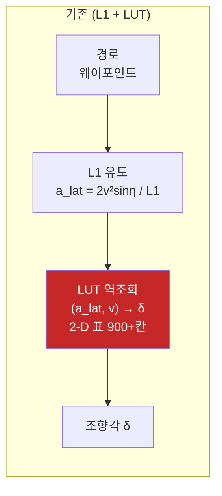
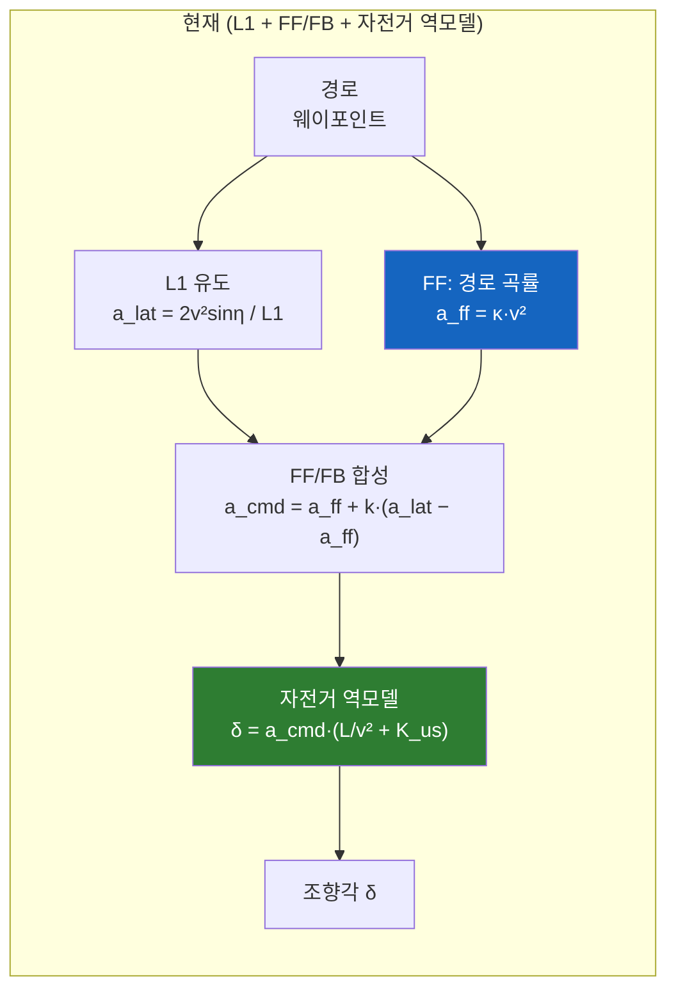

# f1tenth_control — 조향 생성 메커니즘 변경 (2026-08-17)

> **한 줄 요약: L1 유도는 그대로다. 바뀐 건 마지막 한 단계 — "목표 횡가속도 → 조향각" 변환뿐이다.**
>
> Steering Lookup Table(LUT)을 걷어내고 **정상상태 자전거 역모델 + FF/FB 분리**로 교체했다.

이 문서는 팀원용 변경 요약이다. 상세 설계·실측 근거·지뢰밭은 [`CLAUDE.md`](CLAUDE.md)의
②-p / ②-q / ②-r 절에 있다.

---

## 1. 무엇이 바뀌었나





**L1 유도법칙, 룩어헤드 계산, 속도 프로파일, 곡률 사전감속, 조향 트림 보상은 하나도 안 바뀌었다.**

---

## 2. 왜 바꿨나 — LUT의 조향 천장이 무너져 있었다

LUT는 그립 피크 이후가 NaN이었고, 표를 만드는 `build_columns()`가 **첫 NaN에서 열을 끊었다.**
그 결과 **속도마다 조향 천장이 제각각**이 됐다:

| v [m/s] | 3.0 | 3.5 | 4.0 | 4.5 | **5.0** | **5.5** | **6.0** |
|---|---|---|---|---|---|---|---|
| LUT 조향 천장 [rad] | 0.31 | 0.36 | 0.31 | 0.28 | **0.15** | **0.13** | **0.12** |
| 사전감속이 가정한 δ_avail | 0.331 | 0.331 | 0.331 | 0.331 | 0.331 | 0.331 | 0.331 |
| 사전감속이 요구(κ=0.548) | 0.25 | 0.28 | 0.30 | 0.33 | 0.37 | 0.41 | 0.46 |
| | OK | OK | OK | −3% | **−52%** | **−62%** | **−69%** |

즉 **컨트롤러 안에 서로 모순되는 차량 모델이 둘 있었다.**
종방향(사전감속)은 해석적 자전거 모델로 "이 속도면 꺾을 수 있다"고 허용했는데,
횡방향(LUT)은 그 속도에서 구조적으로 그만큼 못 꺾었다.

### 이건 잠재 폭탄이 아니라 상시 발동 중이었다

조향 사이클 중 **LUT 천장에 붙어 있던 비율**:

| bag | 천장 구속 | 비고 |
|---|---|---|
| `run_0814_214351` | **37.2%** | 7.73 m/s 최고 기록 (4~6 m/s 구간만 보면 **45~46%**) |
| `run_0814_214021` | **34.1%** | 7.71 m/s 최고 기록 |
| `run_0816_225916` | 18.7% | 4.5 m/s 캡 크래시 |

> 🔴 **최고속 기록 주행이 천장 구속이 가장 심했다.** 잘 돈 게 아니라 LUT가 허용하는 만큼만
> 꺾으며 밀린 채 버틴 것이고, 마진이 남은 트랙이라 안 박았을 뿐이다.

### LUT가 정작 값을 못 했다는 근거

- 각 속도 열을 자전거모델로 회귀하면 **함의하는 K_us가 속도 따라 4.6배 요동**한다
  (2 m/s 0.0029 → 4 m/s 0.0135 → 6 m/s 0.0069). 물성이라 대체로 일정해야 하고 실측은
  0.0135~0.0153 — **보정 노이즈를 물리인 척 담고 있었다.**
- 레이싱 속도대 R² 0.82~0.91, 최대잔차 25~32%.
- 반대로 R²=0.9999인 저속 구간은 `prior_weight 1e9`로 보존된 **원본 Pacejka 부분**인데,
  **거기선 자전거모델과 정확히 같다.** → 정확한 곳에선 2-파라미터 모델과 동일, 나머지는 틀림.

---

## 3. 새 조향 생성 — 정상상태 자전거 역모델

$$\delta = a_{lat}\left(\frac{L}{v^2} + K_{us}\right)$$

`control_map_node.cpp`의 **조향 권한 캡이 이미 쓰고 있던 바로 그 모델**이다 → 모델 일원화.

L1 유도법칙 $a_{lat} = 2v^2\sin\eta / L_1$ 을 대입하면:

$$\delta = \underbrace{\frac{2L\sin\eta}{L_1}}_{\text{pure pursuit}} + \underbrace{\frac{2K_{us}v^2\sin\eta}{L_1}}_{\text{언더스티어 보정}}$$

> 🔑 **$v^2$이 첫 항에서 소거된다.** $v\to0$에서 게인이 폭발하지 않고 pure pursuit 기하로
> 수렴한다 — 예전 "정지 상태에서 조향이 풀락에 붙던" 버그(CLAUDE.md ②-f)가
> **구조적으로 발생 불가능**해졌다.

### 오프라인 검증 (같은 bag·같은 순간에 두 모델 비교)

| 속도대 [m/s] | LUT 중앙 | bicycle 중앙 | 차이 | 그때 천장구속 |
|---|---|---|---|---|
| 3~4 | 0.169 | 0.207 | **+22.0%** | 30.1% |
| 4~5 | 0.152 | 0.188 | **+24.2%** | 45.7% |
| 5~6 | 0.094 | 0.131 | **+39.9%** | 46.4% |
| 6~9 | 0.030 | 0.051 | **+68.6%** | 21.0% |

- bicycle의 조향 **p95는 오히려 더 낮다**(0.243 vs LUT 0.307) — LUT는 천장에 반복적으로
  때려박고, bicycle은 더 고르게 분포한다. 풀락 초과는 두 모델 다 0%.
- 도구: [`tools/bag_analyzer/compare_steering_model.py`](tools/bag_analyzer/compare_steering_model.py)

---

## 4. 새로 생긴 것 — FF/FB 분리

```
a_ff  = κ_path · v²                        ← 경로 자체가 요구하는 몫 (오차가 없어도 작동)
a_fb  = a_lat − a_ff                       ← L1이 만든 순수 보정분
a_cmd = a_ff + steering_fb_gain · a_fb     → clamp(±mla) → 자전거 역모델
```

> 🔑 **모델이 선형이라 `steering_fb_gain = 1.0`이면 분리 전과 수학적으로 완전히 동일하다.**
> `a_ff + 1.0·(a_lat − a_ff) = a_lat`. **현재 기본값이 1.0**이라 안전한 출발점이고,
> 내려가며 A/B 할 수 있는 연속 노브다.

**왜 이게 중요한가**: 게인을 내리면 경로 추종은 FF가, 오차 보정은 L1이 맡는다.
→ **L1을 크게 유지한 채(= 감쇠 여유 = 횡진동 없음) 곡선 추종 정확도를 올릴 수 있다.**
②-m에서 `l1_offset` 0.70→0.4가 횡진동으로 기각됐던 그 트레이드오프가 여기서 분리된다.

실측상 FF 기여도 `a_ff/a_lat` 중앙 **0.79~0.96** — 경로 곡률이 조향 명령의 대부분을 설명한다.
그리고 **FF는 MCL과 무관하다**(경로 곡률만 씀). MCL 노이즈는 FB 항으로만 들어온다.

---

## 5. 타이어 비선형성은 누가 담나 — 자이로가 담는다

"LUT를 지우면 타이어 비선형성을 못 담는 것 아닌가"에 대한 답.

**비선형성은 실재한다.** 자이로로 직접 측정된다 — 요레이트 결손비 $|\dot\psi_{meas}|/|\dot\psi_{ref}|$:

| 조향각 δ [rad] | 0.05~0.12 | 0.12~0.20 | 0.20~0.28 | 0.28~0.36 | 0.36~0.45 |
|---|---|---|---|---|---|
| `run_0814_214351` | 0.75 | 1.09 | 0.89 | 0.84 | **0.71** |
| `run_0814_214021` | 0.96 | 1.13 | 0.90 | 0.83 | **0.76** |
| `run_0813_154525` | 0.55 | 1.21 | 1.00 | 0.82 | **0.68** |

**세 bag 모두 δ 0.12~0.20에서 정점을 찍고 풀락으로 갈수록 0.68~0.76까지 단조 감소**한다
= 풀락에서 선형모델이 약속한 요레이트의 70%밖에 못 낸다. 이게 타이어 포화다.

이걸 **1차원 곡선** $K_{us}(|a_{lat}|)$ 로 넣었다:

$$\delta = a_{lat}\left(\frac{L}{v^2} + K_{us}(|a_{lat}|)\right)$$

| a_lat [m/s²] | 4~5 | 5~6 | 6~7 | 7~8 | 8~10 |
|---|---|---|---|---|---|
| 실측 K_us (구 프런트) | 0.0127 | 0.0128 | **0.0168** | **0.0197** | 0.0185 |

### LUT보다 나은 이유가 구조적이다

| | 구 LUT | K_us(a_lat) 곡선 |
|---|---|---|
| 차원 | 2-D (a_lat × v), 900+ 칸 | **1-D, 4점** |
| 동정 가능성 | 셀 대부분이 미관측 → 보간 아티팩트 | 몇 랩이면 전 빈이 찬다 |
| 정의역 구멍 | **NaN 절단으로 속도별 천장 붕괴** | 함수라 **항상 정의됨** |
| 단조성 | 없음 → 그립피크 이후 접힘 | **단조 비감소 강제** |
| 센서 | 오프라인 Pacejka 피팅 | **자이로만** (MCL 무관) |
| 역해 | 표 역조회 | 요구 a_lat에서 읽으므로 **반복 불필요** |

> 🔴 **기본 `understeer_curve_enable:=false` = 관측 전용.** 빈별 학습과 로그는 항상 돌지만
> 조향은 스칼라를 쓴다. 켜도 `understeer_curve_min_samples`(300) 미만인 빈은
> 스칼라로 폴백하므로 학습이 덜 된 하중대에선 **정확히 구 거동**이다.

---

## 6. ⚠️ 같이 고친 버그 2개

### ① safe stop에서 바퀴가 곧게 펴졌다 (LUT 시절부터 있던 기존 결함)

`local_planning`은 safe stop과 제동경로 말단에서 `vx_mps = 0.0`을 발행한다
(`raceline_spline_planner.cpp:1190, 1238, 1330, 2272`). 그 0이 조향용 속도로 그대로 들어가
`a_lat = 0` → **조향 0**. 차는 아직 4 m/s로 굴러가는 중인데 바퀴가 곧게 펴진다
= **코너 한복판 비상정지가 바깥 벽으로의 직진**이 된다.

**수정**: `steering_speed_floor`(기본 0.5 m/s). 종방향은 0을 그대로 따르되(정지는 planning의
권한) 조향만 살린다. 자전거 역모델에서 v²이 소거되므로 **바닥값이 얼마든 pure pursuit
기하는 그대로 나온다.**

### ② FF가 부호 없는 곡률을 읽고 있었다 (신규 코드의 버그)

`smooth_curvature()`는 `std::abs(curvature)`를 평활한다 — 곡률 사전감속은 크기만 쓰니까
원래 그게 맞다. 그런데 `a_ff = κ·v²`는 **부호가 필요하다.**

> 🔑 `steering_fb_gain = 1.0`(기본)에서는 `a_ff`가 소거돼서 **이 버그가 안 보인다.**
> **`steering_fb_gain < 1.0`으로 내리는 순간** 터진다 — k=0.5, 우코너 `a_lat = −6`이면
> `a_cmd`가 −6이 아니라 **−0.25**. 조향이 거의 사라진다.

**수정**: `Waypoint::smoothed_curvature_signed` 신설. 부호 규약은 실측으로 확인했다
(bag 3개, κ↔조향 부호일치 **92~99%**, 상관 +0.72~+0.86).

---

## 7. 파라미터

### 신규

| 파라미터 | 기본값 | 설명 |
|---|---|---|
| `steering_fb_gain` | **1.0** | FF/FB 분리 게인. **1.0 = 분리 전과 수학적 동일** |
| `curvature_ff_preview` | 0.0 | FF가 곡률을 읽을 전방 거리 [m]. 0 = 최근접점 |
| `understeer_gradient_adapt_gain` | **0.0** | K_us 온라인 적응. **0 = 관측 전용** |
| `understeer_adapt_min_lat_acc` | 3.0 | K_us 학습 게이트 [m/s²] (코너 전용) |
| `understeer_curve_enable` | **false** | K_us(a_lat) 곡선 사용. **false = 관측 전용** |
| `understeer_curve_min_samples` | 300 | 빈을 쓰기까지 필요한 샘플 수 (미달 시 스칼라 폴백) |
| `steering_speed_floor` | **0.5** | 조향용 속도 하한 [m/s]. 0 = 구 거동 |

### 제거

| 파라미터 | 사유 |
|---|---|
| `lookup_table_file` | LUT 경로 자체가 없어짐 |
| `curvature_ff_blend` | `atan(L·κ)`뿐이라 언더스티어 항이 빠져 있었고, 가중평균이라 **켤수록 조향이 줄었다**. `a_ff`가 완전한 형태로 대체 |
| `steering_model` | 런타임 스위치 불필요 (경로가 하나뿐) |

### 삭제된 파일

- `include/f1tenth_control/steering_lookup_table.hpp` (239줄)
- `control_code/LUT_calibrated.csv`
- CMake의 share/cfg 설치 규칙

> ℹ️ [`tools/lut_calibrator/`](tools/lut_calibrator/)(오프라인 보정 웹앱)는 **남겨뒀다** —
> 런타임 경로가 아니고, 되살릴 판단이 서면 필요하다. 현재는 소비처가 없다.

---

## 8. 실차 첫 주행 절차 (필수)

> 🔴 **구 LUT 대비 조향이 12~36% 커진다(고속일수록). 반드시 저속부터.**

```bash
# [1판] 저속 셰이크다운 — 4랩 이상 (MCL 구간별 분석도 이 bag으로 겸한다)
ros2 launch f1tenth_control control_real.launch.py \
    max_speed:=3.5 max_lateral_accel:=5 min_speed:=1.5

# analyze_bag.py CRITICAL 0건 확인 후에만 다음 단계로
python3 tools/bag_analyzer/analyze_bag.py <bag>

# [2판] 정상 페이스 — 그립 포락선 + K_us 곡선 데이터 수집
ros2 launch f1tenth_control control_real.launch.py
```

### 상태 로그 읽는 법

```
| FF κ +0.412 a_ff +5.83 / a_cmd +5.83 | K_us 0.01423(관측)(n=812)
| 곡선(관측)[0.0140/0.0152/0.0171/0.0189 n=210/420/380/95] | 슬립 0.84(peak 2.10)
```

| 항목 | 보는 법 |
|---|---|
| `FF κ` | **부호가 좌우코너에 따라 바뀌어야 한다.** 항상 +면 ②번 버그 재발 |
| `a_ff` / `a_cmd` | `steering_fb_gain=1.0`이면 `a_cmd`는 L1 값과 같다 |
| `K_us …(관측)` | 수렴하면 0.0135~0.0153 부근이어야 한다 |
| `곡선[…]` | 4개 빈이 **오름차순**이면 포화가 관측된 것. `n`이 300 넘어야 쓸 수 있다 |
| `슬립 x.xx` | 자이로↔가속도계 잔차. 준정상 0.4~1.5 / 스핀 1.1~4.3 (**진단 전용**) |

### 분석 도구

```bash
python3 tools/bag_analyzer/analyze_grip_envelope.py   <bag...>   # 그립 한계 + K_us 곡선
python3 tools/bag_analyzer/compare_steering_model.py  <bag...>   # LUT vs bicycle 비교
python3 tools/bag_analyzer/analyze_mcl_quality.py     <bag...>   # MCL 구간별 정확도
python3 tools/bag_analyzer/analyze_local_path_jump.py <bag...>   # Frenet s → 경로 점프 검사
```

---

## 9. 롤백

LUT 구현 전체가 커밋 **`0d16173`**("sync: 08/16")에 그대로 있다.

```bash
git show 0d16173:include/f1tenth_control/steering_lookup_table.hpp
git show 0d16173:control_code/LUT_calibrated.csv
```

> ⚠️ **되살릴 유일한 정당한 근거는 "1-D 모델로는 못 담는 비선형성"**, 즉 같은 `a_lat`에서도
> 속도에 따라 필요 조향이 다르다는 새 실측이다(진짜 2-D 효과).
> **"비선형성이 있어서"는 근거가 아니다** — 그건 §5의 `K_us(a_lat)` 곡선이 담는다.
>
> 되살린다면 `--fill-nan-count`는 필수다. 없으면 §2의 천장 붕괴가 그대로 재발한다
> (08-11 벽 접촉의 원인).

---

## 10. 참고 — 그립 여유는 아직 많다

자이로 실측(준정상상태 + 추종 게이트 통과분):

| bag | a_lat p95 | max | 자이로/가속도계 스케일 |
|---|---|---|---|
| `run_0813_154525` | 7.59 | **8.91** | **1.000** ← 가장 신뢰 가능 |
| `run_0814_214021` | 9.39 | 12.52 | 0.922 |
| `run_0816_230340` | 6.25 | 7.58 | 1.030 |

**현재 `max_lateral_accel = 7.0`은 실측 그립보다 최소 27% 보수적이다.**
다만 이걸 올리는 건 조향 모델 검증이 끝난 뒤의 이야기다.
