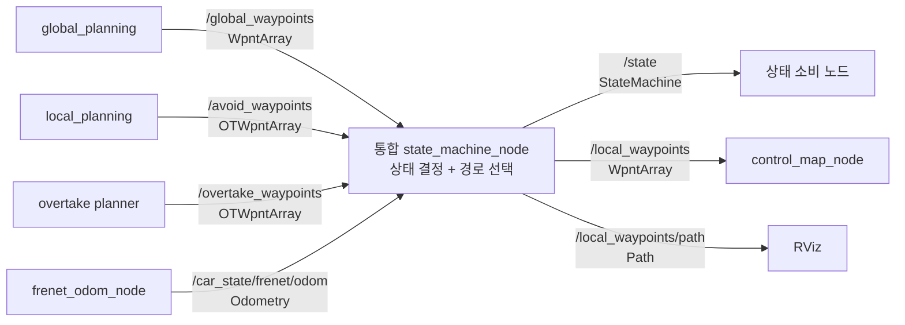
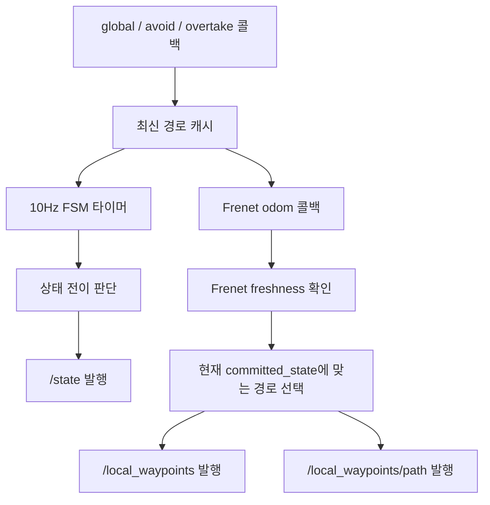

# state_machine과 wpnt_publisher 통합 제안서

> 이 문서는 과거 OVERTAKE 경로 기반 설계 기록입니다. 현재 구현에서는 상태 2가 `CRUISE`로
> 대체됐으며, `/opp_obs.is_interfering`으로 진입하고 `/global_waypoints`를 선택합니다. 최신 동작은
> `state_machine_node.md`를 기준으로 확인하세요.

## 1. 문서 목적

이 문서는 현재 분리되어 있는 `state_machine_node`와 `wpnt_publisher`의 책임을
`state_machine_node` 하나로 통합하는 방안을 정의한다.

통합 노드는 하나의 프로세스에서 다음 작업을 수행한다.

1. 글로벌, 회피, 추월 경로와 Frenet odometry를 수신한다.
2. FSM을 이용해 현재 주행 상태를 결정하고 `/state`를 발행한다 (10 Hz 타이머).
3. Frenet odometry 수신 이벤트마다 committed 상태에 맞는 waypoint 소스를 선택해
   `/local_waypoints`, `/local_waypoints/path`를 발행한다.

이 문서는 구현 전 설계 제안서이며, 현재 코드를 변경하지 않는다.

## 2. 통합 배경

현재 `state_machine_node`는 주행 상태를 결정해 `/state`로 발행한다.
`wpnt_publisher`는 `/state`를 다시 구독한 후 같은 경로 입력 중 하나를 선택해
`/local_waypoints`로 발행한다.

```text
state_machine_node
  └─ 상태 결정 → /state 발행
                         ↓
wpnt_publisher
  └─ /state 수신 → 경로 선택 → /local_waypoints 발행
```

두 노드는 다음 입력을 중복 구독한다.

- `/global_waypoints`
- `/avoid_waypoints`
- `/overtake_waypoints`
- `/car_state/frenet/odom`

이 구조에서는 상태 결정과 경로 선택 사이에 토픽 전달 지연이 존재하며, 두 노드가
서로 다른 freshness 정책으로 같은 경로를 판단할 수 있다. 통합 후에는 하나의 노드가
상태 결정과 경로 선택을 연속해서 수행하므로 판단 기준을 일관되게 유지할 수 있다.

## 3. 목표 파이프라인



발행 트리거는 두 갈래로 분리한다 (결정 사항).

- `/state`: 기존 `publish_rate_hz`(10 Hz) 타이머에서 FSM 상태 전이를 판단하고 발행한다.
- `/local_waypoints`, `/local_waypoints/path`: `/car_state/frenet/odom` 수신 이벤트에서만
  발행한다.



경로 발행에 10 Hz 타이머를 쓰지 않는 이유는 다음과 같다.

1. **stale Frenet 재발행 방지.** 타이머 구동이면 Frenet odometry가 중단돼도 마지막
   index로 새 timestamp의 경로를 계속 만들어 하류 `control_map_node`의 local path
   freshness 검사를 통과시킨다. `has_fresh_frenet()` 게이트를 넣어도 timeout(기본
   0.5초) 동안은 오래된 index가 반복 발행된다. 이벤트 구동에서는 Frenet 메시지가
   끊기는 순간 local 경로 발행도 자연스럽게 중단된다.
2. **타이머 주기를 odom 이상으로 높여도 해결되지 않는다.** 예를 들어 Frenet이 50 Hz,
   경로 타이머가 100 Hz면 새 데이터를 더 빨리 처리하는 것이 아니라 같은 Frenet
   데이터를 두 번씩 중복 발행할 뿐이다.
3. **기존 출력률 보존.** 현재 `wpnt_publisher`는 `onOdom()`에서 경로를 발행한다. 이를
   그대로 통합하면 경로 출력률이 유효한 Frenet odometry 입력률과 동일하게 유지된다.

## 4. ROS 2 인터페이스

### 4.1 구독 토픽

| 토픽 | 메시지 | 역할 |
|---|---|---|
| `/global_waypoints` | `f110_msgs/msg/WpntArray` | 기본 글로벌 주행 경로 |
| `/avoid_waypoints` | `f110_msgs/msg/OTWpntArray` | 정적 장애물 회피 경로 |
| `/overtake_waypoints` | `f110_msgs/msg/OTWpntArray` | 동적 상대차 추월 경로 |
| `/car_state/frenet/odom` | `nav_msgs/msg/Odometry` | Frenet 위치와 최근접 글로벌 segment index |

### 4.2 발행 토픽

| 토픽 | 메시지 | 역할 |
|---|---|---|
| `/state` | `f110_msgs/msg/StateMachine` | FSM이 결정한 주행 상태 |
| `/local_waypoints` | `f110_msgs/msg/WpntArray` | 제어기가 추종할 최종 경로 |
| `/local_waypoints/path` | `nav_msgs/msg/Path` | RViz 시각화용 최종 경로 |

`/local_waypoints/path`는 제어 입력은 아니지만 기존 RViz 및 디버깅 인터페이스를
유지하기 위해 통합 노드에서도 계속 발행한다.

### 4.3 QoS

권장 QoS는 기존 노드와 동일하다.

| 인터페이스 | QoS |
|---|---|
| `/global_waypoints` 구독 | `KeepLast(1)`, `Reliable`, `TransientLocal` |
| `/state` 발행 | `KeepLast(1)`, `Reliable`, `TransientLocal` |
| 회피·추월·Frenet 구독 | `KeepLast(1)`, `Reliable`, `Volatile` |
| `/local_waypoints` 발행 | `KeepLast(1)`, `Reliable`, `Volatile` |
| `/local_waypoints/path` 발행 | `KeepLast(1)`, `Reliable`, `Volatile` |

## 5. 상태와 경로 선택 규칙

| 결정된 상태 | 유효한 입력 | 출력 경로 |
|---|---|---|
| `STATE_GLOBAL` | 글로벌 경로와 정상 Frenet index | 글로벌 경로의 전방 구간 |
| `STATE_AVOID` | 최신 non-empty `/avoid_waypoints` 유지 중 | 회피 경로 |
| `STATE_OVERTAKE` | hold 규칙으로 유지 중인 non-empty `/overtake_waypoints` | 추월 경로 |
| `STATE_AVOID` | 회피 경로 없음(빈 메시지로 무효화됨) | 설정된 fallback 정책 |
| `STATE_OVERTAKE` | 추월 경로 없음(hold 경과 후 빈 메시지로 해제됨) | 설정된 fallback 정책 |

Avoid 경로의 유효성은 기존 `state_machine`의 의미론을 따른다 (결정 사항). 시간 기반
stale 판정을 두지 않고, 빈 메시지를 받으면 즉시 무효화하며, 메시지 수신이 끊기면
마지막 non-empty 경로를 계속 유효한 것으로 본다. 기존 `wpnt_publisher`의 0.75초 TTL은
채택하지 않는다.

Overtake 경로의 유효성은 기존 `wpnt_publisher`의 hold 의미론을 따른다 (결정 사항).
시간 기반 TTL이 아니라 다음 규칙으로 동작한다.

- 첫 non-empty 수신 시 경로를 저장하고 hold(`overtake_hold_duration_sec`, 기본 2초)를
  시작한다.
- hold 중에 수신된 새 non-empty 메시지는 무시한다 (경로 고정).
- hold 경과 후 non-empty 메시지가 오면 경로를 갱신하고 hold를 재시작한다.
- 빈 메시지는 hold 경과 후에 수신된 경우에만 경로를 무효화한다 (hold 중 빈 메시지는
  무시).
- 시간 경과만으로는 만료되지 않는다. 해제는 반드시 빈 메시지 수신으로만 이뤄진다.

기존 `overtake_stale_timeout_sec` TTL은 폐기한다 (운영 YAML의 100초 설정이 이미
사실상 TTL 비활성화를 의도했으며, hold 의미론이 원래 `wpnt_publisher` 동작이다).

1차 통합에서는 기존 `wpnt_publisher`와 같은 `global_fallback` 정책을 기본값으로
사용해 동작 호환성을 유지한다.

```yaml
invalid_local_path_policy: "global_fallback"
```

향후 다음 정책을 추가할 수 있다.

- `global_fallback`: 글로벌 전방 경로를 발행한다.
- `publish_empty`: 빈 `/local_waypoints`를 발행해 하류 제어기의 fallback을 유도한다.
- `hold_last`: 마지막 정상 local 경로를 제한된 시간 동안 유지한다.
- `stop`: 별도의 안전정지 상태와 메시지 규약이 정의된 뒤 사용한다.

`global_fallback`을 사용하면 `/state`는 `STATE_AVOID`이지만 `/local_waypoints`는
글로벌 경로인 순간이 생길 수 있다. 이는 기존 동작을 보존하기 위한 선택이며,
안전정지 정책과 함께 별도 개선 대상으로 관리해야 한다.

## 6. 발행 구조: 상태 타이머와 경로 이벤트의 분리

역할을 두 실행 경로로 명확하게 분리한다.

- **10 Hz 타이머**: FSM 상태 판단 및 `/state` heartbeat 발행
- **Frenet odom 콜백**: 현재 committed 상태에 맞는 waypoint 발행

### 6.1 10 Hz 상태 타이머

```cpp
void StateMachineNode::publish_state_cycle()
{
  const uint8_t state = resolve_requested_state();

  f110_msgs::msg::StateMachine output;
  output.header.stamp = now();
  output.header.frame_id = frame_id_;
  output.state = state;

  state_pub_->publish(output);
}
```

### 6.2 Frenet odometry 콜백

```cpp
void StateMachineNode::on_frenet_odom(
  const nav_msgs::msg::Odometry::SharedPtr msg)
{
  has_frenet_ = true;
  frenet_odom_msg_ = msg;
  last_frenet_time_ = now();

  // 현재 FSM이 이미 결정해 둔 상태로 경로를 선택한다.
  publish_selected_waypoints(committed_state_);
}
```

`resolve_requested_state()`는 odom 콜백에서 호출하지 않는다. 호출하면 기존 10 Hz였던
FSM 평가 주기가 odometry 입력률로 바뀌어 상태 전이 의미(M-of-N 확인, `enter_global_sec`
지속시간 판정 등)가 달라진다.

### 6.3 전 소스 공통 Frenet freshness 게이트

경로 발행 함수 가장 바깥에 GLOBAL·AVOID·OVERTAKE 모든 출력에 공통 적용되는 게이트를
둔다.

```cpp
void StateMachineNode::publish_selected_waypoints(uint8_t state)
{
  // 움직이는 차량 위치 정보는 반드시 fresh해야 한다 (전 소스 공통).
  if (!has_fresh_frenet()) {
    RCLCPP_WARN_THROTTLE(
      get_logger(), *get_clock(), 2000,
      "Frenet odometry is stale; local waypoint publication stopped.");
    return;
  }

  // 정적 기준 경로는 시간 대신 유효성 검사 (§12 참고).
  if (!has_valid_global()) {
    return;
  }

  const rclcpp::Time stamp = now();
  const auto waypoints = select_waypoints(state, stamp);
  if (!waypoints.has_value()) {
    return;
  }

  local_waypoints_pub_->publish(waypoints.value());
  local_path_pub_->publish(build_path(waypoints.value()));
}
```

이 함수는 `on_frenet_odom()` 직후 호출되므로 일반적으로 freshness 검사를 항상
통과한다. 그래도 공통 함수에 게이트를 두면 향후 다른 경로에서 호출하거나 구조가
변경되더라도 오래된 Frenet 정보로 경로를 발행하지 않는다.

### 6.4 상태 전환 시 경로 발행

10 Hz 타이머에서 상태가 바뀌었다고 캐시된 마지막 Frenet 데이터로 즉시 경로를
재발행하지 않는다. 마지막 Frenet 데이터가 오래됐을 수 있기 때문이다. 대신 다음
Frenet 메시지를 기다린다.

```text
10Hz timer:
  STATE_GLOBAL → STATE_AVOID
  /state = AVOID 발행

다음 Frenet odom 도착:
  committed_state = AVOID 확인
  /avoid_waypoints를 /local_waypoints로 발행
```

전환 지연은 최대 Frenet odometry 한 주기다 (50 Hz면 약 20 ms). 기존 `wpnt_publisher`도
`/state`를 받은 뒤 다음 odometry 콜백에서 경로를 전환하므로 기존 동작과 같다.

`/state`와 `/local_waypoints`는 서로 다른 트리거에서 발행되므로 소비자는 두 토픽의
수신 순서에 의존하지 않아야 한다.

## 7. 상태 메시지

`/state` 메시지 구성은 §6.1의 `publish_state_cycle()`에서 수행한다.
FSM 상태 상수는 기존 `f110_msgs/msg/StateMachine`을 유지한다.

```text
STATE_GLOBAL   = 0
STATE_AVOID    = 1
STATE_OVERTAKE = 2
```

## 8. 상태별 waypoint 선택

```cpp
std::optional<f110_msgs::msg::WpntArray>
StateMachineNode::select_waypoints(
  uint8_t state,
  const rclcpp::Time & stamp)
{
  if (state == f110_msgs::msg::StateMachine::STATE_OVERTAKE &&
    has_overtake_wpnts())
  {
    return convert_ot_waypoints(*overtake_wpnts_msg_, stamp);
  }

  if (state == f110_msgs::msg::StateMachine::STATE_AVOID &&
    has_avoid_wpnts())
  {
    return convert_ot_waypoints(*avoid_wpnts_msg_, stamp);
  }

  // STATE_GLOBAL 또는 유효한 상태 전용 경로가 없는 경우다.
  return build_global_waypoints(stamp);
}
```

Frenet freshness와 글로벌 유효성 게이트는 이 함수 바깥의
`publish_selected_waypoints()`(§6.3)에서 공통 적용한다. 글로벌 index
(`child_frame_id`) 유효성 검사는 `build_global_waypoints()` 내부에서만 수행한다.
AVOID/OVERTAKE도 Frenet 메시지 도착을 발행 트리거로 사용하지만, 기존
`wpnt_publisher`와 마찬가지로 해당 경로를 선택할 때 `child_frame_id`까지 요구하지는
않는다.

상태 진입·복귀 판단과 실제 경로 선택은 반드시 같은 유효성 함수를 사용한다. 예를 들어
FSM이 `has_avoid_wpnts()`(non-empty latch)를 기준으로 AVOID 경로의 유효성을 판단한다면
경로 선택도 동일한 함수를 사용해야 한다. 단, 다음 세 조건은 서로 다른 역할이므로
하나의 함수로 뭉개지 않고 결합 조건을 명시해 관리한다.

- M-of-N 수신 확인(`local_path_confirmed`): 경로 검출 안정성 (상태 진입 게이트)
- 유효성 판정(`has_avoid_wpnts` / `has_overtake_wpnts`): 경로 사용 가능 여부
- `enter_to_global`: 실제 합류 기하 판단 (GLOBAL 복귀 게이트)

## 9. 글로벌 경로 추출

`frenet_odom_node`는 글로벌 경로의 최근접 segment index를 `Odometry.child_frame_id`에
문자열로 저장한다.

```cpp
output.child_frame_id = std::to_string(conversion.segment_index);
```

통합 노드는 이 값을 정수로 변환하고 최근접점의 다음 점부터 `waypoint_num`개를
선택한다.

```cpp
std::optional<f110_msgs::msg::WpntArray>
StateMachineNode::build_global_waypoints(const rclcpp::Time & stamp)
{
  if (!global_wpnts_msg_ || global_wpnts_msg_->wpnts.empty() ||
    !frenet_odom_msg_)
  {
    return std::nullopt;
  }

  const auto index = parse_waypoint_index(
    frenet_odom_msg_->child_frame_id);
  if (!index.has_value()) {
    RCLCPP_WARN_THROTTLE(
      get_logger(), *get_clock(), 2000,
      "Invalid Frenet child_frame_id: '%s'",
      frenet_odom_msg_->child_frame_id.c_str());
    return std::nullopt;
  }

  const int total = static_cast<int>(global_wpnts_msg_->wpnts.size());
  const int closest_index = index.value();
  if (closest_index < 0 || closest_index >= total) {
    RCLCPP_WARN_THROTTLE(
      get_logger(), *get_clock(), 2000,
      "Global waypoint index out of range: %d (0..%d)",
      closest_index, total - 1);
    return std::nullopt;
  }

  const int start = (closest_index + 1) % total;
  const int count = std::min(waypoint_num_, total);

  f110_msgs::msg::WpntArray output;
  output.header.stamp = stamp;
  output.header.frame_id = global_wpnts_msg_->header.frame_id.empty() ?
    frame_id_ : global_wpnts_msg_->header.frame_id;
  output.wpnts.reserve(static_cast<std::size_t>(count));

  for (int offset = 0; offset < count; ++offset) {
    const int global_index = (start + offset) % total;
    output.wpnts.push_back(global_wpnts_msg_->wpnts[global_index]);
  }

  return output;
}
```

`% total` 연산으로 트랙 끝에서 배열 처음으로 연결한다.

```text
글로벌 waypoint 개수: 100
최근접 index: 97
waypoint_num: 5

출력 index: 98 → 99 → 0 → 1 → 2
```

인덱스 문자열은 기존 `wpnt_publisher`와 동일하게 공백을 허용하고 숫자 이외의 문자가
있으면 거부한다.

```cpp
std::optional<int>
StateMachineNode::parse_waypoint_index(const std::string & value) const
{
  if (value.empty()) {
    return std::nullopt;
  }

  std::size_t begin = 0;
  std::size_t end = value.size();
  while (begin < end &&
    std::isspace(static_cast<unsigned char>(value[begin])))
  {
    ++begin;
  }
  while (end > begin &&
    std::isspace(static_cast<unsigned char>(value[end - 1])))
  {
    --end;
  }

  if (begin == end) {
    return std::nullopt;
  }

  const std::string trimmed = value.substr(begin, end - begin);
  for (const char character : trimmed) {
    if (!std::isdigit(static_cast<unsigned char>(character))) {
      return std::nullopt;
    }
  }

  try {
    return std::stoi(trimmed);
  } catch (const std::exception &) {
    return std::nullopt;
  }
}
```

## 10. 회피·추월 경로 변환

`/avoid_waypoints`와 `/overtake_waypoints`의 `OTWpntArray`를 제어기 입력인
`WpntArray`로 변환한다.

```cpp
f110_msgs::msg::WpntArray
StateMachineNode::convert_ot_waypoints(
  const f110_msgs::msg::OTWpntArray & source,
  const rclcpp::Time & stamp) const
{
  f110_msgs::msg::WpntArray output;
  output.header = source.header;
  output.header.stamp = stamp;

  if (output.header.frame_id.empty()) {
    output.header.frame_id = frame_id_;
  }

  output.wpnts = source.wpnts;
  return output;
}
```

`Wpnt` 배열의 다음 값은 그대로 유지된다.

- `s_m`, `d_m`
- `x_m`, `y_m`
- `d_left`, `d_right`
- `psi_rad`, `kappa_radpm`
- `vx_mps`, `ax_mps2`

다음 `OTWpntArray` 전용 메타데이터는 `WpntArray`에 대응 필드가 없어 최종 출력에서
제외된다.

- `last_switch_time`
- `side_switch`
- `ot_side`
- `ot_line`

### 10.1 `/avoid_waypoints` 형식 규약

`local_planning`(`raceline_spline_planner`)은 상황에 따라 두 가지 형식을 발행하며,
통합 노드는 둘 다 그대로 통과시켜야 한다.

- **일반 AVOID 경로**: ego → spline merge → global tail로 이어지는 **열린 세그먼트**
  (global raceline 기준 Frenet 좌표, tail은 d→0 수렴)
- **GLOBAL handoff 경로**: 합류 완료 후 상태 전환 확인을 위해 의도적으로 발행하는,
  현재 위치 기준으로 회전된 **전체 글로벌 폐루프**

통합 노드의 변환·발행 로직은 형식을 구분하지 않고 전달하며, 하류 `control_map_node`는
시작·끝점 간격으로 폐루프 여부를 자체 감지한다. `enter_to_global()`의 tail 판정은
세그먼트 형식을 전제하므로, handoff 폐루프 수신 구간의 복귀 판정 정확도는 기존
state_machine과 동일한 한계를 가진다.

## 11. RViz Path 변환

기존 `/local_waypoints/path` 인터페이스를 유지한다. 통합 과정에서 waypoint의
`psi_rad`를 quaternion으로 변환하면 기존 구현보다 진행 방향을 정확히 시각화할 수
있다.

```cpp
nav_msgs::msg::Path
StateMachineNode::build_path(
  const f110_msgs::msg::WpntArray & waypoints) const
{
  nav_msgs::msg::Path path;
  path.header = waypoints.header;
  path.poses.reserve(waypoints.wpnts.size());

  for (const auto & waypoint : waypoints.wpnts) {
    geometry_msgs::msg::PoseStamped pose;
    pose.header = path.header;
    pose.pose.position.x = waypoint.x_m;
    pose.pose.position.y = waypoint.y_m;
    pose.pose.position.z = 0.0;

    const double half_yaw = waypoint.psi_rad * 0.5;
    pose.pose.orientation.z = std::sin(half_yaw);
    pose.pose.orientation.w = std::cos(half_yaw);

    path.poses.push_back(std::move(pose));
  }

  return path;
}
```

## 12. Freshness 정책 통합

현재 두 노드의 freshness 기준은 서로 다르다.

| 경로 | 기존 `state_machine` | 기존 `wpnt_publisher` |
|---|---|---|
| Avoid | timeout 없이 최신 non-empty 여부 | 기본 0.75초 TTL |
| Overtake | YAML timeout 사용 (운영값 100초 = 사실상 무한) | 2초 hold, 메시지 기반 해제 (시간 만료 없음) |
| Global | 운영 YAML 2.0초 / 코드 선언 기본 0.5초 freshness | 한번 받으면 계속 사용 |
| Frenet odom | 기본 0.5초 freshness | 수신할 때마다 경로 발행 |

Global 행의 두 값이 다른 것은 `declare_parameter` 기본값(0.5초)과 헤더 멤버
초기값·운영 YAML(2.0초)이 현재 코드베이스에서 서로 불일치하기 때문이다.

통합 후에는 경로별로 판정 기준을 하나로 통일하되, 그 기준은 경로마다 다르다.

**Avoid: 기존 `state_machine` 의미론을 채택한다 (결정 사항).**
`wpnt_publisher`의 0.75초 TTL은 사용하지 않는다.

- 시간 기반 stale 판정 없음
- 빈 메시지를 받으면 즉시 무효
- 메시지 수신이 끊기면 마지막 non-empty 경로를 계속 유효로 판단

```cpp
bool StateMachineNode::has_avoid_wpnts() const
{
  // 기존 state_machine과 동일: 마지막 수신 메시지의 non-empty 여부만 latch.
  return has_avoid_wpnts_ &&
    avoid_wpnts_msg_ != nullptr &&
    !avoid_wpnts_msg_->wpnts.empty();
}
```

이 선택으로 TTL 만료에 의한 AVOID 복귀 차단(경로가 stale이 되어
`evaluate_enter_to_global`이 영구히 false를 반환하는 교착)은 발생하지 않는다. 다만
기존과 동일하게, 회피 중 빈 `/avoid_waypoints`가 수신되면 복귀 판정이 차단되는 문제는
남아 있으며, 이는 통합과 별도의 local path failure policy 과제로 관리한다. failure
policy는 무조건적인 GLOBAL 강제 복귀가 아니라 bounded hold, zero-speed 경로, 명시적
fault/stop 상태 등을 포함해 별도로 설계한다.

**Overtake: 기존 `wpnt_publisher`의 hold 의미론을 채택한다 (결정 사항, §5 규칙 참고).**
`overtake_stale_timeout_sec` TTL은 제거하고, hold 로직을 수신 콜백에 구현한다.
M-of-N 진입 확인용 history 갱신은 hold와 무관하게 모든 수신에 대해 수행한다.

```cpp
void StateMachineNode::on_overtake_wpnts(
  const f110_msgs::msg::OTWpntArray::SharedPtr msg)
{
  const auto current_time = now();
  const bool non_empty = (msg != nullptr) && !msg->wpnts.empty();

  // M-of-N 진입 게이트용 수신 이력은 hold와 무관하게 항상 갱신한다.
  overtake_path_history_.push_back(non_empty);
  while (static_cast<int64_t>(overtake_path_history_.size()) >
    local_path_confirmation_window_size_)
  {
    overtake_path_history_.pop_front();
  }

  const bool hold_elapsed = !has_overtake_wpnts_ ||
    (current_time - last_overtake_update_time_).seconds() >=
    overtake_hold_duration_sec_;

  if (non_empty) {
    // hold 중에는 새 non-empty 경로도 무시해 경로를 고정한다.
    if (hold_elapsed) {
      overtake_wpnts_msg_ = msg;
      has_overtake_wpnts_ = true;
      last_overtake_update_time_ = current_time;
    }
  } else {
    // 빈 메시지도 hold가 지나야 무효화한다. 시간 경과만으로는 만료되지 않는다.
    if (has_overtake_wpnts_ && hold_elapsed) {
      has_overtake_wpnts_ = false;
    }
  }
}

bool StateMachineNode::has_overtake_wpnts() const
{
  return has_overtake_wpnts_ &&
    overtake_wpnts_msg_ != nullptr &&
    !overtake_wpnts_msg_->wpnts.empty();
}
```

**Global: 정적 경로로 해석한다 (결정 사항).** 시간 기반 stale 판정을 제거하고,
마지막으로 검증된 non-empty 글로벌 경로를 계속 사용한다. 근거는 다음과 같다.

1. 글로벌 경로는 실시간 센서 데이터가 아니라 JSON/CSV에서 한 번 로드한 동일한
   raceline의 반복 발행이다 (`global_planning` 기본 2초).
2. `TransientLocal` QoS 자체가 지도·파라미터·정적 TF에 가까운 정적 데이터 의미를
   표현한다.
3. 현재 운영값은 발행 주기(2.0초)와 stale timeout(2.0초)이 동일해 약간의 scheduling
   지연만으로도 순간 stale 오판이 가능하다. 발행자 생존 여부와 경로 유효성은 서로
   다른 개념이다.
4. 차량 위치의 실질적 생존 신호는 Frenet odometry이며, freshness는 그쪽에 적용하는
   것이 맞다 (§6.3의 공통 게이트).

시간 대신 메시지 내용으로 유효성을 판단한다.

```cpp
bool StateMachineNode::has_valid_global() const
{
  return has_global_ &&
    global_wpnts_msg_ != nullptr &&
    global_wpnts_msg_->wpnts.size() >= 2U;
}

bool StateMachineNode::validate_global_waypoints(
  const f110_msgs::msg::WpntArray & message,
  std::string * error) const
{
  if (message.wpnts.size() < 2U) {
    *error = "global path requires at least two waypoints";
    return false;
  }

  for (std::size_t i = 0; i < message.wpnts.size(); ++i) {
    const auto & waypoint = message.wpnts[i];

    if (!std::isfinite(waypoint.s_m) ||
        !std::isfinite(waypoint.x_m) ||
        !std::isfinite(waypoint.y_m))
    {
      *error = "global path contains non-finite values";
      return false;
    }

    if (i > 0U && waypoint.s_m <= message.wpnts[i - 1U].s_m) {
      *error = "global s_m must be strictly increasing";
      return false;
    }
  }

  return true;
}

void StateMachineNode::on_global_waypoints(
  const f110_msgs::msg::WpntArray::SharedPtr msg)
{
  std::string error;

  if (msg == nullptr || !validate_global_waypoints(*msg, &error)) {
    has_global_ = false;
    global_wpnts_msg_.reset();
    RCLCPP_ERROR(get_logger(), "Rejected global waypoints: %s", error.c_str());
    return;
  }

  global_wpnts_msg_ = msg;
  has_global_ = true;
  last_global_receive_time_ = now();  // 진단 목적으로만 저장
}
```

동작 규칙은 다음과 같다.

| 입력 상황 | 결과 |
|---|---|
| 최초 정상 global 수신 | 저장하고 계속 사용 |
| 이후 메시지 중단 | 마지막 정상 경로 계속 사용 |
| 새로운 정상 global 수신 | 새 경로로 교체 |
| 빈 메시지 수신 | global 무효화 |
| 비정상 경로 수신 | global 무효화 및 오류 출력 |
| 노드 시작 후 global을 한 번도 못 받음 | local waypoint 발행 안 함 |

빈 메시지나 비정상 업데이트에서 마지막 정상 경로를 유지할 수도 있지만, 발행자가
명시적으로 경로를 비웠거나 잘못된 경로로 전환한 상황을 숨길 수 있으므로 무효화한다.

FSM의 GLOBAL 복귀 판단에서도 시간 freshness 대신 데이터 유효성을 사용한다.

```cpp
bool StateMachineNode::evaluate_enter_to_global(
  uint8_t eval_state,
  bool local_available,
  const f110_msgs::msg::OTWpntArray::SharedPtr & local_wpnts)
{
  if (!local_available || !has_fresh_frenet() || !has_valid_global()) {
    enter_global_ok_since_.reset();
    return false;
  }
  return enter_to_global(frenet_odom_msg_, local_wpnts, global_wpnts_msg_);
}
```

글로벌 발행 노드의 생존 감시가 필요하면 경로 사용을 차단하는 freshness가 아니라
경고용 진단으로만 처리한다. 이 경고는 경로 발행을 중단하지 않는다.

```cpp
// global_publisher_warn_timeout_sec: 5.0
if (has_global_ &&
    (now() - last_global_receive_time_).seconds() >
      global_publisher_warn_timeout_sec_)
{
  RCLCPP_WARN_THROTTLE(
    get_logger(), *get_clock(), 5000,
    "Global waypoint publisher is silent; "
    "continuing with the last validated static path.");
}
```

발행자 생존이 정말 운행 필수 조건이라면 반복되는 정적 데이터를 heartbeat로
이용하기보다 ROS lifecycle 상태나 `/diagnostics`를 별도로 사용하는 것이 명확하다.

**최종 규칙 요약**

```text
Global waypoint:
  시간 TTL 없음
  정상 non-empty 경로를 한번 받으면 계속 사용
  새 정상 경로가 들어오면 교체
  빈 경로나 비정상 경로가 들어오면 무효화

Avoid waypoint:
  시간 TTL 없음
  마지막 non-empty 경로 유지
  빈 메시지 수신 시 즉시 무효

Overtake waypoint:
  시간 TTL 없음
  hold(2초) 중 갱신 억제, hold 경과 후 갱신 허용
  hold 경과 후 빈 메시지로만 해제

Frenet odometry:
  이벤트 구동 (경로 발행 트리거)
  시간 freshness 적용
  stale이면 상태와 관계없이 /local_waypoints 발행 중단
```

AVOID 규칙과 Frenet 게이트를 결합한 동작은 다음과 같다.

| 조건 | 결과 |
|---|---|
| STATE_AVOID + 마지막 avoid가 non-empty + Frenet 수신 계속 | 캐시된 avoid 경로 계속 발행 |
| STATE_AVOID + avoid 발행자 침묵 + Frenet 수신 계속 | 마지막 avoid 경로 계속 발행 |
| STATE_AVOID + 빈 avoid 메시지 수신 + Frenet 수신 | 글로벌 경로로 폴백 |
| 어떤 상태든 Frenet 입력 중단 | `/local_waypoints` 발행 중단 |
| Frenet 입력 재개 | 현재 상태에 맞는 경로 발행 재개 |

Frenet이 끊겼을 때 하류 동작: `/local_waypoints` 발행이 중단되면 0.3초 후
`control_map_node`가 local stale로 판정하고 글로벌 경로로 폴백한다. MCL 자체도
중단됐다면 제어기의 `/pf/pose/odom` watchdog이 약 0.5초 후 안전정지를 수행한다.
단, "frenet_odom_node만 중단되고 MCL pose는 정상"인 경우 제어기는 글로벌 경로로 계속
주행한다. 이것이 원하지 않는 동작이라면 통합 노드가 아니라 전체 시스템 failure
policy로 별도 정의해야 한다.

## 13. 파라미터 제안

`config/state_machine.yaml`에 다음 항목을 추가하거나 정리한다.

```yaml
state_machine_node:
  ros__parameters:
    state_topic: "/state"
    local_waypoints_topic: "/local_waypoints"
    local_path_topic: "/local_waypoints/path"

    global_waypoints_topic: "/global_waypoints"
    avoid_waypoints_topic: "/avoid_waypoints"
    overtake_waypoints_topic: "/overtake_waypoints"
    frenet_odom_topic: "/car_state/frenet/odom"

    frame_id: "map"
    # /state(FSM 평가) 발행 주기 전용. 경로 발행은 Frenet odom 이벤트 구동(§3, §6).
    publish_rate_hz: 10.0
    waypoint_num: 50

    # --- 기존 FSM 파라미터 (전부 유지) ---
    default_state: "global"
    allow_avoid_transition: false
    allow_overtake_transition: false
    local_path_confirmation_window_size: 5
    local_path_confirmation_min_hits: 3
    enter_global_sec: 0.5
    enter_global_threshold: 0.2
    enter_global_tail_ratio: 0.1
    enter_global_s_gap_tol_m: 0.5

    # --- 경로 유효성 정책 (§12 결정 사항) ---
    # avoid: 시간 기반 stale 없음 (state_machine 의미론) — 파라미터 없음
    # overtake: hold 의미론 (wpnt_publisher 동작 보존, TTL 아님)
    overtake_hold_duration_sec: 2.0
    # global: 정적 경로 — stale timeout 제거, 발행자 침묵은 경고 진단만
    global_publisher_warn_timeout_sec: 5.0
    # frenet: 유일한 시간 기반 freshness 게이트
    frenet_stale_timeout_sec: 0.5

    invalid_local_path_policy: "global_fallback"
```

제거하는 파라미터는 다음과 같다.

- `overtake_stale_timeout_sec`: hold 의미론 채택으로 TTL 개념 폐기 (§12)
- `global_stale_timeout_sec`: 글로벌 경로를 정적 경로로 해석 (§12)
- `path_eval_enabled`, `path_min_length_m`, `path_start_max_gap_m`,
  `path_min_bound_margin_m`, `path_min_obstacle_gap_m`, `path_max_kappa_radpm`:
  현재 노드가 선언·사용하지 않는 **죽은 파라미터**로 운영 YAML과 문서에만 존재한다.
  통합 시 YAML과 관련 문서에서 제거한다 (경로 검증이 필요해지면 별도 과제로 구현).

`publish_rate_hz`는 `/state` 발행 주기만 결정한다. `/local_waypoints` 출력률은 유효한
Frenet odometry 입력률과 동일하며, 제어기의 `local_fresh_timeout`(0.3초)을 자연스럽게
만족한다.

현재 운영 YAML은 `allow_avoid_transition`·`allow_overtake_transition`이 모두 false
(GLOBAL 고정 운용)이므로, AVOID/OVERTAKE 검증 시에는 테스트 전용 YAML에서 활성화해야
한다.

## 14. 클래스 변경안

`StateMachineNode`에 다음 함수와 멤버를 추가한다.

```cpp
void publish_state_cycle();                        // 10Hz 타이머: FSM 평가 + /state
void publish_selected_waypoints(uint8_t state);    // Frenet odom 콜백에서 호출

std::optional<f110_msgs::msg::WpntArray> select_waypoints(
  uint8_t state,
  const rclcpp::Time & stamp);

std::optional<f110_msgs::msg::WpntArray> build_global_waypoints(
  const rclcpp::Time & stamp);

f110_msgs::msg::WpntArray convert_ot_waypoints(
  const f110_msgs::msg::OTWpntArray & source,
  const rclcpp::Time & stamp) const;

nav_msgs::msg::Path build_path(
  const f110_msgs::msg::WpntArray & waypoints) const;

std::optional<int> parse_waypoint_index(
  const std::string & value) const;

bool has_valid_global() const;
bool has_overtake_wpnts() const;
bool validate_global_waypoints(
  const f110_msgs::msg::WpntArray & message,
  std::string * error) const;

rclcpp::Publisher<f110_msgs::msg::WpntArray>::SharedPtr
  local_waypoints_pub_;

rclcpp::Publisher<nav_msgs::msg::Path>::SharedPtr
  local_path_pub_;

int waypoint_num_{50};
double overtake_hold_duration_sec_{2.0};
double global_publisher_warn_timeout_sec_{5.0};
rclcpp::Time last_overtake_update_time_{0, 0, RCL_ROS_TIME};
rclcpp::Time last_global_receive_time_{0, 0, RCL_ROS_TIME};  // 진단 전용

std::string local_waypoints_topic_;
std::string local_path_topic_;
```

기존 멤버·함수 중 다음은 제거하거나 대체한다.

- `publish_state()` → `publish_state_cycle()`로 대체 (경로 발행 로직은 포함하지 않음)
- `has_fresh_global()` / `global_stale_timeout_sec_` / `last_global_time_`
  → `has_valid_global()` + 진단용 `last_global_receive_time_`으로 대체
- `has_fresh_overtake_wpnts()` / `overtake_stale_timeout_sec_` / `last_overtake_time_`
  → `has_overtake_wpnts()` + hold 로직(`last_overtake_update_time_`)으로 대체
- `last_avoid_time_`, `avoid_stale_timeout_sec_`은 도입하지 않는다 (avoid는 시간 판정
  없음)

## 15. 빌드 및 패키지 변경

### 15.1 CMakeLists.txt

`geometry_msgs/msg/PoseStamped`를 직접 사용하므로 `geometry_msgs`를 명시적으로
의존한다.

```cmake
find_package(geometry_msgs REQUIRED)

target_link_libraries(state_machine_node
  rclcpp::rclcpp
  ${geometry_msgs_TARGETS}
  ${nav_msgs_TARGETS}
  ${std_msgs_TARGETS}
  ${f110_msgs_TARGETS}
)
```

### 15.2 package.xml

```xml
<depend>geometry_msgs</depend>
```

기존 `state_machine.launch.py`는 `state_machine.yaml`을 이미 설치하고 로드하므로
통합 후에도 같은 실행 명령을 유지한다.

```bash
ros2 launch state_machine state_machine.launch.py
```

## 16. 저장소 변경 범위

### 수정 대상

- `src/state_machine/src/state_machine_node.cpp`
- `src/state_machine/include/state_machine/state_machine_node.hpp`
- `src/state_machine/config/state_machine.yaml`
- `src/state_machine/CMakeLists.txt`
- `src/state_machine/package.xml`
- `src/state_machine/docs/state_machine_node.md`
- `src/state_machine/AGENTS.md`

### 제거 대상

- `src/wpnt_publisher/`

현재 `src/state_machine/AGENTS.md`는 이 패키지가 `/local_waypoints`를 발행하거나 waypoint
소스를 선택하지 못하도록 명시하고 있다. 통합 구현을 시작하기 전에 이 문서를 새로운
패키지 책임에 맞게 갱신해야 한다.

`wpnt_publisher`는 통합 노드의 빌드와 런타임 검증이 완료되기 전에는 제거하지 않는다.
두 노드가 동시에 `/local_waypoints`를 발행하지 않도록 전환 시점도 명확히 구분한다.

## 17. 구현 순서

1. `state_machine/AGENTS.md`의 패키지 책임을 통합 구조에 맞게 갱신한다.
2. `state_machine_node`에 local waypoint 및 Path publisher를 추가한다.
3. 글로벌 index 파싱과 전방 waypoint 추출 코드를 이동한다.
4. 회피·추월 `OTWpntArray` 변환 코드를 이동한다.
5. 상태 판단과 경로 선택이 같은 유효성 함수를 사용하도록 정리한다
   (avoid latch / overtake hold / global 정적 유효성, §12).
6. `publish_state()`를 상태 전용 `publish_state_cycle()`로 정리하고, Frenet odom
   콜백에 `publish_selected_waypoints()`를 연결한다 (§6).
7. YAML, CMake, package.xml과 노드 문서를 갱신한다.
8. 단위 테스트와 ROS 2 파이프라인 테스트를 수행한다.
9. 기존 `wpnt_publisher` 없이 실차 또는 시뮬레이션 런타임을 검증한다.
10. 검증 완료 후 `src/wpnt_publisher` 패키지를 제거한다.

## 18. 검증 계획

운영 YAML은 `allow_avoid_transition`·`allow_overtake_transition`이 모두 false이므로,
AVOID/OVERTAKE 시나리오는 테스트 전용 YAML에서 활성화한 뒤 수행한다.

### 18.1 GLOBAL 경로 원형 추출

```text
입력:
  글로벌 waypoint 개수 = 100
  child_frame_id = "97"
  waypoint_num = 5

기대 출력 index:
  98, 99, 0, 1, 2
```

### 18.2 AVOID 선택

```text
조건:
  committed state = STATE_AVOID
  fresh /avoid_waypoints 존재

기대 결과:
  /avoid_waypoints.wpnts와 동일한 배열을 /local_waypoints로 발행
```

### 18.3 AVOID 무효화·latch 유지

```text
조건 1 (빈 메시지 무효화):
  committed state = STATE_AVOID
  빈 /avoid_waypoints 수신

기대 결과:
  has_avoid_wpnts() == false
  invalid_local_path_policy 적용

조건 2 (latch 유지):
  committed state = STATE_AVOID
  마지막 non-empty 수신 후 발행 중단 (메시지 없음)

기대 결과:
  마지막 non-empty 회피 경로를 계속 /local_waypoints로 발행
  (시간 경과만으로는 무효화되지 않음)
```

### 18.4 OVERTAKE hold 의미론

```text
조건 1 (hold 중 갱신 억제):
  non-empty 경로 A 수신 직후, hold(2초) 이내에 non-empty 경로 B 수신

기대 결과:
  경로 A가 계속 /local_waypoints로 발행됨 (B 무시)

조건 2 (hold 경과 후 갱신):
  경로 A 수신 후 hold 경과, non-empty 경로 B 수신

기대 결과:
  경로 B로 교체 발행, hold 재시작

조건 3 (hold 중 empty 무시):
  경로 A 수신 후 hold 이내에 빈 메시지 수신

기대 결과:
  경로 A 유지

조건 4 (hold 경과 후 empty 해제):
  경로 A 수신 후 hold 경과, 빈 메시지 수신

기대 결과:
  추월 경로 무효화, invalid_local_path_policy 적용

조건 5 (시간 경과만으로는 만료되지 않음):
  경로 A 수신 후 발행 중단 (메시지 없음)

기대 결과:
  경로 A가 계속 발행됨 (빈 메시지 없이는 해제되지 않음)
```

### 18.5 잘못된 Frenet index

다음 입력에서 글로벌 경로를 발행하지 않고 throttled warning을 출력해야 한다.

```text
child_frame_id = ""
child_frame_id = "base_link"
child_frame_id = "-1"
child_frame_id >= global waypoint 개수
```

### 18.6 Frenet 중단·재개

```text
조건:
  임의 상태에서 /car_state/frenet/odom 발행 중단

기대 결과:
  /local_waypoints 발행 즉시 중단
  약 0.3초 후 control_map_node가 local stale 판정, 자체 글로벌 폴백

조건:
  Frenet 발행 재개

기대 결과:
  현재 committed_state에 맞는 경로 발행 재개
```

### 18.7 Global 무효화·정적 유지

```text
조건 1 (정적 유지):
  정상 global 수신 후 global 발행자 중단

기대 결과:
  마지막 검증된 경로로 /local_waypoints 계속 발행
  global_publisher_warn_timeout_sec 경과 후 경고 로그만 출력

조건 2 (무효화):
  빈 global 또는 s_m 비단조·non-finite 값을 가진 global 수신

기대 결과:
  global 무효화, 오류 로그 출력, /local_waypoints 발행 중단
```

### 18.8 단일 Publisher 확인

```bash
ros2 topic info -v /local_waypoints
```

통합 완료 후 `state_machine_node` 하나만 `/local_waypoints` publisher로 표시되어야 한다.

### 18.9 상태와 출력 주기 확인

```bash
ros2 topic echo /state --once
ros2 topic echo /local_waypoints --once
ros2 topic hz /state
ros2 topic hz /local_waypoints
```

`/state`는 `publish_rate_hz`(10 Hz), `/local_waypoints`는 Frenet odometry 입력률과
같은 주기로 발행되어야 한다.

### 18.10 전체 실행 검증

```bash
colcon build --packages-select state_machine
source install/setup.zsh
ros2 launch state_machine state_machine.launch.py
```

GLOBAL, AVOID, OVERTAKE 상태별로 `/state`와 `/local_waypoints`의 실제 데이터가 일치하는지
rosbag 또는 테스트 publisher를 이용해 확인한다.

## 19. 완료 기준

- `state_machine_node`가 `/state`, `/local_waypoints`, `/local_waypoints/path`를 발행한다.
- `/state`는 10 Hz 타이머, `/local_waypoints`는 Frenet odometry 이벤트로 발행되며
  경로 출력률이 Frenet 입력률과 같다.
- 상태 판단과 경로 선택이 같은 입력 snapshot과 유효성 규칙(avoid latch, overtake
  hold, global 정적 유효성)을 사용한다.
- Frenet odometry가 stale이면 모든 상태에서 `/local_waypoints` 발행이 중단된다.
- GLOBAL 경로가 현재 index 다음부터 원형으로 정상 추출된다.
- AVOID와 OVERTAKE 경로가 `WpntArray`로 정상 변환된다.
- 기존 제어기와 RViz 토픽 인터페이스가 유지된다.
- `/local_waypoints` publisher가 하나만 존재한다.
- `state_machine` 패키지가 ROS 2 Jazzy에서 빌드되고 launch된다.
- 시뮬레이션 또는 실제 런타임에서 상태별 경로 전환이 검증된다.
- 모든 검증 완료 후 `wpnt_publisher` 패키지가 제거된다.

## 20. 결론

`state_machine_node`가 상태 결정과 최종 waypoint 선택을 함께 수행하면 중복 구독과
노드 간 상태 전달 지연을 제거할 수 있다. 특히 상태 판단에 사용한 경로 유효성 규칙과
실제로 제어기에 전달하는 경로의 유효성 규칙을 동일하게 유지할 수 있다는 점이 가장 큰
장점이다.

발행 트리거는 `/state` 10 Hz 타이머와 `/local_waypoints` Frenet 이벤트 구동으로
분리해 기존 두 노드의 주기 의미를 보존하고, stale Frenet 재발행 문제를 구조적으로
차단한다. 경로 유효성은 avoid latch(시간 판정 없음), overtake hold(빈 메시지 기반
해제), global 정적 유효성(내용 검증), frenet 시간 freshness로 각각 확정했다.

통합은 기존 인터페이스를 보존하는 단계부터 진행한다. 먼저 글로벌 fallback,
`/local_waypoints/path`, 기존 메시지 타입을 유지해 동작을 검증하고, 안전정지 및
상태·경로 불일치 정책(빈 avoid 수신 시 복귀 차단, frenet 단독 고장 등)은 후속
설계에서 명시적으로 개선한다.
