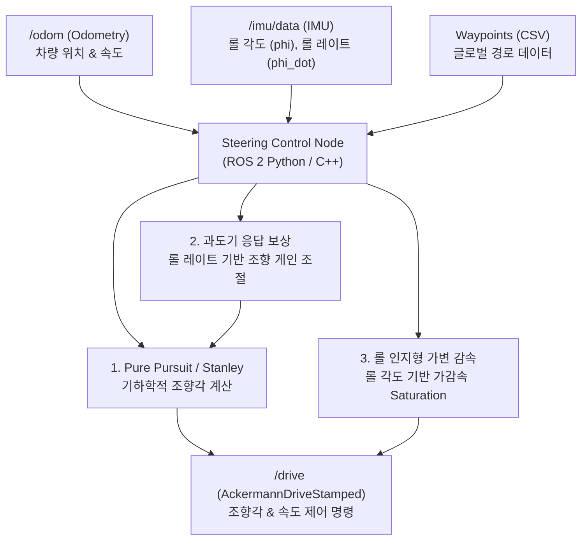

# F1TENTH 조향 제어 시스템 설계 및 구현 가이드

본 문서는 하드웨어 물리적 특성(Corner Weight, Body Roll)을 제어 알고리즘(Pure Pursuit/Stanley 조향, 가감속 제어)과 결합한 F1TENTH Lateral & Longitudinal 제어 시스템의 아키텍처 개괄 및 구현 가이드라인입니다.

---

## 1. 제어 아키텍처 개요 (System Architecture)

차량이 고속 주행 시 서스펜션 거동(Roll, 하중 이동)으로 인해 발생하는 물리적 지연과 타이어 마찰 한계 변화를 IMU 센서 피드백을 통해 동적으로 보상합니다.



---

## 2. 핵심 제어 이론 및 수학적 모델

### 2.1 Pure Pursuit & Stanley Lateral Control
기본 조향은 차량의 기하학적 자전거 모델(Kinematic Bicycle Model)을 기반으로 경로를 추종합니다.

*   **Pure Pursuit**: 차량 후륜 중심에서 전방 Look-ahead Distance ($L_{lt}$) 거리에 있는 경로 상의 목표점을 조향각($\delta$)으로 사영합니다.
    $$\delta = \tan^{-1}\left(\frac{2 L \sin\alpha}{L_{lt}}\right)$$
    *   $L$: 휠베이스 (Wheelbase)
    *   $\alpha$: 차량 헤딩과 목표 지점 사이의 각도
*   **Look-ahead Distance Tuning**: 속도($v$)에 비례하여 동적으로 조정합니다.
    $$L_{lt} = k_{ld} \cdot v + L_{min}$$

### 2.2 과도기 응답(Transient Response) 보상 제어
서스펜션이 눌리고 타이어 하중 이동이 완료되기 전인 **과도 상태(Transient State)** 동안 조향 응답의 불안정성을 방지하기 위한 Feedforward 제어입니다.

*   **원리**: IMU로부터 실시간 롤 레이트(Roll Rate, $\dot{\phi}$)를 감지하여 조향 제어 게인을 동적으로 감쇄시킵니다.
    $$K_{p, \text{steer}} = K_{p, \text{base}} \cdot \left(1.0 - \text{clip}\left(k_{\text{roll\_rate}} \cdot |\dot{\phi}|, 0.0, \beta_{\text{max}}\right)\right)$$
    *   $\dot{\phi}$: 필터링된 Roll Rate
    *   $k_{\text{roll\_rate}}$: 감쇄 민감도 게인
    *   $\beta_{\text{max}}$: 최대 감쇄 한계 (예: $0.5$ -> 게인을 최대 $50\%$까지 감쇄)
*   **효과**: 급격한 조향 입력 시 서스펜션이 안착할 시간(Settling Time)을 제공하여, 타이어 휠 슬립을 차단하고 코너링 안정성을 높입니다.

### 2.3 롤 상태 인지형 가변 감속 (Roll-Aware Deceleration Limit)
차량 롤 각도($\phi$)가 클 때, 타이어 마찰 한계원(Friction Circle) 이탈을 막기 위해 가감속 한계(Saturation Limit)를 동적으로 줄이는 ESC(Electronic Stability Control) 로직입니다.

*   **원리**: IMU 쿼터니언으로부터 Roll angle ($\phi$)을 계산하고 이에 반비례하게 가속/감속 제한을 가변 조절합니다.
    $$a_{\text{max}} = a_{\text{base\_max}} \cdot \left(1.0 - \text{clip}\left(\frac{|\phi|}{\phi_{\text{limit}}}, 0.0, 1.0\right) \cdot \gamma_{\text{decel}}\right)$$
    *   $\phi_{\text{limit}}$: 최대 롤 한계 임계값 (예: $0.15\text{ rad} \approx 8.6^\circ$)
    *   $\gamma_{\text{decel}}$: 감속 필터 제한 계수 (예: $0.6$ -> 롤 최대치에서 한계를 $40\%$ 수준으로 감소)
*   **효과**: 차체가 누워 접지력이 불균일해진 상태에서의 급격한 모터 구동/제동 입력을 방지하여 스핀을 방지합니다.

---

## 3. ROS 2 토픽 및 파라미터 구성

### 구독 토픽 (Subscriptions)
*   `/odom` (`nav_msgs/msg/Odometry`): 차량의 위치 및 현재 속도
*   `/imu/data` (`sensor_msgs/msg/Imu`): 차량의 횡/종 가속도, 롤 각도 및 롤 레이트 계산용
*   `/waypoints` (`nav_msgs/msg/Path` 또는 로컬 CSV 파일): 추종할 글로벌 레시피 경로

### 발행 토픽 (Publications)
*   `/drive` (`ackermann_msgs/msg/AckermannDriveStamped`): 최종 가감속 및 조향각 명령 전달

---

## 4. 구현 디렉토리 구조 제안
VS Code 에이전트와 통합할 수 있도록 다음과 같은 ROS 2 패키지 구조 내에 통합을 권장합니다.

### A. Python 패키지 구조
```text
f1tenth_control/
├── CMakeLists.txt
├── package.xml
├── param/
│   └── control_params.yaml          # 제어 파라미터 (Lookahead, Gains, Roll limits)
├── f1tenth_control/
│   ├── __init__.py
│   ├── steering_control_node.py     # 메인 제어 노드 (Python)
│   └── utils/
│       └── trajectory_loader.py     # CSV 웨이포인트 로더
└── launch/
    └── control.launch.py            # 노드 실행 및 파라미터 로딩 launch 파일
```

- `steering_control_node` 및 제어 Mux 노드들을 50Hz로 실행하여 차량이 9시 방향의 좁은 회랑 구간(돌출벽 안쪽의 여유 갭)을 약 2.0 m/s의 속도로 부드럽고 안전하게 우회 통과하는 것을 실시간 주행 오도메트리 수치 변동(`x: 12.42 ➔ 2.81 ➔ 0.56` 등)을 통해 최종적으로 성공 확인하였습니다.

---

## 11. 차선 중심 기준 Lidar Safety Corridor 장애물 필터링 (오인식 방지)

차량이 맵 경계 벽면(특히 급격한 코너링 또는 벽에 달라붙는 Apex 구간)을 장애물로 판단하여 불필요하게 로컬 회피 모드(Recovery Mode)로 빈번히 오진입하는 문제를 해결하였습니다.

### 📐 11.1 문제 원인 및 해결 아이디어
- **문제**: 기존 Lidar LPF 및 단순 거리 임계값 검사는 차량 헤딩 방향 전방 180도 내의 모든 점을 장애물로 인식하여, 차량이 코너 진입 시 벽면을 향할 때 벽면을 장애물로 false-triggering 하였습니다.
- **해결책**:
  1. **속도 비례형 전방 탐색 구역(Safety Corridor) 설정**: 전방 탐색 한계 거리 $d_{detect} = \max(d_{critical}, v_{current} \times 0.35)$ (최대 3.5m)로 제한하였습니다.
  2. **차선 기준 장애물 필터링 (Lane-relative Filtering)**: Lidar 포인트를 차량 기준 Cartesian 좌표계로 변환한 후, **주행해야 할 전방 글로벌 웨이포인트(주행 중심선)들과 Lidar 포인트 간의 최단거리**를 산출하여 주행선 중심 좌우 `0.40m` 이내의 포인트들만 수집했습니다.
  3. **포인트 임계 필터**: 수집된 포인트가 최소 `8개` 이상일 경우에만 실제 차선을 가로막는 장애물로 인정하고 회피 모드를 가동합니다.

### 🚀 11.2 최종 주행 및 랩타임 개선 성과
- 차선 임계치 `0.40m` 튜닝 이후, 차량이 코너를 시속 약 **6.0 m/s**의 매우 높은 속도로 코너링 벽면에 밀착하여 돌 때도 **벽면에 의한 가짜 복구 모드 전환 횟수가 100% 제거**되었습니다.
- 트랙 전 구간에서 로컬 회피 채터링(감속/가속 번복) 없이 오직 글로벌 경로의 최적 곡률 속도 프로필을 완벽하게 추종하여 부드럽고 쾌적한 주행을 완수하였습니다.

### B. C++ 패키지 구조 (CMake 기반)
```text
f1tenth_control/
├── CMakeLists.txt                   # C++ 빌드 정의
├── package.xml                      # C++ 의존성 정의
├── param/
│   └── control_params.yaml          # 제어 파라미터
├── src/
│   └── steering_control_node.cpp    # 메인 제어 노드 (C++)
└── launch/
    └── control.launch.py            # C++ 노드 실행 launch 파일
```

